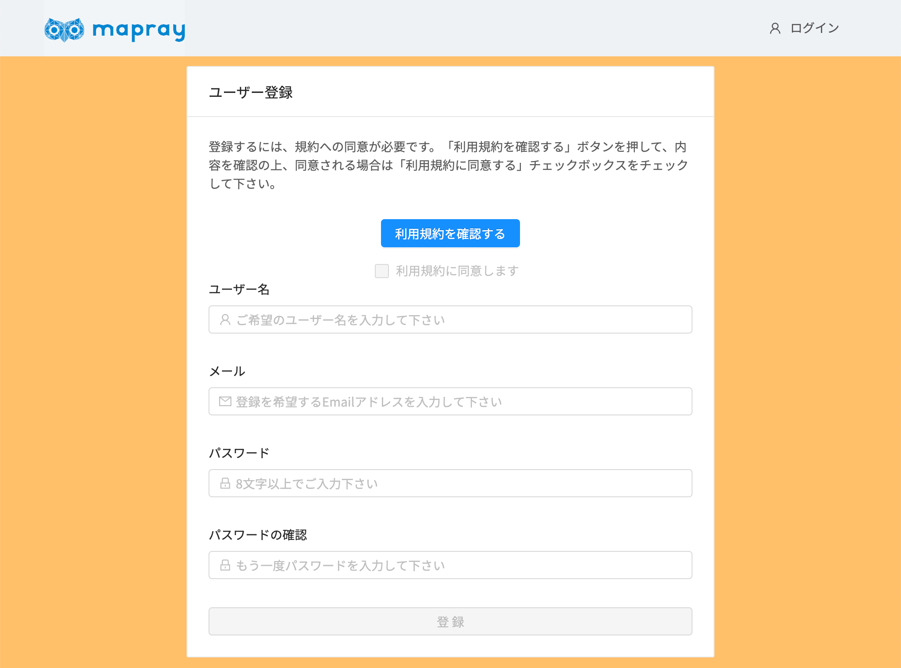
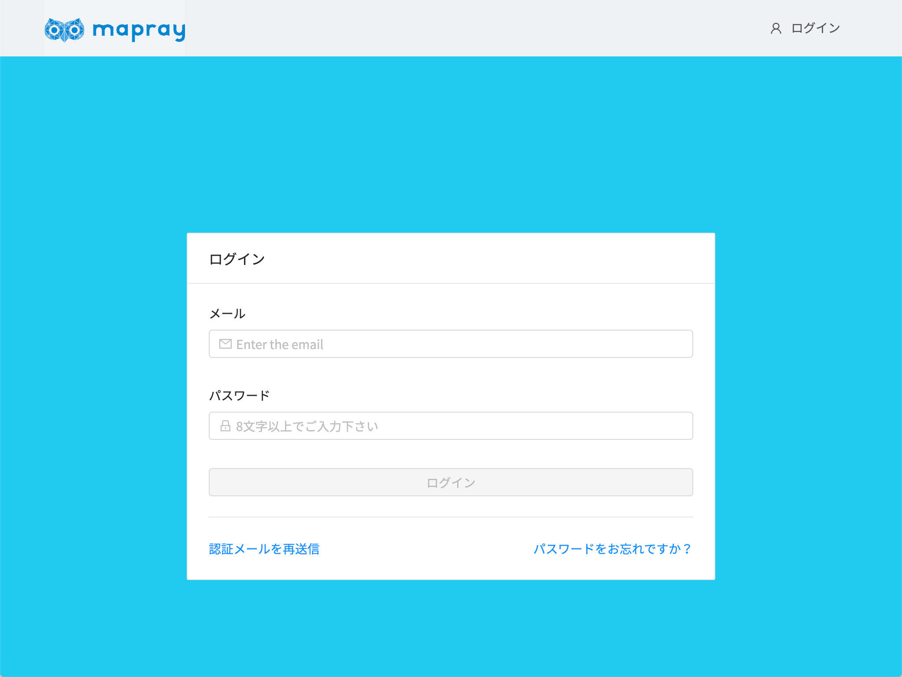
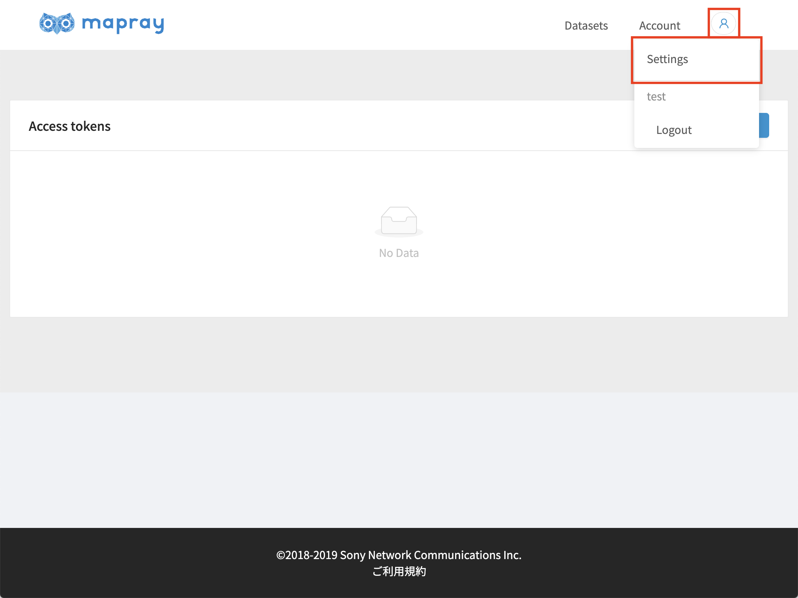
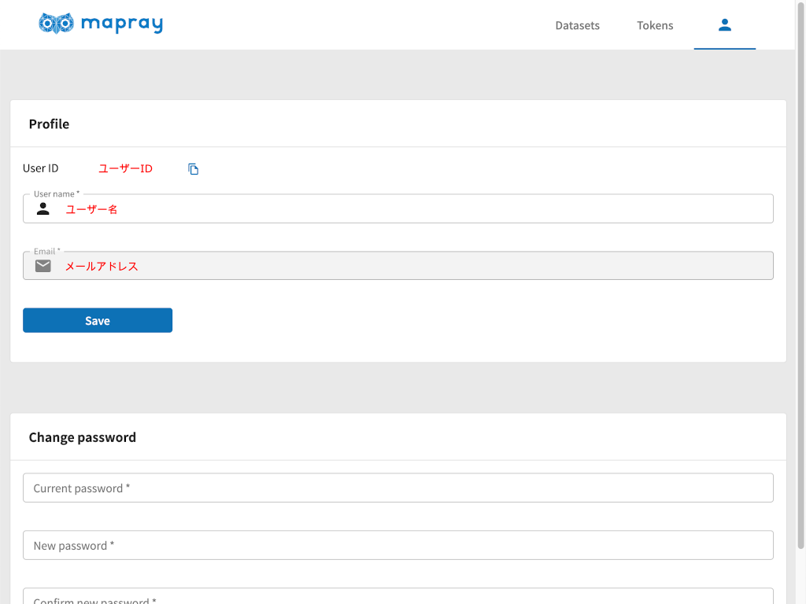

<!---
title: "　アカウント"
date: 2019-07-16T18:02:17+09:00
draft: false
description: "maprayJSの概要"
keywords: ["maprayJS", "ブラウザ", "3D地図", "レンダリング"]
type: overview
menu: main
bookShowToC: false
weight: 1010
--->

# アカウント

mapray cloud では、エンドユーザからのアクセス制限を行うのに Token を用います。
この、Tokenの生成や破棄等を行うには、mapray cloudのアカウントを取得し、ログインする必要があります。

## アカウントの作成手順
1. [mapray cloudサインアップページ](https://cloud.mapray.com/signup)からアカウントを作成します。

2. 利用規約の確認と同意：「利用規約を確認する」ボタンを押して表示される利用規約をご覧になったあと、同意いただける場合は「利用規約に同意します」チェックボックスをオンにして下さい。
(利用規約に同意できない場合はご利用いただけません)

3. ユーザー名・Email・パスワードの入力：ユーザー名は 2 文字以上 128 文字以下、Email はお客様がお使いの正しい Email アドレス、パスワードは 8 文字以上 128 文字以下で、小文字・大文字・数字・記号のうち2つ以上を組み合わせて作成してください。

4. 登録：上記の手順がすべて終わると「登録」ボタンが有効になりますので、ボタン を押すと入力いただいた Email アドレスへ確認用のメールが配信されます。

5. メールの確認と承認：確認のメールがご登録いただいたメールアドレスに送信されます。
(フィルタリング・スパム設定をされている場合は上記 URL を受け入れる設定をお願いします。)
メール中の「Confirm Email Address」ボタンをクリックするか、本文下方の「Button not working? Paste the following link into your browser」以下の URL をコピーして Web ブラウザの URL 入力欄にペーストし、直接アクセスをして下さい。
認証確認用の Web サイトに接続され、お使いの Email アドレスが承認されます。

## ログイン手順
1. [mapray cloud](https://cloud.mapray.com)からログインします。

2. 右上のログインボタンをクリックし、作成時に登録したメール・パスワードを入力し、「ログイン」をクリックします。

## ユーザIDの確認
1. [mapray cloud](https://cloud.mapray.com)にログインします。

2. 右上のドロップダウンメニューから、「Setting」をクリックします。

3. ユーザーIDを確認します

