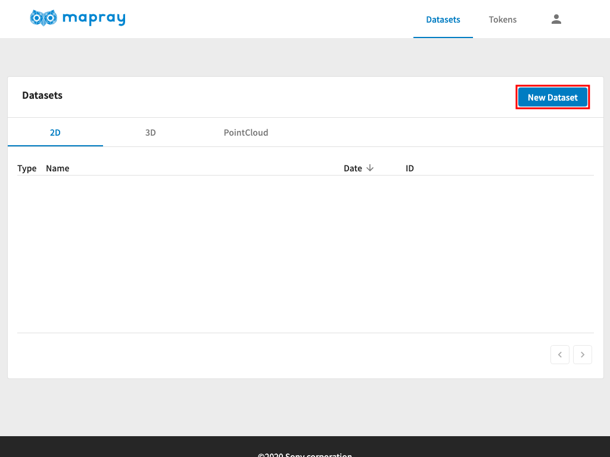
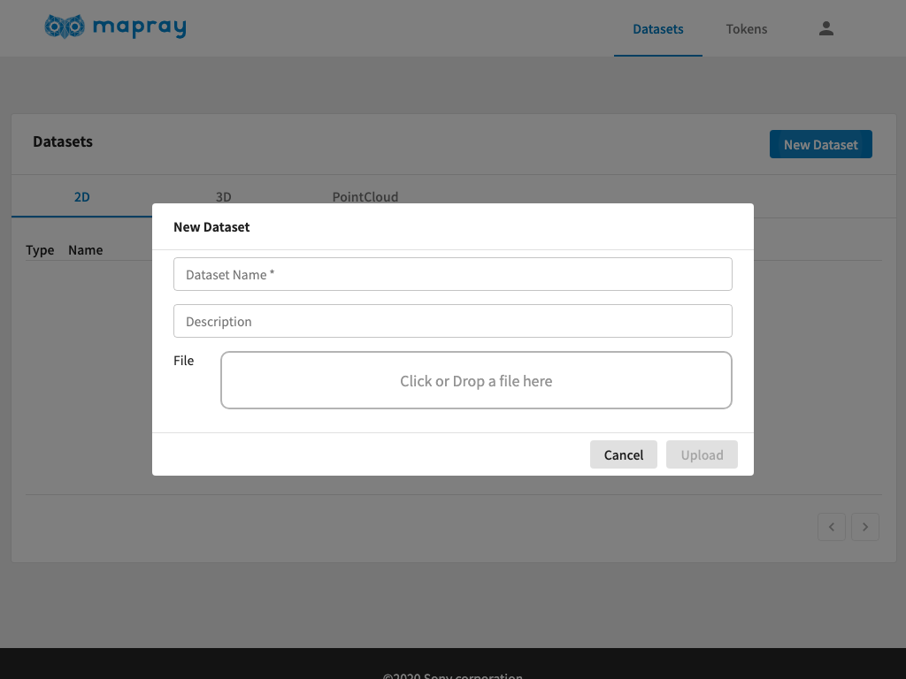
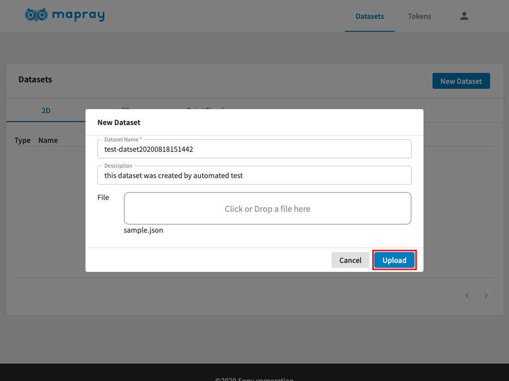
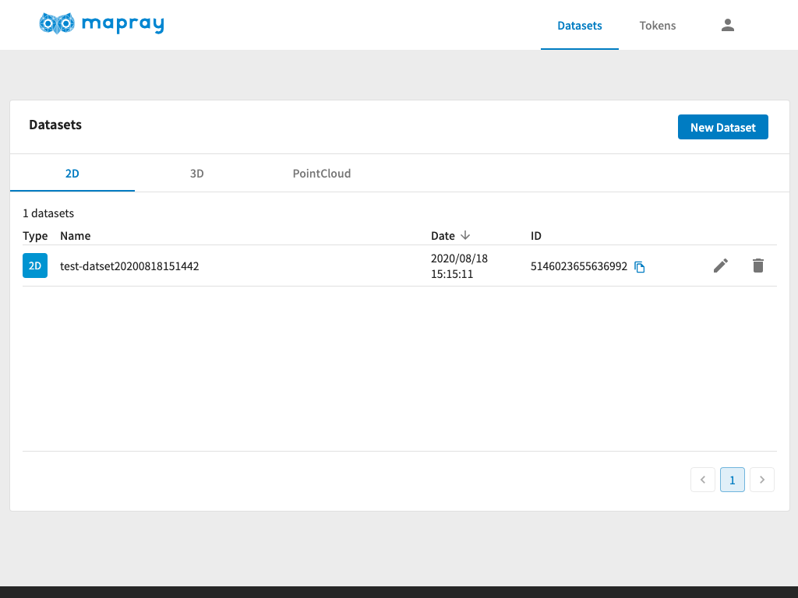

<!---
title: "　mapray cloudへ登録(2D)"
date: 2019-07-16T18:02:17+09:00
draft: false
description: ""
keywords: ["maprayJS", "ブラウザ", "3D地図", "レンダリング"]
type: overview
menu: main
bookShowToC: false
weight: 1030
--->

# Mapray Cloudへ地理情報を登録し、地図上に表示する(2D)

ここでは、mapray cloudの基本操作方法として、mapray cloudへGeoJSONを保存して、Viewerで閲覧する手順を説明します。


## 2Dデータ(GeoJSON)をmapray cloudへアップロードする
mapray cloudへ地理情報をアップロードするには、[mapray cloud管理者ページ](https://cloud.mapray.com)から行います。

`Datasets`ページを表示している状態で、`2D`タブへ切り替え、`New Dataset`をクリックします。



`New Dataset`ダイアログが表示されたら、必要事項を入力します。


入力が完了したらOKをクリックします。


アップロードに成功したら、下記のようにメッセージが表示され、リストに新しい項目が追加されます。この例では、アップロードしたデータセットのIDは` 5146023655636992 `で、後述するmaprayJSのViewerで表示する際に指定するIDとなります。



## mapray cloudに保存された2Dデータを地図上に表示する

例として、[最小構成アプリケーション](../gettingstarted/)にmapray cloudに保存された3Dデータを読み込む例を示します。最小構成アプリケーションのhtmlの`<script>`に下記のコードを追加します。追加する場所は、`var viewer = new mapray.Viewer(...);`の部分以降であればどこでも構いません。
```javascript
    // mapray cloud へのアクセス情報を生成します。
    var maprayApi = new mapray.cloud.CloudApiV1({
            basePath: "https://cloud.mapray.com",
            userId: "<userId>",
            token: "<token>",
    });

    // Mapray Apiを使ってリソースを定義します。
    var resource = maprayApi.getDatasetAsResource( "<sceneId>" );

    // GeoJSONLoaderを使ってリソースを読み込みます。
    var loader = new mapray.GeoJSONLoader( viewer.scene, resource );
    loader.load();
```
`<userId>`については[アカウント](../account/)、
`<token>`については[リソースの管理と認証](../token/#Tokenの作成手順)をそれぞれご参照頂き、適切な値に変更してください。
また、`<sceneId>`については、データアップロード時に確認したデータセットIDに変更してください。


