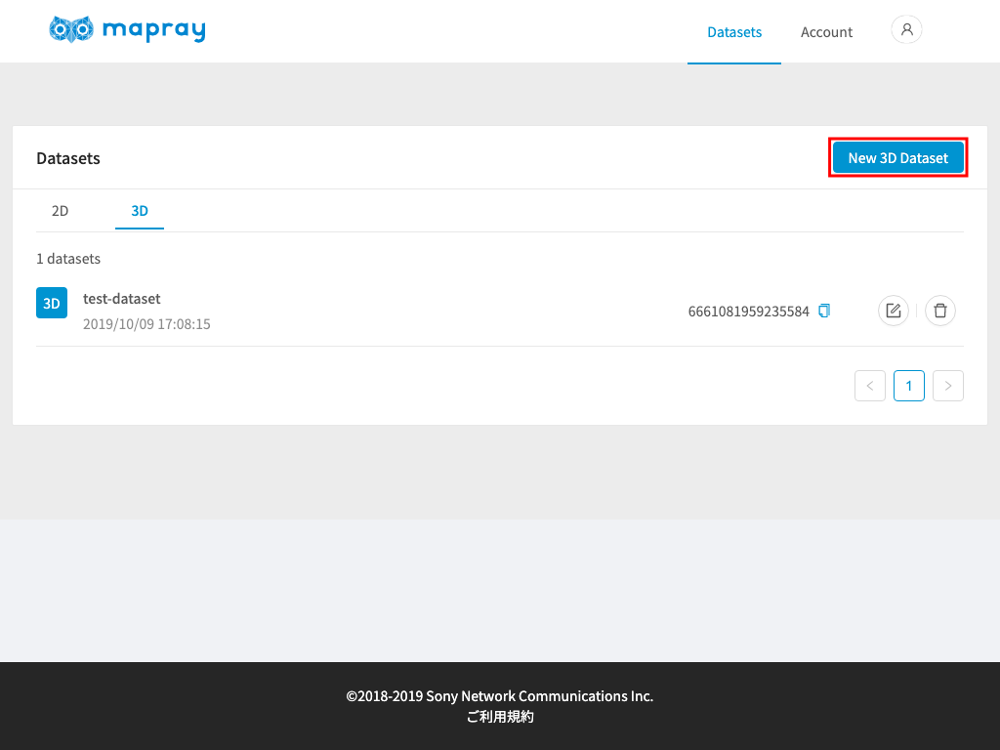
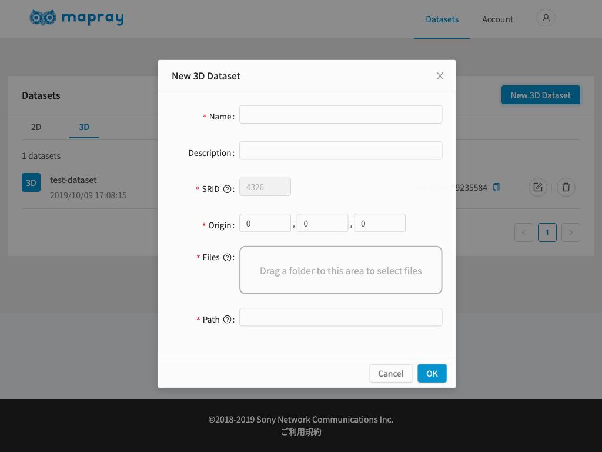
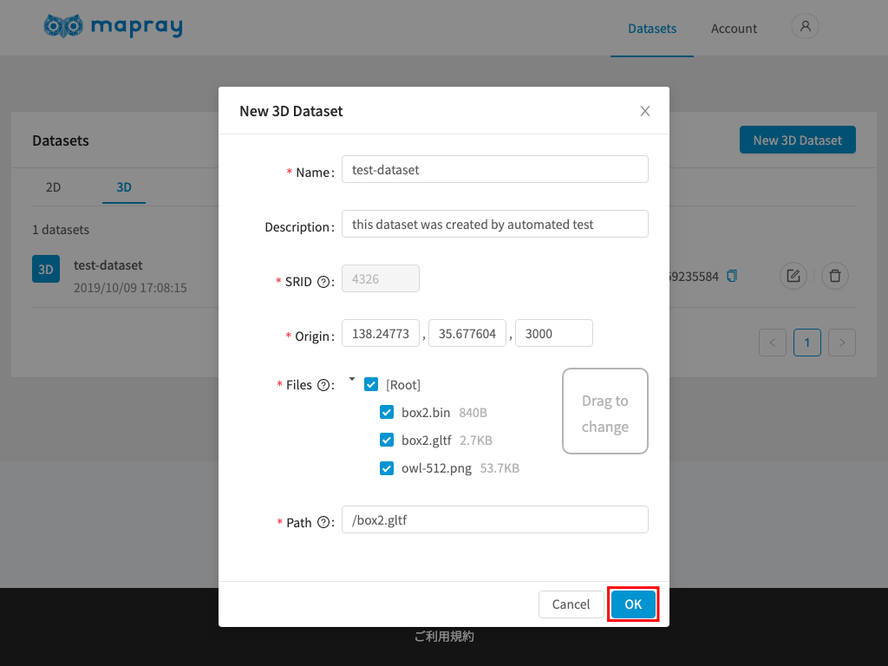
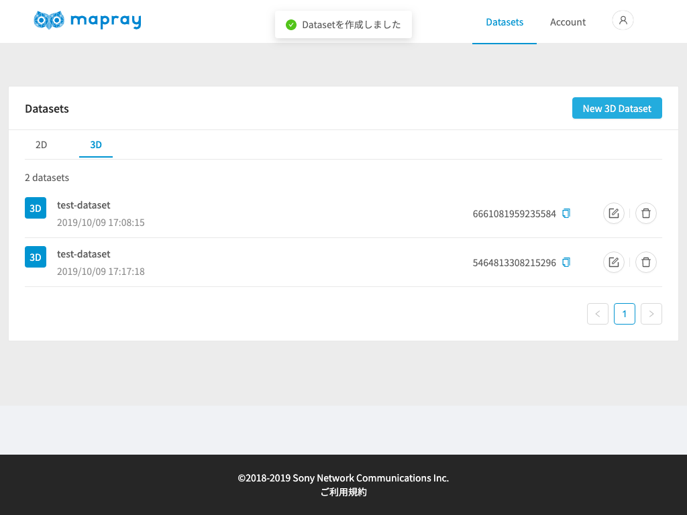

<!---
title: "　mapray cloudへ登録(3D)"
date: 2019-07-16T18:02:17+09:00
draft: false
description: ""
keywords: ["maprayJS", "ブラウザ", "3D地図", "レンダリング"]
type: overview
menu: main
bookShowToC: false
weight: 1040
--->

# Mapray Cloudへ3D地理情報を登録し、地図上に表示する

ここでは、mapray cloudの基本操作方法として、mapray cloudへglTFを保存して、Viewerで閲覧する手順を説明します。


## 3Dデータ(glTF)をmapray cloudへアップロードする
GeoJSONと同様に[mapray cloud管理者ページ](https://cloud.mapray.com)からアップロードを行います。


`Datasets`ページを表示している状態で、`3D`タブへ切り替え、`New 3D Dataset`をクリックします。



`New 3D Dataset`ダイアログが表示されたら、必要事項を入力します。



| プロパティ    | 説明                                           |
|-------------|------------------------------------------------|
| Name        | 任意の名前を指定します |
| Desctiption | 任意の説明を指定します |
| SRID        | モデルを配置する場所を指定する際に用いる座標系を指定します。現在は4326（緯度・経度）しか対応していないため変更することはできません。 |
| Origin      | 緯度・経度でモデルを配置する場所を指定します。X：経度, Y：緯度, Z：高さの順に指定します |
| Files       | モデルデータ（glTF）を指定します。glTFファイルはbinファイルやテクスチャファイルが含まれるため、それら全てを含んだディレクトリを指定します。ドラッグ操作でディレクトリを指定するか、ドラッグ領域をクリックすることでシステムのファイル選択ダイアログから選択することができます。 |
| Path        | 上記で指定したディレクトリの中でglTFファイルへのパスを指定します。指定したディレクトリのルートにsample.glTFがある場合には、`/sample.glTF`のように指定します。直接パスを入力するか、上記Filesを指定した際に表示されるディレクトリツリーから、対象のglTFをクリックすると自動的に入力されます。 |


入力が完了したら`OK`をクリックします。



アップロードに成功したら、下記のようにメッセージが表示され、リストに新しい項目が追加されます。この例では、アップロードしたデータセットのIDは` 5919598805254144 `で、後述するmaprayJSのViewerで表示する際に指定するIDとなります。




## mapray cloudに保存された3Dデータを地図上に表示する
例として、[最小構成アプリケーション](../gettingstarted/)にmapray cloudに保存された3Dデータを読み込む例を示します。最小構成アプリケーションのhtmlの`<script>`に下記のコードを追加します。追加する場所は、`var viewer = new mapray.Viewer(...);`の部分以降であればどこでも構いません。
```javascript
    // Mapray Cloud へのアクセス情報を生成します。
    var maprayApi = new mapray.MaprayApi({
            basePath: "https://cloud.mapray.com",
            version: "v1",
            userId: "<userId>",
            token: "<token>",
    });

    // Mapray Apiを使ってリソースを定義します。
    var resource = maprayApi.get3DDatasetAsResource( ["5919598805254144"] );

    // SceneLoaderを使ってリソースを読み込みます。
    var loader = new mapray.SceneLoader( viewer.scene, resource );
    loader.load();
```
`<userId>`については[アカウント](../account/)、
`<token>`については[リソースの管理と認証](../token/#Tokenの作成手順)をそれぞれご参照頂き、適切な値に変更してください。
また、`<sceneId>`については、データアップロード時に確認したデータセットIDに変更してください。


ブラウザで確認すると、下記のようにglTFモデルが表示されます。

