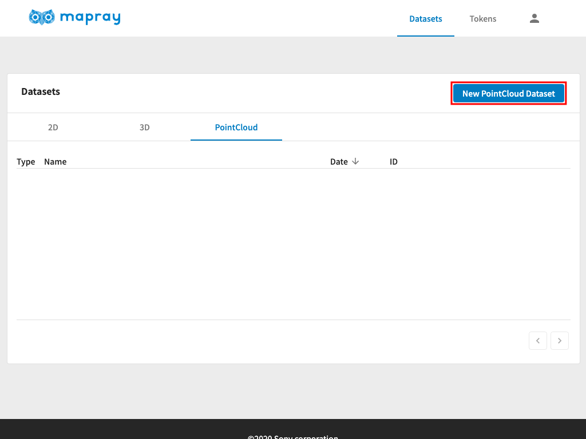
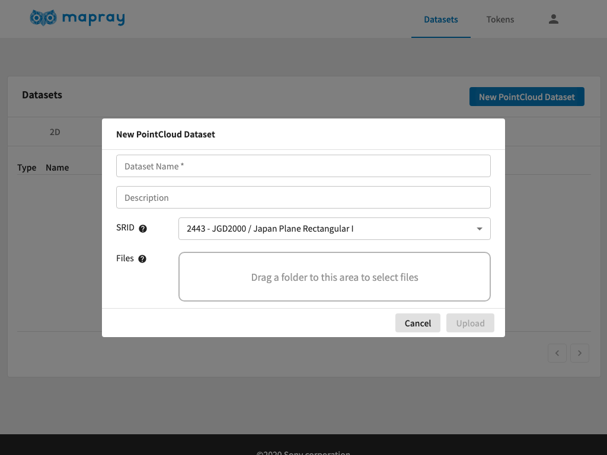
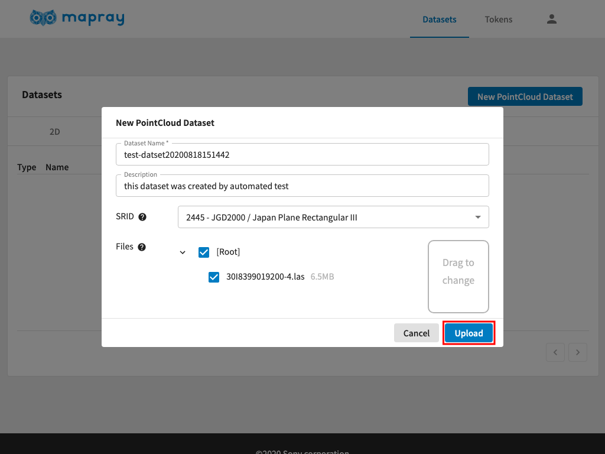
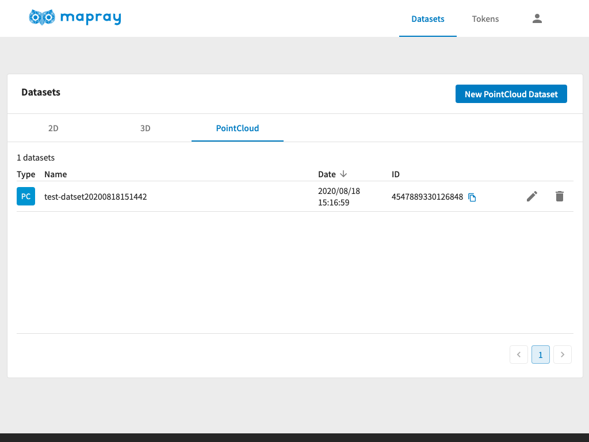

<!---
title: "　mapray cloudへ登録(点群)"
date: 2019-07-16T18:02:17+09:00
draft: false
description: ""
keywords: ["maprayJS", "ブラウザ", "3D地図", "レンダリング"]
type: overview
menu: main
bookShowToC: false
weight: 1050
--->

# Mapray Cloudへ点群情報を登録し、地図上に表示する

ここでは、mapray cloudの基本操作方法として、mapray cloudへ点群(las)を保存して、Viewerで閲覧する手順を説明します。


## 点群データ(las)をmapray cloudへアップロードする
3Dと同様に[mapray cloud管理者ページ](https://cloud.mapray.com)からアップロードを行います。


`Datasets`ページを表示している状態で、`PointCloud`タブへ切り替え、`New PointCloud Dataset`をクリックします。



`New PointCloud Dataset`ダイアログが表示されたら、必要事項を入力します。



| プロパティ    | 説明                                           |
|-------------|------------------------------------------------|
| Name        | 任意の名前を指定します |
| Desctiption | 任意の説明を指定します |
| SRID        | 点群の座標系を指定します。現在は平面直角座標系のみ対応しています。[平面直角座標系の系番号](https://www.gsi.go.jp/sokuchikijun/jpc.html)に対応した[SRDI](https://epsg.io/?q=JGD2000%20/%20Japan%20Plane%20Rectangular)（2443から2461）を指定します。|
| Files       | 点群データ（las）を指定します。lasファイルは複数のこともあるため、それら全てを含んだディレクトリを指定します。ドラッグ操作でディレクトリを指定するか、ドラッグ領域をクリックすることでシステムのファイル選択ダイアログから選択することができます。 lasファイル以外のファイルが含まれるとアップロードできませんので、チェックを外してください。|


入力が完了したら`OK`をクリックします。



アップロードに成功したら、下記のようにメッセージが表示され、リストに新しい項目が追加されます。この例では、アップロードしたデータセットのIDは` 4547889330126848 `で、後述するmaprayJSのViewerで表示する際に指定するIDとなります。
アップロード後に、サーバで変換処理が行われます。変換処理が完了すると点群データを利用することができます。変換時間はデータの大きさにより変化します。変換処理のステータス表示については現在作成中です。




## mapray cloudに保存された点群データを地図上に表示する
例として、[最小構成アプリケーション](../gettingstarted/)にmapray cloudに保存された点群データを読み込む例を示します。最小構成アプリケーションのhtmlの`<script>`に下記のコードを追加します。追加する場所は、`var viewer = new mapray.Viewer(...);`の部分以降であればどこでも構いません。
```javascript
    // Mapray Cloud へのアクセス情報を生成します。
    var maprayApi = new mapray.MaprayApi({
            basePath: "https://cloud.mapray.com",
            version: "v1",
            userId: "<userId>",
            token: "<token>",
    });

    // Mapray Apiを使ってリソースを定義します。
    const datasetId = "<datasetId>";
    const resource = maprayApi.getPointCloudDatasetAsResource( datasetId );

    // リソースをviewerに追加します。
    const pcProvider = new mapray.RawPointCloudProvider( resource );
    const pc = viewer.point_cloud_collection.add( pcProvider );
```
`<userId>`については[アカウント](../account/)、
`<token>`については[リソースの管理と認証](../token/#Tokenの作成手順)をそれぞれご参照頂き、適切な値に変更してください。
`<datasetId>`については、データアップロード時に確認したデータセットIDに変更してください。

また、カメラの位置と視線方向を点群データセットが見えるように調整する必要があります。

例として、静岡県交通基盤部建設支援局が公開している浜松城データを読み込む方法を説明します。

### 点群データの入手
[Shizuoka Point Cloud DB](https://pointcloud.pref.shizuoka.jp/)から[浜松城](https://pointcloud.pref.shizuoka.jp/lasmap/ankendetail?ankenno=29XXX00010002)へアクセスし、点群(las)ファイルフォーマットのデータのうち 29XXX00010002-3.las (ファイルサイズ：200MB) をダウンロードしてください。点群データが6ファイルあるうちの一部となりますが、点群の変換に時間がかかるため、ここでは1ファイルのみという想定で以下の説明を行います。

なお、データは当社の著作物ではありません。著作権は各データの作成者に帰属します。詳細は静岡県ポイントクラウドデータベースの利用規約を参照の上ご利用ください。
ユーザーの皆様がコンテンツの権利を侵害した場合、当社では一切責任を追うものではありませんのでご注意ください。

### 点群データの準備
点群データはそのまま読み込むことはできず、[mapray cloud](https://cloud.mapray.com)にデータをアップロードする必要があります。アップロードされたデータはサーバ内でmaprayが利用できるデータに自動変換されます。
前述のアップロード方法を参照の上、**29XXX00010002-3.las**ファイルをアップロードし、データセットのIDを<datasetId>に設定してください。
アップロード時のSRIDは 2450 にしてください。

アップロード後30分程度でデータの変換が完了しますので、その後にアプリケーションで表示することができます。

### カメラの位置と視線方向の調整

最小構成アプリケーションのhtmlの`<script>`の下記のコードの数値を変更します。
```javascript
// 球面座標系で視点を設定。
var home_pos = { longitude: 138.247739, latitude: 35.677604, height: 3000 };

// 球面座標から
var home_view_to_gocs = mapray.GeoMath.iscs_to_gocs_matrix( home_pos, mapray.GeoMath.createMatrix());

// 視線方向を定義
var cam_pos = mapray.GeoMath.createVector3( [-3000, 2600, 700] );
var cam_end_pos    = mapray.GeoMath.createVector3( [0, 0, 0] );
var cam_up         = mapray.GeoMath.createVector3( [0, 0, 1] );
```

それぞれ、次のように変更してください。
```javascript
var home_pos = { longitude: 137.7246, latitude: 34.7113, height: 67 };
```
```javascript
var cam_pos = mapray.GeoMath.createVector3( [-1, -2, 1] );
```

ブラウザで確認すると、下記のように点群モデルが表示されます。

点群モデルは「静岡県ポイントクラウドデータベース」の浜松城を使用しています。
