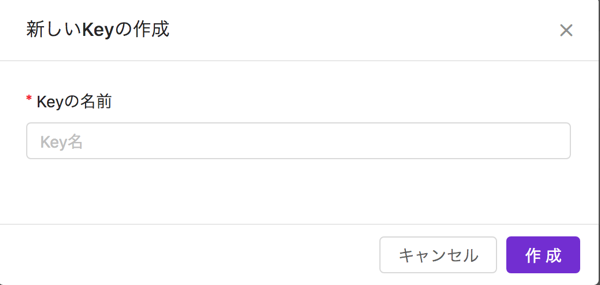

## まず始めに
このドキュメントではmaprayJSのセットアップ方法を説明し、そのmapray cloudからデータを取得して、最初の３次元地理データを表示するサンプルを作成します。
maprayJSはWebブラウザ上で動作するJavaScriptライブラリで、3D地図データを高速に美しく表現することができます。また、mapray cloudはmaprayJSに最適化されたデータを保存・配信するクラウドサービスです。世界規模の地形データを強力なクラウドインフラで配信することができます。
mapray cloudはソニーネットワークコミュニケーションズ（株）によって運営されているクラウドサービスです。
maprayJSはオープンソースプロジェクトです。([Github.comへのリンク](https://github.com/sony/mapray-js))
ご利用の際には[Attribution](./Attribution.md)も参照の上、著作権表示に気をつけてご利用下さい。

## QuickStart
このドキュメントではmapray cloudへのアカウト登録はすでに終了しているという前提で記載しています。
アカウント登録に関しては別途サポートからのご案内を参照してください。
また、JavaScriptの言語仕様、npmの使い方については本ドキュメントでは説明しません。あらかじめご了承下さい。

### 1. maprayJSの取得
maprayJSはJavaScriptファイルを`<head>`で直接読み込むか(以下CDN方式)、npmパッケージでモジュールとして取得（以下モジュール方式）することが可能です。

#### CDN方式
HTMLファイルでJavaScriptを読み込みます。`<head>`タグ内で以下のようにインクルードして下さい。
```html
  <script src="https://resource.mapray.com/mapray-js/v0.7.0/mapray.js"></script>
```
上記はバージョン0.7.0の場合です。`v0.7.0`には任意のバージョンを指定して下さい。
リリースされている該当のバージョンがあれば、アクセスすることができます。

#### モジュール形式
npm packageをインストールします。
packageはnpmjs.comで[公開](https://www.npmjs.com/package/mapray-js)されています。

```bash
npm install --save mapray-js
```

もしくは

```bash
yarn add mapray-js
```
です。
バージョンの指定方法に関してはnpm(yarn)の操作ドキュメントをご参照下さい。


### 2. Access Tokenの取得
クラウドサービスにログインしている状態で`メニュー`から`Account`を選択します。すると、以下のような画面が表示されます。


<div align="center">
  <div>
    
    <p><i>Account画面</i></p>
  </div>
</div>

このAccess Token画面で`Create a token`ボタンを押すと'新しいKeyを作成'ダイアログが表示されます。

<div align="center">
  <div>
    
    <p><i>新しいKeyを作成ダイアログ</i></p>
  </div>
</div>

お好みのKey名を入力して`作成`ボタンを押すと新しいKeyが作成されます。ここではdefaultという名前のAccess Tokenを作成しました。

<div align="center">
  <div>
    
    <p><i>Access Tokenを作成</i></p>
  </div>
</div>

以上でAccess Tokenが作成されました。このAPIキーをhttpリクエストと一緒に送っていただくことで、mapray cloudのリソースへアクセスすることが可能になります。

### 3. Hello Globe !!
ここでははじめてのアプリケーションを作成します。完成するとお使いのWebブラウザ内に地球が表示されます。
（CDN形式での説明になります）
このサンプルプログラムは、日本で２番目に標高の高い北岳付近より、１番目に標高の高い富士山を眺めたものになります。
以下のプログラムの
`<your access token here>`を上記で作成したAccess Tokenで書き換えて下さい。
例えば、得られたAccess Tokenが`AbCdEfGhIjKlMnOpQrStU`
であれば、

```javascript
var accessToken = 'AbCdEfGhIjKlMnOpQrStU';
```
となります。

```html
<!DOCTYPE html>
<html>
<head>
    <meta charset="UTF-8">
    <title>Hello Globe</title>
    <link rel="stylesheet" href="https://resource.mapray.com/styles/v1/mapray.css">
</head>
<style>
    html, body {
        height: 100%;
        margin: 0;
    }
    div#mapray-container {
        display: flex;
        height: 100%;
    }
</style>
<body>
    <div id="mapray-container"></div>
</body>
</html>
<script src="https://resource.mapray.com/mapray-js/v0.7.0/mapray.js"></script>
<script>
     // Access Tokenを設定
       var accessToken = "<your access token here>";

       // 国土地理院提供の地図タイルを設定
       var imageProvider = new mapray.StandardImageProvider( "https://cyberjapandata.gsi.go.jp/xyz/seamlessphoto/", ".jpg", 256, 0, 18 );

       // Viewerを作成する
       var viewer = new mapray.Viewer(
           "mapray-container", {
               image_provider: imageProvider,
               dem_provider: new mapray.CloudDemProvider(accessToken)
           }
       );

       // 地図タイルの著作権表示
       viewer.attribution_controller.addAttribution({
         display: "国土地理院",
         link: "http://maps.gsi.go.jp/development/ichiran.html"
         });
       // カメラ位置の設定

       // 球面座標系で視点を設定。
       var home_pos = { longitude: 138.247739, latitude: 35.677604, height: 3000 };

       // 球面座標から
       var home_view_to_gocs = mapray.GeoMath.iscs_to_gocs_matrix( home_pos, mapray.GeoMath.createMatrix());

       // 視線方向を定義
       var cam_pos = mapray.GeoMath.createVector3( [-3000, 2600, 1000] );
       var cam_end_pos    = mapray.GeoMath.createVector3( [0, 0, 0] );
       var cam_up         = mapray.GeoMath.createVector3( [0, 0, 1] );


       var view_to_home = mapray.GeoMath.createMatrix();
       mapray.GeoMath.lookat_matrix(cam_pos, cam_end_pos, cam_up, view_to_home);

       // カメラの位置と視線方向からカメラの姿勢を変更
       var view_to_gocs = viewer.camera.view_to_gocs;
       mapray.GeoMath.mul_AA( home_view_to_gocs, view_to_home, view_to_gocs );

       // カメラのnear  farの設定
       viewer.camera.near = 30;
       viewer.camera.far = 500000;
</script>
```
<div align="center">
  <div>v
    
    <p><i>Hello Globe</i></p>
  </div>
</div>

## Example
### Basic
基本的なサンプルはWebサイトの[Example](https://mapray.com/documents/examples/index.html)が一覧になります。
これらはGithub上のリポジトリの[examples](https://github.com/sony/mapray-js/tree/master/examples)と同じものになります。
#### 動かしてみよう
##### 1. 各サンプルのアクセストークンを書き換える
Hello Globe!と同じく、各Exampleの`<your access token here>`を取得したAccess Tokenに置き換えます。

##### 2. ローカルサーバーの起動
[examples](https://github.com/sony/mapray-js/tree/master/examples)以下で、
python等でローカルサーバーを起動すると簡単にお試しいただけます。
以下、examplesをルートとして

```
 $ python -m SimpleHTTPServer 7777
```

##### 3. アクセス
http://localhost:7777

にアクセスしてください。
リンクをクリックすると各Exampleを参照できます。

### アプリケーションのサンプル
Github.comのmapray-js[リポジトリ](https://github.com/sony/mapray-js)で公開されています。
今後さらに追加の予定です。
- [Fall](https://github.com/sony/mapray-js/tree/master/src/apps/fall):　富士山に向かって滑らかなカメラアニメーションを行うアプリケーションです。

- [nextRambler](https://github.com/sony/mapray-js/tree/master/src/apps/next):　
  キーボードとマウスで自由にカメラを操作できます。
  
- [UI Framework](https://github.com/sony/mapray-js/tree/master/html/ui.html):　
  uiモジュールを利用して簡単にマウスによるリアルタイム操作の制御ができるサンプルです。

#### 開発者向けの説明
mapray-js[リポジトリ](https://github.com/sony/mapray-js)でmaprayJSをビルドして動かす方法を解説します。
デバッグ情報付きで動作させる方法になりますので、データサイズが大きくなります。
各説明はルートディレクトリを基点とします。以下の手順の前に一度だけ

```
$ npm install
```
を呼び出してセットアップを終了してください。


##### 1. アクセストークンの設定
###### Fallの場合
[Fall.js](https://github.com/sony/mapray-js/blob/master/src/apps/fall/Fall.js)の**accessToken**をmapray cloudで取得したTokenで置き換えます。
###### nextRamblerの場合
[NextRambler.js](https://github.com/sony/mapray-js/blob/master/src/apps/next/NextRambler.js)の**accessToken**をmapray cloudで取得したTokenで置き換えます。
また、Bing Mapsに衛星写真地図を切り替えたい場合(デモ起動後キーボードのBで切り替え)で、かつ、Bing MapsのAPI Keyをお持ちの場合はNextRambler.jsの[\<your Bing Maps Key here\>](https://github.com/sony/mapray-js/blob/master/src/apps/next/NextRambler.js#L644)をBing Mapsで取得したAPI Keyで置き換えます。Bing Mapsを表示しない場合はそのままで結構です。
##### 他のアプリの場合
基本的には、**accessToken**を書き換えていただくと起動します。

##### 2. ビルド
```
$ npm run debug
```
buildディレクトリにmapray.js, maprayui.jsとmapファイル、distディレクトリにmapray.cssが生成されます。
また、開発用のローカルサーバーが自動的に起動します。ソースコードを監視しており変更があれば即座に反映されます。

##### 3. 実行
- fall: http://localhost:7776/html
- nextRambler: http://localhost:7776/html/nextRambler.html
 

### データのライセンス
ソースコードは[LICENSE](https://github.com/sony/mapray-js/blob/master/LICENSE)が適応されますので、ご自由に２次利用可能ですが、
デモで利用しているデモデータには適応されません。それぞれのデータ提供元のライセンスが適応されます。
データ提供元の許諾を得ていない場合、2次利用はできません。ご注意下さい。
例えば、デモデータに対して

- 弊社のクラウドからダウンロードして利用
- 弊社のクラウドへアクセスして外部へ無断で公開する

等を行うと著作権違反になります。
以下のデータは外部から提供されているものです。

* 3Dモデル(NATS)
* 注記を表示するためのデータ(AEDデータ・山の名称を表示するデータ)

なお、クラウド上のデモデータは将来、事前の予告なく変更・削除されます。
コンテンツ等のご利用により万一何らかの損害が発生したとしても、当社が一切責任を負うものではありません。
