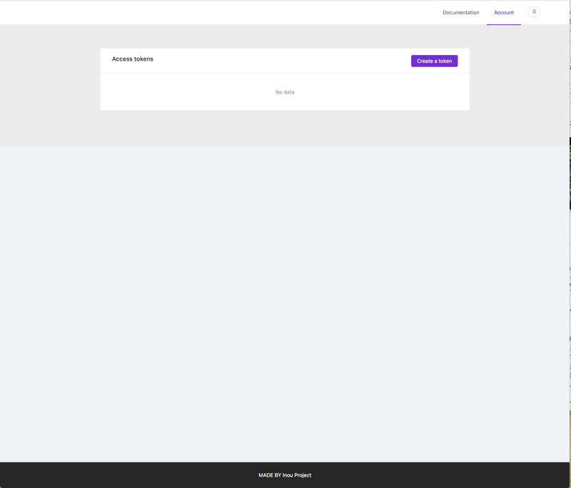
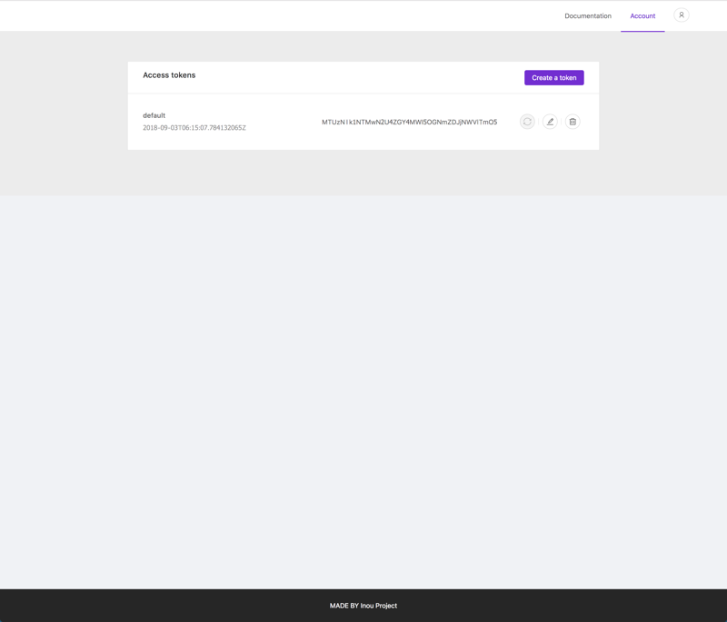
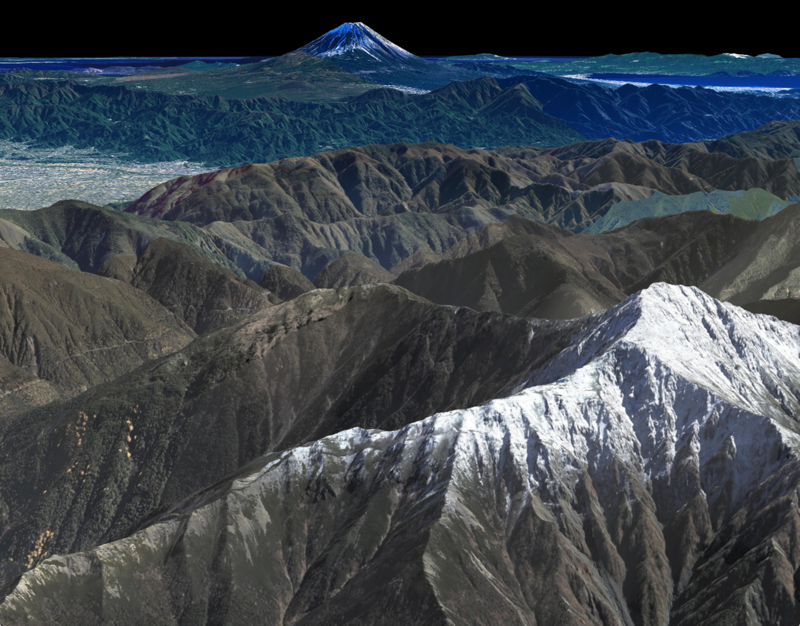

<!---
title: "　QuickStart"
date: 2019-07-12T16:49:26+09:00
draft: false
description: "このドキュメントでは、まず最小構成のアプリ開発について説明します。"
keywords: ["ドキュメント", "mapray cloud","アカウント", "クラウド"]
type: overview
menu: main
weight: 1001
--->

# QuickStart

このドキュメントでは最小構成の地図アプリケーションを作成する例をご説明します。
mapray cloud のアカウト登録はすでに完了している前提で記載しています。アカウント登録に関しては[アカウント](/documents/overview/Account/)を参照してください。

## 1. maprayJS本体の取得
maprayJSは、JavaScriptファイルを`<script>`で直接読み込む方式(以下CDN方式)と、npmパッケージでモジュールとして読み込む方式（以下モジュール方式）のどちらかで読み込みます。

### CDN方式
HTMLファイルでJavaScriptを読み込みます。`<head>`タグ内で以下のようにインクルードして下さい。
```html
  <script src="https://api.mapray.com/mapray-js/v0.8.1/mapray.js"></script>
```
上記はバージョン0.8.1の場合です。`v0.8.1`には任意のバージョンを指定して下さい。
リリースされている該当のバージョンがあれば、アクセスすることができます。

### モジュール形式
npmかyarnを用いてインストールすることができます。npmjs.comで [公開](https://www.npmjs.com/package/@mapray/mapray-js) されています。npmを使う場合は、下記のコマンドを実行します。

```bash
npm install --save @mapray/mapray-js
```

yarnを使う場合は、下記のコマンドを実行します。

```bash
yarn add @mapray/mapray-js
```

バージョンの指定方法に関してはnpm(yarn)の操作ドキュメントをご参照下さい。


## 2. Access Tokenの取得
mapray cloud のリソースへアクセスするのに必要なAccess Tokenの取得手順について説明します。[mapray cloud](https://cloud.mapray.com)にログインし、右上の`メニュー`から`Account`を選択します。すると、以下のような画面が表示されます。



このAccess Token画面で`Create a token`ボタンを押すと'新しいKeyを作成'ダイアログが表示されます。


お好みのKey名を入力して`作成`ボタンを押すと新しいKeyが作成されます。ここではdefaultという名前のAccess Tokenを作成しました。



以上でAccess Tokenが作成されました。ここで作成したAccess Tokenを後述の手順で利用します。


## 3. Hello Globe !! (最小構成の地図アプリケーション)
いよいよ、最小構成の地図アプリケーションを作成します。完成するとお使いのWebブラウザ内に地球が表示されます。このサンプルプログラムは、日本で２番目に標高の高い北岳付近から、１番目に標高の高い富士山を眺めたものになります。

```html
<!DOCTYPE html>
<html>
<head>
    <meta charset="UTF-8">
    <title>Hello Globe</title>
    <script src="https://api.mapray.com/mapray-js/v0.8.1/mapray.min.js"></script>
</head>
<style>
    html, body {
        height: 100%;
        margin: 0;
    }
    div#mapray-container {
        display: flex;
        height: 100%;
    }
</style>
<body>
    <div id="mapray-container"></div>
</body>
</html>

<script>
    // Access Tokenを設定
    var accessToken = "<your access token here>";

    // 国土地理院提供の地図タイルを設定
    var imageProvider = new mapray.StandardImageProvider( "https://cyberjapandata.gsi.go.jp/xyz/seamlessphoto/", ".jpg", 256, 0, 18 );

    // Viewerを作成する
    var viewer = new mapray.Viewer(
        "mapray-container", {
            image_provider: imageProvider,
            dem_provider: new mapray.CloudDemProvider(accessToken)
        }
    );

    // カメラ位置の設定

    // 球面座標系で視点を設定。
    var home_pos = { longitude: 138.247739, latitude: 35.677604, height: 3000 };

    // 球面座標から
    var home_view_to_gocs = mapray.GeoMath.iscs_to_gocs_matrix( home_pos, mapray.GeoMath.createMatrix());

    // 視線方向を定義
    var cam_pos = mapray.GeoMath.createVector3( [-3000, 2600, 700] );
    var cam_end_pos    = mapray.GeoMath.createVector3( [0, 0, 0] );
    var cam_up         = mapray.GeoMath.createVector3( [0, 0, 1] );


    var view_to_home = mapray.GeoMath.createMatrix();
    mapray.GeoMath.lookat_matrix(cam_pos, cam_end_pos, cam_up, view_to_home);

    // カメラの位置と視線方向からカメラの姿勢を変更
    var view_to_gocs = viewer.camera.view_to_gocs;
    mapray.GeoMath.mul_AA( home_view_to_gocs, view_to_home, view_to_gocs );

    // カメラのnear  farの設定
    viewer.camera.near = 30;
    viewer.camera.far = 500000;
</script>
```

上記プログラム内の`<your access token here>`を、作成したAccess Tokenで書き換えて下さい。例えば、Access Tokenが`AbCdEfGhIjKlMnOpQrStU`であれば、下記のように修正します。

```javascript
var accessToken = 'AbCdEfGhIjKlMnOpQrStU';
```

Access Tokenを書き換えたファイルを任意の名前で保存し、ブラウザで確認します。





## 4. Sample applications
以下のアプリケーションは簡単に動作させることができます。
各サンプルのReadMeをご覧ください。

- [Fall](/apps/fall): 富士山に向かって滑らかなカメラアニメーションを行うアプリケーションです。
- [nextRambler](/apps/next): キーボードとマウスで自由にカメラを操作することができるアプリケーションです([DEMO](https://mapray.com/nextRambler.html))。

## 5. Example
[Example](/examples/)以下がサンプル集になります。同様のサンプルを[Webサイト](https://mapray.com/documents/examples/index.html)でご覧になれます。

## What's next?
- [mapray cloudへ接続する例(2D)](/documents/overview/connectmapraycloud-2D/)
- [mapray cloudへ接続する例(3D)](/documents/overview/connectmapraycloud-3D/)
- [maprayJSの機能開発例](/documents/tutorials/)


※ プログラムやデータに関するライセンスについては[こちら](/documents/overview/Licence)をご確認ください。
