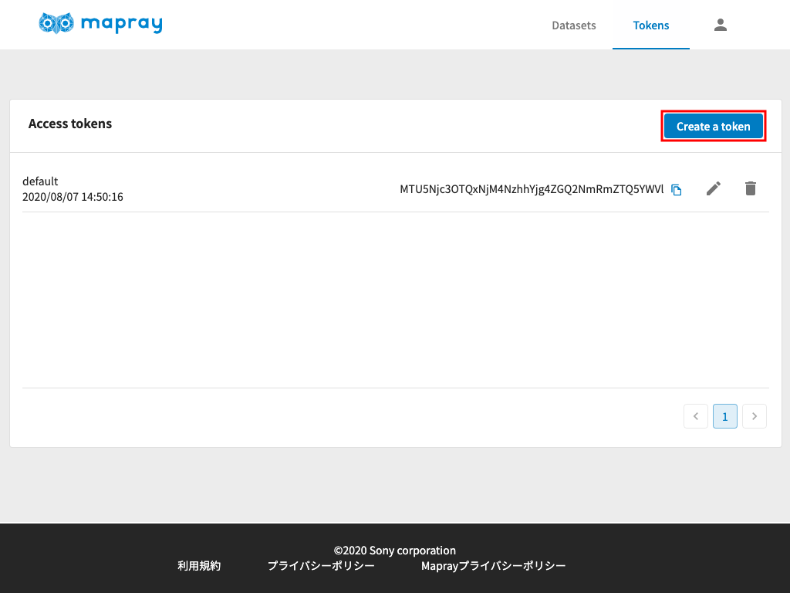
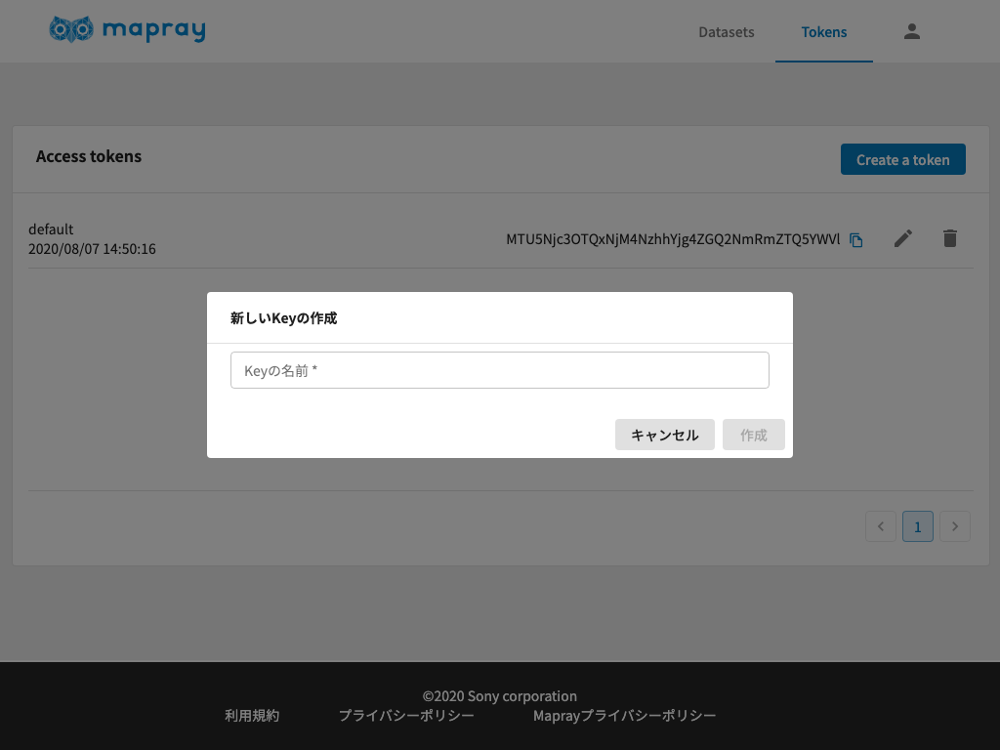
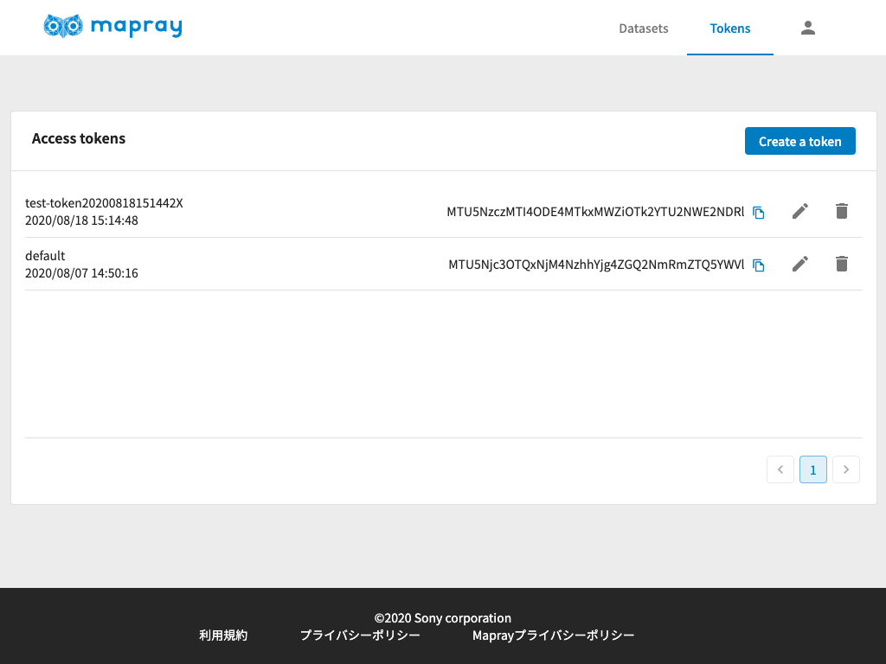

<!---
title: "　リソースの管理と認証"
date: 2019-07-16T18:02:17+09:00
draft: false
description: "maprayJSの概要"
keywords: ["maprayJS", "ブラウザ", "3D地図", "レンダリング"]
type: overview
menu: main
bookShowToC: false
weight: 1020
--->

# リソースの管理と認証

mapray cloud でのリソースの管理方法やリソースへのアクセス制限について説明します。
mapray cloud では下記２種類のデータを扱います。
- 地形・地図画像データ
- 地図上に表示する地理データ（ランドマークやポリゴン、3Dモデル）

## 地形・地図画像データ
地形データとは、地図の形状情報（高さ情報）を持ったデータです。地図に表示される地図画像データと同様にサーバから配信され地図上に表示されます。
これらのデータへのアクセスはTokenによって管理されており、適切な`Token`がHTTPヘッダに含まれていない場合はアクセスできないようになっています。

## 地図上に表示する地理データ
駅の位置情報や特定のエリアを示すポリゴン、3Dデータといった地図上に表示する地理データです。
mapray cloudでは、ユーザ様がお持ちの地理情報を自由にアップロードすることができます。
現段階では、2DデータとしてGeoJSON形式、3DデータとしてglTF形式のデータに対応しており、[mapray cloud](https://cloud.mapray.com)からアップロードすることができます。
今後様々な形式に対応する予定です。

アップロードや編集、削除といった地理情報の操作は、アップロードしたユーザしか行うことはできません。
アップロードされた地理情報の閲覧については地形・地図画像データ同様に、`Token`がHTTPヘッダに含まれていない場合はアクセスできないようになっています。

## Token

### Tokenの作成手順
1. Tokenは[mapray cloud](https://cloud.mapray.com)から生成します。

2. ログインが完了している状態で、 `Create a token`ボタン をクリックします。

    

3. 作成するTokenの名前を入力します。任意の名前を入力します。

    

4. Tokenを確認します

    
