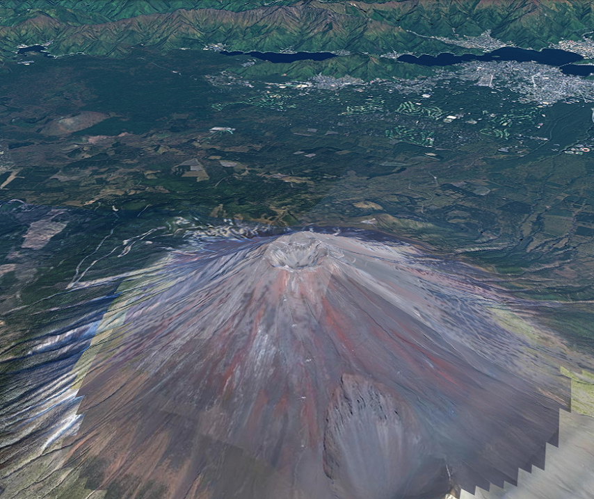
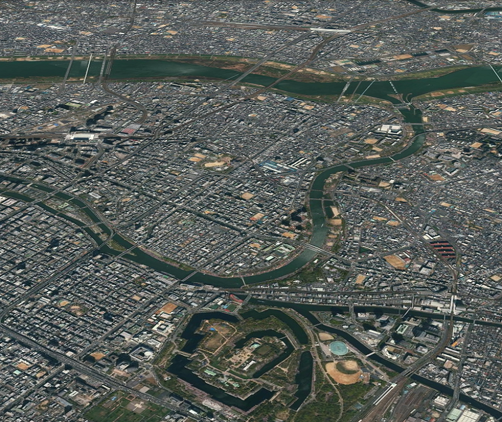

<!---
title: "　1.2 カメラのアニメーション"
date: 2019-12-02T15:00:00+09:00
draft: false
description: "動的にカメラの姿勢を変更するアニメーションを作成する"
keywords: ["チュートリアル", "カメラ", "姿勢", "アニメーション", "富士山", "回転"]
type: tutorials
menu: main
weight: 2012
--->

## カメラのアニメーション
動的にカメラの姿勢を変更するアニメーションを作成する方法を説明します。

### サンプルコード
動的にカメラの姿勢を変更するアニメーションを作成する**CameraAnimation.html**のサンプルコードです。
このサンプルコードでは、富士山を中心にカメラが360度回転します。

#### CameraAnimation.html

<!--@ 1 -->
```HTML
<!DOCTYPE html>
<html>
    <head>
        <meta charset="utf-8">
        <title>CameraAnimationSample</title>
        <script src="https://resource.mapray.com/mapray-js/v0.8.2/mapray.min.js"></script>
        <link rel="stylesheet" href="https://resource.mapray.com/styles/v1/mapray.css">
        <style>
            html, body {
                height: 100%;
                margin: 0;
            }

            div#mapray-container {
                display: flex;
                position: relative;
                height: 100%;
            }
        </style>
    </head>

    <body>
        <div id="mapray-container"></div>
    </body>
</html>

<script>
    // サブクラスのコンストラクタ定義
    function CameraAnimation() {
        mapray.RenderCallback.call(this);

        // Access Tokenを設定
        var accessToken = "<your access token here>";

        // Viewerを作成する
        new mapray.Viewer("mapray-container", {
            render_callback: this,
            image_provider: new mapray.StandardImageProvider("https://cyberjapandata.gsi.go.jp/xyz/seamlessphoto/", ".jpg", 256, 2, 18),
            dem_provider: new mapray.CloudDemProvider(accessToken)
        });

        this.longitude = 138.730647;    // 富士山の経度
        this.latitude = 35.362773;      // 富士山の緯度
        this.height = 3776.24;          // 富士山の高度
        this.distance = 10000.0;        // 富士山からの距離
        this.pitch_angle = -30.0;       // 仰俯角
        this.angular_velocity = 5.0;    // 毎フレームの回転角度
        this.turn_angle = 0;            // ターン角
    }

    // CameraAnimationにmapray.RenderCallbackを継承させる
    CameraAnimation.prototype = Object.create(mapray.RenderCallback.prototype);

    // 毎フレームの処理を定義
    CameraAnimation.prototype.onUpdateFrame = function(delta_time) {
        // 毎フレームの処理
        var camera = this.viewer.camera;

        // 基準座標系から GOCS への変換行列を生成
        var base_geoPoint = new mapray.GeoPoint( this.longitude, this.latitude, this.height );
        var base_to_gocs = base_geoPoint.getMlocsToGocsMatrix( mapray.GeoMath.createMatrix() );

        // カメラの相対位置を計算し、姿勢を決める
        var d = this.distance;

        var camera_Mat = mapray.GeoMath.createMatrix();

        var camera_pos_mat = mapray.GeoMath.createMatrix();
        mapray.GeoMath.setIdentity(camera_pos_mat);

        // カメラの位置をY軸方向に距離分移動させる
        camera_pos_mat[13] = -d;

        // z軸でturn_angle分回転させる回転行列を求める
        var turn_Mat = mapray.GeoMath.rotation_matrix([0, 0, 1], this.turn_angle, mapray.GeoMath.createMatrix());

        // x軸でpitch_angle分回転させる回転行列を求める
        var pitch_Mat = mapray.GeoMath.rotation_matrix([1, 0, 0], this.pitch_angle, mapray.GeoMath.createMatrix());

        // カメラの位置にX軸の回転行列をかける
        mapray.GeoMath.mul_AA(pitch_Mat, camera_pos_mat, camera_pos_mat);

        // カメラの位置にZ軸の回転行列をかける
        mapray.GeoMath.mul_AA(turn_Mat, camera_pos_mat, camera_pos_mat);

        // 視線方向を定義
        var cam_pos = mapray.GeoMath.createVector3([camera_pos_mat[12], camera_pos_mat[13], camera_pos_mat[14]]);
        var cam_end_pos = mapray.GeoMath.createVector3([0, 0, 0]);
        var cam_up = mapray.GeoMath.createVector3([0, 0, 1]);

        // ビュー変換行列を作成
        mapray.GeoMath.lookat_matrix(cam_pos, cam_end_pos, cam_up, camera_Mat);

        // カメラに変換行列を設定
        mapray.GeoMath.mul_AA(base_to_gocs, camera_Mat, camera.view_to_gocs);

        // カメラに近接遠方平面を設定
        camera.near = this.distance / 2;
        camera.far = camera.near * 1000;

        // 次のターン角度
        this.turn_angle += this.angular_velocity * delta_time;
    }

    // CameraAnimationのインスタンス作成
    var cam_Animation = new CameraAnimation();
</script>
```

このサンプルコードの詳細を以下で解説します。

#### htmlの記述
1～25行目でhtmlを記述しています。ヘルプページ『**緯度経度によるカメラ位置の指定**』で示したhtmlファイルからタイトルのみを変更します。
詳細はヘルプページ『**緯度経度によるカメラ位置の指定**』を参照してください。

<!--@ 1 -->
```HTML
<!DOCTYPE html>
<html>
    <head>
        <meta charset="utf-8">
        <title>CameraAnimationSample</title>
        <script src="https://resource.mapray.com/mapray-js/v0.8.2/mapray.min.js"></script>
        <link rel="stylesheet" href="https://resource.mapray.com/styles/v1/mapray.css">
        <style>
            html, body {
                height: 100%;
                margin: 0;
            }

            div#mapray-container {
                display: flex;
                position: relative;
                height: 100%;
            }
        </style>
    </head>
    <body>
        <div id="mapray-container"></div>
    </body>
</html>
```

#### カメラアニメーションクラスの定義
アニメーション処理を実現させるために、maprayにおけるレンダリング関連のコールバック関数（mapray.RenderCallback）を継承するカメラアニメーションクラスを作成します。29～49行目がその定義となり、コールバック関数の設定、アクセストークンの設定、Viewerの作成、カメラ姿勢に関する初期値の設定を行います。
まず、30行目でコールバック関数の設定を行い、33行目でアクセストークンを設定します。取得したアクセストークンを＜your access token here＞部分に設定します。
次に、地図を表示するために、maprayの表示を管理するクラス（mapray.Viewer）を生成します。このサンプルコードでは、レンダリング関連のコールバック関数を変更してアニメーションを実現させる必要があるため、コールバック関数を指定してViewerを作成します。その他、mapray.Viewerの生成処理の詳細は、ヘルプページ『**緯度経度によるカメラ位置の指定**』を参照してください。
最後に、カメラ姿勢に関する初期値を下記のように設定します。
- 注視点（回転中心）の緯度・経度・高度　⇒　富士山山頂付近
- 注視点（回転中心）からカメラまでの距離　⇒　10,000m
- カメラの仰俯角　⇒　-30度
- 1秒当たりの回転角度　⇒　5度
- 現在の回転角度　⇒　0度

<!--@ 28 -->
```JavaScript
// サブクラスのコンストラクタ定義
function CameraAnimation() {
    mapray.RenderCallback.call(this);

    // Access Tokenを設定
    var accessToken = "<your access token here>";

    // Viewerを作成する
    new mapray.Viewer("mapray-container", {
        render_callback: this,
        image_provider: new mapray.StandardImageProvider("https://cyberjapandata.gsi.go.jp/xyz/seamlessphoto/", ".jpg", 256, 2, 18),
        dem_provider: new mapray.CloudDemProvider(accessToken)
    });

    this.longitude = 138.730647;    // 富士山の経度
    this.latitude = 35.362773;      // 富士山の緯度
    this.height = 3776.24;          // 富士山の高度
    this.distance = 10000.0;        // 富士山からの距離
    this.pitch_angle = -30.0;       // 仰俯角
    this.angular_velocity = 5.0;    // 毎フレームの回転角度
    this.turn_angle = 0;            // ターン角
}
```

#### RenderCallbackの継承
52行目で、カメラのアニメーションクラスのプロトタイプに、Object.create関数で作成したRenderCallbackクラスのプロトタイプ設定することで、RenderCallbackクラスを継承します。

<!--@ 51 -->
```JavaScript
// CameraAnimationにmapray.RenderCallbackを継承させる
CameraAnimation.prototype = Object.create(mapray.RenderCallback.prototype);
```

#### フレームレンダリング前のコールバックメソッド（カメラ姿勢の変更処理）
55～103行目がフレームレンダリング前のコールバックメソッドです。このサンプルコードでは、動的にカメラの姿勢を変更し、アニメーションを表現します。
まず、60～61行目のgetMlocsToGocsMatrix関数で、注視点（回転中心）の緯度・経度・高度を地心直交座標系で表現したカメラ位置を表す変換行列を計算します。
次に、ビュー変換行列を作成します。まず、64～72行目で相対視点位置を表す変換行列を単位行列に初期化し、注視点からの距離を設定した値になるように、相対視点位置をY軸方向に移動します。その後、75～78行目で、現在の回転角度に対応する回転行列（Z軸回りの回転行列）、カメラの仰俯角に対応する回転行列（X軸回りの回転行列）を生成し、81～84行目で、相対視点位置を表す変換行列にそれぞれの回転行列を掛け合わせることで、相対視点位置を表す変換行列を作成します。最後に、87～92行目で、求めた相対視点位置、注視点、カメラの上方向ベクトルを利用して、最終的なビュー変換行列を作成します。
そして、95行目で、これまでに求めたカメラ位置を表す変換行列と、ビュー変換行列を掛け合わせることで、最終的なカメラ姿勢を計算します。
最後に、98～102行目でカメラの投影範囲を設定し、現在の回転角度を最新の状態に更新します。

<!--@ 54 -->
```JavaScript
// 毎フレームの処理を定義
CameraAnimation.prototype.onUpdateFrame = function(delta_time) {
    // 毎フレームの処理
    var camera = this.viewer.camera;

    // 基準座標系から GOCS への変換行列を生成
    var base_geoPoint = new mapray.GeoPoint( this.longitude, this.latitude, this.height );
    var base_to_gocs = base_geoPoint.getMlocsToGocsMatrix( mapray.GeoMath.createMatrix() );

    // カメラの相対位置を計算し、姿勢を決める
    var d = this.distance;

    var camera_Mat = mapray.GeoMath.createMatrix();

    var camera_pos_mat = mapray.GeoMath.createMatrix();
    mapray.GeoMath.setIdentity(camera_pos_mat);

    // カメラの位置をY軸方向に距離分移動させる
    camera_pos_mat[13] = -d;

    // z軸でturn_angle分回転させる回転行列を求める
    var turn_Mat = mapray.GeoMath.rotation_matrix([0, 0, 1], this.turn_angle, mapray.GeoMath.createMatrix());

    // x軸でpitch_angle分回転させる回転行列を求める
    var pitch_Mat = mapray.GeoMath.rotation_matrix([1, 0, 0], this.pitch_angle, mapray.GeoMath.createMatrix());

    // カメラの位置にX軸の回転行列をかける
    mapray.GeoMath.mul_AA(pitch_Mat, camera_pos_mat, camera_pos_mat);

    // カメラの位置にZ軸の回転行列をかける
    mapray.GeoMath.mul_AA(turn_Mat, camera_pos_mat, camera_pos_mat);

    // 視線方向を定義
    var cam_pos = mapray.GeoMath.createVector3([camera_pos_mat[12], camera_pos_mat[13], camera_pos_mat[14]]);
    var cam_end_pos = mapray.GeoMath.createVector3([0, 0, 0]);
    var cam_up = mapray.GeoMath.createVector3([0, 0, 1]);

    // ビュー変換行列を作成
    mapray.GeoMath.lookat_matrix(cam_pos, cam_end_pos, cam_up, camera_Mat);

    // カメラに変換行列を設定
    mapray.GeoMath.mul_AA(base_to_gocs, camera_Mat, camera.view_to_gocs);

    // カメラに近接遠方平面を設定
    camera.near = this.distance / 2;
    camera.far = camera.near * 1000;

    // 次のターン角度
    this.turn_angle += this.angular_velocity * delta_time;
}
```

#### クラスのインスタンス生成
106行目で、カメラアニメーションクラスのインスタンスを生成し、カメラのアニメーションが動作するようにします。

<!--@ 105 -->
```JavaScript
// CameraAnimationのインスタンス作成
var cam_Animation = new CameraAnimation();
```

### 出力イメージ
このサンプルコードの出力イメージは下図のようになります。


### カメラのアニメーションの改修
このサンプルコードを改修して、下記のアニメーションを表現できるようにします。
- 見る場所を富士山山頂から大阪城にする
- カメラの画角も動的に変更する

サンプルコードの修正部分は2つあり、以下で解説します。

#### カメラアニメーションクラスの定義の変更
カメラアニメーションクラスのカメラ姿勢の初期値の設定を下記のように変更します。
- 注視点（回転中心）の緯度・経度・高度　⇒　大阪城
- 注視点（回転中心）からカメラまでの距離　⇒　5,000m
- カメラの仰俯角　⇒　-30度
- 1秒当たりの回転角度　⇒　5度
- 現在の回転角度　⇒　0度
- 動的に変更する画角の最小値　⇒　30度
- 動的に変更する画角の最大値　⇒　70度
- 現在の画角　⇒　0度

<!--@ none -->
```JavaScript
// サブクラスのコンストラクタ定義
function CameraAnimation() {
    // 前半部分は省略

    this.longitude = 135.526202;    // 大阪城の経度
    this.latitude = 34.686502;      // 大阪城の緯度
    this.height = 1000;             // 大阪城の高度
    this.distance = 5000.0;         // 大阪城からの距離
    this.pitch_angle = -30.0;       // 仰俯角
    this.angular_velocity = 5.0;    // 毎フレームの回転角度
    this.turn_angle = 0;            // ターン角
    this.angle_Of_View_min = 30     // 最小画角
    this.angle_Of_View_max = 70     // 最大画角
    this.angle_Of_View = 0          // 画角
}
```

#### フレームレンダリング前のコールバックメソッド（カメラ姿勢の変更処理）の変更
ここでは、画角を動的に変更するために下記の2つの改修を行います。
- カメラの画角に現在の画角を設定する（コード内コメント『画角を設定』部分）
- 現在の画角を最新の状態に更新する（コード内コメント『次の画角』部分）

現在の画角は、現在の回転角度が、0～180度の間は最小画角から最大画角に遷移するように、180～360度の間は最大画角から最小画角に遷移するように設定します。

<!--@ none -->
```JavaScript
// 毎フレームの処理を定義
CameraAnimation.prototype.onUpdateFrame = function(delta_time) {
    // 前半部分は省略

    // 画角を設定
    camera.fov = this.angle_Of_View;

    // 次のターン角度
    this.turn_angle += this.angular_velocity * delta_time;

    // 次の画角
    if (this.turn_angle % 360 > 180)
    {
        this.angle_Of_View = this.angle_Of_View_min * (this.turn_angle % 180 / 180) + this.angle_Of_View_max * (1 - (this.turn_angle % 180 / 180));
    }
    else
    {
        this.angle_Of_View = this.angle_Of_View_min * (1 - (this.turn_angle % 180 / 180)) + this.angle_Of_View_max * (this.turn_angle % 180 / 180);
    }
}
```

### 出力イメージ
修正したサンプルコードの出力イメージは下図のようになります。

