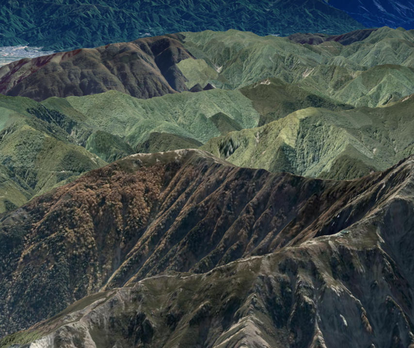
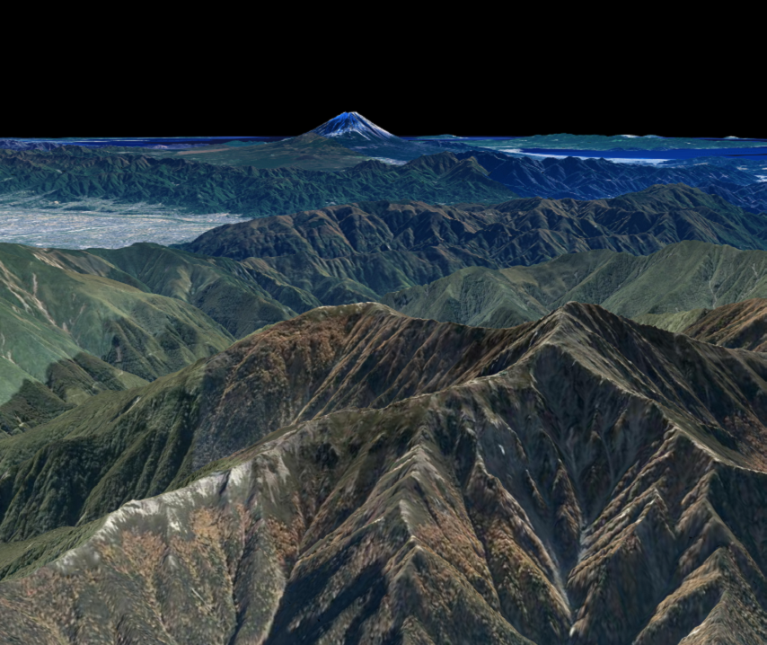

## 画角の変更

カメラの画角を変更する方法を説明します。

### サンプルコード
mapray.Viewerクラスの画角を指定する**ChangeAngleOfView30.html**のサンプルコードです。このサンプルコードでは、画角を30度に設定し、日本で2番目に標高の高い北岳付近から1番目に標高の高い富士山を眺めています。

#### ChangeAngleOfView30.html

```HTML
<!DOCTYPE html>
<html>
<html>
    <head>
        <meta charset="UTF-8">
        <title>ChangeAngleOfView30Sample</title>
        <script src="https://resource.mapray.com/mapray-js/v0.7.0/mapray.js"></script>
        <style>
            html, body {
                height: 100%;
                margin: 0;
            }

            div#mapray-container {
                display: flex;
                height: 97%;
            }

            div#mapInfo{
                display: flex;
                width: 50px;
                height: 25px;
                margin-left: auto;
                margin-right: 10px;
                align-items: center;
            }
        </style>
    </head>

    <body>
        <div id="mapray-container"></div>
        <div id="mapInfo"><a href="https://maps.gsi.go.jp/development/ichiran.html" style="font-size: 9px">国土地理院</a></div>
    </body>
</html>

<script>
    // Access Tokenを設定
    var accessToken = "<your access token here>";

    // Viewerを作成する
    viewer = new mapray.Viewer(
        "mapray-container", {
            image_provider: new mapray.StandardImageProvider("https://cyberjapandata.gsi.go.jp/xyz/seamlessphoto/", ".jpg", 256, 2, 18),
            dem_provider: new mapray.CloudDemProvider(accessToken)
        }
    );

    // カメラ位置の設定

    // 球面座標系（経度、緯度、高度）で視点を設定。座標は日本で2番目に高い山
    var home_pos = { longitude: 138.247739, latitude: 35.677604, height: 3000 };

    // 球面座標から地心直交座標へ変換
    var home_view_to_gocs = mapray.GeoMath.iscs_to_gocs_matrix(home_pos, mapray.GeoMath.createMatrix());

    // 視線方向を定義
    var cam_pos = mapray.GeoMath.createVector3([-3000, 2600, 1000]);
    var cam_end_pos = mapray.GeoMath.createVector3([0, 0, 0]);
    var cam_up = mapray.GeoMath.createVector3([0, 0, 1]);

    // ビュー変換行列を作成
    var view_to_home = mapray.GeoMath.createMatrix();
    mapray.GeoMath.lookat_matrix(cam_pos, cam_end_pos, cam_up, view_to_home);

    // カメラの位置と視線方向からカメラの姿勢を変更
    var view_to_gocs = viewer.camera.view_to_gocs;
    mapray.GeoMath.mul_AA(home_view_to_gocs, view_to_home, view_to_gocs);

    // カメラのnear、farの設定
    viewer.camera.near = 30;
    viewer.camera.far = 500000;

    // カメラの画角を30°に設定
    viewer.camera.fov = 30;
</script>
```

このサンプルコードの詳細を以下で解説します。

#### htmlの記述
1～33行目がhtmlの定義です。ヘルプページ『**緯度経度によるカメラ位置の指定**』で示したhtmlファイルからタイトルのみを変更します。
詳細はヘルプページ『**緯度経度によるカメラ位置の指定**』を参照してください。

```HTML
<!DOCTYPE html>
<html>
    <head>
        <meta charset="UTF-8">
        <title>ChangeAngleOfView30Sample</title>
        <script src="https://resource.mapray.com/mapray-js/v0.7.0/mapray.js"></script>
        <style>
            html, body {
                height: 100%;
                margin: 0;
            }

            div#mapray-container {
                display: flex;
                height: 97%;
            }

            div#mapInfo{
                display: flex;
                width: 50px;
                height: 25px;
                margin-left: auto;
                margin-right: 10px;
                align-items: center;
            }
        </style>
    </head>

    <body>
        <div id="mapray-container"></div>
        <div id="mapInfo"><a href="https://maps.gsi.go.jp/development/ichiran.html" style="font-size: 9px">国土地理院</a></div>
    </body>
</html>
```

#### カメラ位置・向きの設定
37～70行目でmapray.Viewerクラスを作成し、カメラ位置・向きを設定します。
詳細はヘルプページ『**緯度経度によるカメラ位置の指定**』を参照してください。

```JavaScript
// Access Tokenを設定
var accessToken = "<your access token here>";

// Viewerを作成する
viewer = new mapray.Viewer(
"mapray-container", {
    image_provider: new mapray.StandardImageProvider("https://cyberjapandata.gsi.go.jp/xyz/seamlessphoto/", ".jpg", 256, 2, 18),
    dem_provider: new mapray.CloudDemProvider(accessToken)
}
);

// カメラ位置の設定

// 球面座標系（経度、緯度、高度）で視点を設定。座標は日本で2番目に高い山
var home_pos = { longitude: 138.247739, latitude: 35.677604, height: 3000 };

// 球面座標から地心直交座標へ変換
var home_view_to_gocs = mapray.GeoMath.iscs_to_gocs_matrix(home_pos, mapray.GeoMath.createMatrix());

// 視線方向を定義
var cam_pos = mapray.GeoMath.createVector3([-3000, 2600, 1000]);
var cam_end_pos = mapray.GeoMath.createVector3([0, 0, 0]);
var cam_up = mapray.GeoMath.createVector3([0, 0, 1]);

// ビュー変換行列を作成
var view_to_home = mapray.GeoMath.createMatrix();
mapray.GeoMath.lookat_matrix(cam_pos, cam_end_pos, cam_up, view_to_home);

// カメラの位置と視線方向からカメラの姿勢を変更
var view_to_gocs = viewer.camera.view_to_gocs;
mapray.GeoMath.mul_AA(home_view_to_gocs, view_to_home, view_to_gocs);

// カメラのnear、farの設定
viewer.camera.near = 30;
viewer.camera.far = 500000;
```

#### カメラの画角の指定
73行目で画角を指定します。設定する値は正の角度（度）です。

```JavaScript
// カメラの画角を30°に設定
viewer.camera.fov = 30;
```

### 出力イメージ
このサンプルコードの出力イメージは下図のようになります。


カメラの画角を60度に設定した出力イメージは下図のようになります。画角が30度の時よりも広い範囲が見えます。

