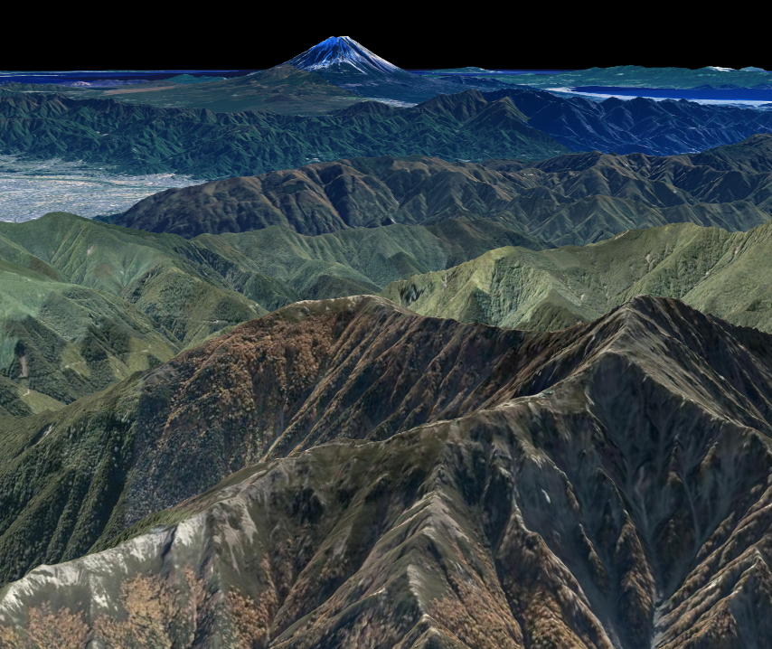

## 緯度経度によるカメラ位置の指定

緯度経度を指定してカメラ位置を指定する方法を説明します。

### サンプルコード
Mapray.Viewerクラスのカメラ位置を緯度・経度で指定する**LongitudeAndLatitudeCameraPos.html**サンプルコードです。このサンプルコードでは日本で2番目に標高の高い北岳付近から、最も標高の高い富士山を眺めています。

#### LongitudeAndLatitudeCameraPos.html

```HTML


<!DOCTYPE html>
<html>
<head>
    <meta charset="UTF-8">
    <title>LongitudeAndLatitudeCameraPosSample</title>
    <script src="https://api.mapray.com/mapray-js/v0.5.1/mapray.js"></script>
    <style>
        html, body {
            height: 100%;
            margin: 0;
        }

        div#mapray-container {
            display: flex;
            height: 97%;
        }

        div#mapInfo{
            display: flex;
            width: 50px;
            height: 25px;
            margin-left: auto;
            margin-right: 10px;
            align-items: center;
        }
    </style>
</head>

<body>
    <div id="mapray-container"></div>
    <div id="mapInfo"><a href="https://maps.gsi.go.jp/development/ichiran.html" style="font-size: 9px">国土地理院</a></div>
</body>
</html>

<script>
    // Access Tokenを設定
    var accessToken = "<your access token here>";

    // Viewerを作成する
    viewer = new mapray.Viewer(
        "mapray-container", {
            image_provider: new mapray.StandardImageProvider("https://cyberjapandata.gsi.go.jp/xyz/seamlessphoto/", ".jpg", 256, 2, 18),
            dem_provider: new mapray.CloudDemProvider(accessToken)
        }
    );

    // カメラ位置の設定

    // 球面座標系（経度、緯度、高度）で視点を設定。座標は日本で2番目に高い山
    var home_pos = { longitude: 138.247739, latitude: 35.677604, height: 3000 };

    // 球面座標から地心直交座標へ変換
    var home_view_to_gocs = mapray.GeoMath.iscs_to_gocs_matrix(home_pos, mapray.GeoMath.createMatrix());

    // 視線方向を定義
    var cam_pos = mapray.GeoMath.createVector3([-3000, 2600, 1000]);
    var cam_end_pos = mapray.GeoMath.createVector3([0, 0, 0]);
    var cam_up = mapray.GeoMath.createVector3([0, 0, 1]);

    //ビュー変換行列を作成
    var view_to_home = mapray.GeoMath.createMatrix();
    mapray.GeoMath.lookat_matrix(cam_pos, cam_end_pos, cam_up, view_to_home);

    // カメラの位置と視線方向からカメラの姿勢を変更
    var view_to_gocs = viewer.camera.view_to_gocs;
    mapray.GeoMath.mul_AA(home_view_to_gocs, view_to_home, view_to_gocs);

    // カメラのnear  farの設定
    viewer.camera.near = 30;
    viewer.camera.far = 500000;

</script>
```
このサンプルコードの詳細を以下で解説します。

#### htmlの文字コード設定
4行目でhtmlの文字コードを設定します。このサンプルコードでは、utf-8を設定します。

```HTML
<meta charset="UTF-8">
```

#### タイトルの設定
5行目でタイトルを設定します。このサンプルコードでは、LongitudeAndLatitudeCameraPosSampleを設定します。

```HTML
<title>LongitudeAndLatitudeCameraPosSample</title>
```

#### JavaScriptファイルのパス設定
6行目でhtmlで参照するJavaScriptのパスを設定します。このサンプルコードでは、maprayのJavaScriptファイルを設定します。

```HTML
<script src="https://api.mapray.com/mapray-js/v0.5.1/mapray.js"></script>
```

#### スタイルの設定
7～26行目で表示する要素のスタイルを設定します。このサンプルコードでは以下の要素のスタイルを設定します。
- html
- body
- div#mapray-container（地図表示部分）
- div#mapInfo（出典表示部分）

```HTML
<style>
    html, body {
        height: 100%;
        margin: 0;
    }

    div#mapray-container {
        display: flex;
        height: 97%;
    }

    div#mapInfo{
        display: flex;
        width: 50px;
        height: 25px;
        margin-left: auto;
        margin-right: 10px;
        align-items: center;
    }
</style>
```

#### 地図表示部分の要素
30行目で地図表示部分のブロックを記述します。このブロックのidに紐づけて地図を表示します。

```HTML
<div id="mapray-container"></div>
```

#### 出典表示部分の要素
31行目で国土地理院の出典部分のブロックを記述します。このブロックの中には国土地理院のホームページへのリンクを記述します。

```HTML
<div id="mapInfo"><a href="https://maps.gsi.go.jp/development/ichiran.html" style="font-size: 9px">国土地理院</a></div>
```

#### アクセストークンの設定
36、37行目でアクセストークンを設定します。＜your access token here＞部分に取得したアクセストークンを設定します。

```JavaScript
// Access Tokenを設定
var accessToken = "<your access token here>";
```

#### Viewerの作成
次に、地図を表示するために、39～45行目のmaprayの表示を管理するクラス（mapray.Viewer）を生成します。このクラスの引数は、コンテナ、生成オプションの順に設定します。このサンプルコードでは、地図表示部分のブロックのid、汎用的な地図画像プロバイダクラス（mapray.StandardImageProvider）のインスタンス、クラウドDEMプロバイダクラス（mapray.CloudDemProvider）のインスタンスを設定します。
汎用的な地図画像プロバイダクラスのコンストラクタの引数は、地図タイルのURLの先頭文字列、地図タイルのURLの末尾文字列、地図タイル画像の寸法、最小ズームレベル、最大ズームレベルの順に設定します。このサンプルコードでは、"https://cyberjapandata.gsi.go.jp/xyz/seamlessphoto/" 、".jpg"、256、2、18を設定します。
クラウドDEMプロバイダクラスのコンストラクタの引数は、APIキーの文字列を設定します。このサンプルコードでは、アクセストークンを設定します。

```JavaScript
// Viewerを作成する
viewer = new mapray.Viewer(
    "mapray-container", {
        image_provider: new mapray.StandardImageProvider("https://cyberjapandata.gsi.go.jp/xyz/seamlessphoto/", ".jpg", 256, 2, 18),
        dem_provider: new mapray.CloudDemProvider(accessToken)
    }
);
```
#### 3次元データの表示方法
2次元データ（画像等）は、直接画面に表示することができますが、3次元データは、直接画面に表示することができません。これは、表示しようとしている画面が2次元空間であるためであり、それよりも次元の大きいデータを表示しようとすると、2次元空間で表示できるように、次元の削減をする必要があります。
この問題を解決するために、コンピュータグラフィックスの世界では、カメラで撮影したと仮定した映像を表示することで、3次元データを画面上に表示できるようにしています。
ここでは、その方法の概念をサンプルコードと合わせて解説します。

##### カメラと3Dモデルの関係
カメラで撮影したと仮定した映像を表示するためには、カメラそのものと被写体となる3Dモデルが必要になります。日常生活におけるカメラと被写体の関係と同じように、コンピュータグラフィックスで表現する場合も、カメラと被写体は同一空間上に存在する必要があります。その空間は基本的に3次元の直交座標系で表現され、こちらも日常生活における生活空間と何ら変わりがありません。つまり、日常生活において、カメラで被写体を撮影する行為をコンピュータの中で実現させることで、3次元データを2次元データで表現することができるようになります。
そのために必要となる情報は、日常生活においてカメラを撮影することを考えると、下記の情報が必要なことが想像できます。
 - 被写体（対象の3Dモデル）
 - 撮影位置（カメラの位置）
 - 撮影する向き（カメラの向き）
 - 焦点距離（ズーム量）などのカメラの詳細パラメータ（カメラのズームイン・ズームアウト）
 - 撮影中心（被写体のどこを狙って撮影するか）

これらの情報が用意できれば、コンピュータの中で被写体を撮影するという行為ができるようになり、その結果の画像を画面に表示することができるようになります。以降で、これらの情報をどのように用意するのかを順に解説します。

##### 被写体（対象の3Dモデル）
Maprayを利用する場合の被写体（対象の3Dモデル）は、表示したいものは地図データなので、地図データそのものとなります。その地図データのどこをどのように撮影する（見る）かで、表示される画像が変わることになります。

##### 撮影位置（カメラの位置）
このサンプルコードでは、日本で2番目に標高の高い北岳付近から、最も標高の高い富士山を見ている画像を作成することを目標としているため、撮影位置（カメラの位置）は、日本で2番目に標高の高い北岳にする必要があります。
まず、北岳の場所を緯度・経度・高度による球面座標系で用意します。サンプルコードでは、50行目の処理がその内容にあたります。
しかし、前述のとおり、コンピュータグラフィックスで表現するためには、カメラと被写体は同一空間、つまり3次元の直交座標系上に存在する必要があります。50行目で用意した北岳の場所は、球面座標系で表現された位置なので、3次元の直交座標系に変換しなければ、2次元の画像として表現できないことになります。Maprayでは、この3次元の直交座標系に地心直交座標系を用いているため、球面座標系から地心直交座標系に変換する処理を行い、地心直交座標系での北岳の位置を求めます。サンプルコードでは、53行目の処理がその内容にあたります。maprayで用意されているiscs_to_gocs_matrix関数は、球面座標系で表現された位置を地心直交座標系に変換することができます。

```JavaScript
// 球面座標系（経度、緯度、高度）で視点を設定。座標は日本で2番目に高い山
var home_pos = { longitude: 138.247739, latitude: 35.677604, height: 3000 };

// 球面座標から地心直交座標へ変換
var home_view_to_gocs = mapray.GeoMath.iscs_to_gocs_matrix(home_pos, mapray.GeoMath.createMatrix());
```

##### 撮影する向き（カメラの向き）と撮影中心（被写体のどこを狙って撮影するか）
次に、撮影する向き（カメラの向き）と撮影中心（被写体のどこを狙って撮影するか）を決定します。撮影する向きは視線方向と、撮影中心は注視点とそれぞれ呼ばれ、それが決まると、3次元データを2次元画像として表現することができるようになります。maprayでは、カメラの情報を元に3次元データを2次元画像に変換するための変換行列を、62行目のlookat_matrix関数で作成することができます。
lookat_matrix関数には、カメラの向きを定めるために、下記の3つの情報を受け渡す必要があります。これらの情報はローカル座標で定義することになりますが、Maprayではこのローカル座標系をMaprayローカル直交座標系と呼びます。
- 視点の位置
- 注視点の位置
- カメラの上方向ベクトル

このサンプルコードでは、56行目で視点の位置を設定し、57行目で注視点の位置を設定しています。この視点と注視点の位置から撮影する向きは決まりますが、カメラ自体の向き（縦持ち・横持ちなどのカメラ自身の向き）はこれらの情報だけでは決定することができません。そこで、58行目でカメラの上方向を示すベクトルを設定することで、カメラ自体の向きを確定することができ、これらの情報をもとに変換行列を計算することができます。

```JavaScript
// 視線方向を定義
var cam_pos = mapray.GeoMath.createVector3([-3000, 2600, 1000]);
var cam_end_pos = mapray.GeoMath.createVector3([0, 0, 0]);
var cam_up = mapray.GeoMath.createVector3([0, 0, 1]);

//ビュー変換行列を作成
var view_to_home = mapray.GeoMath.createMatrix();
mapray.GeoMath.lookat_matrix(cam_pos, cam_end_pos, cam_up, view_to_home);
```

##### カメラ姿勢の適用
これまでに求めたカメラ位置を表す変換行列と、カメラ方向を表す変換行列から、最終的なカメラ姿勢を計算し、Mapray.Viewerクラスのカメラに反映します。64～66行目では、mul_AA関数を用いて、2つの行列を乗算し、最終的なカメラ姿勢を計算しています。

```JavaScript
// カメラの位置と視線方向からカメラの姿勢を変更
var view_to_gocs = this.viewer.camera.view_to_gocs;
mapray.GeoMath.mul_AA(home_view_to_gocs, view_to_home, view_to_gocs);
```

##### 焦点距離（ズーム量）などのカメラの詳細パラメータ（カメラのズームイン・ズームアウト）
これまでに説明した内容で、3次元データを2次元画像として表現することができるようになりましたが、撮影するカメラには、画角や焦点距離など、カメラの詳細パラメータを設定することで、2次元画像に表現する内容を変更させることができます。
このサンプルコードでは、カメラの見える範囲（投影範囲）を設定します。これは実際のカメラの焦点距離と同じ考え方で、撮影するカメラで見える範囲を設定することができます。コンピュータグラフィックスでは、カメラからの近い側を近接平面距離、遠い側を遠方平面距離と呼び、その2つの距離の中に含まれている3次元データを2次元画像で表現する対象としています。具体的には、69行目で指定した近接平面距離と70行目で指定した遠方平面距離の間になるため、このサンプルコードでは、カメラの位置から30～500,000mmの範囲が表示対象となっています。

```JavaScript
// カメラのnear  farの設定
this.viewer.camera.near = 30;
this.viewer.camera.far = 500000;
```

### 出力イメージ
このサンプルコードの出力イメージは下図のようになります。

