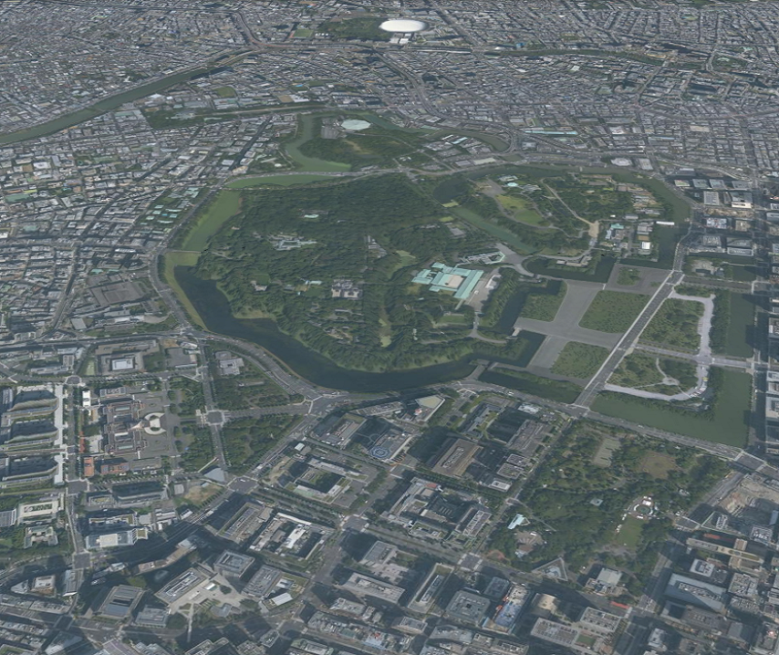
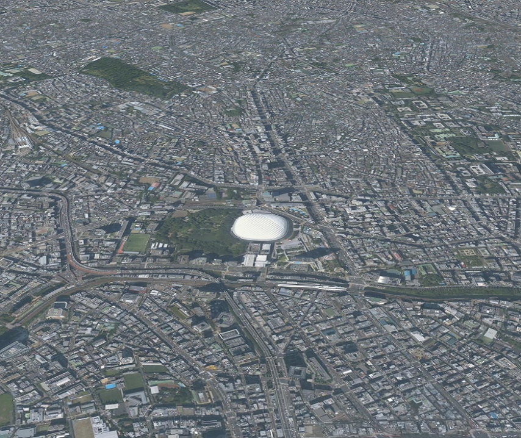

<!---
title: "　1.4 パスに沿ったカメラアニメーション"
date: 2019-12-02T14:15:31+09:00
draft: false
description: "パスに沿ったカメラアニメーション"
keywords: ["チュートリアル", "カメラ", "アニメーション", "パス", "皇居", "東京タワー", "東京スカイツリー", "東京ドーム"]
type: tutorials
menu: main
weight: 2014
--->

## パスに沿ったカメラアニメーション
仮想的なパスに沿ってカメラをアニメーションさせる方法を説明します。

### サンプルコード
仮想的なパスに沿ってカメラをアニメーションさせる**VirtualPathCameraAnimation.html**及び**VirtualPathCameraAnimation.js**のサンプルコードです。
このサンプルコードでは、皇居、東京タワー、東京スカイツリー、東京ドーム、皇居の順に各地を結ぶ仮想パスに沿ってカメラが移動します。

#### VirtualPathCameraAnimation.html

<!--@ 1 -->
```HTML
<!DOCTYPE html>
<html>
    <head>
        <meta charset="utf-8">
        <title>VirtualPathCameraAnimationSample</title>
        <script src="https://resource.mapray.com/mapray-js/v0.8.3/mapray.min.js"></script>
        <link rel="stylesheet" href="https://resource.mapray.com/styles/v1/mapray.css">
        <script src="VirtualPathCameraAnimation.js"></script>
        <style>
            html, body {
                height: 100%;
                margin: 0;
            }

            div#mapray-container {
                display: flex;
                position: relative;
                height: 100%;
            }
        </style>
    </head>

    <body onload="new VirtualPathCameraAnimation('mapray-container');">
        <div id="mapray-container"></div>
    </body>
</html>
```

#### VirtualPathCameraAnimation.js

<!--@ 1 -->
```JavaScript
class VirtualPathCameraAnimation extends mapray.RenderCallback {

    constructor(container) {
        super();

        // Access Tokenを設定
        var accessToken = "<your access token here>";

        // Viewerを作成する
        new mapray.Viewer(container, {
            render_callback: this,
            image_provider: this.createImageProvider(),
            dem_provider: new mapray.CloudDemProvider(accessToken)
        });

        this.path_Pos_Array = [{ longitude: 139.7528, latitude: 35.685175, height: 50.0 },      // 仮想パスの終点(皇居)
                               { longitude: 139.745433, latitude: 35.658581, height: 50.0 },    // 仮想パスの終点(東京タワー)
                               { longitude: 139.8107, latitude: 35.710063, height: 50.0 },      // 仮想パスの終点(スカイツリー)
                               { longitude: 139.751891, latitude: 35.70564, height: 50.0 },     // 仮想パスの終点(東京ドーム)
                               { longitude: 139.7528, latitude: 35.685175, height: 50.0 }]      // 仮想パスの始点(皇居)
        this.distance = 3000.0;         // 基準点からの距離
        this.pitch_angle = -30.0;       // 仰俯角
        this.ratio_Increment = 0.15;    // 毎フレームの線形補間割合増加分
        this.ratio = 0.0;               // 線形補間の割合
        this.path_Pos_Index = 0;
    }

    onStart()  // override
    {
        // 初期の線形補間の割合を設定
        this.ratio = 0.0;
    }

    //フレーム毎に呼ばれるメソッド
    onUpdateFrame(delta_time)  // override
    {
        var camera = this.viewer.camera;

        // カメラに変換行列を設定
        mapray.GeoMath.mul_AA(this.createInterpolationBaseToGocsMatrix(), this.createViewToBaseMatrix(), camera.view_to_gocs);

        // カメラに近接遠方平面を設定
        camera.near = this.distance / 2;
        camera.far = camera.near * 1000;

        // 次の線形補間の割合
        this.ratio += this.ratio_Increment * delta_time;

        if (this.ratio > 1.0) {
            this.ratio = 0.0;
            this.path_Pos_Index += 1;
        }

        if (this.path_Pos_Index == this.path_Pos_Array.length - 1) {
            this.path_Pos_Index = 0;
        }
    }

    // 画像プロバイダを生成
    createImageProvider() {
        return new mapray.StandardImageProvider("https://cyberjapandata.gsi.go.jp/xyz/seamlessphoto/", ".jpg", 256, 2, 18);
    }

    // 2点の間を線形保管し、基準座標系から GOCS への変換行列を生成
    createInterpolationBaseToGocsMatrix() {
        var interpolation_Pos = {
            longitude: this.path_Pos_Array[this.path_Pos_Index].longitude * (1 - this.ratio) + this.path_Pos_Array[this.path_Pos_Index + 1].longitude * this.ratio,
            latitude: this.path_Pos_Array[this.path_Pos_Index].latitude * (1 - this.ratio) + this.path_Pos_Array[this.path_Pos_Index + 1].latitude * this.ratio,
            height: this.path_Pos_Array[this.path_Pos_Index].height * (1 - this.ratio) + this.path_Pos_Array[this.path_Pos_Index + 1].height * this.ratio
        };

        var base_geoPoint = new mapray.GeoPoint( interpolation_Pos.longitude, interpolation_Pos.latitude, interpolation_Pos.height );
        var base_to_gocs = base_geoPoint.getMlocsToGocsMatrix( mapray.GeoMath.createMatrix() );

        return base_to_gocs;
    }

    // カメラの相対位置を計算し、姿勢を決める
    createViewToBaseMatrix() {
        var d = this.distance;

        var mat = mapray.GeoMath.createMatrix();

        var camera_pos_mat = mapray.GeoMath.createMatrix();
        mapray.GeoMath.setIdentity(camera_pos_mat);

        // カメラの位置をY軸方向に距離分移動させる
        camera_pos_mat[13] = -d;

        // x軸でpitch_angle分回転させる回転行列を求める
        var pitch_Mat = mapray.GeoMath.rotation_matrix([1, 0, 0], this.pitch_angle, mapray.GeoMath.createMatrix());

        // カメラの位置にX軸の回転行列をかける
        mapray.GeoMath.mul_AA(pitch_Mat, camera_pos_mat, camera_pos_mat);

        // 視線方向を定義
        var cam_pos = mapray.GeoMath.createVector3([camera_pos_mat[12], camera_pos_mat[13], camera_pos_mat[14]]);
        var cam_end_pos = mapray.GeoMath.createVector3([0, 0, 0]);
        var cam_up = mapray.GeoMath.createVector3([0, 0, 1]);

        // ビュー変換行列を作成
        mapray.GeoMath.lookat_matrix(cam_pos, cam_end_pos, cam_up, mat);

        return mat;
    }

}
```

### htmlのサンプルコードの詳細
htmlのサンプルコードの詳細を以下で解説します。

#### htmlの文字コード設定
4行目でhtmlの文字コードを設定します。このサンプルコードでは、utf-8を設定します。

<!--@ 4 -->
```HTML
<meta charset="utf-8">
```

#### タイトルの設定
5行目でタイトルを設定します。このサンプルコードでは、VirtualPathCameraAnimationSampleを設定します。

<!--@ 5 -->
```HTML
<title>VirtualPathCameraAnimationSample</title>
```

#### JavaScriptファイルのパス設定
6～8行目で参照するJavaScript及びスタイルシートのパスを設定します。このサンプルコードでは、maprayのJavaScriptファイル、スタイルシート、パスに沿ってカメラアニメーションするJavaScriptファイル（**VirtualPathCameraAnimation.js**）を設定します。

<!--@ 6 -->
```HTML
<script src="https://resource.mapray.com/mapray-js/v0.8.3/mapray.min.js"></script>
<link rel="stylesheet" href="https://resource.mapray.com/styles/v1/mapray.css">
<script src="VirtualPathCameraAnimation.js"></script>
```

#### スタイルの設定
9～20行目で表示する要素のスタイルを設定します。スタイルの詳細は、ヘルプページ『**緯度経度によるカメラ位置の指定**』を参照してください。

<!--@ 9 -->
```HTML
<style>
    html, body {
        height: 100%;
        margin: 0;
    }

    div#mapray-container {
        display: flex;
        position: relative;
        height: 100%;
    }
</style>
```

#### loadイベントの処理
画面を表示するときに、パスに沿ったカメラアニメーションクラスを生成します。そのため、23行目でページの読み込み時に、地図表示部分のブロックのidからパスに沿ったカメラアニメーションクラスのインスタンスを生成します。
パスに沿ったカメラアニメーションクラスはJavaScriptのサンプルコードの詳細で説明します。

<!--@ 23 -->
```HTML
<body onload="new VirtualPathCameraAnimation('mapray-container');">
```

#### 地図表示部分の指定
24行目で地図表示部分のブロックを記述します。
要素の詳細は、ヘルプページ『**緯度経度によるカメラ位置の指定**』を参照してください。

<!--@ 24 -->
```HTML
<div id="mapray-container"></div>
```

### JavaScriptのサンプルコードの詳細
JavaScriptのサンプルコードの詳細を以下で解説します。

#### クラスとグローバル変数の説明
1～108行目でパスに沿ったカメラアニメーションクラスを定義します。アニメーションを表現するために、パスに沿ったカメラアニメーションクラスは、mapray.RenderCallbackクラスを継承します。

<!--@ none -->
```JavaScript
class VirtualPathCameraAnimation extends mapray.RenderCallback {

    //中略

}
```

#### コンストラクタ
3～26行目がパスに沿ったカメラアニメーションクラスのコンストラクタです。引数として渡されるブロックのidに対して、mapray.Viewerを作成します。Mapray.Viewerのベース地図の画像プロバイダは、画像プロバイダの生成メソッドで取得した画像プロバイダを設定します。mapray.Viewerの生成処理の詳細は、ヘルプページ『**カメラのアニメーション**』を参照してください。
最後に、パスアニメーションに関する初期値を下記のように設定します。
- パスの経由点の緯度・経度・高度　⇒　皇居、東京タワー、東京スカイツリー、東京ドーム
- パスの経由点からカメラまでの距離　⇒　3,000m
- カメラの仰俯角　⇒　-30度
- カメラ位置の線形補間時の1秒当たりの増加割合　⇒ 0.15
- カメラ位置の線形補間時の現在の割合 ⇒ 0
- カメラ位置の線形補間対象となる区間番号　⇒　0

<!--@ 3 -->
```JavaScript
constructor(container) {
    super();

    // Access Tokenを設定
    var accessToken = "<your access token here>";

    // Viewerを作成する
    new mapray.Viewer(container, {
        render_callback: this,
        image_provider: this.createImageProvider(),
        dem_provider: new mapray.CloudDemProvider(accessToken)
    });

    this.path_Pos_Array = [{ longitude: 139.7528, latitude: 35.685175, height: 50.0 },      // 仮想パスの終点(皇居)
                           { longitude: 139.745433, latitude: 35.658581, height: 50.0 },    // 仮想パスの終点(東京タワー)
                           { longitude: 139.8107, latitude: 35.710063, height: 50.0 },      // 仮想パスの終点(スカイツリー)
                           { longitude: 139.751891, latitude: 35.70564, height: 50.0 },     // 仮想パスの終点(東京ドーム)
                           { longitude: 139.7528, latitude: 35.685175, height: 50.0 }]      // 仮想パスの始点(皇居)
    this.distance = 3000.0;         // 基準点からの距離
    this.pitch_angle = -30.0;       // 仰俯角
    this.ratio_Increment = 0.15;    // 毎フレームの線形補間割合増加分
    this.ratio = 0.0;               // 線形補間の割合
    this.path_Pos_Index = 0;
}
```

#### レンダリングループの開始時のコールバックメソッド
28～32行目がレンダリングループの開始時のコールバックメソッドです。RenderCallbackクラスのonStartメソッドをオーバーライドしたメソッドで、レンダリングが始まる前に呼ばれます。
このサンプルコードでは、線形補間の割合に0を設定します。

<!--@ 28 -->
```JavaScript
onStart()  // override
{
    // 初期の線形補間の割合を設定
    this.ratio = 0.0;
}
```

#### フレームレンダリング前のコールバックメソッド（カメラ位置の更新処理）
35～57行目がフレームレンダリング前のコールバックメソッドです。このサンプルコードでは、カメラ位置の更新処理を行います。
まず、現在の線形補間状態からカメラ位置を表す変換行列を求めるメソッド、カメラの視線方向を表すビュー変換行列を求めるメソッドを用いて、現時点のカメラ姿勢を反映します。そして、カメラの設定範囲（近接遠方平面）を設定し、現在の線形補間の割合および線形補間の対象区間を更新します。
カメラ位置を表す変換行列を求めるメソッド、カメラの視線方向を表すビュー変換行列を求めるメソッドの詳細については後述します。

<!--@ 34 -->
```JavaScript
// フレーム毎に呼ばれるメソッド
onUpdateFrame(delta_time)  // override
{
    var camera = this.viewer.camera;

    // カメラに変換行列を設定
    mapray.GeoMath.mul_AA(this.createInterpolationBaseToGocsMatrix(), this.createViewToBaseMatrix(), camera.view_to_gocs);

    // カメラに近接遠方平面を設定
    camera.near = this.distance / 2;
    camera.far = camera.near * 1000;

    // 次の線形補間の割合
    this.ratio += this.ratio_Increment * delta_time;

    if (this.ratio > 1.0) {
        this.ratio = 0.0;
        this.path_Pos_Index += 1;
    }

    if (this.path_Pos_Index == this.path_Pos_Array.length - 1) {
        this.path_Pos_Index = 0;
    }
}
```

#### 画像プロバイダの生成
60～62行目が画像プロバイダの生成メソッドです。生成した画像プロバイダを返します。
画像プロバイダの生成の詳細は、ヘルプページ『**緯度経度によるカメラ位置の指定**』を参照してください。

<!--@ 59 -->
```JavaScript
// 画像プロバイダを生成
createImageProvider() {
    return new mapray.StandardImageProvider("https://cyberjapandata.gsi.go.jp/xyz/seamlessphoto/", ".jpg", 256, 2, 18);
}
```

#### カメラ位置を表す変換行列の取得
65～76行目がカメラ位置を表す変換行列の取得メソッドです。まず、66～70行目で、線形補間対象となる区間番号に対応する経由点間に対して、現在の線形補間の割合で線形補間し、カメラの緯度・経度・高度を求めます。そして、72～73行目で、その緯度・経度・高度の座標を地心直交座標系に変換することで、カメラ位置を表す変換行列を求めます。

<!--@ 64 -->
```JavaScript
// 2点の間を線形保管し、基準座標系から GOCS への変換行列を生成
createInterpolationBaseToGocsMatrix() {
    var interpolation_Pos = {
        longitude: this.path_Pos_Array[this.path_Pos_Index].longitude * (1 - this.ratio) + this.path_Pos_Array[this.path_Pos_Index + 1].longitude * this.ratio,
        latitude: this.path_Pos_Array[this.path_Pos_Index].latitude * (1 - this.ratio) + this.path_Pos_Array[this.path_Pos_Index + 1].latitude * this.ratio,
        height: this.path_Pos_Array[this.path_Pos_Index].height * (1 - this.ratio) + this.path_Pos_Array[this.path_Pos_Index + 1].height * this.ratio
    };

    var base_geoPoint = new mapray.GeoPoint( interpolation_Pos.longitude, interpolation_Pos.latitude, interpolation_Pos.height );
    var base_to_gocs = base_geoPoint.getMlocsToGocsMatrix( mapray.GeoMath.createMatrix() );

    return base_to_gocs;
}
```

#### カメラの視線方向を表すビュー変換行列の取得
79～105行目がカメラの視線方向を表すビュー変換行列の取得メソッドです。まず、80～88行目で、相対視点位置を表す変換行列を単位行列に初期化し、注視点からの距離を設定した値になるように、相対視点位置をY軸方向に移動します。その後、91行目でカメラの仰俯角に対応する回転行列（X軸回りの回転行列）を生成し、94行目で相対視点位置を表す変換行列に回転行列を掛け合わせることで、相対視点位置を表す変換行列を作成します。最後に、97～102行目で、求めた相対視点位置、注視点、カメラの上方向ベクトルを利用して、最終的なビュー変換行列を求めます。

<!--@ 78 -->
```JavaScript
// カメラの相対位置を計算し、姿勢を決める
createViewToBaseMatrix() {
    var d = this.distance;

    var mat = mapray.GeoMath.createMatrix();

    var camera_pos_mat = mapray.GeoMath.createMatrix();
    mapray.GeoMath.setIdentity(camera_pos_mat);

    // カメラの位置をY軸方向に距離分移動させる
    camera_pos_mat[13] = -d;

    // x軸でpitch_angle分回転させる回転行列を求める
    var pitch_Mat = mapray.GeoMath.rotation_matrix([1, 0, 0], this.pitch_angle, mapray.GeoMath.createMatrix());

    // カメラの位置にX軸の回転行列をかける
    mapray.GeoMath.mul_AA(pitch_Mat, camera_pos_mat, camera_pos_mat);

    // 視線方向を定義
    var cam_pos = mapray.GeoMath.createVector3([camera_pos_mat[12], camera_pos_mat[13], camera_pos_mat[14]]);
    var cam_end_pos = mapray.GeoMath.createVector3([0, 0, 0]);
    var cam_up = mapray.GeoMath.createVector3([0, 0, 1]);

    // ビュー変換行列を作成
    mapray.GeoMath.lookat_matrix(cam_pos, cam_end_pos, cam_up, mat);

    return mat;
}
```

### 出力イメージ
このサンプルコードの初期状態の出力イメージは下図のようになります。


その後、カメラが東京ドームまで移動した時の出力イメージは下図のようになります。

