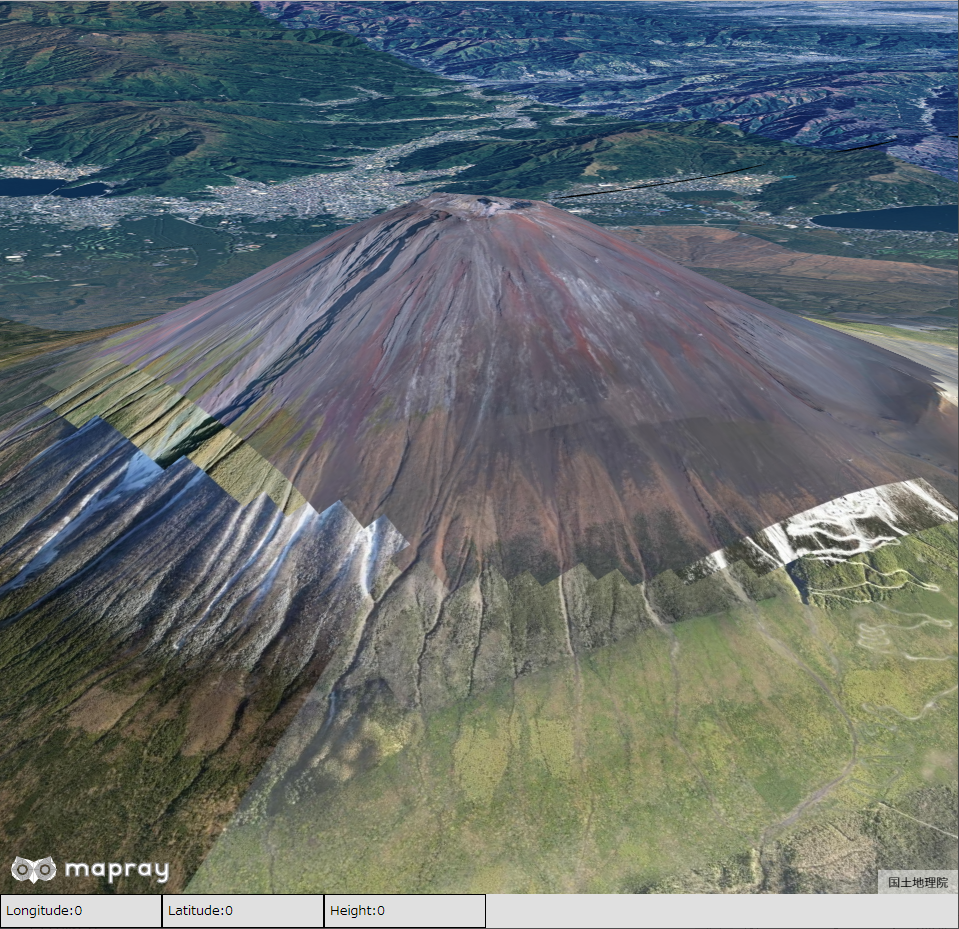
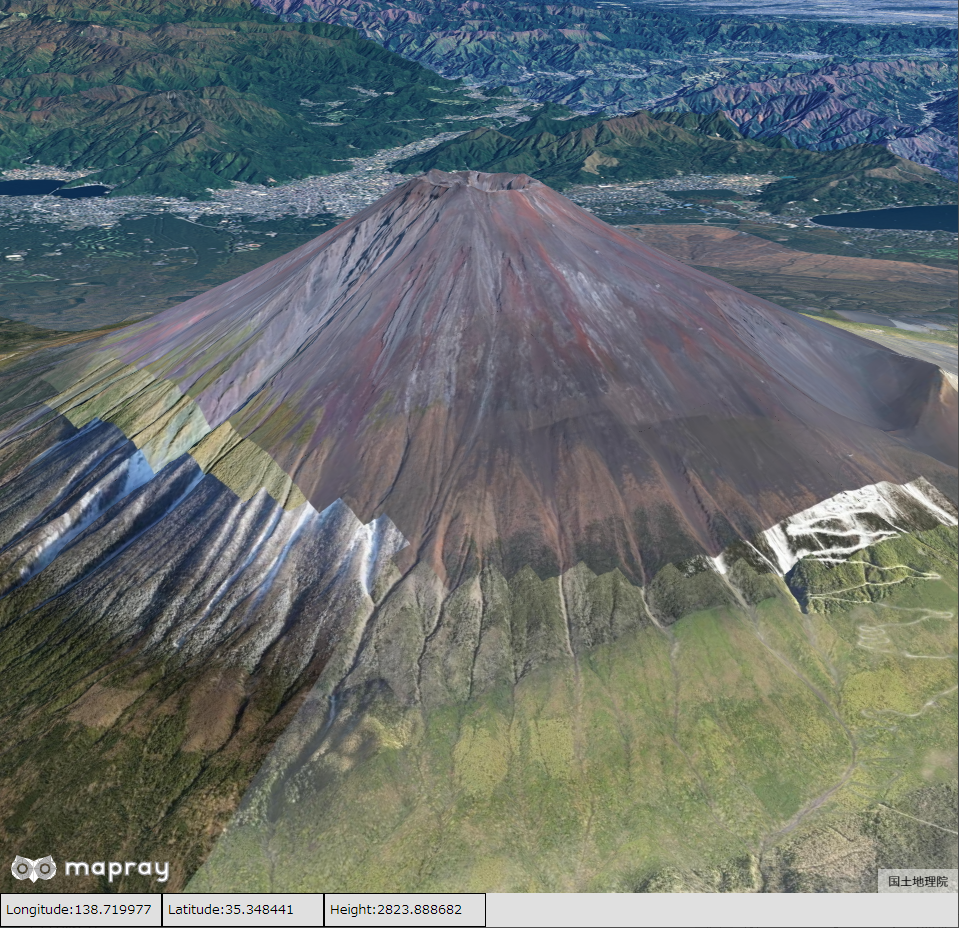
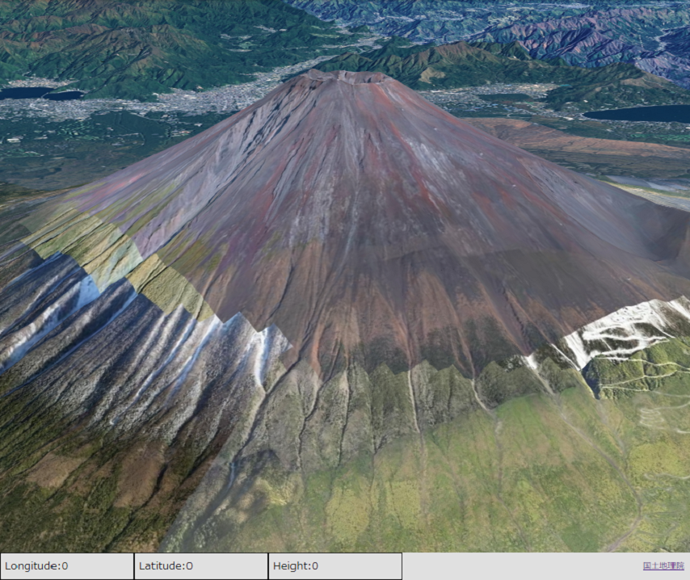
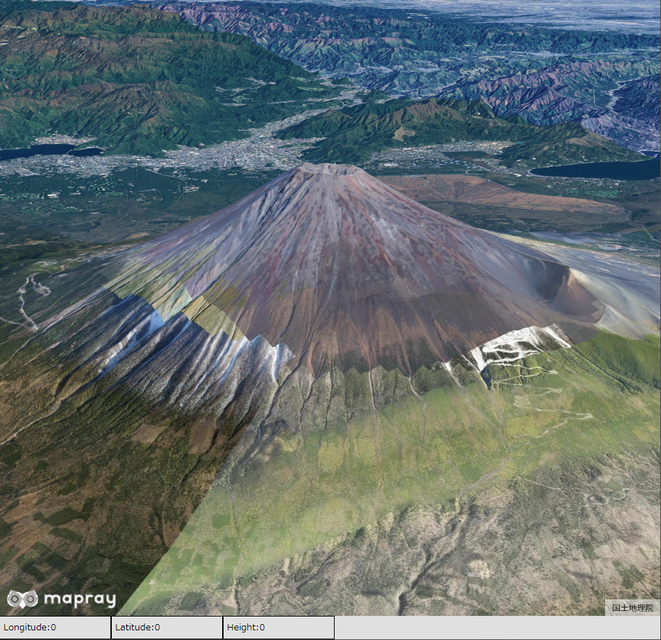
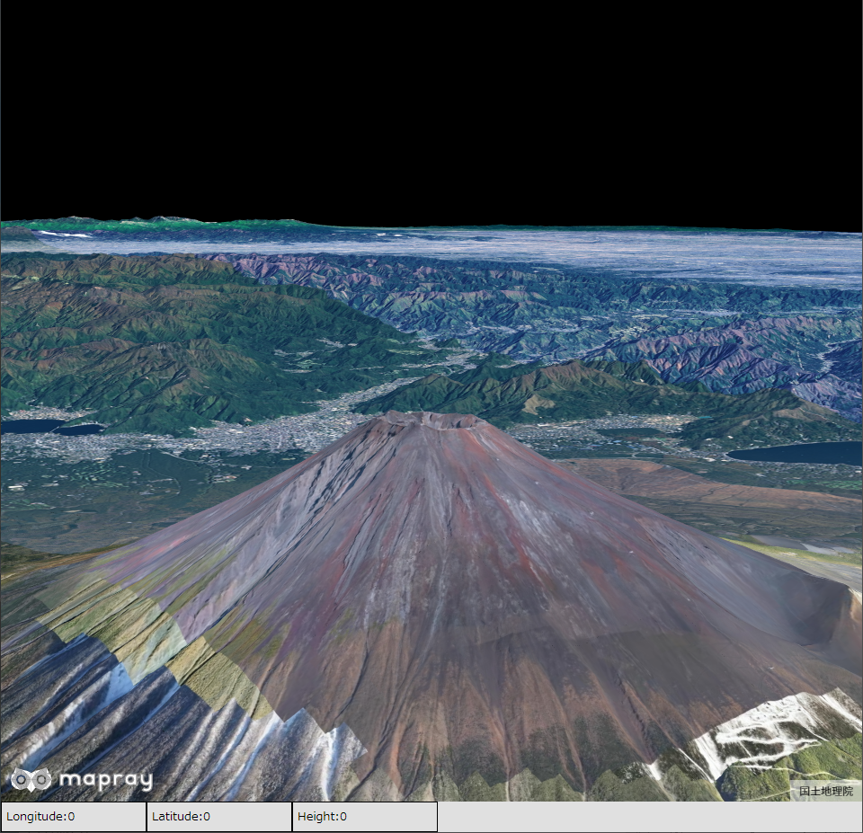
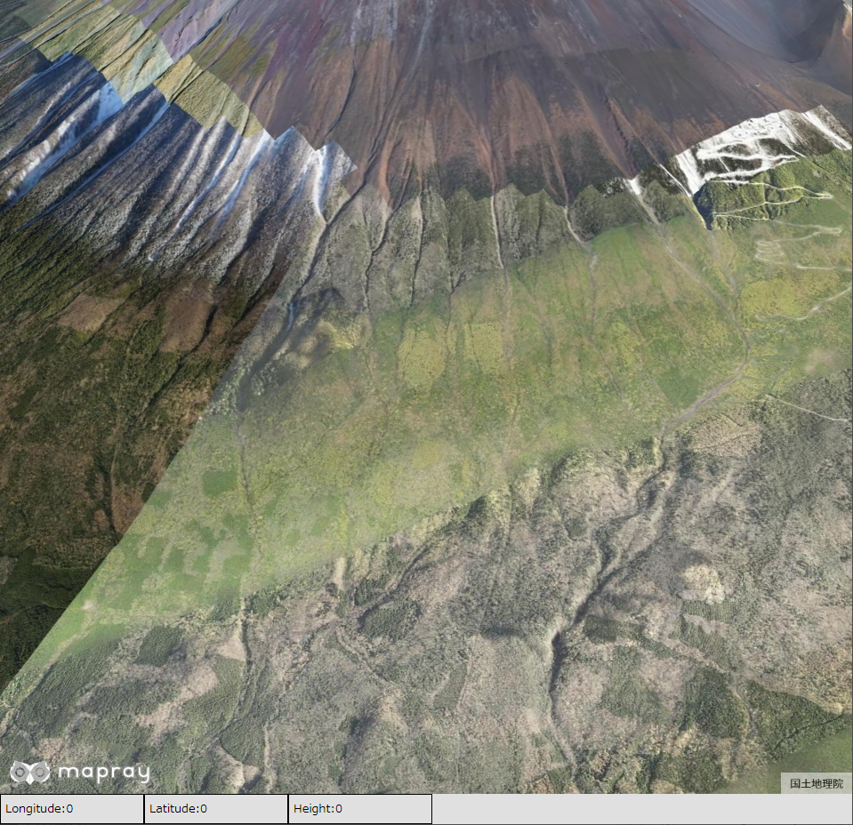
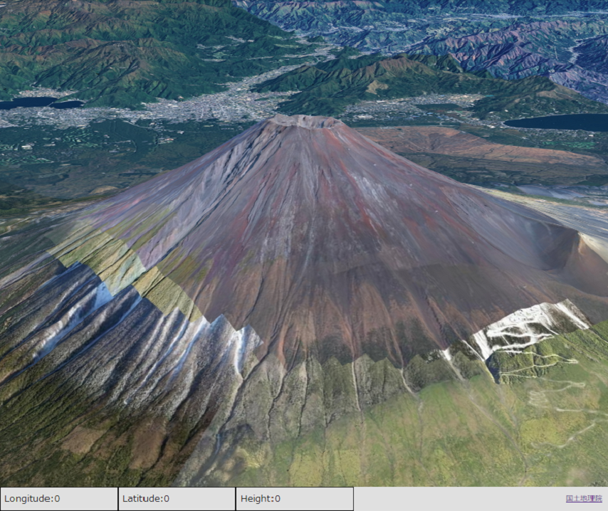
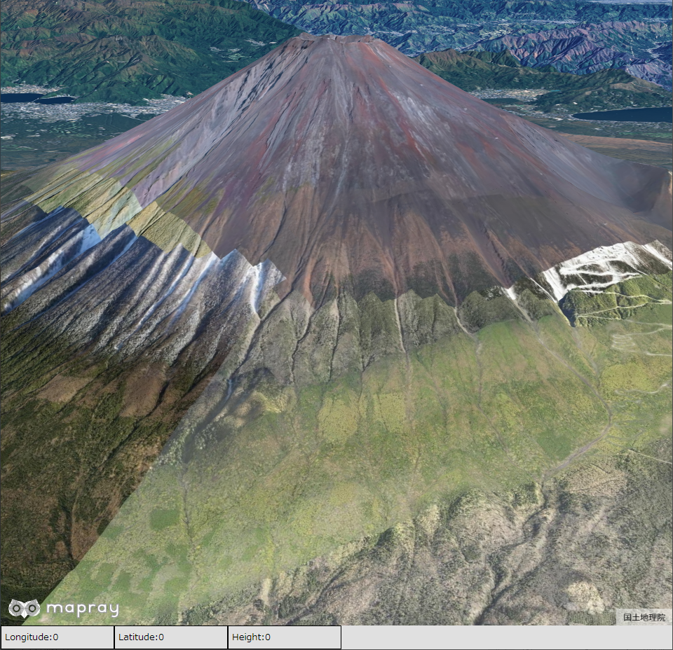

## マウス操作によるカメラ操作及び指定位置の緯度・経度の取得
マウス操作でカメラの操作や指定した位置の緯度・経度を取得する方法を説明します。

### サンプルコード
マウス操作でカメラの操作や指定した位置の緯度・経度を取得する**CameraControlWithMouse.html**及び2つのJavascriptファイルのサンプルコードです。JavaScriptファイルは、マウスの入力検知を行う**CheckInputKeyAndMouse.js**とカメラ操作及び指定位置の緯度・経度を取得する**CameraControlWithMouse.js**の2種類です。
このサンプルコードでは、マウスのホイール操作で、カメラの前進・後進を操作し、Shift＋左ドラッグでカメラの回転を操作し、Alt＋ドラッグでカメラの高度を操作します。また、クリックした場所の緯度・経度・高度を画面下部に表示します。

#### CameraControlWithMouse.html

```HTML
<!DOCTYPE html>
<html>
    <head>
        <meta charset="utf-8">
        <title>CameraControlWithMouseSample</title>
        <script src="https://resouce.mapray.com/mapray-js/v0.7.0/mapray.js"></script>
        <script src="CameraControlWithMouse.js"></script>
        <script src="CheckInputKeyAndMouse.js"></script>
        <style>
            html, body {
                height: 100%;
                margin: 0;
                background-color: #E0E0E0;
            }

            p{
                font-size:13px;
            }

            div#mapray-container {
                display: flex;
                height: 96%;
            }

            div#LongitudeStringBox {
                display: flex;
                background-color: #E0E0E0;
                height: 32px;
                width: 160px;
                float: left;
                border: inset 1px #000000;
                align-items: center;
            }

            div#LatitudeStringBox {
                display: flex;
                background-color: #E0E0E0;
                height: 32px;
                width: 160px;
                float: left;
                border: inset 1px #000000;
                align-items: center;
            }

            div#HeightStringBox {
                display: flex;
                background-color: #E0E0E0;
                height: 32px;
                width: 160px;
                float: left;
                border: inset 1px #000000;
                align-items: center;
            }

            div#mapInfo{
                display: flex;
                width: 50px;
                height: 32px;
                margin-left: auto;
                margin-right: 10px;
                align-items: center;
            }
        </style>
    </head>

    <body onload="new CameraControl('mapray-container');">
        <div id="mapray-container"></div>

        <div id="LongitudeStringBox">
            <p style="margin-left:5px;">Longitude:</p>
            <p id="LongitudeValue">0</p>
        </div>

        <div id="LatitudeStringBox">
            <p style="margin-left:5px;">Latitude:</p>
            <p id="LatitudeValue">0</p>
        </div>

        <div id="HeightStringBox">
            <p style="margin-left:5px;">Height:</p>
            <p id="HeightValue">0</p>
        </div>

        <div id="mapInfo"><a href="https://maps.gsi.go.jp/development/ichiran.html" style="font-size: 9px">国土地理院</a></div>
    </body>
</html>
```

#### CheckInputKeyAndMouse.js

```JavaScript
class CheckInput {

    constructor(viewer) {
        // マウス、キーのイベントを設定
        var element = viewer.canvas_element;
        var self = this;

        this.is_Mouse_Click = false;                // マウスがクリックされたか
        this.mouse_Click_Pos = [0, 0];              // クリックされたマウスの位置
        this.is_Forward = false;                    // 前進するか
        this.is_Backward = false;                   // 後退するか
        this.is_Camera_Turn = false;                // カメラが回るか
        this.is_Camera_Height_Move = false;         // 高度を更新するか
        this.mouse_Move_Pos = [0, 0];               // 左マウスボタンドラッグ時のマウス位置
        this.mouse_Move_Pos_Old = [0, 0];           // 左マウスボタンドラッグ時の1フレーム前の位置
        this.mouse_Right_Move_Pos = [0, 0];         // 右マウスボタンドラッグ時のマウス位置
        this.mouse_Right_Move_Pos_Old = [0, 0];     // 右マウスボタンドラッグ時の1フレーム前の位置

        // イベントをセット
        window.addEventListener("blur", function (event) { self._onBlur(event); }, false);
        element.addEventListener("mousedown", function (event) { self._onMouseDown(event); }, false);
        document.addEventListener("mousemove", function (event) { self._onMouseMove(event); }, false);
        document.addEventListener("mouseup", function (event) { self._onMouseUp(event); }, false);

        if (window.addEventListener) {
            // FireFoxのマウスホイールイベント
            window.addEventListener("DOMMouseScroll", function (event) { self._onMouseScroll_FireFox(event); }, false);
        }

        // chromeのマウスホイールイベント
        window.onmousewheel = function (event) {
            self._onMouseScroll_Chrome(event);
        }
    }

    IsMouseClick(mousePos) {
        if(this.is_Mouse_Click){
            mousePos[0] = this.mouse_Click_Pos[0];
            mousePos[1] = this.mouse_Click_Pos[1];
            return true;
        } else {
            return false;
        }
    }

    IsForward() {
        return this.is_Forward;
    }

    IsBackward() {
        return this.is_Backward;
    }

    IsCameraTurn(dragVec) {
        if (this.is_Camera_Turn == true) {
            // 前フレームからの移動量を計算
            dragVec[0] = this.mouse_Move_Pos[0] - this.mouse_Move_Pos_Old[0];
            dragVec[1] = this.mouse_Move_Pos[1] - this.mouse_Move_Pos_Old[1];
            return true;
        } else {
            return false;
        }
    }

    IsCameraHeightMove(dragVec) {
        if (this.is_Camera_Height_Move == true) {
            // 前フレームからの移動量を計算
            dragVec[0] = this.mouse_Right_Move_Pos[0] - this.mouse_Right_Move_Pos_Old[0];
            dragVec[1] = this.mouse_Right_Move_Pos[1] - this.mouse_Right_Move_Pos_Old[1];
            return true;
        } else {
            return false;
        }
    }

    _onMouseDown(event) {
        if (event.button == 0 /* 左ボタン */) {
            if (event.shiftKey) {
                // カメラ回転ドラッグ開始
                this.is_Camera_Turn = true;
                this.mouse_Move_Pos[0] = event.clientX;
                this.mouse_Move_Pos[1] = event.clientY;
                this.mouse_Move_Pos_Old[0] = event.clientX;
                this.mouse_Move_Pos_Old[1] = event.clientY;
            }

            if(event.altKey){
                // カメラ移動ドラッグ開始
                this.is_Camera_Height_Move = true;
                this.mouse_Right_Move_Pos[0] = event.clientX;
                this.mouse_Right_Move_Pos[1] = event.clientY;
                this.mouse_Right_Move_Pos_Old[0] = event.clientX;
                this.mouse_Right_Move_Pos_Old[1] = event.clientY;
            }

            if (event.shiftKey == false & event.altKey == false) {
                // クリックされた
                this.is_Mouse_Click = true;
                this.mouse_Click_Pos[0] = event.clientX;
                this.mouse_Click_Pos[1] = event.clientY;
            }
        }
    }

    _onMouseMove(event) {
        if (this.is_Camera_Turn == true) {
            // カメラ回転ドラッグ中
            this.mouse_Move_Pos_Old[0] = this.mouse_Move_Pos[0];
            this.mouse_Move_Pos_Old[1] = this.mouse_Move_Pos[1];
            this.mouse_Move_Pos[0] = event.clientX;
            this.mouse_Move_Pos[1] = event.clientY;
        }

        if (this.is_Camera_Height_Move == true) {
            // カメラ移動ドラッグ中
            this.mouse_Right_Move_Pos_Old[0] = this.mouse_Right_Move_Pos[0];
            this.mouse_Right_Move_Pos_Old[1] = this.mouse_Right_Move_Pos[1];
            this.mouse_Right_Move_Pos[0] = event.clientX;
            this.mouse_Right_Move_Pos[1] = event.clientY;
        }
    }

    _onMouseUp(event) {
        if (event.button == 0 /* 左ボタン */) {
            // クリック、カメラ回転終了
            this.is_Mouse_Click = false;
            this.is_Camera_Turn = false;
            this.mouse_Click_Pos[0] = 0;
            this.mouse_Click_Pos[1] = 0;
            this.mouse_Move_Pos[0] = 0;
            this.mouse_Move_Pos[1] = 0;

            // カメラ移動終了
            this.is_Camera_Height_Move = false;
            this.mouse_Right_Move_Pos[0] = 0;
            this.mouse_Right_Move_Pos[1] = 0;
        }
    }

    _onBlur(event) {
        // フォーカスを失った
        this.is_Mouse_Click = false;
        this.is_Forward = false;
        this.is_Backward = false;
        this.is_Camera_Turn = false;
        this.is_Camera_Height_Move = false;
    }

    _onMouseScroll_Chrome(event) {
        // chromeのホイール移動量検出
        if (event.wheelDelta > 0) {
            this.is_Forward = true;
        }else{
            this.is_Backward = true;
        }
    }

    _onMouseScroll_FireFox(event) {
        // FireFoxのホイール移動量検出
        if (event.detail < 0) {
            this.is_Forward = true;
        }else{
            this.is_Backward = true;
        }
    }

    endFrame() {
        // フレーム終了時
        this.is_Forward = false;
        this.is_Backward = false;
    }

}
```

#### CameraControlWithMouse.js

```JavaScript
var GeoMath = mapray.GeoMath;

class CameraControl extends mapray.RenderCallback{

    constructor(container) {
        super();

        // Access Tokenを設定
        var accessToken = "<your access token here>";

        // Viewerを作成する
        new mapray.Viewer(container, {
            render_callback: this,
            image_provider: this.createImageProvider(),
            dem_provider: new mapray.CloudDemProvider(accessToken)
        });

        // 球面座標系（経度、緯度、高度）で視点の初期値を設定。座標は富士山から7kmほど南西の場所
        this.camera_Pos = { longitude: 138.668035, latitude: 35.290262, height: 5500.0 };
        this.camera_Vec = [0, 0, 0];                // カメラの前進後退方向
        this.camera_Turn_Angle = 145;               // ターン角度
        this.camera_Pitch = 20;                     // 仰俯角
        this.camera_Move_Correction = 30;           // 前進後退の補正値
        this.camera_Turn_Correction = 0.1;          // ターン、仰俯角の補正値
        this.camera_Height_Correction = 0.5;        // 高度更新の補正値

        // 入力検知クラス
        this.input_Checker = new CheckInput(this.viewer);

        this.SetCamera();
    }

    // フレーム毎に呼ばれるメソッド
    onUpdateFrame(delta_time)  // override
    {
        // カメラ回転
        var turn_Drag_Vec = [0, 0];
        if (this.input_Checker.IsCameraTurn(turn_Drag_Vec)) {
            this.TurnCamera(turn_Drag_Vec);
        }

        // カメラの高度変更
        var height_Move_Drag_Vec = [0, 0];
        if (this.input_Checker.IsCameraHeightMove(height_Move_Drag_Vec)) {
            this.UpdateCameraHeight(height_Move_Drag_Vec);
        }

        // カメラ前進
        if (this.input_Checker.IsForward()) {
            this.ForwardCameraPos();
        }

        // カメラ後退
        if (this.input_Checker.IsBackward()) {
            this.BackwardCameraPos();
        }

        this.SetCamera();

        var click_Pos = [0, 0];

        // 緯度経度高度表示
        if (this.input_Checker.IsMouseClick(click_Pos)) {
            this.SetClickPosLongitudeAndLatitudeAndHeight(click_Pos);
        }

        this.input_Checker.endFrame();
    }

    // 画像プロバイダを生成
    createImageProvider() {
        return new mapray.StandardImageProvider("https://cyberjapandata.gsi.go.jp/xyz/seamlessphoto/", ".jpg", 256, 2, 18);
    }

    SetCamera() {
        // カメラ位置の設定

        // 球面座標から地心直交座標へ変換
        var camera_Pos_Gocs = GeoMath.iscs_to_gocs_matrix(this.camera_Pos, GeoMath.createMatrix());

        var camera_End_Pos_Mat = GeoMath.createMatrix();
        GeoMath.setIdentity(camera_End_Pos_Mat);

        // カメラの位置をY軸方向に移動させる
        camera_End_Pos_Mat[13] = -1;

        // z軸でcamera_Turn_Angle分回転させる回転行列を求める
        var turn_Mat = GeoMath.rotation_matrix([0, 0, 1], this.camera_Turn_Angle, GeoMath.createMatrix());

        // x軸でcamera_Pitch分回転させる回転行列を求める
        var pitch_Mat = GeoMath.rotation_matrix([1, 0, 0], this.camera_Pitch, GeoMath.createMatrix());

        // カメラの位置にX軸の回転行列をかける
        GeoMath.mul_AA(pitch_Mat, camera_End_Pos_Mat, camera_End_Pos_Mat);

        // カメラの位置にZ軸の回転行列をかける
        GeoMath.mul_AA(turn_Mat, camera_End_Pos_Mat, camera_End_Pos_Mat);

        // 視線方向を定義
        var cam_Start_Pos = GeoMath.createVector3([0, 0, 0]);
        var camera_End_Pos = GeoMath.createVector3([camera_End_Pos_Mat[12], camera_End_Pos_Mat[13], camera_End_Pos_Mat[14]]);

        // 視点、注視点ベクトルとZ軸で外積をして垂直な軸を求める
        var tmp_closs_vec = GeoMath.cross3(camera_End_Pos, GeoMath.createVector3([0, 0, -1]), GeoMath.createVector3());
        GeoMath.normalize3(tmp_closs_vec, tmp_closs_vec);

        // 視点、注視点ベクトルと垂直な軸で外積をしてアップベクトルを求める
        var cam_Up = GeoMath.cross3(camera_End_Pos, tmp_closs_vec, GeoMath.createVector3());

        // ビュー変換行列を作成
        var view_To_Home = GeoMath.createMatrix();
        GeoMath.lookat_matrix(cam_Start_Pos, camera_End_Pos, cam_Up, view_To_Home);

        // カメラの位置と視線方向からカメラの姿勢を変更
        var view_To_Gocs = this.viewer.camera.view_to_gocs;
        GeoMath.mul_AA(camera_Pos_Gocs, view_To_Home, view_To_Gocs);

        // カメラの視線方向を取得
        this.camera_Vec = [view_To_Gocs[8], view_To_Gocs[9], view_To_Gocs[10]];

        // カメラのnear、farの設定
        this.viewer.camera.near = 30;
        this.viewer.camera.far = 500000;
    }

    SetClickPosLongitudeAndLatitudeAndHeight(clickPos) {
        // キャンバス座標のレイを取得
        var ray = this.viewer.camera.getCanvasRay(clickPos, new mapray.Ray());

        // レイと地表の交点を求める
        var clossPoint = this.viewer.getRayIntersection(ray);

        if (clossPoint != null) {
            // 交点を球面座標系に変換する
            var closs_Pos = GeoMath.gocs_to_iscs(clossPoint, {});

            // UIを更新する
            document.getElementById("LongitudeValue").innerText = closs_Pos.longitude.toFixed(6);
            document.getElementById("LatitudeValue").innerText = closs_Pos.latitude.toFixed(6);
            document.getElementById("HeightValue").innerText = closs_Pos.height.toFixed(6);
        }
    }

    ForwardCameraPos() {
        // 球面座標から地心直交座標へ変換
        var camera_Pos_Gocs = GeoMath.iscs_to_gocs_matrix(this.camera_Pos, GeoMath.createMatrix());

        // 地心直交座標の平行移動成分を変更
        camera_Pos_Gocs[12] -= this.camera_Vec[0] * this.camera_Move_Correction;
        camera_Pos_Gocs[13] -= this.camera_Vec[1] * this.camera_Move_Correction;
        camera_Pos_Gocs[14] -= this.camera_Vec[2] * this.camera_Move_Correction;

        // 地心直交座標を球面座標に変換する
        GeoMath.gocs_to_iscs([camera_Pos_Gocs[12], camera_Pos_Gocs[13], camera_Pos_Gocs[14]], this.camera_Pos);
    }

    BackwardCameraPos() {
        // 球面座標から地心直交座標へ変換
        var camera_Pos_Gocs = GeoMath.iscs_to_gocs_matrix(this.camera_Pos, GeoMath.createMatrix());

        // 地心直交座標の平行移動成分を変更
        camera_Pos_Gocs[12] += this.camera_Vec[0] * this.camera_Move_Correction;
        camera_Pos_Gocs[13] += this.camera_Vec[1] * this.camera_Move_Correction;
        camera_Pos_Gocs[14] += this.camera_Vec[2] * this.camera_Move_Correction;

        // 地心直交座標を球面座標に変換する
        GeoMath.gocs_to_iscs([camera_Pos_Gocs[12], camera_Pos_Gocs[13], camera_Pos_Gocs[14]], this.camera_Pos);
    }

    TurnCamera(drag_Vec) {
        // ターン、仰俯角の角度の更新量決定
        var add_Turn_Angle = drag_Vec[0] * this.camera_Turn_Correction;
        var add_Pitch = drag_Vec[1] * this.camera_Turn_Correction;

        // 更新量が少なかったら０にする
        if (add_Turn_Angle > -0.3 & add_Turn_Angle < 0.3) {
            add_Turn_Angle = 0;
        }

        if (add_Pitch > -0.3 & add_Pitch < 0.3) {
            add_Pitch = 0;
        }

        // ターン、仰俯角の角度更新
        this.camera_Turn_Angle -= add_Turn_Angle;
        this.camera_Pitch += add_Pitch;
    }

    UpdateCameraHeight(drag_Vec) {
        // 高度の変更量決定
        var add_Height = drag_Vec[1] * this.camera_Height_Correction;

        // 値が小さい場合０にする
        if (add_Height > -1 & add_Height < 1) {
            add_Height = 0;
        }

        // カメラ座標の高度を更新する
        this.camera_Pos.height -= add_Height;
    }

}
```

### htmlのサンプルコードの詳細
htmlのサンプルコードの詳細を以下で解説します。

#### htmlの文字コード設定
4行目でhtmlの文字コードを設定します。このサンプルコードでは、utf-8を設定します。

```HTML
<meta charset="utf-8">
```

#### タイトルの設定
5行目でタイトルを設定します。このサンプルコードでは、CameraControlWithMouseSampleを設定します。

```HTML
<title>CameraControlWithMouseSample</title>
```

#### JavaScriptファイルのパス設定
6～8行目で参照するJavaScriptのパスを設定します。このサンプルコードでは、maprayのJavaScriptファイル、カメラを操作するJavaScriptファイル（**CameraControlWithMouse.js**）、マウスの入力を検知するJavaScriptファイル（**CheckInputKeyAndMouse.js**）を設定します。

```HTML
<script src="https://resouce.mapray.com/mapray-js/v0.7.0/mapray.js"></script>
<script src="CameraControlWithMouse.js"></script>
<script src="CheckInputKeyAndMouse.js"></script>
```

#### スタイルの設定
9～63行目で表示する要素のスタイルを設定します。このサンプルコードでは、下記のスタイルを設定します。
- html
- body
- p
- div#mapray-container（地図表示部分）
- div#LongitudeStringBox（経度表示部分）
- div#LatitudeStringBox（緯度表示部分）
- div#HeightStringBox（高度表示部分）
- div#mapInfo（出典表示部分）

```HTML
<style>
    html, body {
        height: 100%;
        margin: 0;
        background-color: #E0E0E0;
    }

    p{
        font-size:13px;
    }

    div#mapray-container {
        display: flex;
        height: 96%;
    }

    div#LongitudeStringBox {
        display: flex;
        background-color: #E0E0E0;
        height: 32px;
        width: 160px;
        float: left;
        border: inset 1px #000000;
        align-items: center;
    }

    div#LatitudeStringBox {
        display: flex;
        background-color: #E0E0E0;
        height: 32px;
        width: 160px;
        float: left;
        border: inset 1px #000000;
        align-items: center;
    }

    div#HeightStringBox {
        display: flex;
        background-color: #E0E0E0;
        height: 32px;
        width: 160px;
        float: left;
        border: inset 1px #000000;
        align-items: center;
    }

    div#mapInfo{
        display: flex;
        width: 50px;
        height: 32px;
        margin-left: auto;
        margin-right: 10px;
        align-items: center;
    }
</style>
```

#### loadイベントの処理
画面を表示する時に、カメラを操作するクラスを生成します。そのため、66行目でページの読み込み時に、地図表示部分のブロックのidからカメラを操作するクラスのインスタンスを生成します。
カメラを操作するはJavaScriptのサンプルコードの詳細で説明します。

```HTML
<body onload="new CameraControl('mapray-container');">
```

#### 地図表示部分と出典表示部分の指定
67行目で地図表示部分のブロックを、84行目で出典を明記するためのブロックを記述します。詳細はヘルプページ『**緯度経度によるカメラ位置の指定**』を参照してください。

```HTML
<div id="mapray-container"></div>

中略

<div id="mapInfo"><a href="https://maps.gsi.go.jp/development/ichiran.html" style="font-size: 9px">国土地理院</a></div>
```

#### クリック位置の緯度・経度・高度表示のUI
69～82行目で緯度・経度・高度を表示するブロックを記述します。それぞれのブロックの中には、該当する数値を表示する領域を用意します。

```HTML
<div id="LongitudeStringBox">
    <p style="margin-left:5px;">Longitude:</p>
    <p id="LongitudeValue">0</p>
</div>

<div id="LatitudeStringBox">
    <p style="margin-left:5px;">Latitude:</p>
    <p id="LatitudeValue">0</p>
</div>

<div id="HeightStringBox">
    <p style="margin-left:5px;">Height:</p>
    <p id="HeightValue">0</p>
</div>
```

### JavaScriptのサンプルコードの詳細（マウスの入力検知）
マウスの入力を検知するJavaScriptのサンプルコードの詳細を以下で解説します。

#### クラス
1～173行目で、マウスの入力を検知するクラスを定義します。クラス内の各メソッドの詳細は以降で解説します。

```JavaScript
class CheckInput {

  //中略

}
```

#### コンストラクタ
3～34行目がマウスの入力を検知するクラスのコンストラクタです。
まず、マウスの入力検知に関する初期値を下記のように設定します。
- クリックしたかどうか　⇒　false
- クリックした画面の位置 ⇒　全て0
- 前進中かどうか　⇒　false
- 後進中かどうか　⇒　false
- 回転中かどうか　⇒　false
- 高度変更中かどうか　⇒　false
- 回転時のマウス位置　⇒　全て0
- 回転時の1フレーム前のマウス位置　⇒　全て0
- 高度変更時のマウス位置　⇒　全て0
- 高度変更時の1フレーム前のマウス位置　⇒　全て0

そして、マウスのイベントとして下記の内容を設定します。

- フォーカスが外れた時のイベント（20行目）
- マウスのボタンが押された時のイベント（21行目）
- マウスが移動した時のイベント（22行目）
- マウスのボタンが離された時のイベント（23行目）
- FireFox用のマウスホイールが動いた時のイベント（24～27行目）
- Google Chrome用のマウスホイールが動いた時のイベント（30～32行目）

```JavaScript
constructor(viewer) {
    // マウス、キーのイベントを設定
    var element = viewer.canvas_element;
    var self = this;

    this.is_Mouse_Click = false;                // マウスがクリックされたか
    this.mouse_Click_Pos = [0, 0];              // クリックされたマウスの位置
    this.is_Forward = false;                    // 前進するか
    this.is_Backward = false;                   // 後退するか
    this.is_Camera_Turn = false;                // カメラが回るか
    this.is_Camera_Height_Move = false;         // 高度を更新するか
    this.mouse_Move_Pos = [0, 0];               // 左マウスボタンドラッグ時のマウス位置
    this.mouse_Move_Pos_Old = [0, 0];           // 左マウスボタンドラッグ時の1フレーム前の位置
    this.mouse_Right_Move_Pos = [0, 0];         // 右マウスボタンドラッグ時のマウス位置
    this.mouse_Right_Move_Pos_Old = [0, 0];     // 右マウスボタンドラッグ時の1フレーム前の位置

    // イベントをセット
    window.addEventListener("blur", function (event) { self._onBlur(event); }, false);
    element.addEventListener("mousedown", function (event) { self._onMouseDown(event); }, false);
    document.addEventListener("mousemove", function (event) { self._onMouseMove(event); }, false);
    document.addEventListener("mouseup", function (event) { self._onMouseUp(event); }, false);

    if (window.addEventListener) {
        // FireFoxのマウスホイールイベント
        window.addEventListener("DOMMouseScroll", function (event) { self._onMouseScroll_FireFox(event); }, false);
    }

    // chromeのマウスホイールイベント
    window.onmousewheel = function (event) {
        self._onMouseScroll_Chrome(event);
    }
}
```

#### クリック状態の取得
36～44行目がクリック状態の取得メソッドです。このメソッドはクリックしたかどうかを返し、クリックされている場合は、引数のmousePosにクリックされた位置を格納します。

```JavaScript
IsMouseClick(mousePos) {
    if(this.is_Mouse_Click){
        mousePos[0] = this.mouse_Click_Pos[0];
        mousePos[1] = this.mouse_Click_Pos[1];
        return true;
    }else{
        return false;
    }
}
```

#### カメラの前進状態の取得
46～48行目がカメラの前進状態の取得メソッドです。このメソッドは、カメラが前進中かどうかを返します。

```JavaScript
IsForward() {
    return this.is_Forward;
}
```

#### カメラの後進状態の取得
50～52行目がカメラの後進状態の取得メソッドです。このメソッドは、カメラが後進中かどうかを返します。

```JavaScript
IsBackward() {
    return this.is_Backward;
}
```

#### カメラの回転状態の取得
54～63行目がカメラの回転状態の取得メソッドです。このメソッドは、カメラが回転中かどうかを返し、回転中の場合は、現在のマウス位置と1フレーム前のマウス位置からマウスの移動方向を求め、引数のdragVecに格納します。

```JavaScript
IsCameraTurn(dragVec) {
    if (this.is_Camera_Turn == true) {
        // 前フレームからの移動量を計算
        dragVec[0] = this.mouse_Move_Pos[0] - this.mouse_Move_Pos_Old[0];
        dragVec[1] = this.mouse_Move_Pos[1] - this.mouse_Move_Pos_Old[1];
        return true;
    } else {
        return false;
    }
}
```

#### カメラの高度変更フラグの取得
65～74行目がカメラの高度変更状態の取得メソッドです。このメソッドは、カメラが高度変更中かどうかを返し、高度変更中の場合は、現在のマウス位置と1フレーム前のマウス位置から移動方向を求め、引数のdragVecに格納します。

```JavaScript
IsCameraHeightMove(dragVec) {
    if (this.is_Camera_Height_Move == true) {
        // 前フレームからの移動量を計算
        dragVec[0] = this.mouse_Right_Move_Pos[0] - this.mouse_Right_Move_Pos_Old[0];
        dragVec[1] = this.mouse_Right_Move_Pos[1] - this.mouse_Right_Move_Pos_Old[1];
        return true;
    } else {
        return false;
    }
}
```

#### マウスのボタンが押された時のイベント
76～103行目がマウスのボタンが押されたときのイベントメソッドです。このメソッドでは、マウスの左ボタンとShiftキー、Altキーの組み合わせで対応する操作を決定します。
まず、マウスの左ボタンとShiftキーの組み合わせで、カメラの回転操作に対する設定を下記のように行います。

- 回転中かどうか　⇒　true
- 回転時のマウス位置　⇒　現在のマウス位置
- 回転時の1フレーム前のマウス位置　⇒　現在のマウス位置

次に、マウスの左ボタンとAltキーの組み合わせで、カメラの高度変更操作に対する設定を下記のように行います。

- 高度変更中かどうか　⇒　true
- 高度変更時のマウス位置　⇒　現在のマウス位置
- 高度変更時の1フレーム前のマウス位置　⇒　現在のマウス位置

最後に、マウスの左ボタンが押されていて、Shiftキー、Altキーの両方が押されていないときは、以下の設定を行います。

- クリックしたかどうか　⇒　true
- クリックした画面の位置　⇒　現在のマウス位置

```JavaScript
_onMouseDown(event) {
    if (event.button == 0 /* 左ボタン */) {
        if (event.shiftKey) {
            // カメラ回転ドラッグ開始
            this.is_Camera_Turn = true;
            this.mouse_Move_Pos[0] = event.clientX;
            this.mouse_Move_Pos[1] = event.clientY;
            this.mouse_Move_Pos_Old[0] = event.clientX;
            this.mouse_Move_Pos_Old[1] = event.clientY;
        }

        if(event.altKey){
            // カメラ移動ドラッグ開始
            this.is_Camera_Height_Move = true;
            this.mouse_Right_Move_Pos[0] = event.clientX;
            this.mouse_Right_Move_Pos[1] = event.clientY;
            this.mouse_Right_Move_Pos_Old[0] = event.clientX;
            this.mouse_Right_Move_Pos_Old[1] = event.clientY;
        }

        if (event.shiftKey == false & event.altKey == false) {
            // クリックされた
            this.is_Mouse_Click = true;
            this.mouse_Click_Pos[0] = event.clientX;
            this.mouse_Click_Pos[1] = event.clientY;
        }
    }
}
```

#### マウスが移動した時のイベント
105～121行目がマウスが移動した時のイベントメソッドです。このメソッドは、カメラが回転中か高度変更中の場合に、マウス位置を更新する処理を行います。
まず、カメラが回転中の場合は、下記の設定を行います。

- 回転時の1フレーム前のマウス位置　⇒　回転時のマウス位置
- 回転時のマウス位置　⇒　現在のマウス位置

そして、カメラが高度変更中の場合は、下記の設定を行います。

- 高度変更時の1フレーム前のマウス位置　⇒　高度変更時のマウス位置
- 高度変更時のマウス位置　⇒　現在のマウス位置

```JavaScript
_onMouseMove(event) {
    if (this.is_Camera_Turn == true) {
        // カメラ回転ドラッグ中
        this.mouse_Move_Pos_Old[0] = this.mouse_Move_Pos[0];
        this.mouse_Move_Pos_Old[1] = this.mouse_Move_Pos[1];
        this.mouse_Move_Pos[0] = event.clientX;
        this.mouse_Move_Pos[1] = event.clientY;
    }

    if (this.is_Camera_Height_Move == true) {
        // カメラ移動ドラッグ中
        this.mouse_Right_Move_Pos_Old[0] = this.mouse_Right_Move_Pos[0];
        this.mouse_Right_Move_Pos_Old[1] = this.mouse_Right_Move_Pos[1];
        this.mouse_Right_Move_Pos[0] = event.clientX;
        this.mouse_Right_Move_Pos[1] = event.clientY;
    }
}
```

#### マウスのボタンが離された時のイベント
123～138行目がマウスのボタンが離された時のイベントメソッドです。このメソッドは、各種カメラ操作を終了させる処理を行います。そのため、下記の設定（初期化）を行います。

- クリックしたかどうか　⇒　false
- クリックした画面の位置 ⇒　全て0
- 回転中かどうか　⇒　false
- 高度変更中かどうか　⇒　false
- 回転時のマウス位置　⇒　全て0
- 高度変更時のマウス位置　⇒　全て0

```JavaScript
_onMouseUp(event) {
    if (event.button == 0 /* 左ボタン */) {
        // クリック、カメラ回転終了
        this.is_Mouse_Click = false;
        this.is_Camera_Turn = false;
        this.mouse_Click_Pos[0] = 0;
        this.mouse_Click_Pos[1] = 0;
        this.mouse_Move_Pos[0] = 0;
        this.mouse_Move_Pos[1] = 0;

        // カメラ移動終了
        this.is_Camera_Height_Move = false;
        this.mouse_Right_Move_Pos[0] = 0;
        this.mouse_Right_Move_Pos[1] = 0;
    }
}
```

#### フォーカスが外れた時のイベント
140～147行目がフォーカスが外れた時のイベントメソッドです。画面のフォーカスが外れた時に呼ばれます。このサンプルコードでは、以下の変数を初期化します。

- クリックしたかどうか　⇒　false
- 前進中かどうか　⇒　false
- 後進中かどうか　⇒　false
- 回転中かどうか　⇒　false
- 高度変更中かどうか　⇒　false

```JavaScript
_onBlur(event) {
    // フォーカスを失った
    this.is_Mouse_Click = false;
    this.is_Forward = false;
    this.is_Backward = false;
    this.is_Camera_Turn = false;
    this.is_Camera_Height_Move = false;
}
```

#### マウスホイールが動いた時のイベント（Google Chrome用）
149～156行目がGoogle Chrome用のマウスホイールが動いた時のイベントメソッドです。このサンプルコードでは、マウスホイールを前に動かすと前進中とし、後ろに動かすと後進中とします。

```JavaScript
_onMouseScroll_Chrome(event) {
    // chromeのホイール移動量検出
    if (event.wheelDelta > 0) {
        this.is_Forward = true;
    }else{
        this.is_Backward = true;
    }
}
```

#### マウスホイールが動いた時のスクロールイベント（FireFox用）
158～165行目がFireFox用のマウスホイールが動いた時のイベントメソッドです。このメソッドは、このサンプルコードでは、Google Chrome用のマウスホイールのスクロールイベントメソッドと同様の動きとしますが、マウスホイールの移動量を表す変数が異なります。

```JavaScript
_onMouseScroll_FireFox(event) {
    // FireFoxのホイール移動量検出
    if (event.detail < 0) {
        this.is_Forward = true;
    }else{
        this.is_Backward = true;
    }
}
```

#### フレーム終了時のリセット
167～171行目がフレーム終了時のリセットメソッドです。このメソッドは、前進中の状態、後進中の状態を初期化します。

```JavaScript
endFrame() {
    // フレーム終了時
    this.is_Forward = false;
    this.is_Backward = false;
}
```

### JavaScriptのサンプルコードの詳細（カメラの操作）
カメラを操作するJavaScriptのサンプルコードの詳細を以下で解説します。

#### クラスとグローバル変数
3～202行目で、カメラを操作するクラスを定義します。カメラをマウスで操作するために、カメラを操作するクラスはmapray.RenderCallbackクラスを継承します。
1行目のグローバル変数は、数学関連の関数または定数を定義するユーティリティークラスです。

```JavaScript
var GeoMath = mapray.GeoMath;

class CameraControl extends mapray.RenderCallback{

  //中略

}
```

#### コンストラクタ
5～31行目がカメラを操作するクラスのコンストラクタです。
まず、引数として渡されるブロックのidに対して、mapray.Viewerを作成します。Mapray.Viewerのベース地図の画像プロバイダは、画像プロバイダの生成メソッドで取得した画像プロバイダを設定します。mapray.Viewerの作成の詳細は、ヘルプページ『**カメラのアニメーション**』を参照してください。
次に、カメラ操作に関する初期値を下記のように設定します。
- カメラの位置　⇒　緯度・経度が富士山から7kmほど南西の場所、高度は5500m
- カメラの視線方向　⇒　全て0
- カメラの回転角度　⇒　145度
- カメラの仰俯角　⇒　30度
- 前進、後進時の移動量の補正値　⇒　30倍
- カメラの回転角度、仰俯角更新時の補正値　⇒　0.1倍
- カメラの高度更新時の補正値　⇒　0.5倍
- マウスの入力を検知するクラス　⇒　作成したViewerを使ったインスタンス

最後に、カメラの位置・向きの設定メソッドを呼び出します。

```JavaScript
constructor(container) {
    super();

    // Access Tokenを設定
    var accessToken = "<your access token here>";

    // Viewerを作成する
    new mapray.Viewer(container, {
        render_callback: this,
        image_provider: this.createImageProvider(),
        dem_provider: new mapray.CloudDemProvider(accessToken)
    });

    // 球面座標系（経度、緯度、高度）で視点の初期値を設定。座標は富士山から7kmほど南西の場所
    this.camera_Pos = { longitude: 138.668035, latitude: 35.290262, height: 5500.0 };
    this.camera_Vec = [0, 0, 0];                // カメラの前進後退方向
    this.camera_Turn_Angle = 145;               // ターン角度
    this.camera_Pitch = 20;                     // 仰俯角
    this.camera_Move_Correction = 30;           // 前進後退の補正値
    this.camera_Turn_Correction = 0.1;          // ターン、仰俯角の補正値
    this.camera_Height_Correction = 0.5;        // 高度更新の補正値

    // 入力検知クラス
    this.input_Checker = new CheckInput(this.viewer);

    this.SetCamera();
}
```

#### フレームレンダリング前のコールバックメソッド（カメラ姿勢の更新処理）
34～68行目がフレームレンダリング前のコールバックメソッドです。このサンプルコードでは、カメラの操作モードに応じてカメラ姿勢の更新を行います。
まず、37～40行目でカメラが回転中の場合は、カメラの回転角度の更新メソッドを呼び出し、カメラの回転角度を更新します。
同様に、43～56行目で、カメラ高度の変更処理、カメラの前進処理、カメラの後進処理をそれぞれ呼び出し、カメラ姿勢を更新します。
そして、58行目でカメラの位置・向きの設定メソッドを呼びだし、最終的なカメラ姿勢に更新します。
また、63～65行目では、マウスをクリックした時に、その地点の緯度・経度・高度を画面に表示させるメソッドを呼び出し、画面に表示される緯度・経度・高度を変更します。
最後に、フレーム終了時のリセットメソッドを呼びだし、カメラ姿勢の更新処理を終了します。

```JavaScript
onUpdateFrame(delta_time)  // override
{
    // カメラ回転
    var turn_Drag_Vec = [0, 0];
    if (this.input_Checker.IsCameraTurn(turn_Drag_Vec)) {
        this.TurnCamera(turn_Drag_Vec);
    }

    // カメラの高度変更
    var height_Move_Drag_Vec = [0, 0];
    if (this.input_Checker.IsCameraHeightMove(height_Move_Drag_Vec)) {
        this.UpdateCameraHeight(height_Move_Drag_Vec);
    }

    // カメラ前進
    if (this.input_Checker.IsForward()) {
        this.ForwardCameraPos();
    }

    // カメラ後退
    if (this.input_Checker.IsBackward()) {
        this.BackwardCameraPos();
    }

    this.SetCamera();

    var click_Pos = [0, 0];

    // 緯度経度高度表示
    if (this.input_Checker.IsMouseClick(click_Pos)) {
        this.SetClickPosLongitudeAndLatitudeAndHeight(click_Pos);
    }

    this.input_Checker.endFrame();
}
```

#### 画像プロバイダの生成
71～73行目が画像プロバイダの生成メソッドです。生成した画像プロバイダを返します。
画像プロバイダの生成の詳細は、ヘルプページ『**緯度経度によるカメラ位置の指定**』を参照してください。

```JavaScript
createImageProvider() {
    return new mapray.StandardImageProvider("https://cyberjapandata.gsi.go.jp/xyz/seamlessphoto/", ".jpg", 256, 2, 18);
}
```

#### カメラの位置・向きの設定
75～124行目がカメラの位置・向きの設定メソッドです。
まず、79行目のiscs_to_gocs_matrix関数で、カメラ位置の緯度・経度・高度を地心直交座標系で表現したカメラ位置を表す変換行列を計算します。
次に、ビュー変換行列を作成します。まず、81～85行目で相対注視点を表す変換行列を単位行列に初期化し、相対注視点がY軸の負の方向になるように、Y軸方向に移動します。その後、88～91行目で、現在の回転角度に対応する回転行列（Z軸回りの回転行列）、カメラの仰俯角に対応する回転行列（X軸回りの回転行列）を生成し、94～97行目で、相対注視点を表す変換行列にそれぞれの回転行列を掛け合わせることで、相対注視点を表す変換行列を作成します。そして、100～108行目で、原点と求めた相対注視点から上方向ベクトルを求め、111～112行目で、原点、求めた相対注視点、カメラの上方向ベクトルを利用して、最終的なビュー変換行列を作成します。
そして、115～116行目で、これまでに求めたカメラ位置を表す変換行列と、ビュー変換行列を掛け合わせることで、最終的なカメラ姿勢を計算します。
最後に、119行目で、視線方向ベクトルを更新し、122～123行目でカメラの投影範囲を設定し、現在のカメラ視線を最新の状態に更新します。

```JavaScript
SetCamera() {
    // カメラ位置の設定

    // 球面座標から地心直交座標へ変換
    var camera_Pos_Gocs = GeoMath.iscs_to_gocs_matrix(this.camera_Pos, GeoMath.createMatrix());

    var camera_End_Pos_Mat = GeoMath.createMatrix();
    GeoMath.setIdentity(camera_End_Pos_Mat);

    // カメラの位置をY軸方向に移動させる
    camera_End_Pos_Mat[13] = -1;

    // z軸でcamera_Turn_Angle分回転させる回転行列を求める
    var turn_Mat = GeoMath.rotation_matrix([0, 0, 1], this.camera_Turn_Angle, GeoMath.createMatrix());

    // x軸でcamera_Pitch分回転させる回転行列を求める
    var pitch_Mat = GeoMath.rotation_matrix([1, 0, 0], this.camera_Pitch, GeoMath.createMatrix());

    // カメラの位置にX軸の回転行列をかける
    GeoMath.mul_AA(pitch_Mat, camera_End_Pos_Mat, camera_End_Pos_Mat);

    // カメラの位置にZ軸の回転行列をかける
    GeoMath.mul_AA(turn_Mat, camera_End_Pos_Mat, camera_End_Pos_Mat);

    // 視線方向を定義
    var cam_Start_Pos = GeoMath.createVector3([0, 0, 0]);
    var camera_End_Pos = GeoMath.createVector3([camera_End_Pos_Mat[12], camera_End_Pos_Mat[13], camera_End_Pos_Mat[14]]);

    // 視点、注視点ベクトルとZ軸で外積をして垂直な軸を求める
    var tmp_closs_vec = GeoMath.cross3(camera_End_Pos, GeoMath.createVector3([0, 0, -1]), GeoMath.createVector3());
    GeoMath.normalize3(tmp_closs_vec, tmp_closs_vec);

    // 視点、注視点ベクトルと垂直な軸で外積をしてアップベクトルを求める
    var cam_Up = GeoMath.cross3(camera_End_Pos, tmp_closs_vec, GeoMath.createVector3());

    // ビュー変換行列を作成
    var view_To_Home = GeoMath.createMatrix();
    GeoMath.lookat_matrix(cam_Start_Pos, camera_End_Pos, cam_Up, view_To_Home);

    // カメラの位置と視線方向からカメラの姿勢を変更
    var view_To_Gocs = this.viewer.camera.view_to_gocs;
    GeoMath.mul_AA(camera_Pos_Gocs, view_To_Home, view_To_Gocs);

    // カメラの視線方向を取得
    this.camera_Vec = [view_To_Gocs[8], view_To_Gocs[9], view_To_Gocs[10]];

    // カメラのnear、farの設定
    this.viewer.camera.near = 30;
    this.viewer.camera.far = 500000;
}
```

#### クリックした位置の緯度・経度・高度表示
126～142行目がクリックした位置の緯度・経度・高度表示メソッドです。このサンプルコードでは、クリックした位置から視線方向に伸ばした直線と地表面の交点を求め、その位置の緯度・経度・高度を画面に表示します。
まず、128行目のgetCanvasRay関数で、クリックした位置から視線方向に伸ばした直線（レイ）を取得します。次に、131行目で行目のgetRayIntersection関数で、先ほど取得したレイと地表の交点を取得します。最後に、135行目のgocs_to_iscs関数で、先ほど取得した交点の緯度・経度・高度を取得し、138～140行目で、その緯度・経度・高度を対応したテキストに設定します。

```JavaScript
SetClickPosLongitudeAndLatitudeAndHeight(clickPos) {
    // キャンバス座標のレイを取得
    var ray = this.viewer.camera.getCanvasRay(clickPos, new mapray.Ray());

    // レイと地表の交点を求める
    var clossPoint = this.viewer.getRayIntersection(ray);

    if (clossPoint != null) {
        // 交点を球面座標系に変換する
        var closs_Pos = GeoMath.gocs_to_iscs(clossPoint, {});

        // UIを更新する
        document.getElementById("LongitudeValue").innerText = closs_Pos.longitude.toFixed(6);
        document.getElementById("LatitudeValue").innerText = closs_Pos.latitude.toFixed(6);
        document.getElementById("HeightValue").innerText = closs_Pos.height.toFixed(6);
    }
}
```

#### カメラ位置の前進
144～155行目がカメラ位置の前進メソッドです。このサンプルコードでは、カメラの位置が視線方向に移動します。
まず、146行目のiscs_to_gocs_matrix関数で、カメラ位置の地心直交座標への変換行列を作成します。次に、149～151行目で、視線方向ベクトルと前進、後退時の移動量の補正値を使って、前進させたカメラ位置を求めます。最後に、154行目のgocs_to_iscs関数で、前進させたカメラ位置の球面座標を取得します。

```JavaScript
ForwardCameraPos() {
    // 球面座標から地心直交座標へ変換
    var camera_Pos_Gocs = GeoMath.iscs_to_gocs_matrix(this.camera_Pos, GeoMath.createMatrix());

    // 地心直交座標の平行移動成分を変更
    camera_Pos_Gocs[12] -= this.camera_Vec[0] * this.camera_Move_Correction;
    camera_Pos_Gocs[13] -= this.camera_Vec[1] * this.camera_Move_Correction;
    camera_Pos_Gocs[14] -= this.camera_Vec[2] * this.camera_Move_Correction;

    // 地心直交座標を球面座標に変換する
    GeoMath.gocs_to_iscs([camera_Pos_Gocs[12], camera_Pos_Gocs[13], camera_Pos_Gocs[14]], this.camera_Pos);
}
```

#### カメラ位置の後進
157～168行目がカメラ位置の後進メソッドです。このサンプルコードでは、カメラの位置が視線の逆方向に移動します。
このメソッドは、前述したカメラ位置の前進メソッドを逆方向に動くようにしたメソッドです。

```JavaScript
BackwardCameraPos() {
    // 球面座標から地心直交座標へ変換
    var camera_Pos_Gocs = GeoMath.iscs_to_gocs_matrix(this.camera_Pos, GeoMath.createMatrix());

    // 地心直交座標の平行移動成分を変更
    camera_Pos_Gocs[12] += this.camera_Vec[0] * this.camera_Move_Correction;
    camera_Pos_Gocs[13] += this.camera_Vec[1] * this.camera_Move_Correction;
    camera_Pos_Gocs[14] += this.camera_Vec[2] * this.camera_Move_Correction;

    // 地心直交座標を球面座標に変換する
    GeoMath.gocs_to_iscs([camera_Pos_Gocs[12], camera_Pos_Gocs[13], camera_Pos_Gocs[14]], this.camera_Pos);
}
```

#### カメラの回転角度の更新
170～187行目がカメラの回転角度の更新メソッドです。このサンプルコードでは、ドラッグした方向によってカメラの回転角度と仰俯角を更新します。
まず、172～173行目でドラッグした方向とカメラの回転角度、仰俯角更新時の補正値を使って、カメラの回転角度と仰俯角の更新量を求めます。次に。先ほど求めた更新量の絶対値が0.3よりも小さい場合は、176～182行目で更新量を0にします。最後に、185～186行目でカメラの回転角度と仰俯角の更新量を使って、カメラの角度を更新します。

```JavaScript
TurnCamera(drag_Vec) {
    // ターン、仰俯角の角度の更新量決定
    var add_Turn_Angle = drag_Vec[0] * this.camera_Turn_Correction;
    var add_Pitch = drag_Vec[1] * this.camera_Turn_Correction;

    // 更新量が少なかったら０にする
    if (add_Turn_Angle > -0.3 & add_Turn_Angle < 0.3) {
        add_Turn_Angle = 0;
    }

    if (add_Pitch > -0.3 & add_Pitch < 0.3) {
        add_Pitch = 0;
    }

    //ターン、仰俯角の角度更新
    this.camera_Turn_Angle -= add_Turn_Angle;
    this.camera_Pitch += add_Pitch;
}
```

#### カメラの高度の更新
189～200行目がカメラの高度の更新メソッドです。このサンプルコードでは、ドラッグした方向によってカメラの高度を更新します。
まず、191行目でドラッグした方向とカメラの高度更新時の補正値を使って、カメラの高度の更新量を求めます。次に、先ほど求めた更新量の絶対値が1よりも小さい場合は、194～196行目で更新量を0にします。最後に、199行目でカメラの高度の更新量を使って、高度を更新します。

```JavaScript
UpdateCameraHeight(drag_Vec) {
    // 高度の変更量決定
    var add_Height = drag_Vec[1] * this.camera_Height_Correction;

    // 値が小さい場合０にする
    if (add_Height > -1 & add_Height < 1) {
        add_Height = 0;
    }

    // カメラ座標の高度を更新する
    this.camera_Pos.height -= add_Height;
}
```

### 出力イメージ
このサンプルコードの初期状態の出力イメージは下図のようになります。


初期状態から以下の操作を行った時の出力イメージは以下のようになります。

- 画面中央付近へのクリック


- カメラの前進


- カメラの後進


- カメラの左回転


- カメラの右回転


- カメラの上回転


- カメラの下回転


- カメラの高度の上昇


- カメラの高度の下降

