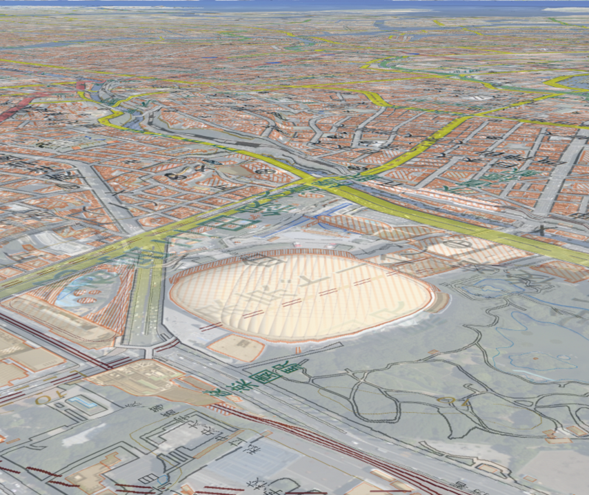

## レイヤの表示

レイヤを表示する方法を説明します。

### サンプルコード
レイヤを表示する**AddLayer.html**のサンプルコードです。このサンプルコードでは、東京ドーム付近の地図に国土地理院の標準地図を重ねて表示します。

#### AddLayer.html

```HTML
<!DOCTYPE html>
<html>
    <head>
        <meta charset="UTF-8">
        <title>AddLayerSample</title>
        <script src="https://resource.mapray.com/mapray-js/v0.8.0/mapray.min.js"></script>
        <link rel="stylesheet" href="https://resource.mapray.com/styles/v1/mapray.css">
        <style>
            html, body {
                height: 100%;
                margin: 0;
            }

            div#mapray-container {
                display: flex;
                position: relative;
                height: 100%;
            }
        </style>
    </head>

    <body>
        <div id="mapray-container"></div>
    </body>
</html>

<script>
    // Access Tokenを設定
    var accessToken = "<your access token here>";

    // レイヤーを設定しViewerを作成する。
    viewer = new mapray.Viewer(
        "mapray-container", {
            image_provider: new mapray.StandardImageProvider("https://cyberjapandata.gsi.go.jp/xyz/seamlessphoto/", ".jpg", 256, 2, 18),
            dem_provider: new mapray.CloudDemProvider(accessToken),
            layers: [{ image_provider: new mapray.StandardImageProvider("https://cyberjapandata.gsi.go.jp/xyz/std/", ".png", 256, 5, 18), opacity: 0.5 }]
        }
    );

    // カメラ位置の設定

    // 球面座標系（経度、緯度、高度）で視点を設定。座標は東京ドーム
    var home_pos = { longitude: 139.751891, latitude: 35.70564, height: 50.0 };

    // 球面座標から地心直交座標へ変換
    var home_view_geoPoint = new mapray.GeoPoint( home_pos.longitude, home_pos.latitude, home_pos.height );
    var home_view_to_gocs = home_view_geoPoint.getMlocsToGocsMatrix( mapray.GeoMath.createMatrix() );

    // 視線方向を定義
    var cam_pos = mapray.GeoMath.createVector3([-500, 500, 200]);
    var cam_end_pos = mapray.GeoMath.createVector3([0, 0, 0]);
    var cam_up = mapray.GeoMath.createVector3([0, 0, 1]);

    //　ビュー変換行列を作成
    var view_to_home = mapray.GeoMath.createMatrix();
    mapray.GeoMath.lookat_matrix(cam_pos, cam_end_pos, cam_up, view_to_home);

    // カメラの位置と視線方向からカメラの姿勢を変更
    var view_to_gocs = viewer.camera.view_to_gocs;
    mapray.GeoMath.mul_AA(home_view_to_gocs, view_to_home, view_to_gocs);

    // カメラのnear、farの設定
    viewer.camera.near = 30;
    viewer.camera.far = 500000;
</script>
```

このサンプルコードの詳細を以下で解説します。

#### htmlの記述
1～25行目がhtmlの定義です。ヘルプページ『**緯度経度によるカメラ位置の指定**』で示したhtmlファイルからタイトルのみを変更します。
詳細はヘルプページ『**緯度経度によるカメラ位置の指定**』を参照してください。

```HTML
<!DOCTYPE html>
<html>
    <head>
        <meta charset="UTF-8">
        <title>AddLayerSample</title>
        <script src="https://resource.mapray.com/mapray-js/v0.8.0/mapray.min.js"></script>
        <link rel="stylesheet" href="https://resource.mapray.com/styles/v1/mapray.css">
        <style>
            html, body {
                height: 100%;
                margin: 0;
            }

            div#mapray-container {
                display: flex;
                position: relative;
                height: 100%;
            }
        </style>
    </head>

    <body>
        <div id="mapray-container"></div>
    </body>
</html>
```

#### レイヤの設定
レイヤーを表示するためには、mapray.Viewerのlayersにレイヤーの情報を設定する必要があります。そのため、36行目でmapray.Viewerにレイヤの情報を設定します。設定するレイヤーの情報は、画像プロバイダと不透明度です。画像プロバイダはimage_providerに、不透明度はopacityに設定します。このサンプルコードでは、image_providerに国土地理院の標準地図のタイルを、opacityには半透明の0.5を設定します。
その他のアクセストークンの設定部分やmapray.Viewerの生成部分の詳細は、ヘルプページ『**緯度経度によるカメラ位置の指定**』を参照してください。

```JavaScript
// Access Tokenを設定
var accessToken = "<your access token here>";

// レイヤーを設定しViewerを作成する。
viewer = new mapray.Viewer(
    "mapray-container", {
        image_provider: new mapray.StandardImageProvider("https://cyberjapandata.gsi.go.jp/xyz/seamlessphoto/", ".jpg", 256, 2, 18),
        dem_provider: new mapray.CloudDemProvider(accessToken),
        layers: [{ image_provider: new mapray.StandardImageProvider("https://cyberjapandata.gsi.go.jp/xyz/std/", ".png", 256, 5, 18), opacity: 0.5 }]
        }
);
```

#### カメラの位置・向きの設定
43～64行目でカメラ位置・向きを設定します。
ヘルプページ『**緯度経度によるカメラ位置の指定**』を参照してください。

```JavaScript
// カメラ位置の設定

// 球面座標系（経度、緯度、高度）で視点を設定。座標は東京ドーム
var home_pos = { longitude: 139.751891, latitude: 35.70564, height: 50.0 };

// 球面座標から地心直交座標へ変換
var home_view_geoPoint = new mapray.GeoPoint( home_pos.longitude, home_pos.latitude, home_pos.height );
var home_view_to_gocs = home_view_geoPoint.getMlocsToGocsMatrix( mapray.GeoMath.createMatrix() );

// 視線方向を定義
var cam_pos = mapray.GeoMath.createVector3([-500, 500, 200]);
var cam_end_pos = mapray.GeoMath.createVector3([0, 0, 0]);
var cam_up = mapray.GeoMath.createVector3([0, 0, 1]);

// ビュー変換行列を作成
var view_to_home = mapray.GeoMath.createMatrix();
mapray.GeoMath.lookat_matrix(cam_pos, cam_end_pos, cam_up, view_to_home);

// カメラの位置と視線方向からカメラの姿勢を変更
var view_to_gocs = viewer.camera.view_to_gocs;
mapray.GeoMath.mul_AA(home_view_to_gocs, view_to_home, view_to_gocs);

// カメラのnear  farの設定
viewer.camera.near = 30;
viewer.camera.far = 500000;
```

### 出力イメージ
このサンプルコードの出力イメージは下図のようになります。

