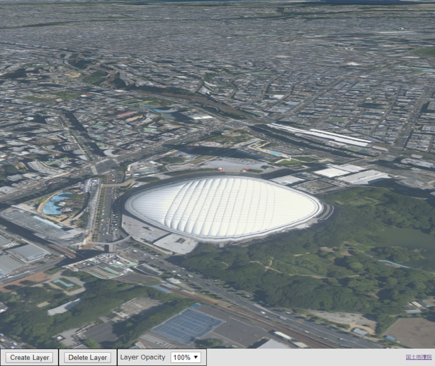
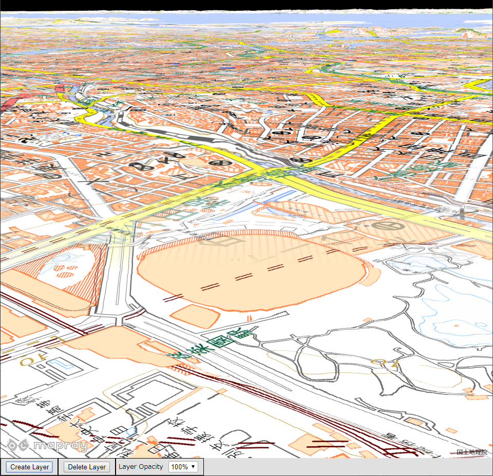
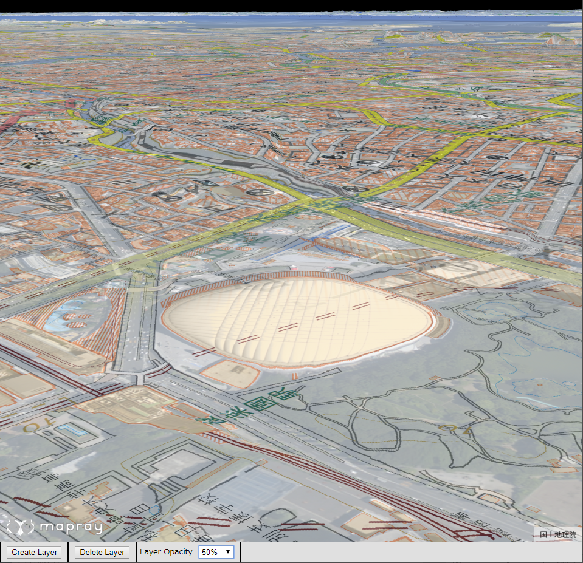
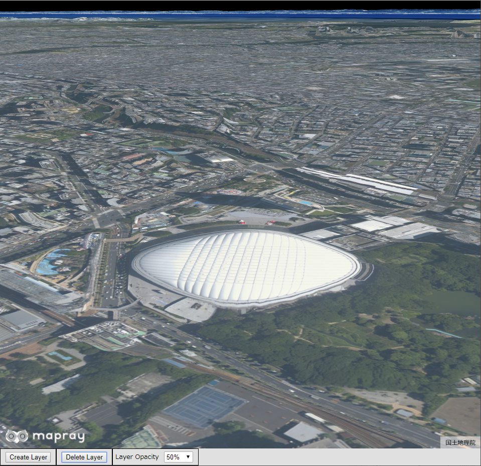

<!---
title: "　3.2. レイヤの動的追加、削除と不透明度の変更"
date: 2019-12-02T17:29:11+09:00
draft: false
description: "レイヤの動的追加、削除と不透明度の変更"
keywords: ["チュートリアル", "レイヤ", "動的", "追加", "削除", "不透明度"]
type: tutorials
menu: main
weight: 2032
--->

## レイヤの動的追加、削除と不透明度の変更

動的にレイヤを追加、削除する方法とレイヤの不透明度を変更する方法を説明します。

### サンプルコード
動的にレイヤを追加、削除し、レイヤの不透明度を変更する**CreateDeleteLayerChangeOpacity.html**及び**CreateDeleteLayerChangeOpacity.js**のサンプルコードです。
このサンプルコードでは、レイヤ追加ボタンを押すと、東京ドーム周辺の地図に国土地理院の標準地図のレイヤを追加します。もう一度レイヤ追加ボタンを押すと、追加されたレイヤの上に新しく同じレイヤが追加され、レイヤ削除ボタンを押すと、一番上に表示されているレイヤを削除します。レイヤの不透明度を変更すると、一番上に表示されているレイヤの不透明度を変更します。

#### CreateDeleteLayerChangeOpacity.html

<!--@ 1 -->
```HTML
<!DOCTYPE html>
<html>
    <head>
        <meta charset="utf-8">
        <title>CreateDeleteLayerChangeOpacitySample</title>
        <script src="https://resource.mapray.com/mapray-js/v0.8.7/mapray.min.js"></script>
        <link rel="stylesheet" href="https://resource.mapray.com/styles/v1/mapray.css">
        <script src="CreateDeleteLayerChangeOpacity.js"></script>
        <style>
            html, body {
                height: 100%;
                margin: 0;
                background-color: #E0E0E0;
            }

            select {
                height: 22px;
                vertical-align: middle;
                font-size: 13px;
                margin-left: 10px;
            }

            p {
                font-size: 13px;
                margin-left:5px;
            }

            input{
                margin-left:10px;
                font-size: 13px;
                width: 90px;
            }

            div#mapray-container {
                display: flex;
                position: relative;
                height: calc(100% - 34px);
            }

            div#CreateLayerBox {
                display: flex;
                background-color: #E0E0E0;
                height: 32px;
                width: 110px;
                float: left;
                border: inset 1px #000000;
                align-items: center;
            }

            div#DeleteLayerBox {
                display: flex;
                background-color: #E0E0E0;
                height: 32px;
                width: 110px;
                float: left;
                border: inset 1px #000000;
                align-items: center;
            }

            div#LayerOpacityBox {
                display: flex;
                background-color: #E0E0E0;
                height: 32px;
                width: 170px;
                float: left;
                border: inset 1px #000000;
                align-items: center;
            }
        </style>
    </head>

    <body onload="CreateLayerControlInstance('mapray-container');">
        <div id="mapray-container"></div>

        <div id="CreateLayerBox">
            <input type="button" value="Create Layer" onclick="CreateLayerButtonClicked()">
        </div>

        <div id="DeleteLayerBox">
            <input type="button" value="Delete Layer" onclick="DeleteLayerButtonClicked()">
        </div>

        <div id="LayerOpacityBox">
            <p>Layer Opacity</p>
            <select name="LayerOpacityPullDown" id="LayerOpacityPullDown" onchange="LayerOpacityValueChanged()">
                <option value=1.0>100%</option>
                <option value=0.75>75%</option>
                <option value=0.5>50%</option>
                <option value=0.25>25%</option>
                <option value=0.001>0%</option>
            </select>
        </div>
    </body>
</html>
```

#### CreateDeleteLayerChangeOpacity.js

<!--@ 1 -->
```JavaScript
var layer_Control;

class LayerControl {

    constructor(container) {
        // Access Tokenを設定
        var accessToken = "<your access token here>";

        // Viewerを作成する
        this.viewer = new mapray.Viewer(
            container, {
                image_provider: this.createImageProvider(),
                dem_provider: new mapray.CloudDemProvider(accessToken)
            }
        );

        this.SetCamera();
    }

    // 画像プロバイダを生成
    createImageProvider() {
        // 国土地理院提供の汎用的な地図タイルを設定
        return new mapray.StandardImageProvider("https://cyberjapandata.gsi.go.jp/xyz/seamlessphoto/", ".jpg", 256, 2, 18);
    }

    SetCamera() {
        // カメラ位置の設定

        // 球面座標系（経度、緯度、高度）で視点を設定。座標は東京ドーム
        var home_pos = { longitude: 139.751891, latitude: 35.70564, height: 50.0 };

        // 球面座標から地心直交座標へ変換
        var home_view_geoPoint = new mapray.GeoPoint( home_pos.longitude, home_pos.latitude, home_pos.height );
        var home_view_to_gocs = home_view_geoPoint.getMlocsToGocsMatrix( mapray.GeoMath.createMatrix() );

        // 視線方向を定義
        var cam_pos = mapray.GeoMath.createVector3([-500, 500, 200]);
        var cam_end_pos = mapray.GeoMath.createVector3([0, 0, 0]);
        var cam_up = mapray.GeoMath.createVector3([0, 0, 1]);

        // ビュー変換行列を作成
        var view_to_home = mapray.GeoMath.createMatrix();
        mapray.GeoMath.lookat_matrix(cam_pos, cam_end_pos, cam_up, view_to_home);

        // カメラの位置と視線方向からカメラの姿勢を変更
        var view_to_gocs = this.viewer.camera.view_to_gocs;
        mapray.GeoMath.mul_AA(home_view_to_gocs, view_to_home, view_to_gocs);

        // カメラのnear、farの設定
        this.viewer.camera.near = 30;
        this.viewer.camera.far = 500000;
    }

    createLayerImageProvider() {
        // レイヤー用の地図タイルを設定
        return new mapray.StandardImageProvider("https://cyberjapandata.gsi.go.jp/xyz/std/", ".png", 256, 5, 18);
    }

    AddLayer() {
        // UI不透明度取得
        var opacity_Value = parseFloat(document.getElementById("LayerOpacityPullDown").value);

        // レイヤーを末尾に追加
        this.viewer.layers.add({ image_provider: this.createLayerImageProvider(), opacity: opacity_Value });
    }

    DeleteLayer() {
        // 末尾のレイヤーを削除
        if (this.viewer.layers.num_layers == 0) {
            return;
        }

        this.viewer.layers.remove(this.viewer.layers.num_layers - 1);
    }

    ChangeOpacity() {
        if (this.viewer.layers.num_layers == 0) {
            return;
        }

        // UI不透明度取得
        var opacity_Value = parseFloat(document.getElementById("LayerOpacityPullDown").value);

        // 末尾のレイヤー不透明度を変更
        this.viewer.layers.getLayer(this.viewer.layers.num_layers - 1).setOpacity(opacity_Value);
    }

}

function CreateLayerControlInstance(container) {
    layer_Control = new LayerControl(container);
}

function CreateLayerButtonClicked() {
    layer_Control.AddLayer();
}

function DeleteLayerButtonClicked() {
    layer_Control.DeleteLayer();
}

function LayerOpacityValueChanged() {
    layer_Control.ChangeOpacity();
}
```

### htmlのサンプルコードの詳細
htmlのサンプルコードの詳細を以下で解説します。

#### htmlの文字コード設定
4行目でhtmlの文字コードを設定します。このサンプルコードでは、utf-8を設定します。

<!--@ 4 -->
```HTML
<meta charset="utf-8">
```

#### タイトルの設定
5行目でタイトルの設定をします。このサンプルコードでは、CreateDeleteLayerChangeOpacitySampleを設定します。

<!--@ 5 -->
```HTML
<title>CreateDeleteLayerChangeOpacitySample</title>
```

#### JavaScriptファイルのパス設定
6～8行目で参照するJavaScript及びスタイルシートのパスを設定します。このサンプルコードでは、maprayのJavaScriptファイル、スタイルシート、レイヤの動的追加、削除と不透明度を変更するJavaScriptファイル（**CreateDeleteLayerChangeOpacity.js**）を設定します。

<!--@ 6 -->
```HTML
<script src="https://resource.mapray.com/mapray-js/v0.8.7/mapray.min.js"></script>
<link rel="stylesheet" href="https://resource.mapray.com/styles/v1/mapray.css">
<script src="CreateDeleteLayerChangeOpacity.js"></script>
```

#### スタイルの設定
8～76行目で表示する要素のスタイルを設定します。このサンプルコードでは、下記のスタイルを設定します。
- html
- body
- select
- p
- input
- div#mapray-container（地図表示部分）
- div#CreateLayerBox（レイヤ追加ボタン表示部分）
- div#DeleteLayerBox（レイヤ削除ボタン表示部分）
- div#LayerOpacityBox（レイヤの不透明度変更コンボボックス表示部分）

<!--@ 8 -->
```HTML
<style>
    html, body {
        height: 100%;
        margin: 0;
        background-color: #E0E0E0;
    }

    select {
        height: 22px;
        vertical-align: middle;
        font-size: 13px;
        margin-left: 10px;
    }

    p {
        font-size: 13px;
        margin-left:5px;
    }

    input{
        margin-left:10px;
        font-size: 13px;
        width: 90px;
    }

    div#mapray-container {
        display: flex;
        position: relative;
        height: calc(100% - 34px);
    }

    div#CreateLayerBox {
        display: flex;
        background-color: #E0E0E0;
        height: 32px;
        width: 110px;
        float: left;
        border: inset 1px #000000;
        align-items: center;
    }

    div#DeleteLayerBox {
        display: flex;
        background-color: #E0E0E0;
        height: 32px;
        width: 110px;
        float: left;
        border: inset 1px #000000;
        align-items: center;
    }

    div#LayerOpacityBox {
        display: flex;
        background-color: #E0E0E0;
        height: 32px;
        width: 170px;
        float: left;
        border: inset 1px #000000;
        align-items: center;
    }
</style>
```

#### loadイベントの設定
画面を表示する時に、レイヤ操作クラスを生成します。そのため、72行目でページ読み込み時に、レイヤを操作するクラスのインスタンスを生成する関数（**CreateLayerControlInstance**）を呼ぶように設定します。
レイヤを操作するクラスのインスタンスを生成する関数は、JavaScriptのサンプルコードの詳細で説明します。

<!--@ 72 -->
```HTML
<body onload="CreateLayerControlInstance('mapray-container');">
```

#### 地図表示部分の指定
73行目で地図表示部分のブロックを記述します。
詳細はヘルプページ『**緯度経度によるカメラ位置の指定**』を参照してください。

<!--@ 73 -->
```HTML
<div id="mapray-container"></div>
```

#### レイヤ追加のUI
75～77行目でレイヤ追加ボタン表示部分のブロックを記述します。このブロックの中には、レイヤ追加ボタンを用意します。レイヤ追加ボタンには、ボタンがクリックされた時のイベント（onclick）に、レイヤ追加ボタンクリック時に呼び出す関数（**CreateLayerButtonClicked**）を設定します。
レイヤ追加ボタンクリック時に呼び出す関数はJavaScriptのサンプルコードの詳細で説明します。

<!--@ 75 -->
```HTML
<div id="CreateLayerBox">
    <input type="button" value="Create Layer" onclick="CreateLayerButtonClicked()">
</div>
```

#### レイヤ削除のUI
79～81行目でレイヤ削除ボタン表示部分のブロックを記述します。このブロックの中には、レイヤ削除ボタンを用意します。レイヤ削除ボタンには、ボタンがクリックされた時のイベント（onclick）に、レイヤ削除ボタンクリック時に呼び出す関数（**DeleteLayerButtonClicked**）を設定します。
レイヤ削除ボタンクリック時に呼び出す関数はJavaScriptのサンプルコードの詳細で説明します。

<!--@ 79 -->
```HTML
<div id="DeleteLayerBox">
    <input type="button" value="Delete Layer" onclick="DeleteLayerButtonClicked()">
</div>
```

#### レイヤの不透明度変更のUI
83～92行目でレイヤの不透明度変更コンボボックス表示部分のブロックを記述します。このブロックの中には、レイヤの不透明度を変更するコンボボックスを用意します。このサンプルコードでは、0%、25%、50%、75%、100%を設定します。
レイヤの不透明度を変更するコンボボックスが変更された時のイベント（onchange）に、コンボボックス変更時に呼び出す関数（**LayerOpacityValueChanged**）を設定します。
コンボボックス変更時に呼び出す関数はJavaScriptのサンプルコードの詳細で説明します。

<!--@ 83 -->
```HTML
<div id="LayerOpacityBox">
    <p>Layer Opacity</p>
    <select name="LayerOpacityPullDown" id="LayerOpacityPullDown" onchange="LayerOpacityValueChanged()">
        <option value=1.0>100%</option>
        <option value=0.75>75%</option>
        <option value=0.5>50%</option>
        <option value=0.25>25%</option>
        <option value=0.001>0%</option>
    </select>
</div>
```

### JavaScriptのサンプルコードの詳細
JavaScriptのサンプルコードの詳細を以下で解説します。

#### クラスとグローバル変数
3～88行目でレイヤを操作するクラスを定義します。クラス内の各メソッドの詳細は以降で解説します。
また、1行目でレイヤを操作するクラスのグローバル変数を定義します。

<!--@ none -->
```JavaScript
var layer_Control;

class LayerControl {

  //中略

}
```

#### コンストラクタ
5～18行目がレイヤを操作するクラスのコンストラクタです。引数として渡されるブロックのidに対して、mapray.Viewerを作成し、カメラの位置・向きの設定メソッドを呼び出します。mapray.Viewerのベース地図の画像プロバイダは、画像プロバイダの生成メソッドで取得した画像プロバイダを設定します。
mapray.Viewerの作成の詳細は、ヘルプページ『**緯度経度によるカメラ位置の指定**』を参照してください。

<!--@ 5 -->
```JavaScript
constructor(container) {
    // Access Tokenを設定
    var accessToken = "<your access token here>";

    // Viewerを作成する
    this.viewer = new mapray.Viewer(
        container, {
            image_provider: this.createImageProvider(),
            dem_provider: new mapray.CloudDemProvider(accessToken)
        }
    );

    this.SetCamera();
}
```

#### 画像プロバイダの生成
21～24行目が画像プロバイダの生成メソッドです。生成した画像プロバイダを返します。
画像プロバイダの生成の詳細は、ヘルプページ『**緯度経度によるカメラ位置の指定**』を参照してください。

<!--@ 20 -->
```JavaScript
// 画像プロバイダを生成
createImageProvider() {
    // 国土地理院提供の汎用的な地図タイルを設定
    return new mapray.StandardImageProvider("https://cyberjapandata.gsi.go.jp/xyz/seamlessphoto/", ".jpg", 256, 2, 18);
}
```

#### カメラの位置・向きの設定
26～52行目がカメラの位置・向きの設定メソッドです。
カメラの位置・向きの設定は、ヘルプページ『**緯度経度によるカメラ位置の指定**』を参照してください。

<!--@ 26 -->
```JavaScript
SetCamera() {
    // カメラ位置の設定

    // 球面座標系（経度、緯度、高度）で視点を設定。座標は東京ドーム
    var home_pos = { longitude: 139.751891, latitude: 35.70564, height: 50.0 };

    // 球面座標から地心直交座標へ変換
    var home_view_geoPoint = new mapray.GeoPoint( home_pos.longitude, home_pos.latitude, home_pos.height );
    var home_view_to_gocs = home_view_geoPoint.getMlocsToGocsMatrix( mapray.GeoMath.createMatrix() );

    // 視線方向を定義
    var cam_pos = mapray.GeoMath.createVector3([-500, 500, 200]);
    var cam_end_pos = mapray.GeoMath.createVector3([0, 0, 0]);
    var cam_up = mapray.GeoMath.createVector3([0, 0, 1]);

    // ビュー変換行列を作成
    var view_to_home = mapray.GeoMath.createMatrix();
    mapray.GeoMath.lookat_matrix(cam_pos, cam_end_pos, cam_up, view_to_home);

    // カメラの位置と視線方向からカメラの姿勢を変更
    var view_to_gocs = this.viewer.camera.view_to_gocs;
    mapray.GeoMath.mul_AA(home_view_to_gocs, view_to_home, view_to_gocs);

    // カメラのnear、farの設定
    this.viewer.camera.near = 30;
    this.viewer.camera.far = 500000;
}
```

#### レイヤの画像プロバイダの生成
54～57行目がレイヤの画像プロバイダの生成メソッドです。生成した画像プロバイダを返します。このサンプルコードでは、国土地理院の標準地図の画像プロバイダを生成します。
画像プロバイダの生成の詳細は、ヘルプページ『**緯度経度によるカメラ位置の指定**』を参照してください。
<!--@ 54 -->
```JavaScript
createLayerImageProvider() {
    // レイヤー用の地図タイルを設定
    return new mapray.StandardImageProvider("https://cyberjapandata.gsi.go.jp/xyz/std/", ".png", 256, 5, 18);
}
```

#### レイヤの追加
59～65行目がレイヤの追加メソッドです。新しいレイヤをシーンに追加します。追加するレイヤの不透明度は、レイヤの不透明度を変更するコンボボックスの値を設定します。
viewerの地図レイヤを管理するオブジェクト（layers）にレイヤの情報を追加すると、シーンにレイヤが追加されます。地図レイヤを管理するオブジェクトの末尾にレイヤの情報を追加する関数が、64行目のadd関数です。add関数の引数はレイヤの情報を設定します。このサンプルコードでは、レイヤの情報である画像プロバイダ（image_provider）にレイヤの画像プロバイダの生成メソッドで生成した画像プロバイダを設定し、不透明度（opacity）に61行目で取得したレイヤの不透明度を変更するコンボボックスの値を設定します。

<!--@ 59 -->
```JavaScript
AddLayer() {
    // UI不透明度取得
    var opacity_Value = parseFloat(document.getElementById("LayerOpacityPullDown").value);

    // レイヤーを末尾に追加
    this.viewer.layers.add({ image_provider: this.createLayerImageProvider(), opacity: opacity_Value });
}
```

#### レイヤの削除
67～74行目がレイヤの削除メソッドです。地図レイヤを管理するオブジェクトの末尾のレイヤを削除します。
73行目の地図レイヤを管理するオブジェクトのremove関数が、レイヤを削除する関数です。remove関数の引数は、削除したいレイヤのインデックスを設定します。このサンプルコードでは、remove関数の引数に末尾のレイヤのインデックスを設定します。

<!--@ 67 -->
```JavaScript
DeleteLayer() {
    // 末尾のレイヤーを削除
    if (this.viewer.layers.num_layers == 0) {
        return;
    }

    this.viewer.layers.remove(this.viewer.layers.num_layers - 1);
}
```

#### レイヤの不透明度変更
76～86行目がレイヤの不透明度変更メソッドです。地図レイヤを管理するオブジェクトから末尾のレイヤを取得し、不透明度を変更します。
85行目の地図レイヤを管理するオブジェクトのgetLayer関数が、地図レイヤを管理するオブジェクトからレイヤの情報を取得する関数です。getLayer関数の引数は、取得したいレイヤのインデックスを設定します。このサンプルコードでは、getLayer関数の引数に末尾のレイヤのインデックスを設定します。取得したレイヤに対して、85行目のレイヤの情報のsetOpacity関数を用いて、82行目で取得したレイヤの不透明度を変更するコンボボックスの値を設定しすることで、レイヤの不透明度を変更します。

<!--@ 76 -->
```JavaScript
ChangeOpacity() {
    if (this.viewer.layers.num_layers == 0) {
        return;
    }

    // UI不透明度取得
    var opacity_Value = parseFloat(document.getElementById("LayerOpacityPullDown").value);

    // 末尾のレイヤー不透明度を変更
    this.viewer.layers.getLayer(this.viewer.layers.num_layers - 1).setOpacity(opacity_Value);
}
```

#### レイヤ操作のクラスのインスタンス生成
90～92行目の関数は、引数として渡されるブロックのidを利用して、レイヤ操作クラスのインスタンスを生成します。

<!--@ 90 -->
```JavaScript
function CreateLayerControlInstance(container) {
    layer_Control = new LayerControl(container);
}
```

#### レイヤ追加ボタンクリック時のイベント
94～96行目の関数は、レイヤ追加ボタンクリック時に呼ばれ、レイヤ操作クラスのレイヤ追加メソッドを呼び出します。

<!--@ 94 -->
```JavaScript
function CreateLayerButtonClicked() {
    layer_Control.AddLayer();
}
```

#### レイヤ削除ボタンクリック時のイベント
98～100行目の関数は、レイヤ削除ボタンクリック時に呼ばれ、レイヤ操作クラスのレイヤ削除メソッドを呼び出します。

<!--@ 98 -->
```JavaScript
function DeleteLayerButtonClicked() {
    layer_Control.DeleteLayer();
}
```

#### レイヤ不透明度変更時のイベント
102～104行目の関数は、レイヤ不透明度変更時に呼ばれ、レイヤ操作クラスのレイヤ不透明度変更メソッドを呼び出します。

<!--@ 102 -->
```JavaScript
function LayerOpacityValueChanged() {
    layer_Control.ChangeOpacity();
}
```

### 出力イメージ
このサンプルコードで初期状態の出力イメージは下図のようになります。


次に、レイヤ追加ボタンを押した時の出力イメージは下図のようになります。


さらに、レイヤの不透明度を50％にした時の出力イメージは下図のようになります。


最後に、レイヤ削除ボタンを押した時の出力イメージは下図のようになります。

