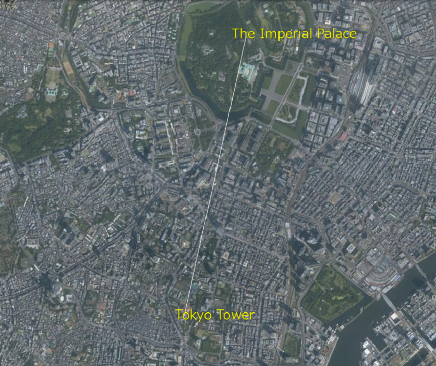

## 線の表示（addPointsを使った表示）

mapray.MarkerLineEntityのaddPointsを使って線を表示する方法を説明します。

### サンプルコード
mapray.MarkerLineEntityのaddPointsを使って線を表示する**AddLine.html**のサンプルコードです。
このサンプルコードでは、皇居と東京タワーを結ぶ直線を表示します。

```HTML
<!DOCTYPE html>
<html>
    <head>
        <meta charset="UTF-8">
        <title>AddLineSample</title>
        <script src="https://resource.mapray.com/mapray-js/v0.7.1/mapray.js"></script>
        <link rel="stylesheet" href="https://resource.mapray.com/styles/v1/mapray.css">
        <style>
            html, body {
                height: 100%;
                margin: 0;
            }

            div#mapray-container {
                display: flex;
                position: relative;
                height: 100%;
            }
        </style>
    </head>

    <body>
        <div id="mapray-container"></div>
    </body>
</html>

<script>
    // Access Tokenを設定
    var accessToken = "<your access token here>";

    // Viewerを作成する
    viewer = new mapray.Viewer(
        "mapray-container", {
            image_provider: new mapray.StandardImageProvider("https://cyberjapandata.gsi.go.jp/xyz/seamlessphoto/", ".jpg", 256, 2, 18),
            dem_provider: new mapray.CloudDemProvider(accessToken)
        }
    );

    // カメラ位置の設定

    // 球面座標系（経度、緯度、高度）で視点を設定。皇居と東京タワーの中間点付近
    var home_pos = { longitude: 139.749486, latitude: 35.671190, height: 50 };

    // 球面座標から地心直交座標へ変換
    var home_view_geoPoint = new mapray.GeoPoint( home_pos.longitude, home_pos.latitude, home_pos.height );
    var home_view_to_gocs = home_view_geoPoint.getMlocsToGocsMatrix( mapray.GeoMath.createMatrix() );

    // 視線方向を定義
    var cam_pos = mapray.GeoMath.createVector3([0, 0, 7500]);
    var cam_end_pos = mapray.GeoMath.createVector3([0, 0, 0]);
    var cam_up = mapray.GeoMath.createVector3([0, 1, 0]);

    // ビュー変換行列を作成
    var view_to_home = mapray.GeoMath.createMatrix();
    mapray.GeoMath.lookat_matrix(cam_pos, cam_end_pos, cam_up, view_to_home);

    // カメラの位置と視線方向からカメラの姿勢を変更
    var view_to_gocs = viewer.camera.view_to_gocs;
    mapray.GeoMath.mul_AA(home_view_to_gocs, view_to_home, view_to_gocs);

    // カメラのnear、farの設定
    viewer.camera.near = 30;
    viewer.camera.far = 500000;

    // 直線のエンティティを作成
    var line_entity = new mapray.MarkerLineEntity(viewer.scene);

    // 皇居の座標を設定
    var line_fast_position = { longitude: 139.7528, latitude: 35.685175, height: 350 };

    // 東京タワーの座標を設定
    var line_second_position = { longitude: 139.745433, latitude: 35.658581, height: 350 };

    // 各座標を配列に保存して、直線を追加
    var position_array = [line_fast_position.longitude, line_fast_position.latitude, line_fast_position.height,
                          line_second_position.longitude, line_second_position.latitude, line_second_position.height];
    line_entity.addPoints(position_array);

    // エンティティをシーンに追加
    viewer.scene.addEntity(line_entity);

    // 文字のエンティティを作成
    var font_entity = new mapray.TextEntity(viewer.scene);

    // 皇居より400mほど東の場所を設定
    var fast_font_position = { longitude: 139.758503, latitude: 35.685030, height: 350 };

    // GeoPointクラスを生成して、テキストを追加
    var fast_font_geopoint = new mapray.GeoPoint(fast_font_position.longitude, fast_font_position.latitude, fast_font_position.height);
    font_entity.addText("The Imperial Palace", fast_font_geopoint, { color: [1, 1, 0], font_size: 25 });

    // 東京タワーより300mほど東の場所を設定
    var second_font_position = { longitude: 139.749069, latitude: 35.658182, height: 350 };

    // GeoPointクラスを生成して、テキストを追加
    var second_font_geopoint = new mapray.GeoPoint(second_font_position.longitude, second_font_position.latitude, second_font_position.height);
    font_entity.addText("Tokyo Tower", second_font_geopoint, { color: [1, 1, 0], font_size: 25 });

    // エンティティをシーンに追加
    viewer.scene.addEntity(font_entity);
</script>
```

このサンプルコードの詳細を以下で解説します。

#### htmlの記述
1～25行目がでhtmlの定義です。ヘルプページ『**緯度経度によるカメラ位置の指定**』で示したhtmlファイルからタイトルのみを変更します。
詳細はヘルプページ『**緯度経度によるカメラ位置の指定**』を参照してください。

```HTML
<!DOCTYPE html>
<html>
    <head>
        <meta charset="UTF-8">
        <title>AddLineSample</title>
        <script src="https://resource.mapray.com/mapray-js/v0.7.1/mapray.js"></script>
        <link rel="stylesheet" href="https://resource.mapray.com/styles/v1/mapray.css">
        <style>
            html, body {
                height: 100%;
                margin: 0;
            }

            div#mapray-container {
                display: flex;
                position: relative;
                height: 100%;
            }
        </style>
    </head>

    <body>
        <div id="mapray-container"></div>
    </body>
</html>
```

#### カメラ位置・向きの設定
29～63行目でMapray.Viewerクラスを作成し、カメラ位置・向きを設定します。
詳細はヘルプページ『**緯度経度によるカメラ位置の指定**』を参照してください。

```JavaScript
// Access Tokenを設定
var accessToken = "<your access token here>";

// Viewerを作成する
viewer = new mapray.Viewer(
    "mapray-container", {
        image_provider: new mapray.StandardImageProvider("https://cyberjapandata.gsi.go.jp/xyz/seamlessphoto/", ".jpg", 256, 2, 18),
        dem_provider: new mapray.CloudDemProvider(accessToken)
    }
);

// カメラ位置の設定

// 球面座標系（経度、緯度、高度）で視点を設定。皇居と東京タワーの中間点付近
var home_pos = { longitude: 139.749486, latitude: 35.671190, height: 50 };

// 球面座標から地心直交座標へ変換
var home_view_geoPoint = new mapray.GeoPoint( home_pos.longitude, home_pos.latitude, home_pos.height );
var home_view_to_gocs = home_view_geoPoint.getMlocsToGocsMatrix( mapray.GeoMath.createMatrix() );

// 視線方向を定義
var cam_pos = mapray.GeoMath.createVector3([0, 0, 7500]);
var cam_end_pos = mapray.GeoMath.createVector3([0, 0, 0]);
var cam_up = mapray.GeoMath.createVector3([0, 1, 0]);

// ビュー変換行列を作成
var view_to_home = mapray.GeoMath.createMatrix();
mapray.GeoMath.lookat_matrix(cam_pos, cam_end_pos, cam_up, view_to_home);

// カメラの位置と視線方向からカメラの姿勢を変更
var view_to_gocs = viewer.camera.view_to_gocs;
mapray.GeoMath.mul_AA(home_view_to_gocs, view_to_home, view_to_gocs);

// カメラのnear、farの設定
viewer.camera.near = 30;
viewer.camera.far = 500000;
```

#### MarkerLineEntityの生成
線を表示するためには、線の情報を管理するクラス（MarkerLineEntity）が必要です。そのため、66行目でMarkerLineEntityのインスタンスを生成します。コンストラクタの引数には、作成したMapray.Viewerのシーン（Mapray.Viewer.scene）を指定します。

```JavaScript
//直線のエンティティを作成
var line_entity = new mapray.MarkerLineEntity(viewer.scene);
```

#### 線の表示座標の定義
69～72行目で、線の端点となる皇居と東京タワーの経度・緯度・高度を定義します。

```JavaScript
// 皇居の座標を設定
var line_fast_position = { longitude: 139.7528, latitude: 35.685175, height: 350 };

// 東京タワーの座標を設定
var line_second_position = { longitude: 139.745433, latitude: 35.658581, height: 350 };
```

#### 線の座標の設定
線の座標を設定するaddPoints関数は、線の座標の配列を引数で指定します。そのため、75～76行目で先ほど定義した皇居と東京タワーの座標を配列に格納します。ただし、線の座標の配列は、対象の座標を緯度、経度、高度の順で格納することとします。その配列を80行目のaddPoints関数に渡すことで、線の座標を設定します。

```JavaScript
// 各座標を配列に保存して、直線を追加
var position_array = [line_fast_position.longitude, line_fast_position.latitude, line_fast_position.height,
                      line_second_position.longitude, line_second_position.latitude, line_second_position.height];
line_entity.addPoints(position_array);
```

#### MarkerLineEntityの追加
80行目でMarkerLineEntityを作成したmapray.Viewerのシーンに追加します。mapray.Viewerのシーンに追加することで線が表示されます。

```JavaScript
// エンティティをシーンに追加
viewer.scene.addEntity(line_entity);
```

#### 文字の表示
83～100行目で、それぞれの地名を表示するための文字をmapray.Viewerのシーンに追加します。文字の表示方法の詳細は、ヘルプページ『**文字の表示（addTextを使った表示）**』を参照してください。

```JavaScript
// 文字のエンティティを作成
var font_entity = new mapray.TextEntity(viewer.scene);

// 皇居より400mほど東の場所を設定
var fast_font_position = { longitude: 139.758503, latitude: 35.685030, height: 350 };

// GeoPointクラスを生成して、テキストを追加
var fast_font_geopoint = new mapray.GeoPoint(fast_font_position.longitude, fast_font_position.latitude, fast_font_position.height);
font_entity.addText("The Imperial Palace", fast_font_geopoint, { color: [1, 1, 0], font_size: 25 });

// 東京タワーより300mほど東の場所を設定
var second_font_position = { longitude: 139.749069, latitude: 35.658182, height: 350 };

// GeoPointクラスを生成して、テキストを追加
var second_font_geopoint = new mapray.GeoPoint(second_font_position.longitude, second_font_position.latitude, second_font_position.height);
font_entity.addText("Tokyo Tower", second_font_geopoint, { color: [1, 1, 0], font_size: 25 });

// エンティティをシーンに追加
viewer.scene.addEntity(font_entity);
```

### 出力イメージ
このサンプルコードの出力イメージは下図のようになります。

