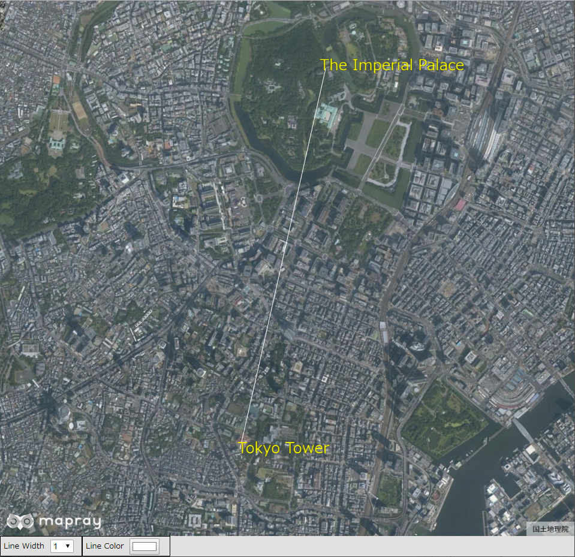
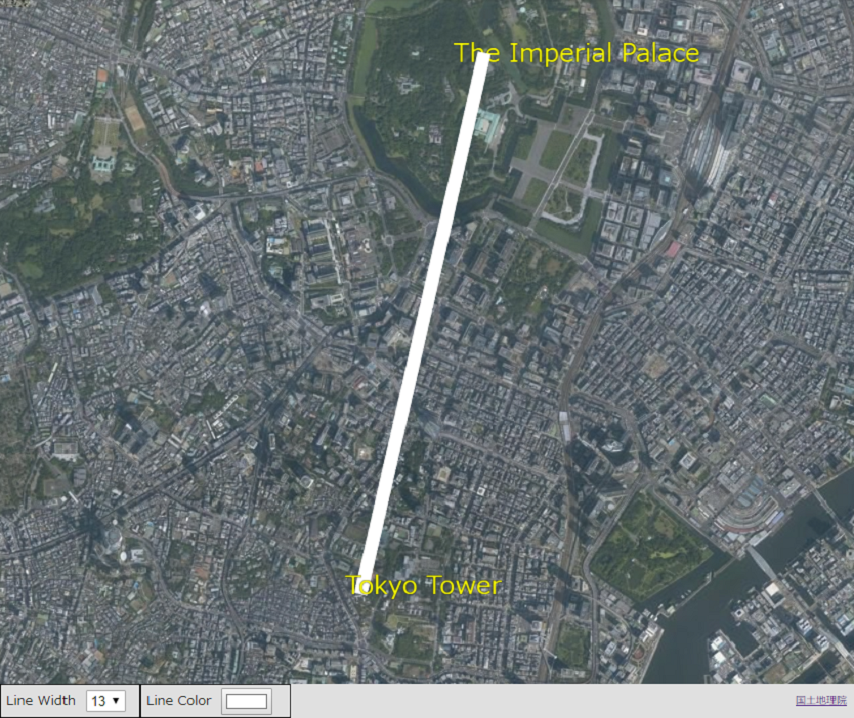
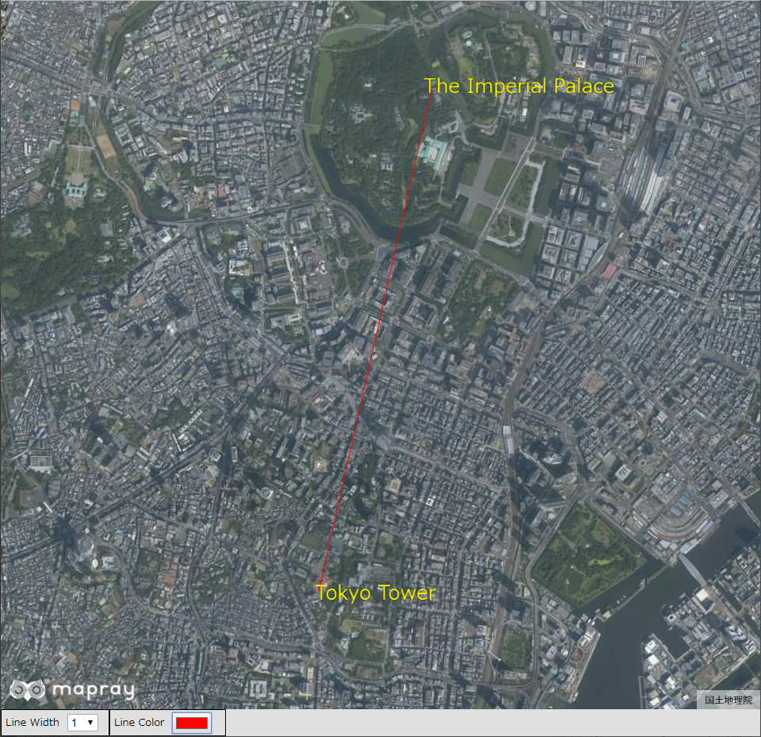

## 線のフォーマットの変更

線のフォーマットを変更する方法を説明します。

### サンプルコード
線のフォーマットを変更する**ChangeLineFormat.html**及び**ChangeLineFormat.js**のサンプルコードです。
このサンプルコードでは、ユーザインタフェースを介して、皇居、東京タワー間を結ぶ線のフォーマットを変更します。変更できるフォーマットは、線の幅、線の色です。線の幅は、1、3、7、13、17、21に変更でき、線の色は、カラーピッカーで変更できます。

#### ChangeLineFormat.html

```HTML
<!DOCTYPE html>
<html>
<head>
    <meta charset="utf-8">
    <title>ChangeLineFormatSample</title>
    <script src="https://api.mapray.com/mapray-js/v0.6.0/mapray.js"></script>
    <script src="ChangeLineFormat.js" charset="utf-8"></script>
    <style>
        html, body {
            height: 100%;
            margin: 0;
            background-color: #E0E0E0;
        }

        select{
            height:22px;
            vertical-align:middle;
            font-size:13px;
            margin-left:10px;
        }

        p{
            font-size:13px;
            margin-left:5px;
        }

        input{
            margin-left:10px;
        }

        div#mapray-container {
            display: flex;
            height: 96%;
        }

        div#LineWidthBox {
            display: flex;
            background-color: #E0E0E0;
            height: 32px;
            width: 135px;
            float: left;
            border: inset 1px #000000;
            align-items: center;
        }

        div#LineColorBox {
            display: flex;
            background-color: #E0E0E0;
            height: 32px;
            width: 145px;
            float: left;
            border: inset 1px #000000;
            align-items: center;
        }

        div#mapInfo{
            display: flex;
            width: 50px;
            height: 32px;
            margin-left: auto;
            margin-right: 10px;
            align-items: center;
        }

    </style>
</head>

<body onload="CreateChangeLineFormatInstance('mapray-container');">
    <div id="mapray-container"></div>

    <div id="LineWidthBox">
        <p>Line Width</p>
        <select name="LineWidthPullDown" id="LineWidthPullDown" onchange="LineWidthValueChanged()">
            <option value=1>1</option>
            <option value=3>3</option>
            <option value=7>7</option>
            <option value=13>13</option>
            <option value=17>17</option>
            <option value=21>21</option>
        </select>
    </div>

    <div id="LineColorBox">
        <p>Line Color</p>
        <input type="color" id="LineColorPallet" name="LineColorPallet" value="#ffffff" onchange="LineColorValueChanged()">
    </div>

    <div id="mapInfo"><a href="https://maps.gsi.go.jp/development/ichiran.html" style="font-size: 9px">国土地理院</a></div>
</body>
</html>
```

#### ChangeLineFormat.js

```JavaScript
var change_Line_Format;

class ChangeLineFormat {

    constructor(container) {

        // Access Tokenを設定
        var accessToken = "<your access token here>";

        // Viewerを作成する
        this.viewer = new mapray.Viewer(
            container, {
                image_provider: this.createImageProvider(),
                dem_provider: new mapray.CloudDemProvider(accessToken)
            }
        );

        this.SetCamera()

        this.MakeUIFormatLine()

        this.SetLinePointStr()
    }

    // 画像プロバイダを生成
    createImageProvider() {
        // 国土地理院提供の汎用的な地図タイルを設定
        return new mapray.StandardImageProvider("https://cyberjapandata.gsi.go.jp/xyz/seamlessphoto/", ".jpg", 256, 2, 18);
    }

    SetCamera() {
        // カメラ位置の設定

        // 球面座標系（経度、緯度、高度）で視点を設定。皇居と東京タワーの中間点付近
        var home_pos = { longitude: 139.749486, latitude: 35.671190, height: 50 };

        // 球面座標から地心直交座標へ変換
        var home_view_to_gocs = mapray.GeoMath.iscs_to_gocs_matrix(home_pos, mapray.GeoMath.createMatrix());

        // 視線方向を定義
        var cam_pos = mapray.GeoMath.createVector3([0, 0, 7500]);
        var cam_end_pos = mapray.GeoMath.createVector3([0, 0, 0]);
        var cam_up = mapray.GeoMath.createVector3([0, 1, 0]);

        //ビュー変換行列を作成
        var view_to_home = mapray.GeoMath.createMatrix();
        mapray.GeoMath.lookat_matrix(cam_pos, cam_end_pos, cam_up, view_to_home);

        // カメラの位置と視線方向からカメラの姿勢を変更
        var view_to_gocs = this.viewer.camera.view_to_gocs;
        mapray.GeoMath.mul_AA(home_view_to_gocs, view_to_home, view_to_gocs);

        // カメラのnear  farの設定
        this.viewer.camera.near = 30;
        this.viewer.camera.far = 500000;
    }

    MakeUIFormatLine() {
        //直線のエンティティを作成
        var entity = new mapray.MarkerLineEntity(this.viewer.scene);

        //皇居の座標を求める
        var line_Fast_Pos = { longitude: 139.7528, latitude: 35.685175, height: 350 }
        var line_Fast_View_To_Gocs = mapray.GeoMath.iscs_to_gocs_matrix(line_Fast_Pos, mapray.GeoMath.createMatrix());

        //東京タワーの座標を求める
        var line_Second_Pos = { longitude: 139.745433, latitude: 35.658581, height: 350 }
        var line_Second_View_To_Gocs = mapray.GeoMath.iscs_to_gocs_matrix(line_Second_Pos, mapray.GeoMath.createMatrix());

        var points = [line_Fast_View_To_Gocs[12], line_Fast_View_To_Gocs[13], line_Fast_View_To_Gocs[14],
                      line_Second_View_To_Gocs[12], line_Second_View_To_Gocs[13], line_Second_View_To_Gocs[14]]

        entity.addPoints(points)

        //プルダウンの値取得
        var line_Width_Value = parseFloat(document.getElementById("LineWidthPullDown").value);
        var line_ColorChord = document.getElementById("LineColorPallet").value;

        //ColorChordをRBGに変換
        var RGBArray = this.convertColorChordToRGB(line_ColorChord);

        //プルダウンの値を設定
        entity.setLineWidth(line_Width_Value);
        entity.setColor(RGBArray);

        //エンティティをシーンに追加
        this.viewer.scene.addEntity(entity);
    }

    SetLinePointStr() {
        //文字のエンティティを作成
        var entity = new mapray.TextEntity(this.viewer.scene);
        //皇居より400mほど東の場所
        var fast_Font_Pos = { longitude: 139.758503, latitude: 35.685030, height: 350 }

        var fast_Font_View_To_Gocs = mapray.GeoMath.iscs_to_gocs_matrix(fast_Font_Pos, mapray.GeoMath.createMatrix());

        entity.addText("The Imperial Palace",
                 [fast_Font_View_To_Gocs[12], fast_Font_View_To_Gocs[13], fast_Font_View_To_Gocs[14]],
                 { color: [1, 1, 0], font_size: 25 });
        //東京タワーより300mほど東の場所
        var second_Font_Pos = { longitude: 139.749169, latitude: 35.658252, height: 350 }

        var second_Font_View_To_Gocs = mapray.GeoMath.iscs_to_gocs_matrix(second_Font_Pos, mapray.GeoMath.createMatrix());

        entity.addText("Tokyo Tower",
                 [second_Font_View_To_Gocs[12], second_Font_View_To_Gocs[13], second_Font_View_To_Gocs[14]],
                 { color: [1, 1, 0], font_size: 25 });

        //エンティティをシーンに追加
        this.viewer.scene.addEntity(entity);
    }

    ChangeLineWidth() {
        //プルダウンの値取得
        var line_Width_Value = parseFloat(document.getElementById("LineWidthPullDown").value);

        //プルダウンの値を設定
        var lineEntity = this.viewer.scene.getEntity(0);
        lineEntity.setLineWidth(line_Width_Value);

    }

    ChangeLineColor() {
        //プルダウンの値取得
        var line_ColorChord = document.getElementById("LineColorPallet").value;

        //ColorChordをRBGに変換
        var RGBArray = this.convertColorChordToRGB(line_ColorChord);

        //プルダウンの値を設定
        var lineEntity = this.viewer.scene.getEntity(0);
        lineEntity.setColor(RGBArray);

    }

    convertColorChordToRGB(ColorChord) {
        var ColorChordChars = ColorChord.split('')

        var r = parseInt(ColorChordChars[1].toString() + ColorChordChars[2].toString(), 16) / 255;
        var g = parseInt(ColorChordChars[3].toString() + ColorChordChars[4].toString(), 16) / 255;
        var b = parseInt(ColorChordChars[5].toString() + ColorChordChars[6].toString(), 16) / 255;

        return [r, g, b]
    }
}

function CreateChangeLineFormatInstance(container) {
    change_Line_Format = new ChangeLineFormat(container);
}

function LineWidthValueChanged() {
    change_Line_Format.ChangeLineWidth()
}

function LineColorValueChanged() {
    change_Line_Format.ChangeLineColor()
}
```

### htmlのサンプルコードの詳細
htmlのサンプルコードの詳細を以下で解説します。

#### htmlの文字コード設定
4行目でhtmlの文字コードを設定します。このサンプルコードでは、utf-8を設定します。

```HTML
<meta charset="utf-8">
```

#### タイトルの設定
5行目でタイトルの設定をします。このサンプルコードでは、ChangeLineFormatSampleを設定します。

```HTML
<title>ChangeLineFormatSample</title>
```

#### JavaScriptファイルのパス設定
6、7行目でで参照するJavaScriptのパスを設定します。このサンプルコードでは、maprayのJavaScriptファイルと線のフォーマットを変えるJavaScriptファイル（**ChangeLineFormat.js**）を設定します。線のフォーマットを変えるJavaScriptファイルの文字コードはutf-8に設定します。

```HTML
<script src="https://api.mapray.com/mapray-js/v0.6.0/mapray.js"></script>
<script src="ChangeLineFormat.js" charset="utf-8"></script>
```

#### スタイルの設定
8～65行目で表示する要素のスタイルを設定します。このサンプルコードでは、下記のスタイルを設定します。
- html
- body
- select
- p
- input
- div#mapray-container（地図表示部分）
- div#LineWidthBox（線幅変更コンボボックス表示部分）
- div#LineColorBox（線色変更ボタン表示部分）
- div#mapInfo（出典表示部分）

```HTML
<style>
    html, body {
        height: 100%;
        margin: 0;
        background-color: #E0E0E0;
    }

    select{
        height:22px;
        vertical-align:middle;
        font-size:13px;
        margin-left:10px;
    }

    p{
        font-size:13px;
        margin-left:5px;
    }

    input{
        margin-left:10px;
    }

    div#mapray-container {
        display: flex;
        height: 96%;
    }

    div#LineWidthBox {
        display: flex;
        background-color: #E0E0E0;
        height: 32px;
        width: 135px;
        float: left;
        border: inset 1px #000000;
        align-items: center;
    }

    div#LineColorBox {
        display: flex;
        background-color: #E0E0E0;
        height: 32px;
        width: 145px;
        float: left;
        border: inset 1px #000000;
        align-items: center;
    }

    div#mapInfo{
        display: flex;
        width: 50px;
        height: 32px;
        margin-left: auto;
        margin-right: 10px;
        align-items: center;
    }

</style>
```

#### loadイベントの設定
画面を表示するときに、線フォーマット変更クラスを生成します。そのため、68行目でページ読み込み時に、線のフォーマットを変更するクラスのインスタンスを生成する関数（**CreateChangeLineFormatInstance**）を呼ぶように設定します。
線のフォーマットを変更するクラスのインスタンスを生成する関数は、JavaScriptのサンプルコードの詳細で説明します。

```HTML
<body onload="CreateChangeLineFormatInstance('mapray-container');">
```

#### 地図表示部分と出典表示部分の指定
69行目で地図表示部分になるブロックを記述し、88行目で出典を明記するためのブロックを記述します。
詳細はヘルプページ『**緯度経度によるカメラ位置の指定**』を参照してください。

```HTML
<div id="mapray-container"></div>

中略

<div id="mapInfo"><a href="https://maps.gsi.go.jp/development/ichiran.html" style="font-size: 9px">国土地理院</a></div>
```

#### 線の幅変更のUI
71～81行目で線幅変更コンボボックス表示部分のブロックを記述します。このブロックの中には、線幅を変更するコンボボックスを用意します。このサンプルコードでは、1、3、7、13、17、21を設定します。
線幅を変更するコンボボックスが変更された時のイベント（onchange）に、線幅のコンボボックス変更時に呼び出す関数（**LineWidthValueChanged**）を設定します。
線幅のコンボボックス変更時に呼び出す関数はJavaScriptのサンプルコードの詳細で説明します。

```HTML
<div id="LineWidthBox">
    <p>Line Width</p>
    <select name="LineWidthPullDown" id="LineWidthPullDown" onchange="LineWidthValueChanged()">
        <option value=1>1</option>
        <option value=3>3</option>
        <option value=7>7</option>
        <option value=13>13</option>
        <option value=17>17</option>
        <option value=21>21</option>
    </select>
</div>
```

#### 線の色変更のUI
83～86行目で線色変更ボタン表示部分のブロックを記述します。このブロックの中には、線色変更ボタンを用意します。
線色変更ボタンには、カラーピッカーの色が変更された時のイベント（onchange）に、線色変更時に呼び出す関数（**LineColorValueChanged**）を設定します。
線色変更時に呼び出す関数はJavaScriptのサンプルコードの詳細で説明します。

```HTML
<div id="LineColorBox">
    <p>Line Color</p>
    <input type="color" id="LineColorPallet" name="LineColorPallet" value="#ffffff" onchange="LineColorValueChanged()">
</div>
```

### JavaScriptのサンプルコードの詳細
JavaScriptのサンプルコードの詳細を以下で解説します。

#### クラスとグローバル変数の説明
3～146行目で線のフォーマットを変更するクラスを定義します。クラス内の各メソッドの詳細は以降で解説します。
また、1行目で線のフォーマットを変更するクラスのグローバル変数を定義します。

```JavaScript
var change_Line_Format;

class ChangeLineFormat {

  //中略

}
```

#### コンストラクタ
5～23行目が線のフォーマットを変更するクラスのコンストラクタです。
引数として渡されるブロックのidに対して、mapray.Viewerを作成し、カメラの位置・向きの設定、線の作成、文字の表示の順にメソッド呼び出します。mapray.Viewerのベース地図の画像プロバイダは、画像プロバイダの生成メソッドで取得した画像プロバイダを設定します。
mapray.Viewerの作成の詳細は、ヘルプページ『**緯度経度によるカメラ位置の指定**』を参照してください。

```JavaScript
constructor(container) {

    // Access Tokenを設定
    var accessToken = "<your access token here>";

    // Viewerを作成する
    this.viewer = new mapray.Viewer(
        container, {
            image_provider: this.createImageProvider(),
            dem_provider: new mapray.CloudDemProvider(accessToken)
        }
    );

    this.SetCamera()

    this.MakeUIFormatLine()

    this.SetLinePointStr()
}
```

#### 画像プロバイダの生成
25～29行目が画像プロバイダの生成メソッドです。生成した画像プロバイダを返します。
画像プロバイダの生成の詳細は、ヘルプページ『**緯度経度によるカメラ位置の指定**』を参照してください。

```JavaScript
// 画像プロバイダを生成
createImageProvider() {
    // 国土地理院提供の汎用的な地図タイルを設定
    return new mapray.StandardImageProvider("https://cyberjapandata.gsi.go.jp/xyz/seamlessphoto/", ".jpg", 256, 2, 18);
}
```

#### カメラの位置・向きの設定
31～56行目がカメラの位置・向きの設定メソッドです。
カメラの位置・向きの設定は、ヘルプページ『**緯度経度によるカメラ位置の指定**』を参照してください。

```JavaScript
SetCamera() {
    // カメラ位置の設定

    // 球面座標系（経度、緯度、高度）で視点を設定。皇居と東京タワーの中間点付近
    var home_pos = { longitude: 139.749486, latitude: 35.671190, height: 50 };

    // 球面座標から地心直交座標へ変換
    var home_view_to_gocs = mapray.GeoMath.iscs_to_gocs_matrix(home_pos, mapray.GeoMath.createMatrix());

    // 視線方向を定義
    var cam_pos = mapray.GeoMath.createVector3([0, 0, 7500]);
    var cam_end_pos = mapray.GeoMath.createVector3([0, 0, 0]);
    var cam_up = mapray.GeoMath.createVector3([0, 1, 0]);

    //ビュー変換行列を作成
    var view_to_home = mapray.GeoMath.createMatrix();
    mapray.GeoMath.lookat_matrix(cam_pos, cam_end_pos, cam_up, view_to_home);

    // カメラの位置と視線方向からカメラの姿勢を変更
    var view_to_gocs = this.viewer.camera.view_to_gocs;
    mapray.GeoMath.mul_AA(home_view_to_gocs, view_to_home, view_to_gocs);

    // カメラのnear  farの設定
    this.viewer.camera.near = 30;
    this.viewer.camera.far = 500000;
}
```

#### 線の作成
58～88行目が線の作成メソッドです。画面で設定した線幅及び線色で皇居、東京タワー間を結ぶ線を作成、表示します。
線の幅は、76行目で線幅を変更するコンボボックスから値を取得し、それを83行目の線幅を設定する関数（MarkerLineEntityのsetLineWidth）を利用して設定します。
線の色は、77行目でカラーピッカーから値を取得し、79、80行目でRGB配列を作成した後に、それを84行目の線色を設定する関数（MarkerLineEntityのsetColor）を利用して設定します。カラーピッカーの値からRGB配列を作成するメソッドの詳細は後述します。
線の表示方法の詳細は、ヘルプページ『**線の表示（addPointsを使った表示）**』を参照してください。

```JavaScript
MakeUIFormatLine() {
    //直線のエンティティを作成
    var entity = new mapray.MarkerLineEntity(this.viewer.scene);

    //皇居の座標を求める
    var line_Fast_Pos = { longitude: 139.7528, latitude: 35.685175, height: 350 }
    var line_Fast_View_To_Gocs = mapray.GeoMath.iscs_to_gocs_matrix(line_Fast_Pos, mapray.GeoMath.createMatrix());

    //東京タワーの座標を求める
    var line_Second_Pos = { longitude: 139.745433, latitude: 35.658581, height: 350 }
    var line_Second_View_To_Gocs = mapray.GeoMath.iscs_to_gocs_matrix(line_Second_Pos, mapray.GeoMath.createMatrix());

    var points = [line_Fast_View_To_Gocs[12], line_Fast_View_To_Gocs[13], line_Fast_View_To_Gocs[14],
                  line_Second_View_To_Gocs[12], line_Second_View_To_Gocs[13], line_Second_View_To_Gocs[14]]

    entity.addPoints(points)

    //プルダウンの値取得
    var line_Width_Value = parseFloat(document.getElementById("LineWidthPullDown").value);
    var line_ColorChord = document.getElementById("LineColorPallet").value;

    //ColorChordをRBGに変換
    var RGBArray = this.convertColorChordToRGB(line_ColorChord);

    //プルダウンの値を設定
    entity.setLineWidth(line_Width_Value);
    entity.setColor(RGBArray);

    //エンティティをシーンに追加
    this.viewer.scene.addEntity(entity);
}
```

#### 文字の表示
90～112行目が文字の表示メソッドです。皇居と東京タワーの文字を表示します。
文字の表示方法の詳細は、ヘルプページ『**文字の表示（addTextを使った表示）**』のヘルプページを参照してください。

```JavaScript
SetLinePointStr() {
    //文字のエンティティを作成
    var entity = new mapray.TextEntity(this.viewer.scene);
    //皇居より400mほど東の場所
    var fast_Font_Pos = { longitude: 139.758503, latitude: 35.685030, height: 350 }

    var fast_Font_View_To_Gocs = mapray.GeoMath.iscs_to_gocs_matrix(fast_Font_Pos, mapray.GeoMath.createMatrix());

    entity.addText("The Imperial Palace",
             [fast_Font_View_To_Gocs[12], fast_Font_View_To_Gocs[13], fast_Font_View_To_Gocs[14]],
             { color: [1, 1, 0], font_size: 25 });
    //東京タワーより300mほど東の場所
    var second_Font_Pos = { longitude: 139.749169, latitude: 35.658252, height: 350 }

    var second_Font_View_To_Gocs = mapray.GeoMath.iscs_to_gocs_matrix(second_Font_Pos, mapray.GeoMath.createMatrix());

    entity.addText("Tokyo Tower",
             [second_Font_View_To_Gocs[12], second_Font_View_To_Gocs[13], second_Font_View_To_Gocs[14]],
             { color: [1, 1, 0], font_size: 25 });

    //エンティティをシーンに追加
    this.viewer.scene.addEntity(entity);
}
```

#### 線の幅変更
114～122行目が線幅変更メソッドです。115、116行目で線幅を変更するコンボボックスから値を取得します。そして、119行目のviewer.sceneのgetEntity関数で表示している線のエンティティを取得し、120行目で取得した値を指定することで、線の幅を変更します。このサンプルコードでは、線のエンティティのインデックスは0となるため、getEntity関数には0を指定します。

```JavaScript
ChangeLineWidth() {
    //プルダウンの値取得
    var line_Width_Value = parseFloat(document.getElementById("LineWidthPullDown").value);

    //プルダウンの値を設定
    var lineEntity = this.viewer.scene.getEntity(0);
    lineEntity.setLineWidth(line_Width_Value);

}
```

#### 線の色変更
124～135行目が線色変更メソッドです。125、126行目でカラーピッカーから値を取得し、128、129行目でカラーピッカーの値をRGBの配列に変換します。そして、132行目のviewer.sceneのgetEntity関数で表示している線のエンティティを取得し、133行目でその値を指定することで、線の色を変更します。このサンプルコードでは、線のエンティティのインデックスは0となるため、getEntity関数には0を指定します。

```JavaScript
ChangeLineColor() {
    //プルダウンの値取得
    var line_ColorChord = document.getElementById("LineColorPallet").value;

    //ColorChordをRBGに変換
    var RGBArray = this.convertColorChordToRGB(line_ColorChord);

    //プルダウンの値を設定
    var lineEntity = this.viewer.scene.getEntity(0);
    lineEntity.setColor(RGBArray);

}
```

#### 色情報の変換
137～145行目が色情報の変換メソッドです。
色情報の変換方法の詳細は、ヘルプページ『**文字のフォーマットの変更**』を参照してください。

```JavaScript
convertColorChordToRGB(ColorChord) {
    var ColorChordChars = ColorChord.split('')

    var r = parseInt(ColorChordChars[1].toString() + ColorChordChars[2].toString(), 16) / 255;
    var g = parseInt(ColorChordChars[3].toString() + ColorChordChars[4].toString(), 16) / 255;
    var b = parseInt(ColorChordChars[5].toString() + ColorChordChars[6].toString(), 16) / 255;

    return [r, g, b]
}
```

#### 線のフォーマット変更クラスのインスタンス生成
148～150行目の関数は、引数として渡されるブロックのidを利用して、線フォーマット変更クラスのインスタンスを生成します。

```JavaScript
function CreateChangeLineFormatInstance(container) {
    change_Line_Format = new ChangeLineFormat(container);
}
```

#### 線幅変更時のイベント
152～154行目の関数は、線幅変更時に呼ばれ、線フォーマット変更クラスの線幅変更メソッドを呼び出します。

```JavaScript
function LineWidthValueChanged() {
    change_Line_Format.ChangeLineWidth()
}
```

#### 線色変更時のイベント
156～158行目の関数は、線色変更時に呼ばれ、線フォーマット変更クラスの線色変更メソッドを呼び出します。

```JavaScript
function LineColorValueChanged() {
    change_Line_Format.ChangeLineColor()
}
```

### 出力イメージ
このサンプルコードで初期状態（線幅：1、線色：白）の出力イメージは下図のようになります。


初期状態から、線幅を13にした時の出力イメージは下図のようになります。


初期状態から、線色を赤にした時の出力イメージは下図のようになります。

