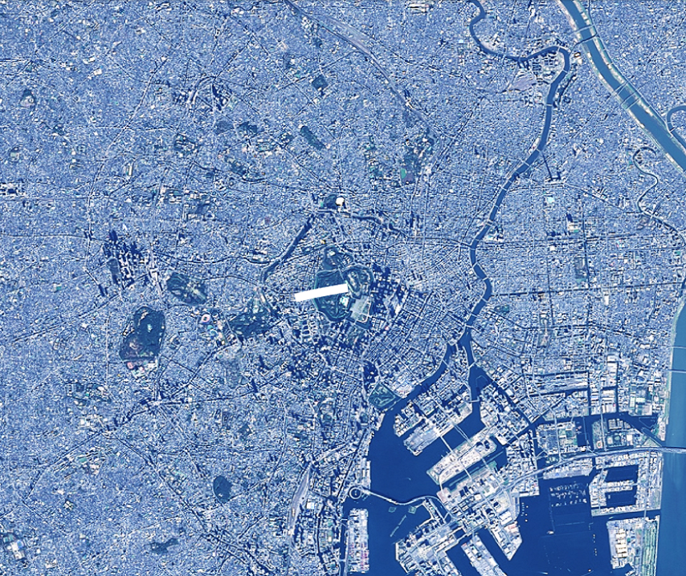
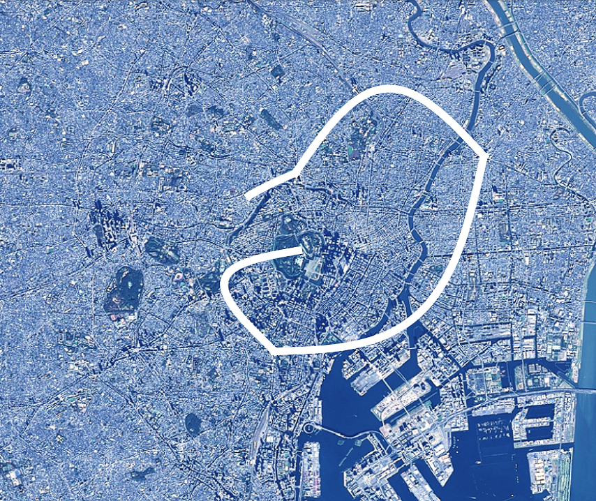

<!---
title: "　5.4 ラインのアニメーション"
date: 2019-12-02T18:23:00+09:00
draft: false
description: "ラインのアニメーション"
keywords: ["チュートリアル", "直線", "ライン", "アニメーション", "動的"]
type: tutorials
menu: main
weight: 2054
--->

## ラインのアニメーション
動的に線を追加し、表示するアニメーションを作成する方法を説明します。

### サンプルコード
動的に線を追加し、表示するアニメーションを作成する**LineAnimation.html**及び**LineAnimation.js**のサンプルコードです。
このサンプルコードでは、皇居、東京タワー、東京スカイツリー、東京ドーム、皇居の順に各地を通る曲線を作図します。皇居までたどりつけば、作図した線をすべて削除し、同じ経路の曲線の作図します。

#### LineAnimation.html

<!--@ 1 -->
```HTML
<!DOCTYPE html>
<html>
    <head>
        <meta charset="utf-8">
        <title>LineAnimationSample</title>
        <script src="https://resource.mapray.com/mapray-js/v0.8.5/mapray.min.js"></script>
        <link rel="stylesheet" href="https://resource.mapray.com/styles/v1/mapray.css">
        <script src="LineAnimation.js"></script>
        <style>
            html, body {
                height: 100%;
                margin: 0;
            }

            div#mapray-container {
                display: flex;
                position: relative;
                height: 100%;
            }
        </style>
    </head>

    <body onload="new LineAnimation('mapray-container');">
        <div id="mapray-container"></div>
    </body>
</html>
```

#### LineAnimation.js

<!--@ 1 -->
```JavaScript
class LineAnimation extends mapray.RenderCallback {

    constructor(container) {
        super();

        // Access Tokenを設定
        var accessToken = "<your access token here>";

        // Viewerを作成する
        new mapray.Viewer(container, {
            render_callback: this,
            image_provider: this.createImageProvider(),
            dem_provider: new mapray.CloudDemProvider(accessToken)
        });

        this.SetCamera();

        this.line_Pos_Array = [{ longitude: 139.7528, latitude: 35.685175, height: 500.0 },     // 仮想パスの終点(皇居)
                               { longitude: 139.745433, latitude: 35.658581, height: 500.0 },   // 仮想パスの終点(東京タワー)
                               { longitude: 139.8107, latitude: 35.710063, height: 500.0 },     // 仮想パスの終点(スカイツリー)
                               { longitude: 139.751891, latitude: 35.70564, height: 500.0 },    // 仮想パスの終点(東京ドーム)
                               { longitude: 139.7528, latitude: 35.685175, height: 500.0 }]     // 仮想パスの始点(皇居)

        this.ratio_Increment = 0.15;    // 毎フレームの線形補間割合増加分
        this.ratio = 0.0;               // 線形補間の割合
        this.line_Pos_Index = 0;

        this.CreateMarkerLineEntityAndAddLineStartPoint();
    }

    // 画像プロバイダを生成
    createImageProvider() {
        // 国土地理院提供の汎用的な地図タイルを設定
        return new mapray.StandardImageProvider("https://cyberjapandata.gsi.go.jp/xyz/seamlessphoto/", ".jpg", 256, 2, 18);
    }

    SetCamera() {
        // カメラ位置の設定

        // 球面座標系（経度、緯度、高度）で視点を設定。座標は皇居
        var home_pos = { longitude: 139.7528, latitude: 35.685175, height: 20000 };

        // 球面座標から地心直交座標へ変換
        var home_view_geoPoint = new mapray.GeoPoint( home_pos.longitude, home_pos.latitude, home_pos.height );
        var home_view_to_gocs = home_view_geoPoint.getMlocsToGocsMatrix( mapray.GeoMath.createMatrix() );

        // 視線方向を定義
        var cam_pos = mapray.GeoMath.createVector3([0, 0, 7000]);
        var cam_end_pos = mapray.GeoMath.createVector3([0, 0, 0]);
        var cam_up = mapray.GeoMath.createVector3([0, 1, 0]);

        // ビュー変換行列を作成
        var view_to_home = mapray.GeoMath.createMatrix();
        mapray.GeoMath.lookat_matrix(cam_pos, cam_end_pos, cam_up, view_to_home);

        // カメラの位置と視線方向からカメラの姿勢を変更
        var view_to_gocs = this.viewer.camera.view_to_gocs;
        mapray.GeoMath.mul_AA(home_view_to_gocs, view_to_home, view_to_gocs);

        // カメラのnear、farの設定
        this.viewer.camera.near = 30;
        this.viewer.camera.far = 1000000;
    }

    CreateMarkerLineEntityAndAddLineStartPoint() {
        // 直線のエンティティを作成
        var entity = new mapray.MarkerLineEntity(this.viewer.scene);

        // 仮想パスの1点目を直線に追加
        var points = [this.line_Pos_Array[0].latitude, this.line_Pos_Array[0].longitude, this.line_Pos_Array[0].height];
        entity.addPoints(points);

        // 線幅を設定
        entity.setLineWidth(11);

        //エンティティをシーンに追加
        this.viewer.scene.addEntity(entity);
    }

    onStart()  // override
    {
        // 初期化（経過時間、ポイント経度、緯度）
        this.ratio = 0.0;
    }

    // フレーム毎に呼ばれるメソッド
    onUpdateFrame(delta_time)  // override
    {
        // 次の線形補間の割合
        this.ratio += this.ratio_Increment * delta_time;

        if (this.ratio > 1.0) {
            this.ratio = 0.0;
            this.line_Pos_Index += 1
        }

        if (this.line_Pos_Index == this.line_Pos_Array.length - 1) {
            this.line_Pos_Index = 0

            this.viewer.scene.clearEntities();

            this.CreateMarkerLineEntityAndAddLineStartPoint();
        }

        // 始点終点間の緯度経度高度のベクトル作成
        var vec = [this.line_Pos_Array[this.line_Pos_Index + 1].longitude - this.line_Pos_Array[this.line_Pos_Index].longitude,
                   this.line_Pos_Array[this.line_Pos_Index + 1].latitude - this.line_Pos_Array[this.line_Pos_Index].latitude,
                   this.line_Pos_Array[this.line_Pos_Index + 1].height - this.line_Pos_Array[this.line_Pos_Index].height];
        mapray.GeoMath.normalize3(vec, vec);

        // 外積で補正方向算出
        var closs_Vec = mapray.GeoMath.cross3(vec, [0, 0, 1], mapray.GeoMath.createVector3());

        // 次のラインの緯度経度高度を算出
        var line_Point = {longitude: (this.line_Pos_Array[this.line_Pos_Index].longitude * (1 - this.ratio) + this.line_Pos_Array[this.line_Pos_Index + 1].longitude * this.ratio) + (closs_Vec[0] * 0.02) * Math.sin(this.ratio * 180 * mapray.GeoMath.DEGREE),
                          latitude: (this.line_Pos_Array[this.line_Pos_Index].latitude * (1 - this.ratio) + this.line_Pos_Array[this.line_Pos_Index + 1].latitude * this.ratio) + (closs_Vec[1] * 0.02) * Math.sin(this.ratio * 180 * mapray.GeoMath.DEGREE),
                          height: this.line_Pos_Array[this.line_Pos_Index].height * (1 - this.ratio) + this.line_Pos_Array[this.line_Pos_Index + 1].height * this.ratio};

        // 次の点を追加
        this.AddLinePoint([line_Point.longitude, line_Point.latitude, line_Point.height]);
    }

    AddLinePoint(points)
    {
        //ラインの点を追加する
        var line_Entity = this.viewer.scene.getEntity(0);
        line_Entity.addPoints(points);
    }

}
```

### htmlのサンプルコードの詳細
htmlのサンプルコードの詳細を以下で解説します。

#### htmlの文字コード設定
4行目でhtmlの文字コードを設定します。このサンプルコードでは、utf-8を設定します。

<!--@ 4 -->
```HTML
<meta charset="utf-8">
```

#### タイトルの設定
5行目でタイトルを設定します。このサンプルコードでは、LineAnimationSampleを設定します。

<!--@ 5 -->
```HTML
<title>LineAnimationSample</title>
```

#### JavaScriptファイルのパス設定
6～8行目で参照するJavaScript及びスタイルシートのパスを設定します。このサンプルコードでは、maprayのJavaScriptファイル、スタイルシート、ラインのアニメーションを作成するJavaScriptファイル（**LineAnimation.js**）を設定します。

<!--@ 6 -->
```HTML
<script src="https://resource.mapray.com/mapray-js/v0.8.5/mapray.min.js"></script>
<link rel="stylesheet" href="https://resource.mapray.com/styles/v1/mapray.css">
<script src="LineAnimation.js"></script>
```

#### スタイルの設定
9～20行目で表示する要素のスタイルを設定します。
スタイルの詳細は、ヘルプページ『**緯度経度によるカメラ位置の指定**』を参照してください。

<!--@ 9 -->
```HTML
<style>
    html, body {
        height: 100%;
        margin: 0;
    }

    div#mapray-container {
        display: flex;
        position: relative;
        height: 100%;
    }
</style>
```

#### loadイベントの処理
画面を表示するときに、ラインアニメーション作成クラスを生成します。そのため、23行目でページの読み込み時に、地図表示部分のブロックのidからラインアニメーション作成クラスのインスタンスを生成します。
ラインアニメーション作成クラスはJavaScriptのサンプルコードの詳細で説明します。

<!--@ 23 -->
```HTML
<body onload="new LineAnimation('mapray-container');">
```

#### 地図表示部分の指定
24行目で地図表示部分のブロックを記述します。
詳細はヘルプページ『**緯度経度によるカメラ位置の指定**』を参照してください。

<!--@ 24 -->
```HTML
<div id="mapray-container"></div>
```

### JavaScriptのサンプルコードの詳細
JavaScriptのサンプルコードの詳細を以下で解説します。

#### クラスとグローバル変数の説明
1～130行目でラインのアニメーションを作成するクラスを定義します。アニメーションを表現するために、ラインアニメーション作成クラスは、mapray.RenderCallbackクラスを継承します。

<!--@ none -->
```JavaScript
class LineAnimation extends mapray.RenderCallback {

    //中略

}
```

#### コンストラクタ
3～29行目がラインのアニメーションを作成するクラスのコンストラクタです。引数として渡されるブロックのidに対して、mapray.Viewerを作成し、カメラの位置・向きの設定します。viewerを作成する際の画像プロバイダは画像プロバイダの生成メソッドから取得します。mapray.Viewerの作成の詳細は、ヘルプページ『**カメラのアニメーション**』を参照してください。
その後、アニメーションに必要な変数を定義します。線の通過点配列として、皇居、東京タワー、東京スカイツリー、東京ドームの緯度・経度・高度を、線形補間時の1秒当たりの増加割合として0.15を、線形補間時の現在の割合として0を、線形補間対象となる区間番号として0を、それぞれ設定します。最後に、線のエンティティを作成します。

<!--@ 3 -->
```JavaScript
constructor(container) {
    super();

    // Access Tokenを設定
    var accessToken = "<your access token here>";

    // Viewerを作成する
    new mapray.Viewer(container, {
        render_callback: this,
        image_provider: this.createImageProvider(),
        dem_provider: new mapray.CloudDemProvider(accessToken)
    });

    this.SetCamera();

    this.line_Pos_Array = [{ longitude: 139.7528, latitude: 35.685175, height: 500.0 },     // 仮想パスの終点(皇居)
                           { longitude: 139.745433, latitude: 35.658581, height: 500.0 },   // 仮想パスの終点(東京タワー)
                           { longitude: 139.8107, latitude: 35.710063, height: 500.0 },     // 仮想パスの終点(スカイツリー)
                           { longitude: 139.751891, latitude: 35.70564, height: 500.0 },    // 仮想パスの終点(東京ドーム)
                           { longitude: 139.7528, latitude: 35.685175, height: 500.0 }]     // 仮想パスの始点(皇居)

    this.ratio_Increment = 0.15;    // 毎フレームの線形補間割合増加分
    this.ratio = 0.0;               // 線形補間の割合
    this.line_Pos_Index = 0;

    this.CreateMarkerLineEntityAndAddLineStartPoint();
}
```

#### 画像プロバイダの生成
32～35行目が画像プロバイダの生成メソッドです。生成した画像プロバイダを返します。
画像プロバイダの生成の詳細は、ヘルプページ『**緯度経度によるカメラ位置の指定**』を参照してください。

<!--@ 31 -->
```JavaScript
// 画像プロバイダを生成
createImageProvider() {
    // 国土地理院提供の汎用的な地図タイルを設定
    return new mapray.StandardImageProvider("https://cyberjapandata.gsi.go.jp/xyz/seamlessphoto/", ".jpg", 256, 2, 18);
}
```

#### カメラの位置・向きの設定
37～63行目がカメラの位置・向きの設定メソッドです。
カメラの位置・向きの設定は、ヘルプページ『**緯度経度によるカメラ位置の指定**』を参照してください。

<!--@ 37 -->
```JavaScript
SetCamera() {
    // カメラ位置の設定

    // 球面座標系（経度、緯度、高度）で視点を設定。座標は皇居
    var home_pos = { longitude: 139.7528, latitude: 35.685175, height: 20000 };

    // 球面座標から地心直交座標へ変換
    var home_view_geoPoint = new mapray.GeoPoint( home_pos.longitude, home_pos.latitude, home_pos.height );
    var home_view_to_gocs = home_view_geoPoint.getMlocsToGocsMatrix( mapray.GeoMath.createMatrix() );

    // 視線方向を定義
    var cam_pos = mapray.GeoMath.createVector3([0, 0, 7000]);
    var cam_end_pos = mapray.GeoMath.createVector3([0, 0, 0]);
    var cam_up = mapray.GeoMath.createVector3([0, 1, 0]);

    // ビュー変換行列を作成
    var view_to_home = mapray.GeoMath.createMatrix();
    mapray.GeoMath.lookat_matrix(cam_pos, cam_end_pos, cam_up, view_to_home);

    // カメラの位置と視線方向からカメラの姿勢を変更
    var view_to_gocs = this.viewer.camera.view_to_gocs;
    mapray.GeoMath.mul_AA(home_view_to_gocs, view_to_home, view_to_gocs);

    // カメラのnear、farの設定
    this.viewer.camera.near = 30;
    this.viewer.camera.far = 1000000;
}
```

#### 線のエンティティ作成
65～78行目が線のエンティティ作成メソッドです。線のエンティティを作成し、皇居の座標を追加します。
線の頂点を設定する方法は、ヘルプページ『**線の表示（addPointsを使った表示）**』を参照してください。

<!--@ 65 -->
```JavaScript
CreateMarkerLineEntityAndAddLineStartPoint() {
    // 直線のエンティティを作成
    var entity = new mapray.MarkerLineEntity(this.viewer.scene);

    // 仮想パスの1点目を直線に追加
    var points = [this.line_Pos_Array[0].latitude, this.line_Pos_Array[0].longitude, this.line_Pos_Array[0].height];
    entity.addPoints(points);

    // 線幅を設定
    entity.setLineWidth(11);

    //エンティティをシーンに追加
    this.viewer.scene.addEntity(entity);
}
```

#### レンダリングループの開始時のコールバックメソッド
80～84行目がレンダリングループの開始時のコールバックメソッドです。
レンダリングループの開始時のコールバックメソッドの詳細は、ヘルプページ『**パスに沿ったカメラアニメーション**』を参照してください。

<!--@ 80 -->
```JavaScript
onStart()  // override
{
    // 初期化（経過時間、ポイント経度、緯度）
    this.ratio = 0.0;
}
```

#### フレームレンダリング前のコールバックメソッド（線エンティティの更新処理）
87～121行目がフレームレンダリング前のコールバックメソッドです。このサンプルコードでは、線のエンティティの更新処理を行います。
まず、引数の経過時間をもとに、線形補間時の現在の割合を計算します。その際、現在の割合が1より大きくなった場合は、線形補間対象となる区間番号を1つ増やし、現在の割合を0に設定します。また、全ての区間を補間し終えた場合は、clearEntities関数で線のエンティティを削除し、各メンバ変数及び線の表示状態を初期状態に戻します。また、線形補間の対象区間を曲線で表現するため、106～117行目で対象区間を球面座標系上のサインカーブで表現し、地心直交座標系に変換します。
そして、120行目で線の頂点追加メソッドに地心直交座標系の平行移動成分を指定し、曲線の構成点を追加します。
線の頂点追加メソッドは以下で説明します。

<!--@ 86 -->
```JavaScript
// フレーム毎に呼ばれるメソッド
onUpdateFrame(delta_time)  // override
{
    // 次の線形補間の割合
    this.ratio += this.ratio_Increment * delta_time;

    if (this.ratio > 1.0) {
        this.ratio = 0.0;
        this.line_Pos_Index += 1
    }

    if (this.line_Pos_Index == this.line_Pos_Array.length - 1) {
        this.line_Pos_Index = 0

        this.viewer.scene.clearEntities();

        this.CreateMarkerLineEntityAndAddLineStartPoint();
    }

    // 始点終点間の緯度経度高度のベクトル作成
    var vec = [this.line_Pos_Array[this.line_Pos_Index + 1].longitude - this.line_Pos_Array[this.line_Pos_Index].longitude,
               this.line_Pos_Array[this.line_Pos_Index + 1].latitude - this.line_Pos_Array[this.line_Pos_Index].latitude,
               this.line_Pos_Array[this.line_Pos_Index + 1].height - this.line_Pos_Array[this.line_Pos_Index].height];
    mapray.GeoMath.normalize3(vec, vec);

    // 外積で補正方向算出
    var closs_Vec = mapray.GeoMath.cross3(vec, [0, 0, 1], mapray.GeoMath.createVector3());

    // 次のラインの緯度経度高度を算出
    var line_Point = {longitude: (this.line_Pos_Array[this.line_Pos_Index].longitude * (1 - this.ratio) + this.line_Pos_Array[this.line_Pos_Index + 1].longitude * this.ratio) + (closs_Vec[0] * 0.02) * Math.sin(this.ratio * 180 * mapray.GeoMath.DEGREE),
                      latitude: (this.line_Pos_Array[this.line_Pos_Index].latitude * (1 - this.ratio) + this.line_Pos_Array[this.line_Pos_Index + 1].latitude * this.ratio) + (closs_Vec[1] * 0.02) * Math.sin(this.ratio * 180 * mapray.GeoMath.DEGREE),
                      height: this.line_Pos_Array[this.line_Pos_Index].height * (1 - this.ratio) + this.line_Pos_Array[this.line_Pos_Index + 1].height * this.ratio};

    // 次の点を追加
    this.AddLinePoint([line_Point.longitude, line_Point.latitude, line_Point.height]);
}
```

#### 線の頂点追加
123～128行目が線の座標追加メソッドです。getEntity関数で取得した線のエンティティに引数の頂点を追加します。
線の頂点を設定する方法は、ヘルプページ『**線の表示（addPointsを使った表示）**』を参照してください。

<!--@ 123 -->
```JavaScript
AddLinePoint(points)
{
    //ラインの点を追加する
    var line_Entity = this.viewer.scene.getEntity(0);
    line_Entity.addPoints(points);
}
```

### 出力イメージ
このサンプルコードの出力イメージは下図のようになります。
下図は、皇居から東京タワーまでの区間を補間している時のイメージです。


また、東京ドームから皇居までの区間を補間している時の出力イメージは下図のようになります。

