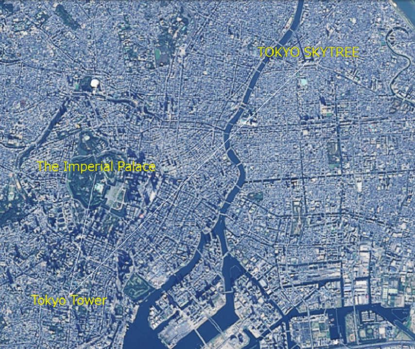

<!---
title: "　5.1 線の表示(SceneLoaderを使った表示)"
date: 2019-12-02T18:25:00+09:00
draft: false
description: "線の表示(SceneLoaderを使った表示)"
keywords: ["チュートリアル", "直線", "表示", "SceneLoader", "皇居", "東京タワー", "スカイツリー"]
type: tutorials
menu: main
weight: 2051
--->

## 線の表示（SceneLoaderを使った表示）

mapray.SceneLoaderを使って線を表示する方法を説明します。

### サンプルコード
mapray.SceneLoaderを使って線を表示する**LoadLineScene.html**及び**LoadLineScene.js**のサンプルコードとシーンファイル（**line.json**）
です。
このサンプルコードでは、皇居、東京タワー、東京スカイツリー間を結ぶ線を表示します。

#### LoadLineScene.html

<!--@ 1 -->
```HTML
<!DOCTYPE html>
<html>
    <head>
        <meta charset="UTF-8">
        <title>LoadLineSceneSample</title>
        <script src="https://resource.mapray.com/mapray-js/v0.8.6/mapray.min.js"></script>
        <link rel="stylesheet" href="https://resource.mapray.com/styles/v1/mapray.css">
        <script src="LoadLineScene.js" charset="utf-8"></script>
        <style>
            html, body {
                height: 100%;
                margin: 0;
            }

            div#mapray-container {
                display: flex;
                position: relative;
                height: 100%;
            }
        </style>
    </head>

    <body onload="new LoadLine('mapray-container');">
        <div id="mapray-container"></div>
    </body>
</html>
```
#### LoadLineScene.js

<!--@ 1 -->
```JavaScript
class LoadLine {

    constructor(container) {
        // Access Tokenを設定
        var accessToken = "<your access token here>";

        // Viewerを作成する
        this.viewer = new mapray.Viewer(
            container, {
                image_provider: this.createImageProvider(),
                dem_provider: new mapray.CloudDemProvider(accessToken)
            }
        );

        this.SetCamera();

        this.LoadScene();
    }

    // 画像プロバイダを生成
    createImageProvider() {
        // 国土地理院提供の汎用的な地図タイルを設定
        return new mapray.StandardImageProvider("https://cyberjapandata.gsi.go.jp/xyz/seamlessphoto/", ".jpg", 256, 2, 18);
    }

    SetCamera() {
        // カメラ位置の設定

        // 球面座標系（経度、緯度、高度）で視点を設定。座標は東京タワーとスカイツリーの中間付近
        var home_pos = { longitude: 139.783217, latitude: 35.685173, height: 50 };

        // 球面座標から地心直交座標へ変換
        var home_view_geoPoint = new mapray.GeoPoint( home_pos.longitude, home_pos.latitude, home_pos.height );
        var home_view_to_gocs = home_view_geoPoint.getMlocsToGocsMatrix( mapray.GeoMath.createMatrix() );

        // 視線方向を定義
        var cam_pos = mapray.GeoMath.createVector3([0, 0, 16000]);
        var cam_end_pos = mapray.GeoMath.createVector3([0, 0, 0]);
        var cam_up = mapray.GeoMath.createVector3([0, 1, 0]);

        // ビュー変換行列を作成
        var view_to_home = mapray.GeoMath.createMatrix();
        mapray.GeoMath.lookat_matrix(cam_pos, cam_end_pos, cam_up, view_to_home);

        // カメラの位置と視線方向からカメラの姿勢を変更
        var view_to_gocs = this.viewer.camera.view_to_gocs;
        mapray.GeoMath.mul_AA(home_view_to_gocs, view_to_home, view_to_gocs);

        // カメラのnear、farの設定
        this.viewer.camera.near = 30;
        this.viewer.camera.far = 500000;
    }

    LoadScene() {
        var scene_File_URL = "./data/line.json";

        //シーンを読み込む
        var loader = new mapray.SceneLoader(this.viewer.scene, scene_File_URL, {
            callback: (loader, isSuccess) => { this.onLoadScene(loader, isSuccess); }
        });

        loader.load();
    }

    onLoadScene(loader, isSuccess) {
        // 読み込みに成功
        if (isSuccess) {
            // 追加するラインポイントの座標を求める。座標はスカイツリー
            var point = { longitude: 139.8107, latitude: 35.710063, height: 350 };
            var points = [point.longitude, point.latitude, point.height];

            // sceneのラインEntityにポイントを追加する
            var lineEntity = this.viewer.scene.getEntity(0);
            lineEntity.addPoints(points);

            //ラインポイントの場所名表示
            this.SetLinePointStr();
        }
    }

    SetLinePointStr() {
        // 文字のエンティティを作成
        var entity = new mapray.TextEntity(this.viewer.scene);

        // 皇居より100mほど北の場所を設定
        var fast_font_position = { longitude: 139.7528, latitude: 35.685947, height: 350 };

        // GeoPointクラスを生成して、テキストを追加
        var fast_font_geopoint = new mapray.GeoPoint(fast_font_position.longitude, fast_font_position.latitude, fast_font_position.height);
        entity.addText("The Imperial Palace", fast_font_geopoint, { color: [1, 1, 0], font_size: 25 } );

        // 東京タワーより200mほど南の場所を設定
        var second_font_position = { longitude: 139.745433, latitude: 35.656687, height: 350 };

    　  // GeoPointクラスを生成して、テキストを追加
        var second_font_geopoint = new mapray.GeoPoint(second_font_position.longitude, second_font_position.latitude, second_font_position.height);
        entity.addText("Tokyo Tower", second_font_geopoint, { color: [1, 1, 0], font_size: 25 } );

        // 東京スカイツリーより100mほど北の場所を設定
        var third_font_position = { longitude: 139.8107, latitude: 35.710934, height: 350 };

    　  // GeoPointクラスを生成して、テキストを追加
        var third_font_geopoint = new mapray.GeoPoint(third_font_position.longitude, third_font_position.latitude, third_font_position.height);
        entity.addText("TOKYO SKYTREE", third_font_geopoint, { color: [1, 1, 0], font_size: 25 } );

        // エンティティをシーンに追加
        this.viewer.scene.addEntity(entity);
    }

}
```
#### シーンファイル（line.json）
<!--@ 1 -->
```json
{
  "entity_list": [
    {
      "type": "markerline",
      "points": [139.7528, 35.685175, 350,
                 139.745433, 35.658581, 350],
      "line_width": 1,
      "color": [1, 1, 1]
    }
  ]
}
```

### htmlのサンプルコードの詳細
htmlのサンプルコードの詳細を以下で解説します。

#### htmlの文字コード設定
4行目でhtmlの文字コードを設定します。このサンプルコードでは、utf-8を設定します。
<!--@ 4 -->
```HTML
<meta charset="UTF-8">
```

#### タイトルの設定
5行目でタイトルを設定します。このサンプルコードでは、LoadLineSceneSampleを設定します。
<!--@ 5 -->
```HTML
<title>LoadLineSceneSample</title>
```

#### JavaScriptファイルのパス設定
6～8行目で参照するJavaScript及びスタイルシートのパスを設定します。このサンプルコードでは、maprayのJavaScriptファイル、スタイルシート、線のシーンを読み込むJavaScriptファイル（**LoadLineScene.js**）を設定します。線のシーンを読み込むJavaScriptファイルは文字コードをutf-8に設定します。
<!--@ 6 -->
```HTML
<script src="https://resource.mapray.com/mapray-js/v0.8.6/mapray.min.js"></script>
<link rel="stylesheet" href="https://resource.mapray.com/styles/v1/mapray.css">
<script src="LoadLineScene.js" charset="utf-8"></script>
```

#### スタイルの設定
9～20行目で表示する要素のスタイルを設定します。
スタイルの詳細は、ヘルプページ『**緯度経度によるカメラ位置の指定**』を参照してください。

<!--@ 9 -->
```HTML
<style>
    html, body {
        height: 100%;
        margin: 0;
    }

    div#mapray-container {
        display: flex;
        position: relative;
        height: 100%;
    }
</style>
```

#### loadイベントの処理
画面を表示する時に、線シーン読み込みクラスを生成します。そのため、23行目でページの読み込み時に、地図表示部分のブロックのidから線シーン読み込みクラスのインスタンスを生成します。
線シーン読み込みクラスは、JavaScriptのサンプルコードの詳細で説明します。

<!--@ 23 -->
```HTML
<body onload="new LoadLine('mapray-container');">
```

#### 地図表示部分の指定
24行目で地図表示部分のブロックを記述します。
要素の詳細は、ヘルプページ『**緯度経度によるカメラ位置の指定**』を参照してください。

<!--@ 24 -->
```HTML
<div id="mapray-container"></div>
```

### JavaScriptのサンプルコードの詳細
JavaScriptのサンプルコードの詳細を以下で解説します。

#### クラス
1～110行目で線シーンを読み込み、表示するクラスを定義します。クラス内の各メソッドの詳細は以降で解説します。

<!--@ none -->
```JavaScript
class LoadLine {

      //中略

}
```

#### コンストラクタ
3～18行目が線のシーンを読み込み表示するクラスのコンストラクタです。引数として渡されるブロックのidに対して、mapray.Viewerを作成し、カメラの位置・向きの設定メソッドを呼び出します。その後、シーンのロードメソッドを呼び出します。viewerを作成する際の画像プロバイダは画像プロバイダの生成メソッドから取得します。
mapray.Viewerの作成の詳細は、ヘルプページ『**緯度経度によるカメラ位置の指定**』を参照してください。

<!--@ 3 -->
```JavaScript
constructor(container) {
    // Access Tokenを設定
    var accessToken = "<your access token here>";

    // Viewerを作成する
    this.viewer = new mapray.Viewer(
        container, {
            image_provider: this.createImageProvider(),
            dem_provider: new mapray.CloudDemProvider(accessToken)
        }
    );

    this.SetCamera();

    this.LoadScene();
}
```

#### 画像プロバイダの生成
21～24行目が画像プロバイダの生成メソッドです。生成した画像プロバイダを返します。
画像プロバイダの生成の詳細は、ヘルプページ『**緯度経度によるカメラ位置の指定**』を参照してください。

<!--@ 20 -->
```JavaScript
// 画像プロバイダを生成
createImageProvider() {
    // 国土地理院提供の汎用的な地図タイルを設定
    return new mapray.StandardImageProvider("https://cyberjapandata.gsi.go.jp/xyz/seamlessphoto/", ".jpg", 256, 2, 18);
}
```

#### カメラの位置・向きの設定
26～52行目がカメラの位置・向きの設定メソッドです。
カメラの位置・向きの設定は、ヘルプページ『**緯度経度によるカメラ位置の指定**』を参照してください。

<!--@ 26 -->
```JavaScript
SetCamera() {
    // カメラ位置の設定

    // 球面座標系（経度、緯度、高度）で視点を設定。座標は東京タワーとスカイツリーの中間付近
    var home_pos = { longitude: 139.783217, latitude: 35.685173, height: 50 };

    // 球面座標から地心直交座標へ変換
    var home_view_geoPoint = new mapray.GeoPoint( home_pos.longitude, home_pos.latitude, home_pos.height );
    var home_view_to_gocs = home_view_geoPoint.getMlocsToGocsMatrix( mapray.GeoMath.createMatrix() );

    // 視線方向を定義
    var cam_pos = mapray.GeoMath.createVector3([0, 0, 16000]);
    var cam_end_pos = mapray.GeoMath.createVector3([0, 0, 0]);
    var cam_up = mapray.GeoMath.createVector3([0, 1, 0]);

    // ビュー変換行列を作成
    var view_to_home = mapray.GeoMath.createMatrix();
    mapray.GeoMath.lookat_matrix(cam_pos, cam_end_pos, cam_up, view_to_home);

    // カメラの位置と視線方向からカメラの姿勢を変更
    var view_to_gocs = this.viewer.camera.view_to_gocs;
    mapray.GeoMath.mul_AA(home_view_to_gocs, view_to_home, view_to_gocs);

    // カメラのnear、farの設定
    this.viewer.camera.near = 30;
    this.viewer.camera.far = 500000;
}
```

#### シーンのロード
54～63行目がシーンのロードメソッドです。mapray.SceneLoaderでシーンを読み込みます。
SceneLoaderの引数は、シーンファイルのエンティティを追加するシーン、読み込むシーンファイルのURL、オプション集合の順に指定します。このサンプルコードでは、viewerのシーン、55行目で設定したURL、シーンのロードが終了した時のコールバック関数の順に指定します。読み込むシーンのURLはhttpもしくはhttpsでアクセスできるURLを指定します。最後に、62行目のload関数を呼び出すことでシーンの読み込みができます。

<!--@ 54 -->
```JavaScript
LoadScene() {
    var scene_File_URL = "./data/line.json";

    //シーンを読み込む
    var loader = new mapray.SceneLoader(this.viewer.scene, scene_File_URL, {
        callback: (loader, isSuccess) => { this.onLoadScene(loader, isSuccess); }
    });

    loader.load();
}
```

#### シーンのロード終了イベント
65～79行目がシーンのロード終了イベントメソッドです。引数のisSuccessには、読み込み結果が格納されており、trueの場合のみ追加の線を作成します。最後に、場所の説明用の文字を表示するメソッドを呼び出します。
なお、ラインエンティティは、addPoints関数で追加した頂点を順に線で結ばれます。そのため、このサンプルコードでは、73行目で取得したラインエンティティに対して頂点を追加することで、シーンファイルで読み込んだ頂点及び後から追加した頂点が結ばれた線が表示されます。
線の座標の追加は、ヘルプページ『**線の表示（addPointsを使った表示）**』を参照してください。

<!--@ 65 -->
```JavaScript
onLoadScene(loader, isSuccess) {
    // 読み込みに成功
    if (isSuccess) {
        // 追加するラインポイントの座標を求める。座標はスカイツリー
        var point = { longitude: 139.8107, latitude: 35.710063, height: 350 };
        var points = [point.longitude, point.latitude, point.height];

        // sceneのラインEntityにポイントを追加する
        var lineEntity = this.viewer.scene.getEntity(0);
        lineEntity.addPoints(points);

        //ラインポイントの場所名表示
        this.SetLinePointStr();
    }
}
```

#### 文字の表示
81～108行目が文字の表示メソッドです。皇居、東京タワー、東京スカイツリーの文字を表示します。
文字の表示は、ヘルプページ『**文字の表示（addTextを使った表示）**』のヘルプページを参照してください。

<!--@ 81 -->
```JavaScript
SetLinePointStr() {
    // 文字のエンティティを作成
    var entity = new mapray.TextEntity(this.viewer.scene);

    // 皇居より100mほど北の場所を設定
    var fast_font_position = { longitude: 139.7528, latitude: 35.685947, height: 350 };

    // GeoPointクラスを生成して、テキストを追加
    var fast_font_geopoint = new mapray.GeoPoint(fast_font_position.longitude, fast_font_position.latitude, fast_font_position.height);
    entity.addText("The Imperial Palace", fast_font_geopoint, { color: [1, 1, 0], font_size: 25 } );

    // 東京タワーより200mほど南の場所を設定
    var second_font_position = { longitude: 139.745433, latitude: 35.656687, height: 350 };

　  // GeoPointクラスを生成して、テキストを追加
    var second_font_geopoint = new mapray.GeoPoint(second_font_position.longitude, second_font_position.latitude, second_font_position.height);
    entity.addText("Tokyo Tower", second_font_geopoint, { color: [1, 1, 0], font_size: 25 } );

    // 東京スカイツリーより100mほど北の場所を設定
    var third_font_position = { longitude: 139.8107, latitude: 35.710934, height: 350 };

　  // GeoPointクラスを生成して、テキストを追加
    var third_font_geopoint = new mapray.GeoPoint(third_font_position.longitude, third_font_position.latitude, third_font_position.height);
    entity.addText("TOKYO SKYTREE", third_font_geopoint, { color: [1, 1, 0], font_size: 25 } );

    // エンティティをシーンに追加
    this.viewer.scene.addEntity(entity);
}
```

### シーンファイルの詳細
シーンファイルの詳細を以下で解説します。なお、シーンファイルはJSON形式で記述します。

#### エンティティの設定
1～4行目でシーンの情報を定義します。このシーンファイルは線のエンティティを指定するため、4行目のtypeという名称にmarkerlineを指定します。シーンの情報の定義は、ヘルプページ『**文字の表示（SceneLoaderを使った表示）**』を参照してください。

<!--@ none -->
```json
{
  "entity_list": [
    {
      "type": "markerline",

        中略

    }
  ]
}
```

#### ライン情報の設定
5～8行目で線の情報を記述します。線の情報は、線の座標（points）、線の幅（line_width）、線の色（color）があります。
このシーンファイルでは、線の座標に始点と終点にあたる皇居と東京タワーの経度・緯度・高度を指定します。また、線の幅（line_width）には1を、線の色（color）には白を、それぞれ指定します。

<!--@ 5 -->
```json
"points": [139.7528, 35.685175, 350,
           139.745433, 35.658581, 350],
"line_width": 1,
"color": [1, 1, 1]
```

### 出力イメージ
このサンプルコードの出力イメージは下図のようになります。

