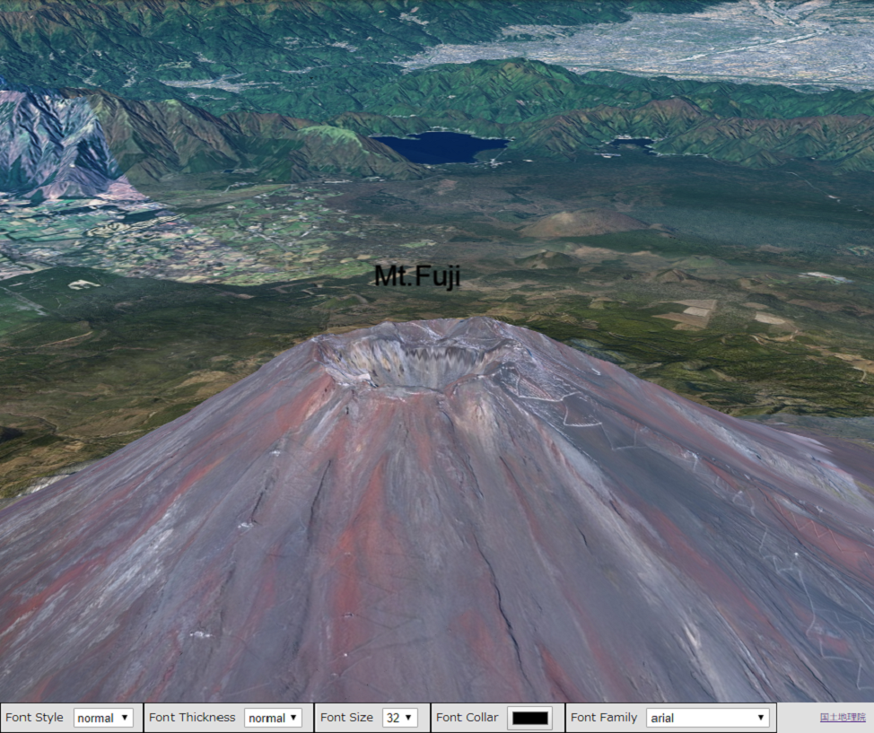
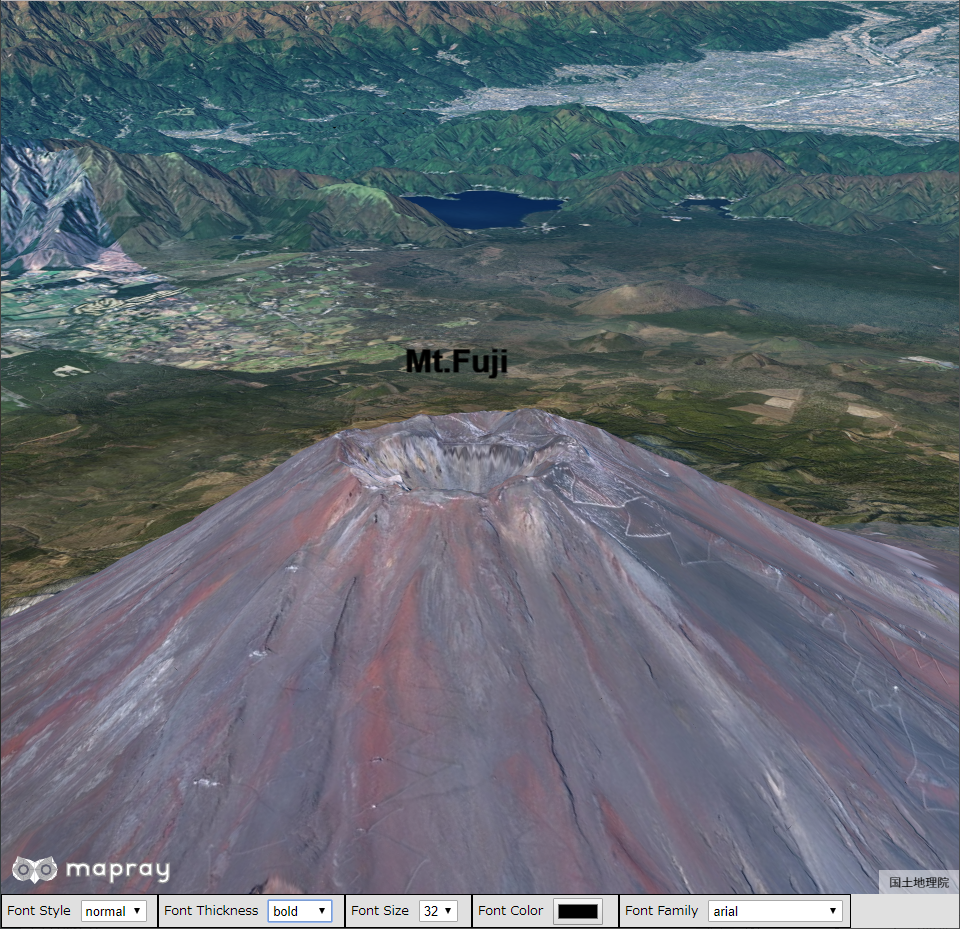
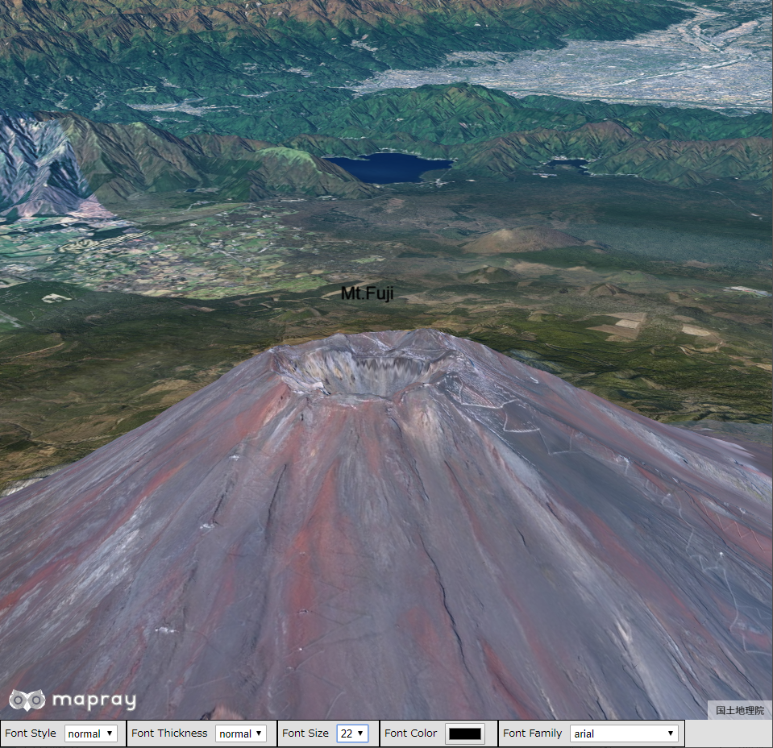
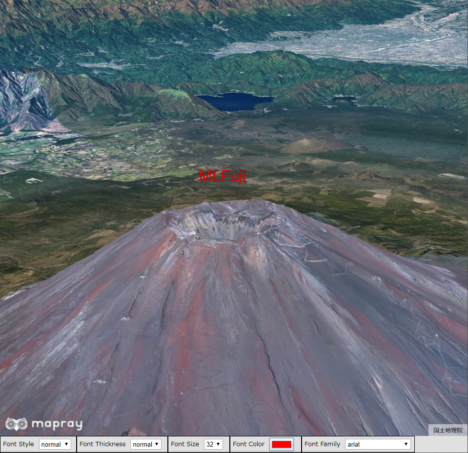

## 文字のフォーマットの変更

文字のフォーマットを変更する方法を説明します。

### サンプルコード
文字のフォーマットを変更する**ChangeFontFormat.html**及び**ChangeFontFormat.js**のサンプルコードです。
このサンプルコードでは、ユーザインタフェースを介して、富士山頂上付近の「Mt.Fuji」の文字フォーマットを変更します。変更できる文字フォーマットはスタイル、太さ、大きさ、色、フォントファミリーです。スタイルは通常、イタリック、斜体に、太さは通常、太いに、大きさは9、14、18、22、26、32に、フォントファミリーはarial、Courier、Times New Roman、vardanaにそれぞれ変更できます。また、色はカラーピッカーから変更できます。

#### ChangeFontFormat.html

```HTML
<!DOCTYPE html>
<html>
    <head>
        <meta charset="utf-8">
        <title>ChangeFontFormatSample</title>
        <script src="https://resource.mapray.com/mapray-js/v0.7.1/mapray.js"></script>
        <link rel="stylesheet" href="https://resource.mapray.com/styles/v1/mapray.css">
        <script src="ChangeFontFormat.js" charset="utf-8"></script>
        <style>
            html, body {
                height: 100%;
                margin: 0;
                background-color:#E0E0E0;
            }

            select{
                height:22px;
                vertical-align:middle;
                font-size:13px;
                margin-left:10px;
            }

            p {
                margin-left:5px;
                font-size:13px;
            }

            input{
                margin-left:10px;
            }

            div#mapray-container {
                display: flex;
                position: relative;
                height: calc(100% - 34px);
            }

            div#FontStyleBox{
                display: flex;
                background-color:#E0E0E0;
                height: 32px;
                width: 155px;
                float:left;
                border:inset 1px #000000;
                align-items:center;
            }

            div#FontWeightBox{
                display: flex;
                background-color:#E0E0E0;
                height: 32px;
                width: 185px;
                float:left;
                border:inset 1px #000000;
                align-items:center;
            }


            div#FontSizeBox{
                display: flex;
                background-color:#E0E0E0;
                height: 32px;
                width: 125px;
                float:left;
                border:inset 1px #000000;
                align-items:center;
            }

            div#FontColorBox{
                display: flex;
                background-color:#E0E0E0;
                height: 32px;
                width: 145px;
                float:left;
                border:inset 1px #000000;
                align-items:center;
            }

            div#FontFamilyBox{
                display: flex;
                background-color:#E0E0E0;
                height: 32px;
                width: 230px;
                float:left;
                border:inset 1px #000000;
                align-items:center;
            }
        </style>
    </head>

    <body onload="CreateChangeFontStyleInstance('mapray-container');">
        <div id="mapray-container"></div>

        <div id="FontStyleBox">
            <p>Font Style</p>
            <select name="FontStylePullDown" id="FontStylePullDown" onchange="FontStyleValueChanged()">
                <option value="normal">normal</option>
                <option value="italic">italic</option>
                <option value="oblique">oblique</option>
            </select>
        </div>

        <div id="FontWeightBox">
            <p>Font Thickness</p>
            <select name="FontWeightPullDown" id="FontWeightPullDown" onchange="FontWeightValueChanged()">
                <option value="normal">normal</option>
                <option value="bold">bold</option>
            </select>
        </div>

        <div id="FontSizeBox">
            <p>Font Size</p>
            <select name="FontSizePullDown" id="FontSizePullDown" onchange="FontSizeValueChanged()">
                <option value=32>32</option>
                <option value=26>26</option>
                <option value=22>22</option>
                <option value=18>18</option>
                <option value=14>14</option>
                <option value=9>9</option>
            </select>
        </div>

        <div id="FontColorBox">
            <p>Font Color</p>
            <input type="color" id="FontColorPallet" name="FontColorPallet" value="#000000" onchange="FontColorValueChanged()">
        </div>

        <div id="FontFamilyBox">
            <p>Font Family</p>
            <select name="FontFamilyPullDown" id="FontFamilyPullDown" onchange="FontFamilyValueChanged()">
                <option value="arial" style="font-family:'arial'">arial</option>
                <option value="Courier" style="font-family:'Courier'">Courier</option>
                <option value="Times New Roman" style="font-family:Times New Roman">Times New Roman</option>
                <option value="vardana" style="font-family:vardana">vardana</option>
            </select>
        </div>
    </body>
</html>
```

#### ChangeFontFormat.js
```JavaScript
var change_Font_Format;

class ChangeFontFormat {

    constructor(container) {
        // Access Tokenを設定
        var accessToken = "<your access token here>";

        // Viewerを作成する
        this.viewer = new mapray.Viewer(
            container, {
                image_provider: this.createImageProvider(),
                dem_provider: new mapray.CloudDemProvider(accessToken)
            }
        );

        this.SetCamera();

        this.WriteUIFormatStr();
    }

    WriteUIFormatStr() {
        // 文字のエンティティを作成
        var entity = new mapray.TextEntity(this.viewer.scene);

        // 座標は富士山山頂付近
        var font_position = { longitude: 138.730647, latitude: 35.362773, height: 4000 };

        // GeoPointクラスを生成して、テキストを追加
        var font_geopoint = new mapray.GeoPoint( font_position.longitude, font_position.latitude, font_position.height );
        entity.addText( "Mt.Fuji", font_geopoint);

        // プルダウンの値取得
        var font_Style_Value = document.getElementById("FontStylePullDown").value;
        var font_Weight_Value = document.getElementById("FontWeightPullDown").value;
        var font_Size_Value = parseFloat(document.getElementById("FontSizePullDown").value);
        var font_ColorChord = document.getElementById("FontColorPallet").value;
        var font_Family_Value = document.getElementById("FontFamilyPullDown").value;

        // ColorChordをRBGに変換
        var RGBArray = this.convertColorChordToRGB(font_ColorChord);

        // プルダウンの値を設定
        entity.setFontStyle(font_Style_Value);
        entity.setFontWeight(font_Weight_Value);
        entity.setFontSize(font_Size_Value);
        entity.setColor(RGBArray);
        entity.setFontFamily(font_Family_Value);

        // エンティティをシーンに追加
        this.viewer.scene.addEntity(entity);
    }

    // 画像プロバイダを生成
    createImageProvider() {
        // 国土地理院提供の汎用的な地図タイルを設定
        return new mapray.StandardImageProvider("https://cyberjapandata.gsi.go.jp/xyz/seamlessphoto/", ".jpg", 256, 2, 18);
    }

    SetCamera() {
        // カメラ位置の設定

        // 球面座標系（経度、緯度、高度）で視点を設定。富士山より５kmほど南の場所
        var home_pos = { longitude: 138.736758, latitude: 35.359326, height: 4000 };

        // 球面座標から地心直交座標へ変換
        var home_view_geoPoint = new mapray.GeoPoint( home_pos.longitude, home_pos.latitude, home_pos.height );
        var home_view_to_gocs = home_view_geoPoint.getMlocsToGocsMatrix( mapray.GeoMath.createMatrix() );

        // 視線方向を定義
        var cam_pos = mapray.GeoMath.createVector3([3000, -2600, 1500]);
        var cam_end_pos = mapray.GeoMath.createVector3([0, 0, 0]);
        var cam_up = mapray.GeoMath.createVector3([0, 0, 1]);

        // ビュー変換行列を作成
        var view_to_home = mapray.GeoMath.createMatrix();
        mapray.GeoMath.lookat_matrix(cam_pos, cam_end_pos, cam_up, view_to_home);

        // カメラの位置と視線方向からカメラの姿勢を変更
        var view_to_gocs = this.viewer.camera.view_to_gocs;
        mapray.GeoMath.mul_AA(home_view_to_gocs, view_to_home, view_to_gocs);

        // カメラのnear、farの設定
        this.viewer.camera.near = 30;
        this.viewer.camera.far = 500000;
    }

    ChangeFontStyle() {
        // プルダウンの値取得
        var font_Style_Value = document.getElementById("FontStylePullDown").value;

        // プルダウンの値を設定
        var textEntity = this.viewer.scene.getEntity(0);
        textEntity.setFontStyle(font_Style_Value);
    }

    ChangeFontWeight() {
        // プルダウンの値取得
        var font_Weight_Value = document.getElementById("FontWeightPullDown").value;

        // プルダウンの値を設定
        var textEntity = this.viewer.scene.getEntity(0);
        textEntity.setFontWeight(font_Weight_Value);
    }

    ChangeFontSize() {
        // プルダウンの値取得
        var font_Size_Value = parseFloat(document.getElementById("FontSizePullDown").value);

        // プルダウンの値を設定
        var textEntity = this.viewer.scene.getEntity(0);
        textEntity.setFontSize(font_Size_Value);
    }

    ChangeFontColor() {
        // プルダウンの値取得
        var font_ColorChord = document.getElementById("FontColorPallet").value;

        // ColorChordをRBGに変換
        var RGBArray = this.convertColorChordToRGB(font_ColorChord);

        // プルダウンの値を設定
        var textEntity = this.viewer.scene.getEntity(0);
        textEntity.setColor(RGBArray);
    }

    ChangeFontFamily() {
        // プルダウンの値取得
        var font_Family_Value = document.getElementById("FontFamilyPullDown").value;

        // プルダウンの値を設定
        var textEntity = this.viewer.scene.getEntity(0);
        textEntity.setFontFamily(font_Family_Value);
    }

    convertColorChordToRGB(colorChord) {
        var colorChordChars = colorChord.split('')

        var r = parseInt(colorChordChars[1].toString() + colorChordChars[2].toString(), 16) / 255;
        var g = parseInt(colorChordChars[3].toString() + colorChordChars[4].toString(), 16) / 255;
        var b = parseInt(colorChordChars[5].toString() + colorChordChars[6].toString(), 16) / 255;

        return [r,g,b];
    }
}

function CreateChangeFontStyleInstance(container) {
    change_Font_Format = new ChangeFontFormat(container);
}

function FontStyleValueChanged() {
    change_Font_Format.ChangeFontStyle();
}

function FontWeightValueChanged() {
    change_Font_Format.ChangeFontWeight();
}

function FontSizeValueChanged() {
    change_Font_Format.ChangeFontSize();
}

function FontColorValueChanged() {
    change_Font_Format.ChangeFontColor();
}

function FontFamilyValueChanged() {
    change_Font_Format.ChangeFontFamily();
}
```

### htmlのサンプルコードの詳細
htmlのサンプルコードの詳細を以下で解説します。

#### htmlの文字コード設定
4行目でhtmlの文字コードを設定します。このサンプルコードでは、utf-8を設定します。

```HTML
<meta charset="utf-8">
```

#### タイトルの設定
5行目でタイトルの設定をします。このサンプルコードでは、ChangeFontFormatSampleを設定します。

```HTML
<title>ChangeFontFormatSample</title>
```

#### JavaScriptファイルのパス設定
6～8行目で参照するJavaScript及びスタイルシートのパスを設定します。このサンプルコードでは、maprayのJavaScriptファイル、スタイルシート、文字のフォーマットを変えるJavaScriptファイル（**ChangeFontFormat.js**）を設定します。文字のフォーマットを変えるJavaScriptファイルの文字コードはutf-8に設定します。

```HTML
<script src="https://resource.mapray.com/mapray-js/v0.7.1/mapray.js"></script>
<link rel="stylesheet" href="https://resource.mapray.com/styles/v1/mapray.css">
<script src="ChangeFontFormat.js" charset="utf-8"></script>
```

#### スタイルの設定
9～88行目で表示する要素のスタイルを設定します。このサンプルコードでは、下記のスタイルを設定します。
- html
- body
- select
- p
- input
- div#mapray-container（地図表示部分）
- div#FontStyleBox（文字のスタイル変更コンボボックス表示部分）
- div#FontWeightBox（文字の太さ変更コンボボックス表示部分）
- div#FontSizeBox（文字の大きさ変更コンボボックス表示部分）
- div#FontColorBox（文字の色変更ボタン表示部分）
- div#FontFamilyBox（文字のフォントファミリー変更コンボボックス表示部分）

```HTML
<style>
    html, body {
        height: 100%;
        margin: 0;
        background-color:#E0E0E0;
    }

    select{
        height:22px;
        vertical-align:middle;
        font-size:13px;
        margin-left:10px;
    }

    p {
        margin-left:5px;
        font-size:13px;
    }

    input{
        margin-left:10px;
    }

    div#mapray-container {
        display: flex;
        position: relative;
        height: calc(100% - 34px);
    }

    div#FontStyleBox{
        display: flex;
        background-color:#E0E0E0;
        height: 32px;
        width: 155px;
        float:left;
        border:inset 1px #000000;
        align-items:center;
    }

    div#FontWeightBox{
        display: flex;
        background-color:#E0E0E0;
        height: 32px;
        width: 185px;
        float:left;
        border:inset 1px #000000;
        align-items:center;
    }


    div#FontSizeBox{
        display: flex;
        background-color:#E0E0E0;
        height: 32px;
        width: 125px;
        float:left;
        border:inset 1px #000000;
        align-items:center;
    }

    div#FontColorBox{
        display: flex;
        background-color:#E0E0E0;
        height: 32px;
        width: 145px;
        float:left;
        border:inset 1px #000000;
        align-items:center;
    }

    div#FontFamilyBox{
        display: flex;
        background-color:#E0E0E0;
        height: 32px;
        width: 230px;
        float:left;
        border:inset 1px #000000;
        align-items:center;
    }
</style>
```

#### loadイベントの設定
画面を表示するときに、文字フォーマット変更クラスを生成します。そのため、90行目でページ読み込み時に、文字のフォーマットを変更するクラスのインスタンスを生成する関数（**CreateChangeFontStyleInstance**）を呼ぶように設定します。
文字のフォーマットを変更するクラスのインスタンスを生成する関数は、JavaScriptのサンプルコードの詳細で説明します。

```HTML
<body onload="CreateChangeFontStyleInstance('mapray-container');">
```

#### 地図表示部分の指定
91行目で地図表示部分のブロックを記述します。
詳細はヘルプページ『**緯度経度によるカメラ位置の指定**』を参照してください。

```HTML
<div id="mapray-container"></div>
```

#### 文字のスタイル変更のUI
93～100行目で文字のスタイル変更コンボボックス表示部分のブロックを記述します。このブロックの中には、文字のスタイルを変更するコンボボックスを用意します。このサンプルコードでは、normal、italic、obliqueを設定します。
文字のスタイルを変更するコンボボックスが変更された時のイベント（onchange）に、文字のスタイルのコンボボックス変更時に呼び出す関数（**FontStyleValueChanged**）を設定します。
文字のスタイルのコンボボックス変更時に呼び出す関数は、JavaScriptのサンプルコードの詳細で説明します。

```HTML
<div id="FontStyleBox">
    <p>Font Style</p>
    <select name="FontStylePullDown" id="FontStylePullDown" onchange="FontStyleValueChanged()">
        <option value="normal">normal</option>
        <option value="italic">italic</option>
        <option value="oblique">oblique</option>
    </select>
</div>
```

#### 文字の太さ変更のUI
102～108行目で文字の太さ変更コンボボックス表示部分のブロックを記述します。このブロックの中には、文字の太さを変更するコンボボックスを用意します。このサンプルコードでは、normal、boldを設定します。
文字の太さを変更するコンボボックスが変更された時のイベント（onchange）に、文字の太さのコンボボックス変更時に呼び出す関数（**FontWeightValueChanged**）を設定します。
文字の太さのコンボボックス変更時に呼び出す関数はJavaScriptのサンプルコードの詳細で説明します。

```HTML
<div id="FontWeightBox">
    <p>Font Thickness</p>
    <select name="FontWeightPullDown" id="FontWeightPullDown" onchange="FontWeightValueChanged()">
        <option value="normal">normal</option>
        <option value="bold">bold</option>
    </select>
</div>
```

#### 文字の大きさ変更のUI
110～120行目で文字の大きさ変更コンボボックス表示部分のブロックを記述します。このブロックの中には、文字の大きさを変更するコンボボックスを用意します。このサンプルコードでは、9、14、18、22、26、32を設定します。
文字の大きさを変更するコンボボックスが変更された時のイベント（onchange）に、文字の大きさのコンボボックス変更時に呼び出す関数（**FontSizeValueChanged**）を設定します。
文字の大きさのコンボボックス変更時に呼び出す関数はJavaScriptのサンプルコードの詳細で説明します。

```HTML
<div id="FontSizeBox">
    <p>Font Size</p>
    <select name="FontSizePullDown" id="FontSizePullDown" onchange="FontSizeValueChanged()">
        <option value=32>32</option>
        <option value=26>26</option>
        <option value=22>22</option>
        <option value=18>18</option>
        <option value=14>14</option>
        <option value=9>9</option>
    </select>
</div>
```

#### 文字の色変更のUI
122～125行目で文字の色変更コンボボックス表示部分のブロックを記述します。このブロックの中には、文字の色変更ボタンを用意します。
文字色変更ボタンには、カラーピッカーの色が変更された時のイベント（onchange）に、文字の色変更時に呼び出す関数（**FontColorValueChanged**）を設定します。
文字の色変更時に呼び出す関数はJavaScriptのサンプルコードの詳細で説明します。

```HTML
<div id="FontColorBox">
    <p>Font Color</p>
    <input type="color" id="FontColorPallet" name="FontColorPallet" value="#000000" onchange="FontColorValueChanged()">
</div>
```

#### 文字のフォントファミリー変更のUI
127～135行目で文字のフォントファミリー変更コンボボックス表示部分のブロックを記述します。このブロックの中には、文字のフォントファミリーを変更するコンボボックスを用意します。このサンプルコードでは、arial、Courier、Times New Roman、vardanaを設定します。
文字のフォントファミリーを変更するコンボボックスが変更された時のイベント（onchange）に、文字のフォントファミリーのコンボボックス変更時に呼び出す関数（**FontFamilyValueChanged**）を設定します。
文字のフォントファミリーのコンボボックス変更時に呼び出す関数はJavaScriptのサンプルコードの詳細で説明します。

```HTML
<div id="FontFamilyBox">
    <p>Font Family</p>
    <select name="FontFamilyPullDown" id="FontFamilyPullDown" onchange="FontFamilyValueChanged()">
        <option value="arial" style="font-family:'arial'">arial</option>
        <option value="Courier" style="font-family:'Courier'">Courier</option>
        <option value="Times New Roman" style="font-family:Times New Roman">Times New Roman</option>
        <option value="vardana" style="font-family:vardana">vardana</option>
    </select>
</div>
```

### JavaScriptのサンプルコードの詳細
JavaScriptのサンプルコードの詳細を以下で解説します。

#### クラスとグローバル変数の説明
3～145行目で文字のフォーマットを変更するクラスを定義します。クラス内の各メソッドの詳細は以降で解説します。
また、1行目で文字のフォーマットを変更するクラスのグルーバル変数を定義します。

```JavaScript
var change_Font_Format;

class ChangeFontFormat {

  //中略

}
```

#### コンストラクタ
5～20行目が文字のフォーマットを変更するクラスのコンストラクタです。
引数として渡されるブロックのidに対して、mapray.Viewerを作成し、カメラの位置・向きの設定、文字の作成の順にメソッド呼び出します。mapray.Viewerのベース地図の画像プロバイダは、画像プロバイダの生成メソッドで取得した画像プロバイダを設定します。
mapray.Viewerの作成の詳細は、ヘルプページ『**緯度経度によるカメラ位置の指定**』を参照してください。

```JavaScript
constructor(container) {
    // Access Tokenを設定
    var accessToken = "<your access token here>";

    // Viewerを作成する
    this.viewer = new mapray.Viewer(
        container, {
            image_provider: this.createImageProvider(),
            dem_provider: new mapray.CloudDemProvider(accessToken)
        }
    );

    this.SetCamera();

    this.WriteUIFormatStr();
}
```

#### 文字の作成
22～52行目が文字の作成メソッドです。画面で設定した文字フォーマットで富士山山頂付近に「Mt.Fuji」という文字を表示します。
文字のスタイルは、34行目で文字のスタイルを変更するコンボボックスから値を取得し、それを44行目の文字のスタイルを設定する関数（TextEntityのsetFontStyle）を利用して設定します。
文字の太さは、35行目で文字の太さを変更するコンボボックスから値を取得し、それを45行目の文字の太さを設定する関数（TextEntityのsetFontWeight）を利用して設定します。
文字の大きさは、36行目で文字の大きさを変更するコンボボックスから値を取得し、それを46行目の文字の大きさを設定する関数（TextEntityのsetFontSize）を利用して設定します。
文字の色は、37行目でカラーピッカーから値を取得し、41行目でRGB配列を作成した後に、それを47行目の文字の色を設定する関数（TextEntityのsetColor）を利用して設定します。なお、カラーピッカーの値からRGB配列を作成するメソッドの詳細は後述します。
文字のフォントファミリーは、38行目で文字のフォントファミリーを変更するコンボボックスから値を取得し、それを48行目の文字のフォントファミリーを設定する関数（TextEntityのsetFontFamily）を利用して設定します。
なお、24～31行目の文字を作成する部分では、初期フォーマットの指定を行わず、表示する文字と位置のみを指定します。文字の表示方法の詳細は、ヘルプページ『**文字の表示（addTextを使った表示）**』を参照してください。

```JavaScript
WriteUIFormatStr() {
    // 文字のエンティティを作成
    var entity = new mapray.TextEntity(this.viewer.scene);

    // 座標は富士山山頂付近
    var font_position = { longitude: 138.730647, latitude: 35.362773, height: 4000 };

    // GeoPointクラスを生成して、テキストを追加
    var font_geopoint = new mapray.GeoPoint( font_position.longitude, font_position.latitude, font_position.height );
    entity.addText( "Mt.Fuji", font_geopoint);

    // プルダウンの値取得
    var font_Style_Value = document.getElementById("FontStylePullDown").value;
    var font_Weight_Value = document.getElementById("FontWeightPullDown").value;
    var font_Size_Value = parseFloat(document.getElementById("FontSizePullDown").value);
    var font_ColorChord = document.getElementById("FontColorPallet").value;
    var font_Family_Value = document.getElementById("FontFamilyPullDown").value;

    // ColorChordをRBGに変換
    var RGBArray = this.convertColorChordToRGB(font_ColorChord);

    // プルダウンの値を設定
    entity.setFontStyle(font_Style_Value);
    entity.setFontWeight(font_Weight_Value);
    entity.setFontSize(font_Size_Value);
    entity.setColor(RGBArray);
    entity.setFontFamily(font_Family_Value);

    // エンティティをシーンに追加
    this.viewer.scene.addEntity(entity);
}
```

#### 画像プロバイダの生成
55～58行目が画像プロバイダの生成メソッドです。生成した画像プロバイダを返します。
画像プロバイダの生成の詳細は、ヘルプページ『**緯度経度によるカメラ位置の指定**』を参照してください。

```JavaScript
// 画像プロバイダを生成
createImageProvider() {
    // 国土地理院提供の汎用的な地図タイルを設定
    return new mapray.StandardImageProvider("https://cyberjapandata.gsi.go.jp/xyz/seamlessphoto/", ".jpg", 256, 2, 18);
}
```

#### カメラの位置・向きの設定
60～86行目がカメラの位置・向きの設定メソッドです。
カメラの位置・向きの設定は、ヘルプページ『**緯度経度によるカメラ位置の指定**』を参照してください。

```JavaScript
SetCamera() {
    // カメラ位置の設定

    // 球面座標系（経度、緯度、高度）で視点を設定。富士山より５kmほど南の場所
    var home_pos = { longitude: 138.736758, latitude: 35.359326, height: 4000 };

    // 球面座標から地心直交座標へ変換
    var home_view_geoPoint = new mapray.GeoPoint( home_pos.longitude, home_pos.latitude, home_pos.height );
    var home_view_to_gocs = home_view_geoPoint.getMlocsToGocsMatrix( mapray.GeoMath.createMatrix() );

    // 視線方向を定義
    var cam_pos = mapray.GeoMath.createVector3([3000, -2600, 1500]);
    var cam_end_pos = mapray.GeoMath.createVector3([0, 0, 0]);
    var cam_up = mapray.GeoMath.createVector3([0, 0, 1]);

    // ビュー変換行列を作成
    var view_to_home = mapray.GeoMath.createMatrix();
    mapray.GeoMath.lookat_matrix(cam_pos, cam_end_pos, cam_up, view_to_home);

    // カメラの位置と視線方向からカメラの姿勢を変更
    var view_to_gocs = this.viewer.camera.view_to_gocs;
    mapray.GeoMath.mul_AA(home_view_to_gocs, view_to_home, view_to_gocs);

    // カメラのnear、farの設定
    this.viewer.camera.near = 30;
    this.viewer.camera.far = 500000;
}
```

#### 文字のスタイル変更
88～95行目が文字のスタイル変更メソッドです。90行目で文字のスタイルを変更するコンボボックスから値を取得します。そして、93行目のviewer.sceneのgetEntity関数で表示している文字のエンティティを取得し、94行目で取得した値を指定することで、文字のスタイルを変更します。このサンプルコードでは、文字のエンティティのインデックスは0となるため、getEntity関数には0を指定します。

```JavaScript
ChangeFontStyle() {
    // プルダウンの値取得
    var font_Style_Value = document.getElementById("FontStylePullDown").value;

    // プルダウンの値を設定
    var textEntity = this.viewer.scene.getEntity(0);
    textEntity.setFontStyle(font_Style_Value);
}
```

#### 文字の太さ変更
97～104行目が文字の太さ変更メソッドです。99行目で文字の太さを変更するコンボボックスから値を取得します。そして、102行目のviewer.sceneのgetEntity関数で表示している文字のエンティティを取得し、103行目で取得した値を指定することで、文字の太さを変更します。このサンプルコードでは、文字のエンティティのインデックスは0となるため、getEntity関数には0を指定します。

```JavaScript
ChangeFontWeight() {
    // プルダウンの値取得
    var font_Weight_Value = document.getElementById("FontWeightPullDown").value;

    // プルダウンの値を設定
    var textEntity = this.viewer.scene.getEntity(0);
    textEntity.setFontWeight(font_Weight_Value);
}
```

#### 文字の大きさ変更
106～113行目が文字の大きさ変更メソッドです。108行目で文字の大きさを変更するコンボボックスから値を取得します。そして、111行目のviewer.sceneのgetEntity関数で表示している文字のエンティティを取得し、112行目で取得した値を指定することで、文字の太さを変更します。このサンプルコードでは、文字のエンティティのインデックスは0となるため、getEntity関数には0を指定します。

```JavaScript
ChangeFontSize() {
    // プルダウンの値取得
    var font_Size_Value = parseFloat(document.getElementById("FontSizePullDown").value);

    // プルダウンの値を設定
    var textEntity = this.viewer.scene.getEntity(0);
    textEntity.setFontSize(font_Size_Value);
}
```

#### 文字の色変更
115～125行目が文字の色変更メソッドです。117行目でカラーピッカーから値を取得し、120行目でカラーピッカーの値をRGBの配列に変換します。そして、123行目のviewer.sceneのgetEntity関数で表示している文字のエンティティを取得し、124行目でその値を指定することで、文字の色を変更します。このサンプルコードでは、文字のエンティティのインデックスは0となるため、getEntity関数には0を指定します。

```JavaScript
ChangeFontColor() {
    // プルダウンの値取得
    var font_ColorChord = document.getElementById("FontColorPallet").value;

    // ColorChordをRBGに変換
    var RGBArray = this.convertColorChordToRGB(font_ColorChord);

    // プルダウンの値を設定
    var textEntity = this.viewer.scene.getEntity(0);
    textEntity.setColor(RGBArray);
}
```

#### 文字のファミリー変更
127～134行目が文字のファミリー変更メソッドです。129行目で文字のフォントファミリーを変更するコンボボックスから値を取得します。そして、132行目のviewer.sceneのgetEntity関数で表示している文字のエンティティを取得し、133行目で取得した値を指定することで、文字のフォントファミリーを変更します。このサンプルコードでは、文字のエンティティのインデックスは0となるため、getEntity関数には0を指定します。

```JavaScript
ChangeFontFamily() {
    // プルダウンの値取得
    var font_Family_Value = document.getElementById("FontFamilyPullDown").value;

    // プルダウンの値を設定
    var textEntity = this.viewer.scene.getEntity(0);
    textEntity.setFontFamily(font_Family_Value);
}
```

#### 色情報の変換
136～144行目が色情報の変換メソッドです。引数の16進数表記の色情報（"#rrggbb"）から赤、緑、青それぞれの色情報を0～1の範囲に正規化し、赤、緑、青の順に配列に格納し返します。
```JavaScript
convertColorChordToRGB(colorChord) {
    var colorChordChars = colorChord.split('')

    var r = parseInt(colorChordChars[1].toString() + colorChordChars[2].toString(), 16) / 255;
    var g = parseInt(colorChordChars[3].toString() + colorChordChars[4].toString(), 16) / 255;
    var b = parseInt(colorChordChars[5].toString() + colorChordChars[6].toString(), 16) / 255;

    return [r,g,b];
}
```

#### 文字のフォーマット変更クラスのインスタンス生成
147～149行目の関数は、引数として渡されるブロックのidを利用して、文字フォーマット変更クラスのインスタンスを生成します。

```JavaScript
function CreateChangeFontStyleInstance(container) {
    change_Font_Format = new ChangeFontFormat(container);
}
```

#### 文字のスタイル変更時のイベント
151～153行目の関数は、文字のスタイル変更時に呼ばれ、文字フォーマット変更クラスの文字のスタイル変更メソッドを呼び出します。

```JavaScript
function FontStyleValueChanged() {
    change_Font_Format.ChangeFontStyle();
}
```

#### 文字の太さ変更時のイベント
155～157行目の関数は、文字の太さ変更時に呼ばれ、文字フォーマット変更クラスの文字の太さ変更メソッドを呼び出します。

```JavaScript
function FontWeightValueChanged() {
    change_Font_Format.ChangeFontWeight();
}
```

#### 文字の大きさ変更時のイベント
159～161行目の関数は、文字の大きさ変更時に呼ばれ、文字フォーマット変更クラスの文字の大きさ変更メソッドを呼び出します。

```JavaScript
function FontSizeValueChanged() {
    change_Font_Format.ChangeFontSize();
}
```

#### 文字の色変更メソッドの呼び出し
163～165行目の関数は、文字の色変更時に呼ばれ、文字フォーマット変更クラスの文字の色変更メソッドを呼び出します。

```JavaScript
function FontColorValueChanged() {
    change_Font_Format.ChangeFontColor();
}
```

#### 文字のフォントファミリー変更メソッドの呼び出し
167～169行目の関数は、文字のフォントファミリー変更時に呼ばれ、文字フォーマット変更クラスの文字のフォントファミリー変更メソッドを呼び出します。

```JavaScript
function FontFamilyValueChanged() {
    change_Font_Format.ChangeFontFamily();
}
```

### 出力イメージ
このサンプルコードで初期状態（スタイル：normal、太さ：normal、大きさ：32、色：黒、フォントファミリー：arial）の出力イメージは下図のようになります。


初期状態から、文字のスタイルをitalicにした時の出力イメージは下図のようになります。


初期状態から、文字の太さをboldにした時の出力イメージは下図のようになります。


初期状態から、文字の大きさを22にした時の出力イメージは下図のようになります。


初期状態から、文字の色を赤にした時の出力イメージは下図のようになります。


初期状態から、文字のフォントファミリーをCourierにした時の出力イメージは下図のようになります。

