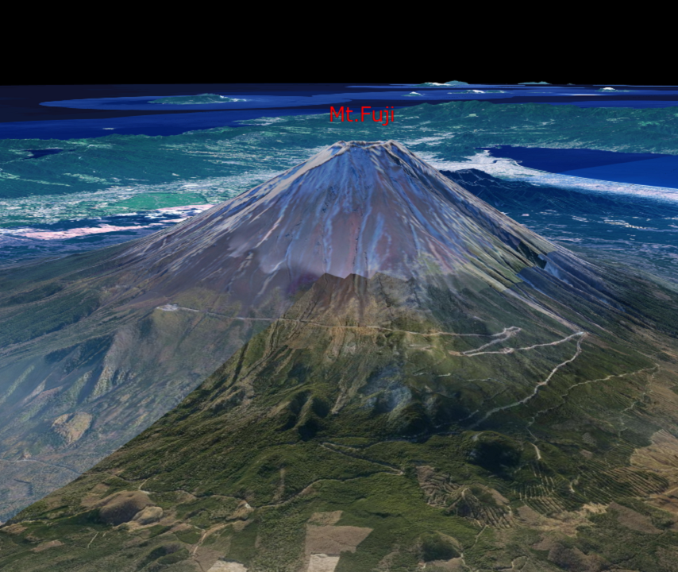

## 文字の表示（addTextを使った表示）

mapray.TextEntityのaddTextを使って文字を表示する方法を説明します。

### サンプルコード
mapray.TextEntityのaddTextを使って文字を表示する**WriteStringWithAddText.html**のサンプルコードです。
このサンプルコードでは、富士山の頂上付近に「Mt.Fuji」を表示しています。

#### WriteStringWithAddText.html

```HTML
<!DOCTYPE html>
<html>
    <head>
        <meta charset="UTF-8">
        <title>WriteStringWithAddTextSample</title>
        <script src="https://resource.mapray.com/mapray-js/v0.8.2/mapray.min.js"></script>
        <link rel="stylesheet" href="https://resource.mapray.com/styles/v1/mapray.css">
        <style>
            html, body {
                height: 100%;
                margin: 0;
            }

            div#mapray-container {
                display: flex;
                position: relative;
                height: 100%;
            }
        </style>
    </head>

    <body>
        <div id="mapray-container"></div>
    </body>
</html>

<script>
    // Access Tokenを設定
    var accessToken = "<your access token here>";

    // Viewerを作成する
    viewer = new mapray.Viewer(
        "mapray-container", {
            image_provider: new mapray.StandardImageProvider("https://cyberjapandata.gsi.go.jp/xyz/seamlessphoto/", ".jpg", 256, 2, 18),
            dem_provider: new mapray.CloudDemProvider(accessToken)
        }
    );

    // カメラ位置の設定

    // 球面座標系（経度、緯度、高度）で視点を設定。座標は富士山から10kmほど北西の場所
    var home_pos = { longitude: 138.678572, latitude: 35.434067, height: 4000 };

    // 球面座標から地心直交座標へ変換
    var home_view_geoPoint = new mapray.GeoPoint( home_pos.longitude, home_pos.latitude, home_pos.height );
    var home_view_to_gocs = home_view_geoPoint.getMlocsToGocsMatrix( mapray.GeoMath.createMatrix() );

    // 視線方向を定義
    var cam_pos = mapray.GeoMath.createVector3([-2300, 3600, 1000]);
    var cam_end_pos = mapray.GeoMath.createVector3([0, 0, 0]);
    var cam_up = mapray.GeoMath.createVector3([0, 0, 1]);

    // ビュー変換行列を作成
    var view_to_home = mapray.GeoMath.createMatrix();
    mapray.GeoMath.lookat_matrix(cam_pos, cam_end_pos, cam_up, view_to_home);

    // カメラの位置と視線方向からカメラの姿勢を変更
    var view_to_gocs = viewer.camera.view_to_gocs;
    mapray.GeoMath.mul_AA(home_view_to_gocs, view_to_home, view_to_gocs);

    // カメラのnear、farの設定
    viewer.camera.near = 30;
    viewer.camera.far = 500000;

    // 文字のエンティティを作成
    var entity = new mapray.TextEntity(viewer.scene);

    // 座標は富士山山頂付近
    var font_position = { longitude: 138.730647, latitude: 35.362773, height: 4000 };

    // GeoPointクラスを生成して、テキストを追加
    var font_geopoint = new mapray.GeoPoint(font_position.longitude, font_position.latitude, font_position.height);
    entity.addText("Mt.Fuji", font_geopoint, { color: [1, 0, 0], font_size: 25 } );

    // エンティティをシーンに追加
    viewer.scene.addEntity(entity);
</script>

```

このサンプルコードの詳細を以下で解説します。

#### htmlの記述
1～25行目でhtmlがhtmlの定義です。ヘルプページ『**緯度経度によるカメラ位置の指定**』で示したhtmlファイルからタイトルのみを変更します。
詳細はヘルプページ『**緯度経度によるカメラ位置の指定**』を参照してください。

```HTML
<!DOCTYPE html>
<html>
    <head>
        <meta charset="UTF-8">
        <title>WriteStringWithAddTextSample</title>
        <script src="https://resource.mapray.com/mapray-js/v0.8.2/mapray.min.js"></script>
        <link rel="stylesheet" href="https://resource.mapray.com/styles/v1/mapray.css">
        <style>
            html, body {
                height: 100%;
                margin: 0;
            }

            div#mapray-container {
                display: flex;
                position: relative;
                height: 100%;
            }
        </style>
    </head>

    <body>
        <div id="mapray-container"></div>
    </body>
</html>
```

#### カメラ位置・向きの設定
29～63行目でMapray.Viewerクラスを作成し、カメラ位置を設定しています。
詳細はヘルプページ『**緯度経度によるカメラ位置の指定**』を参照してください。

```JavaScript
// Access Tokenを設定
var accessToken = "<your access token here>";

// Viewerを作成する
viewer = new mapray.Viewer(
    "mapray-container", {
        image_provider: new mapray.StandardImageProvider("https://cyberjapandata.gsi.go.jp/xyz/seamlessphoto/", ".jpg", 256, 2, 18),
        dem_provider: new mapray.CloudDemProvider(accessToken)
    }
);

// カメラ位置の設定

// 球面座標系（経度、緯度、高度）で視点を設定。座標は富士山から10kmほど北西の場所
var home_pos = { longitude: 138.678572, latitude: 35.434067, height: 4000 };

// 球面座標から地心直交座標へ変換
var home_view_geoPoint = new mapray.GeoPoint( home_pos.longitude, home_pos.latitude, home_pos.height );
var home_view_to_gocs = home_view_geoPoint.getMlocsToGocsMatrix( mapray.GeoMath.createMatrix() );

// 視線方向を定義
var cam_pos = mapray.GeoMath.createVector3([-2300, 3600, 1000]);
var cam_end_pos = mapray.GeoMath.createVector3([0, 0, 0]);
var cam_up = mapray.GeoMath.createVector3([0, 0, 1]);

// ビュー変換行列を作成
var view_to_home = mapray.GeoMath.createMatrix();
mapray.GeoMath.lookat_matrix(cam_pos, cam_end_pos, cam_up, view_to_home);

// カメラの位置と視線方向からカメラの姿勢を変更
var view_to_gocs = viewer.camera.view_to_gocs;
mapray.GeoMath.mul_AA(home_view_to_gocs, view_to_home, view_to_gocs);

// カメラのnear、farの設定
viewer.camera.near = 30;
viewer.camera.far = 500000;
```

#### TextEntityの生成
文字を表示するためには、文字情報を管理するクラス（TextEntity）が必要です。そのため、66行目でTextEntityのインスタンスを生成します。コンストラクタの引数には、作成したmapray.Viewerのシーンを指定します。

```JavaScript
//文字のエンティティを作成
var entity = new mapray.TextEntity(viewer.scene);
```

#### 文字の表示座標の定義
69行目で、富士山頂上付近の緯度・経度・高度を定義します。

```JavaScript
// 座標は富士山山頂付近
var font_position = { longitude: 138.730647, latitude: 35.362773, height: 4000 };
```

#### 文字情報の設定
72～73行目でTextEntityに表示する文字の情報をaddText関数で設定します。文字の表示位置は、GeoPointクラスで表現する必要があるため、まず、72行目で、富士山頂上付近の座標からGeoPointクラスを生成します。そして、73行目のaddText関数で、文字、位置、文字のスタイルを設定します。このサンプルコードでは、文字として「Mt.Fuji」、位置として富士山頂上付近の座標、文字のスタイルとして文字の色に赤、文字の大きさに25を設定します。

```JavaScript
// GeoPointクラスを生成して、テキストを追加
var font_geopoint = new mapray.GeoPoint(font_position.longitude, font_position.latitude, font_position.height);
entity.addText("Mt.Fuji", font_geopoint, { color: [1, 0, 0], font_size: 25 } );
```

#### TextEntityの追加
76行目でTextEntityを作成したmapray.Viewerのシーンに追加します。mapray.Viewerのシーンに追加することで文字が表示されます。

```JavaScript
// エンティティをシーンに追加
viewer.scene.addEntity(entity);
```

### 出力イメージ
このサンプルコードの出力イメージは下図のようになります。

