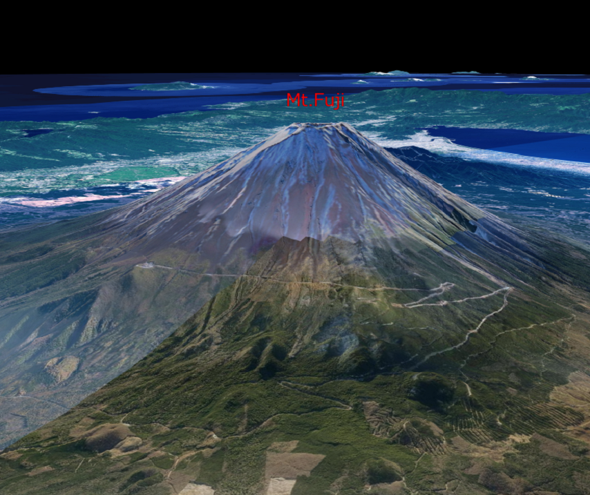

## 文字の表示（SceneLoaderを使った表示）

mapray.SceneLoaderを使って文字を表示する方法を説明します。

### サンプルコード
mapray.SceneLoaderを使って文字を表示する**WriteStringWithSceneLoder.html**のサンプルコードとシーンファイル（**font.json**）です。
このサンプルコードでは、富士山頂上付近に「Mt.Fuji」と表示します。

#### WriteStringWithSceneLoder.html

```HTML
<!DOCTYPE html>
<html>
    <head>
        <meta charset="UTF-8">
        <title>WriteStringWithSceneLoderSample</title>
        <script src="https://resource.mapray.com/mapray-js/v0.8.0/mapray.min.js"></script>
        <link rel="stylesheet" href="https://resource.mapray.com/styles/v1/mapray.css">
        <style>
            html, body {
                height: 100%;
                margin: 0;
            }

            div#mapray-container {
                display: flex;
                position: relative;
                height: 100%;
            }
        </style>
    </head>

    <body>
        <div id="mapray-container"></div>
    </body>
</html>

<script>
    // Access Tokenを設定
    var accessToken = "<your access token here>";

    // Viewerを作成する
    viewer = new mapray.Viewer(
        "mapray-container", {
            image_provider: new mapray.StandardImageProvider("https://cyberjapandata.gsi.go.jp/xyz/seamlessphoto/", ".jpg", 256, 2, 18),
            dem_provider: new mapray.CloudDemProvider(accessToken)
        }
    );

    // カメラ位置の設定

    // 球面座標系（経度、緯度、高度）で視点を設定。座標は富士山から10kmほど北西の場所
    var home_pos = { longitude: 138.678572, latitude: 35.434067, height: 4000 };

    // 球面座標から地心直交座標へ変換
    var home_view_geoPoint = new mapray.GeoPoint( home_pos.longitude, home_pos.latitude, home_pos.height );
    var home_view_to_gocs = home_view_geoPoint.getMlocsToGocsMatrix( mapray.GeoMath.createMatrix() );

    // 視線方向を定義
    var cam_pos = mapray.GeoMath.createVector3([-2300, 3600, 1000]);
    var cam_end_pos = mapray.GeoMath.createVector3([0, 0, 0]);
    var cam_up = mapray.GeoMath.createVector3([0, 0, 1]);

    // ビュー変換行列を作成
    var view_to_home = mapray.GeoMath.createMatrix();
    mapray.GeoMath.lookat_matrix(cam_pos, cam_end_pos, cam_up, view_to_home);

    // カメラの位置と視線方向からカメラの姿勢を変更
    var view_to_gocs = viewer.camera.view_to_gocs;
    mapray.GeoMath.mul_AA(home_view_to_gocs, view_to_home, view_to_gocs);

    // カメラのnear、farの設定
    viewer.camera.near = 30;
    viewer.camera.far = 500000;

    var scene_File_URL = "./data/font.json";

    // シーンを読み込む
    var loader = new mapray.SceneLoader(viewer.scene, scene_File_URL);

    loader.load();
</script>
```

#### シーンファイル（font.json）
```json
{
  "entity_list": [
    {
      "type": "text",
      "entries": [
        { "text": "Mt.Fuji",
          "position": [138.730647, 35.362773, 4000.0],
          "font_size": 25,
          "color": [1, 0, 0] }
      ],
      "font_size": 20
    }
  ]
}
```

### htmlのサンプルコードの詳細
htmlのサンプルコードの詳細を以下で解説します。

#### htmlの記述
1～25行目でhtmlを記述します。ヘルプページ『**緯度経度によるカメラ位置の指定**』で示したhtmlファイルからタイトルのみを変更します。
詳細はヘルプページ『**緯度経度によるカメラ位置の指定**』を参照してください。

```HTML
<!DOCTYPE html>
<html>
    <head>
        <meta charset="UTF-8">
        <title>WriteStringWithSceneLoderSample</title>
        <script src="https://resource.mapray.com/mapray-js/v0.8.0/mapray.min.js"></script>
        <link rel="stylesheet" href="https://resource.mapray.com/styles/v1/mapray.css">
        <style>
            html, body {
                height: 100%;
                margin: 0;
            }

            div#mapray-container {
                display: flex;
                position: relative;
                height: 100%;
            }
        </style>
    </head>

    <body>
        <div id="mapray-container"></div>
    </body>
</html>
```

#### カメラ位置・向きの設定
29～63行目でMapray.Viewerクラスを作成し、カメラ位置・向きを設定します。
詳細はヘルプページ『**緯度経度によるカメラ位置の指定**』を参照してください。

```JavaScript
// Access Tokenを設定
var accessToken = "<your access token here>";

// Viewerを作成する
viewer = new mapray.Viewer(
    "mapray-container", {
        image_provider: new mapray.StandardImageProvider("https://cyberjapandata.gsi.go.jp/xyz/seamlessphoto/", ".jpg", 256, 2, 18),
        dem_provider: new mapray.CloudDemProvider(accessToken)
    }
);

// カメラ位置の設定

// 球面座標系（経度、緯度、高度）で視点を設定。座標は富士山から10kmほど北西の場所
var home_pos = { longitude: 138.678572, latitude: 35.434067, height: 4000 };

// 球面座標から地心直交座標へ変換
var home_view_geoPoint = new mapray.GeoPoint( home_pos.longitude, home_pos.latitude, home_pos.height );
var home_view_to_gocs = home_view_geoPoint.getMlocsToGocsMatrix( mapray.GeoMath.createMatrix() );

// 視線方向を定義
var cam_pos = mapray.GeoMath.createVector3([-2300, 3600, 1000]);
var cam_end_pos = mapray.GeoMath.createVector3([0, 0, 0]);
var cam_up = mapray.GeoMath.createVector3([0, 0, 1]);

// ビュー変換行列を作成
var view_to_home = mapray.GeoMath.createMatrix();
mapray.GeoMath.lookat_matrix(cam_pos, cam_end_pos, cam_up, view_to_home);

// カメラの位置と視線方向からカメラの姿勢を変更
var view_to_gocs = viewer.camera.view_to_gocs;
mapray.GeoMath.mul_AA(home_view_to_gocs, view_to_home, view_to_gocs);

// カメラのnear、farの設定
viewer.camera.near = 30;
viewer.camera.far = 500000;
```

#### シーンファイルの読み込み
68行目でmapray.SceneLoaderのインスタンス生成時にシーンを指定し、70行目で、load関数を呼び出すことで、シーンファイルを読み込みます。
SceneLoaderの引数は、シーンファイルのエンティティを追加するシーン、読み込むシーンファイルのURLの順に指定します。このサンプルコードでは、viewerのシーン、65行目で設定したURLの順に指定します。
読み込むシーンのURLはhttpもしくはhttpsでアクセスできるURLを指定します。

```JavaScript
var scene_File_URL = "./data/font.json";

// シーンを読み込む
var loader = new mapray.SceneLoader(viewer.scene, scene_File_URL);

loader.load();
```

### シーンファイルの詳細
シーンファイルの詳細を以下で解説します。なお、シーンファイルはJSON形式で記述します。

#### エンティティの設定

2行目でentity_listという名称でエンティティを定義し、その中にエンティティの詳細を定義します。4行目のtypeという名称は、エンティティの種類を表し、それにtextを指定することで、文字のエンティティを表現します。

```json
{
  "entity_list": [
    {
      "type": "text",

      中略

    }
  ]
}
```

#### 文字の情報の設定
5～11行目で文字の情報を記述します。文字の情報は、個々の文字情報（entries）、全体のフォントサイズ（font_size）があり、個々の文字情報の中には、表示する文字（text）、位置（position）、フォントサイズ（font_size）、色（color）があります。
このシーンファイルでは、個々の文字情報として、表示する文字にはMt.Fuji、位置には富士山頂上付近の緯度・経度・高度、フォントサイズには25、色に赤を、それぞれ指定します。また、全体のフォントサイズには20を指定します。

```json
"entries": [
  { "text": "Mt.Fuji",
    "position": [138.730647, 35.362773, 4000.0],
    "font_size": 25,
    "color": [1, 0, 0] }
],
"font_size": 20
```

### 出力イメージ
このサンプルコードの出力イメージは下図のようになります。

