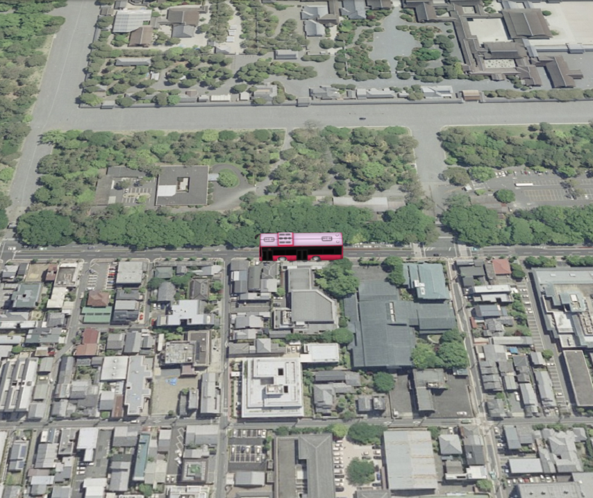

## モデルの表示（SceneLoaderを使った表示）

mapray.SceneLoaderを使って3Dモデルを表示する方法を説明します。

### サンプルコード
mapray.SceneLoaderを使って3Dモデルを表示する**Load3DModel.html**及びと**Load3DModel.js**のサンプルコードとシーンファイル（**bus.json**）です。
このサンプルコードでは、京都御所沿いの道路にバスを北向きに表示します。

#### Load3DModel.html
```HTML
<!DOCTYPE html>
<html>
<head>
    <meta charset="UTF-8">
    <title>Load3DModelSample</title>
    <script src="https://api.mapray.com/mapray-js/v0.6.0/mapray.js"></script>
    <script src="Load3DModel.js"></script>
    <style>
        html, body {
            height: 100%;
            margin: 0;
        }

        div#mapray-container {
            display: flex;
            height: 97%;
        }

        div#mapInfo{
            display: flex;
            width: 50px;
            height: 25px;
            margin-left: auto;
            margin-right: 10px;
            align-items: center;
        }
    </style>
</head>

<body onload="new LoadModel('mapray-container');">
    <div id="mapray-container"></div>
    <div id="mapInfo"><a href="https://maps.gsi.go.jp/development/ichiran.html" style="font-size: 9px">国土地理院</a></div>
</body>
</html>
```

#### Load3DModel.js
```JavaScript
class LoadModel {
    constructor(container) {
        // Access Tokenを設定
        var accessToken = "<your access token here>";

        // Viewerを作成する
        this.viewer = new mapray.Viewer(
            container, {
                image_provider: this.createImageProvider(),
                dem_provider: new mapray.CloudDemProvider(accessToken)
            }
        );

        this.SetCamera();

        this.LoadScene();
    }

    // 画像プロバイダを生成
    createImageProvider() {
        // 国土地理院提供の汎用的な地図タイルを設定
        return new mapray.StandardImageProvider("https://cyberjapandata.gsi.go.jp/xyz/seamlessphoto/", ".jpg", 256, 2, 18);
    }

    SetCamera() {
        // カメラ位置の設定

        // 球面座標系（経度、緯度、高度）で視点を設定。モデルの座標を設定
        var home_pos = { longitude: 135.759366, latitude: 35.025891, height: 50.0 };

        // 球面座標から地心直交座標へ変換
        var home_view_to_gocs = mapray.GeoMath.iscs_to_gocs_matrix(home_pos, mapray.GeoMath.createMatrix());

        // 視線方向を定義
        var cam_pos = mapray.GeoMath.createVector3([-400, 10, 400]);
        var cam_end_pos = mapray.GeoMath.createVector3([0, 0, 0]);
        var cam_up = mapray.GeoMath.createVector3([0, 0, 1]);

        //ビュー変換行列を作成
        var view_to_home = mapray.GeoMath.createMatrix();
        mapray.GeoMath.lookat_matrix(cam_pos, cam_end_pos, cam_up, view_to_home);

        // カメラの位置と視線方向からカメラの姿勢を変更
        var view_to_gocs = this.viewer.camera.view_to_gocs;
        mapray.GeoMath.mul_AA(home_view_to_gocs, view_to_home, view_to_gocs);

        // カメラのnear  farの設定
        this.viewer.camera.near = 30;
        this.viewer.camera.far = 500000;
    }

    LoadScene() {
        var scene_File_URL = "http://localhost/bus/bus.json";
        //シーンを読み込む
        var loader = new mapray.SceneLoader(this.viewer.scene, scene_File_URL, {
            transform: (url, type) => this.onTransform(url, type),
            callback: (loader, isSuccess) => {
                this.onLoadScene(loader, isSuccess);
            }
        });
    }

    onTransform(url, type) {
        return {
            url: url,
            credentials: mapray.CredentialMode.SAME_ORIGIN,
            headers: {}
        };
    }

    onLoadScene(loader, isSuccess) {
        if (isSuccess) {
            var init_pos = { longitude: 135.759309, latitude: 35.025891, height: 50.0 };

            var init_pos_Gocs = mapray.GeoMath.iscs_to_gocs_matrix(init_pos, mapray.GeoMath.createMatrix());

            //sceneのEntityに初期座標をセットする
            var entity = this.viewer.scene.getEntity(0);
            entity.setTransform(init_pos_Gocs);

        }
    }
}
```

#### シーンファイル（bus.json）
```json
{
  "mesh_register": { "mesh-0": { "binary": "http://localhost/bus/bus.mesh" } },
  "texture_register": { "texture-0": { "image": "http://localhost/bus/bus_pink.png" } },
  "entity_list": [{
    "type": "generic",
    "mode": "basic",
    "transform": { "cartographic": [133.918, 34.666, 0.0] },
    "ref_mesh": "mesh-0",
    "properties": {
      "ambient": [0.2, 0.2, 0.2],
      "diffuse": [0.639216, 0.639216, 0.639216],
      "specular": [1.0, 1.0, 1.0],
      "shininess": 0.0,
      "diffuse-map": { "type": "tex-2d", "ref_texture": "texture-0" }
    }
    }
  ]
}
```

### htmlのサンプルコードの詳細
htmlのサンプルコードの詳細を以下で解説します。

#### htmlの文字コード設定
4行目でhtmlの文字コードを設定します。このサンプルコードでは、utf-8を設定します。

```HTML
<meta charset="UTF-8">
```

#### タイトルの設定
5行目でタイトルを設定します。このサンプルコードでは、Load3DModelSampleを設定します。

```HTML
<title>Load3DModelSample</title>
```

#### JavaScriptファイルのパス設定
6、7行目で参照するJavaScripのパスを設定します。このサンプルコードでは、maprayのJavaScriptファイルとモデルのシーンを読み込むJavaScriptファイル（**Load3DModel.js**）を設定します。

```HTML
<script src="https://api.mapray.com/mapray-js/v0.6.0/mapray.js"></script>
<script src="Load3DModel.js"></script>
```

#### スタイルの設定
8～27行目で表示する要素のスタイルを設定します。
スタイルの詳細は、ヘルプページ『**緯度経度によるカメラ位置の指定**』を参照してください。

```HTML
<style>
        html, body {
            height: 100%;
            margin: 0;
        }

        div#mapray-container {
            display: flex;
            height: 97%;
        }

        div#mapInfo{
            display: flex;
            width: 50px;
            height: 25px;
            margin-left: auto;
            margin-right: 10px;
            align-items: center;
        }
    </style>
```

#### loadイベントの処理
画面を表示するときに、モデルシーン読み込みクラスを生成します。そのため、30行目でページの読み込み時に、地図表示部分のブロックのidからモデルシーン読み込みクラスのインスタンスを生成します。
モデルシーン読み込みクラスはJavaScriptのサンプルコードの詳細で説明します。

```HTML
<body onload="new LoadModel('mapray-container');">
```

#### 地図表示部分と出典表示部分の指定
31行目で地図表示部分になるブロックを記述し、32行目で出典を明記するためのブロックを記述します。
詳細はヘルプページ『**緯度経度によるカメラ位置の指定**』を参照してください。

```HTML
<div id="mapray-container"></div>
<div id="mapInfo"><a href="https://maps.gsi.go.jp/development/ichiran.html" style="font-size: 9px">国土地理院</a></div>
```

### JavaScriptのサンプルコードの詳細
JavaScriptのサンプルコードの詳細を以下で解説します。

#### クラスの説明
1～84行目で、モデルシーンを読み込み、表示するクラスを定義します。クラス内の各メソッドの詳細は以降で解説します。

```JavaScript
class LoadModel {

  //中略

}
```

#### コンストラクタ
2～17行目がモデルシーンを読み込み、表示するクラスのコンストラクタです。引数として渡されるブロックのidに対して、mapray.Viewerを作成し、カメラの位置・向きの設定メソッドを呼び出します。その後、シーンのロードメソッドを呼び出します。viewerを作成する際の画像プロバイダは画像プロバイダの生成メソッドから取得します。
mapray.Viewerの作成の詳細は、ヘルプページ『**緯度経度によるカメラ位置の指定**』を参照してください。

```JavaScript
constructor(container) {
    // Access Tokenを設定
    var accessToken = "<your access token here>";

    // Viewerを作成する
    this.viewer = new mapray.Viewer(
        container, {
            image_provider: this.createImageProvider(),
            dem_provider: new mapray.CloudDemProvider(accessToken)
        }
    );

    this.SetCamera();

    this.LoadScene();
}
```

#### 画像プロバイダの生成
19～23行目が画像プロバイダの生成メソッドです。生成した画像プロバイダを返します。
画像プロバイダの生成の詳細は、ヘルプページ『**緯度経度によるカメラ位置の指定**』を参照してください。

```JavaScript
// 画像プロバイダを生成
createImageProvider() {
    // 国土地理院提供の汎用的な地図タイルを設定
    return new mapray.StandardImageProvider("https://cyberjapandata.gsi.go.jp/xyz/seamlessphoto/", ".jpg", 256, 2, 18);
}
```

#### カメラの位置・向きの設定
25～50行目がカメラの位置・向きの設定メソッドです。
カメラの位置・向きの設定は、ヘルプページ『**緯度経度によるカメラ位置の指定**』を参照してください。

```JavaScript
SetCamera() {
    // カメラ位置の設定

    // 球面座標系（経度、緯度、高度）で視点を設定。モデルの座標を設定
    var home_pos = { longitude: 135.759366, latitude: 35.025891, height: 50.0 };

    // 球面座標から地心直交座標へ変換
    var home_view_to_gocs = mapray.GeoMath.iscs_to_gocs_matrix(home_pos, mapray.GeoMath.createMatrix());

    // 視線方向を定義
    var cam_pos = mapray.GeoMath.createVector3([-400, 10, 400]);
    var cam_end_pos = mapray.GeoMath.createVector3([0, 0, 0]);
    var cam_up = mapray.GeoMath.createVector3([0, 0, 1]);

    //ビュー変換行列を作成
    var view_to_home = mapray.GeoMath.createMatrix();
    mapray.GeoMath.lookat_matrix(cam_pos, cam_end_pos, cam_up, view_to_home);

    // カメラの位置と視線方向からカメラの姿勢を変更
    var view_to_gocs = this.viewer.camera.view_to_gocs;
    mapray.GeoMath.mul_AA(home_view_to_gocs, view_to_home, view_to_gocs);

    // カメラのnear  farの設定
    this.viewer.camera.near = 30;
    this.viewer.camera.far = 500000;
}
```

#### シーンのロード
52～61行目がシーンのロードメソッドです。mapray.SceneLoaderでシーンを読み込みます。
SceneLoaderクラス生成時の引数には、シーンファイルのエンティティを追加するシーン、読み込むシーンファイルのURL、オプション集合の順に指定します。このサンプルコードでは、viewerクラスのシーン、53行目で設定したURL、リソース要求変換関数、シーンのロードが終了した時のコールバック関数の順に指定します。読み込むシーンのURLはhttpもしくはhttpsでアクセスできるURLを指定します。

```JavaScript
LoadScene() {
    var scene_File_URL = "http://localhost/bus/bus.json";
    //シーンを読み込む
    var loader = new mapray.SceneLoader(this.viewer.scene, scene_File_URL, {
        transform: (url, type) => this.onTransform(url, type),
        callback: (loader, isSuccess) => {
            this.onLoadScene(loader, isSuccess);
        }
    });
}
```

#### リソース要求変換
63～69行目はリソース要求変換メソッドです。リソースのリクエスト時にURLなどを変換する内容を定義します。このサンプルコードでは、特に指定はしないので、リファレンスに沿った内容で定義します。

```JavaScript
onTransform(url, type) {
    return {
        url: url,
        credentials: mapray.CredentialMode.SAME_ORIGIN,
        headers: {}
    };
}
```

#### シーンのロード終了イベント
71～82行目がシーンのロード終了イベントメソッドです。引数のisSuccessには、読み込み結果が格納されており、trueの場合のみ読み込んだ3Dモデルを表示します。
まず、73行目で、3Dモデルの表示位置を球面座標系（緯度・経度・高度）で定義します。その位置を75行目で地心直交座標系に変換することで、モデルの表示位置を表す変換行列を求めます。
そして、79、80行目で、その変換行列を読み込んだモデルのエンティティに反映させることで、地図上に3Dモデルを表示します。なお、読み込んだモデルは1つ目のエンティティとなるため、エンティティ取得時の引数には0を指定します。

```JavaScript
onLoadScene(loader, isSuccess) {
    if (isSuccess) {
        var init_pos = { longitude: 135.759309, latitude: 35.025891, height: 50.0 };

        var init_pos_Gocs = mapray.GeoMath.iscs_to_gocs_matrix(init_pos, mapray.GeoMath.createMatrix());

        //sceneのEntityに初期座標をセットする
        var entity = this.viewer.scene.getEntity(0);
        entity.setTransform(init_pos_Gocs);

    }
}
```

### シーンファイルの詳細
シーンファイルの詳細を以下で解説します。なお、シーンファイルはJSON形式で記述します。

#### エンティティの設定
4行目でentity_listという名称でエンティティを定義し、その中にエンティティの詳細を定義します。5行目のtypeという名称は、エンティティの種類を表し、3Dモデルの場合はgenericを指定します。

```json
{

  中略

  "entity_list": [{
    "type": "generic",

      中略

    }
  ]
}
```

#### メッシュのデータ
2行目でmesh_registerという名称でメッシュデータを定義します。このシーンファイルでは、メッシュデータのIDをmesh-0とし、メッシュファイルをファイルから読み込むために、binaryという名称にメッシュファイルのURLを指定します。

```json
"mesh_register": { "mesh-0": { "binary": "http://localhost/bus/bus.mesh" } },
```

#### テクスチャのデータ
3行目でtexture_registerという名称でテクスチャデータを定義します。このシーンファイルでは、テクスチャデータのIDをtexture-0とし、テクスチャファイルをファイルから読み込むために、imageという名称にテクスチャファイルのURLを指定します。

```json
"texture_register": { "texture-0": { "image": "http://localhost/bus/bus_pink.png" } },
```

#### 汎用エンティティの設定
6～15行目で汎用エンティティの設定をします。汎用エンティティには以下の内容を定義します。
- モード（mode）　⇒　basic
- 初期姿勢（transform）　⇒　球面座標系（cartographic）での初期位置
- メッシュデータ（ref_mesh）　⇒　メッシュデータのID（mesh-0）
- マテリアル（properties）
 - 環境光（ambient）　⇒　環境光のRGB成分
 - 拡散反射光（diffuse） ⇒　拡散反射光のRGB成分
 - 鏡面反射光（specular）　⇒　鏡面反射光のRGB成分
 - 鏡面反射係数（shininess）　⇒　0.0
 - テクスチャ情報（diffuse_map）　⇒　テクスチャデータのID（texture-0）

```json
"mode": "basic",
"transform": { "cartographic": [133.918, 34.666, 0.0] },
"ref_mesh": "mesh-0",
"properties": {
  "ambient": [0.2, 0.2, 0.2],
  "diffuse": [0.639216, 0.639216, 0.639216],
  "specular": [1.0, 1.0, 1.0],
  "shininess": 0.0,
  "diffuse-map": { "type": "tex-2d", "ref_texture": "texture-0" }
}
```

### 出力イメージ
このサンプルコードの出力イメージは下図のようになります。

