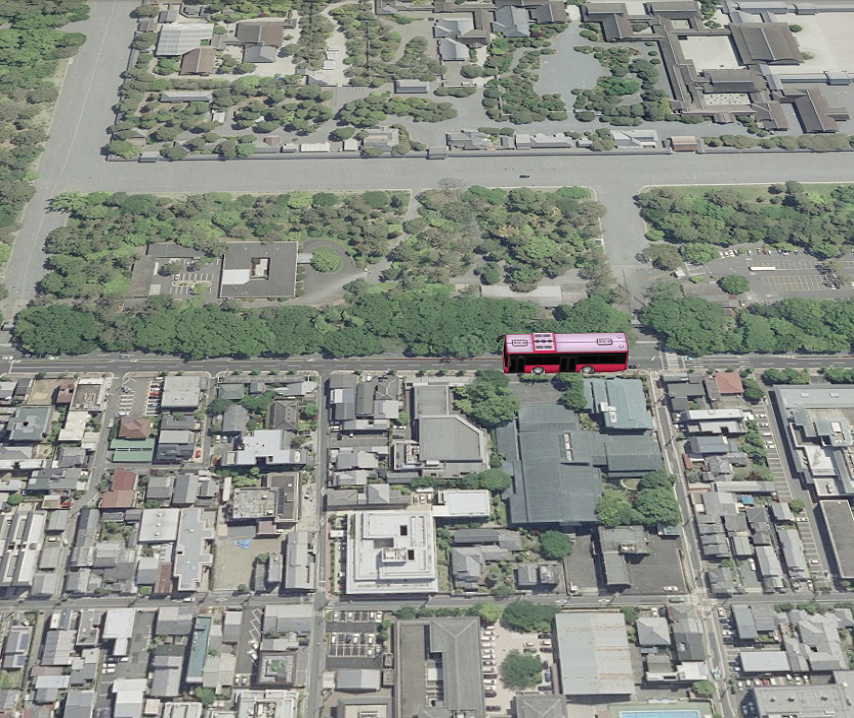
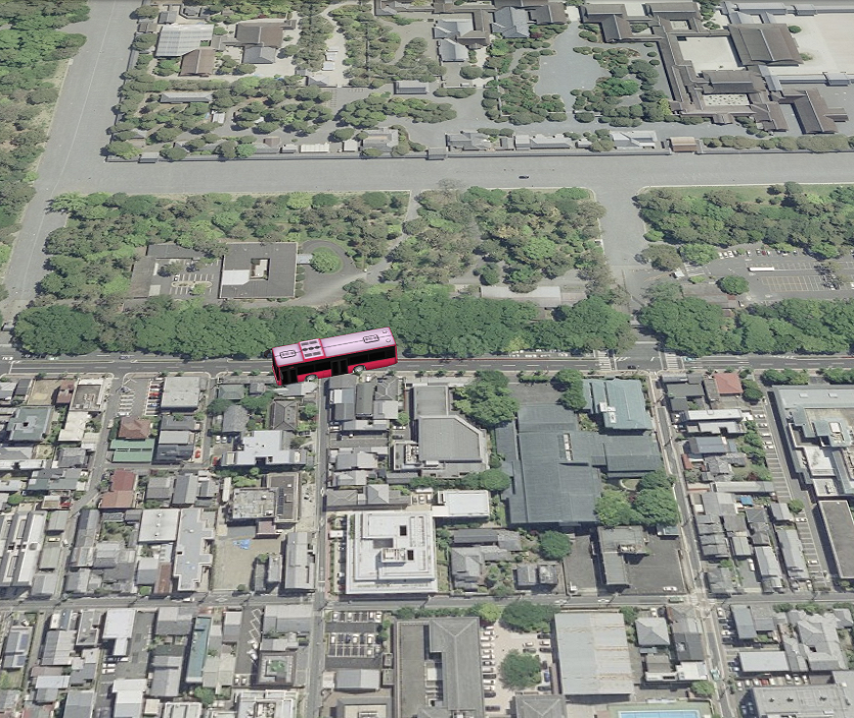
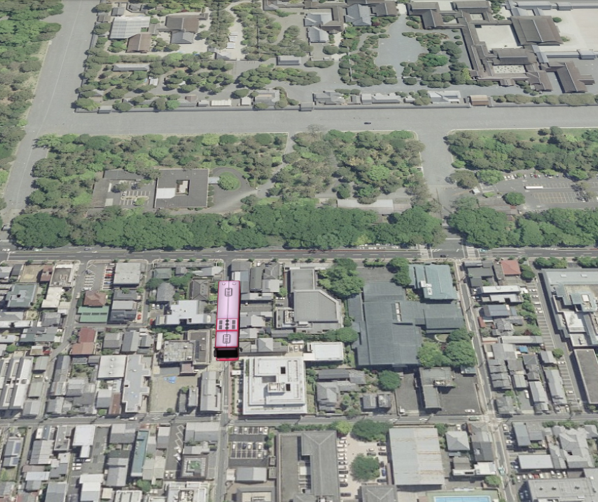

## モデルのアニメーション
動的に3Dモデルの位置・向きを変更するアニメーションを作成する方法を説明します。

### サンプルコード
動的に3Dモデルの位置・向きを変更するアニメーションを作成する**ModelAnimation.html**及び**ModelAnimation.js**のサンプルコードです。サンプルコードで利用するシーンファイル（**bus.json**）については、ヘルプページ『**モデルの表示（SceneLoaderを使った表示）**』を参照してください。
このサンプルコードでは、3Dモデルが京都御所沿いの道路を北上したのち、西向きに向きを変え、さらに西進するアニメーションを表現します。

#### ModelAnimation.html

```HTML
<!DOCTYPE html>
<html>
<head>
    <meta charset="utf-8">
    <title>ModelAnimationSample</title>
    <script src="https://api.mapray.com/mapray-js/v0.5.1/mapray.js"></script>
    <script src="ModelAnimation.js"></script>
    <style>
        html, body {
            height: 100%;
            margin: 0;
        }

        div#mapray-container {
            display: flex;
            height: 97%;
        }

        div#mapInfo{
            display: flex;
            width: 50px;
            height: 25px;
            margin-left: auto;
            margin-right: 10px;
            align-items: center;
        }
    </style>
</head>
<body onload="new ModelAnimation('mapray-container');">
    <div id="mapray-container"></div>
    <div id="mapInfo"><a href="https://maps.gsi.go.jp/development/ichiran.html" style="font-size: 9px">国土地理院</a></div>
</body>
</html>
```

#### ModelAnimation.js
```JavaScript
var GeoMath = mapray.GeoMath;

class ModelAnimation extends mapray.RenderCallback {

    constructor(container) {
        super();

        // Access Tokenを設定
        var accessToken = "<your access token here>";

        // Viewerを作成する
        new mapray.Viewer(container, {
            render_callback: this,
            image_provider: this.createImageProvider(),
            dem_provider: new mapray.CloudDemProvider(accessToken)
        });

        this.animation_Path = [{ longitude: 135.759309, latitude: 35.024954, height: 50.0 },//モデルを移動させるパス。場所は鳥丸通の鳥丸下長者町交差点付近
                               { longitude: 135.759309, latitude: 35.026257, height: 50.0 },//場所は鳥丸通と一条通の交差点付近
                               { longitude: 135.759309, latitude: 35.026257, height: 50.0 },//場所は鳥丸通と一条通の交差点付近
                               { longitude: 135.757438, latitude: 35.026257, height: 50.0 }];//場所は一条通の京都市立上京中学校前付近
        this.model_Pos = { longitude: 0, latitude: 0, height: 0 };//モデルの球面座標
        this.model_Angle = 0;//モデルの向いている向き
        this.isLoadedModel = false;//モデルをロードできたか
        this.move_Correction = 0.00007;//移動量の補正値
        this.ratio_Increment = 0.15;    //毎フレームの線形補間割合増加分
        this.ratio = 0.0;            //線形補間の割合
        this.angle_Animation_Interval = [0, 0, 90, 90];//角度アニメーションの変化量データ
        this.animation_Index = 0;

        this.SetCamera();

        this.LoadScene();
    }

    onStart()  // override
    {
        // 初期の割合
        this.ratio = 0.0;
    }

    //フレーム毎に呼ばれるメソッド
    onUpdateFrame(delta_time)  // override
    {
        if (this.isLoadedModel == false) {
            return;
        }

        // 次の線形補間の割合
        this.ratio += this.ratio_Increment * delta_time;

        if (this.ratio > 1.0) {
            this.ratio = 0.0;
            this.animation_Index += 1;
        }

        if (this.animation_Index == this.animation_Path.length - 1) {
            this.animation_Index = 0
        }

        this.model_Pos.longitude = this.animation_Path[this.animation_Index].longitude * (1 - this.ratio) + this.animation_Path[this.animation_Index + 1].longitude * this.ratio;
        this.model_Pos.latitude = this.animation_Path[this.animation_Index].latitude * (1 - this.ratio) + this.animation_Path[this.animation_Index + 1].latitude * this.ratio;
        this.model_Pos.height = this.animation_Path[this.animation_Index].height * (1 - this.ratio) + this.animation_Path[this.animation_Index + 1].height * this.ratio;

        this.model_Angle = this.angle_Animation_Interval[this.animation_Index] * (1 - this.ratio) + this.angle_Animation_Interval[this.animation_Index + 1] * this.ratio;

        this.SetModelTransform();
    }

    // 画像プロバイダを生成
    createImageProvider() {
        return new mapray.StandardImageProvider("https://cyberjapandata.gsi.go.jp/xyz/seamlessphoto/", ".jpg", 256, 2, 18);
    }

    SetCamera() {
        // カメラ位置の設定

        // 球面座標系（経度、緯度、高度）で視点を設定。座標は京都御所前
        var home_pos = { longitude: 135.759366, latitude: 35.025891, height: 50.0 };

        // 球面座標から地心直交座標へ変換
        var home_view_to_gocs = mapray.GeoMath.iscs_to_gocs_matrix(home_pos, mapray.GeoMath.createMatrix());

        // 視線方向を定義
        var cam_pos = mapray.GeoMath.createVector3([-400, 10, 400]);
        var cam_end_pos = mapray.GeoMath.createVector3([0, 0, 0]);
        var cam_up = mapray.GeoMath.createVector3([0, 0, 1]);

        //ビュー変換行列を作成
        var view_to_home = mapray.GeoMath.createMatrix();
        mapray.GeoMath.lookat_matrix(cam_pos, cam_end_pos, cam_up, view_to_home);

        // カメラの位置と視線方向からカメラの姿勢を変更
        var view_to_gocs = this.viewer.camera.view_to_gocs;
        mapray.GeoMath.mul_AA(home_view_to_gocs, view_to_home, view_to_gocs);

        // カメラのnear  farの設定
        this.viewer.camera.near = 30;
        this.viewer.camera.far = 500000;
    }

    LoadScene() {
        var scene_File_URL = "http://localhost/bus/bus.json";
        //シーンを読み込む
        var loader = new mapray.SceneLoader(this.viewer.scene, scene_File_URL, {
            transform: (url, type) => this.onTransform(url, type),
            callback: (loader, isSuccess) => {
                this.onLoadScene(loader, isSuccess);
            }
        });
    }

    onTransform(url, type) {
        return {
            url: url,
            credentials: mapray.CredentialMode.SAME_ORIGIN,
            headers: {}
        };
    }

    onLoadScene(loader, isSuccess) {
        if (isSuccess) {
            this.isLoadedModel = true;

            this.SetModelTransform();
        }
    }

    SetModelTransform() {
        //モデルの回転行列を求める
        var turn_mat = mapray.GeoMath.rotation_matrix([0, 0, 1], this.model_Angle, mapray.GeoMath.createMatrix());
        //モデルの球面座標を地心座標に変換する
        var model_pos_Gocs = mapray.GeoMath.iscs_to_gocs_matrix(this.model_Pos, mapray.GeoMath.createMatrix());

        //モデルの地心座標に回転行列をかける
        var turned_pos_Gocs = mapray.GeoMath.mul_AA(model_pos_Gocs, turn_mat, mapray.GeoMath.createMatrix());

        //sceneのEntityに初期座標をセットする
        var entity = this.viewer.scene.getEntity(0);
        entity.setTransform(turned_pos_Gocs);


    }
}
```

### htmlのサンプルコードの詳細
htmlのサンプルコードの詳細を以下で解説します。

#### htmlの文字コード設定
4行目でhtmlの文字コードを設定します。このサンプルコードでは、utf-8を設定します。

```HTML
<meta charset="utf-8">
```

#### タイトルの設定
5行目でタイトルを設定します。このサンプルコードでは、ModelAnimationSampleを設定します。

```HTML
<title>ModelAnimationSample</title>
```

#### JavaScriptファイルのパス設定
6、7行目で参照するJavaScripのパスを設定します。このサンプルコードでは、maprayのJavaScriptファイルとモデルのアニメーションJavaScriptファイル（**ModelAnimation.js**）を設定します。

```HTML
<script src="https://api.mapray.com/mapray-js/v0.5.1/mapray.js"></script>
<script src="ModelAnimation.js"></script>
```

#### スタイルの設定
8～27行目で表示する要素のスタイルを設定します。
スタイルの詳細は、ヘルプページ『**緯度経度によるカメラ位置の指定**』を参照してください。

```HTML
<style>
        html, body {
            height: 100%;
            margin: 0;
        }

        div#mapray-container {
            display: flex;
            height: 97%;
        }

        div#mapInfo{
            display: flex;
            width: 50px;
            height: 25px;
            margin-left: auto;
            margin-right: 10px;
            align-items: center;
        }
    </style>
```

#### loadイベントの処理
画面を表示するときに、3Dモデルアニメーションクラスを作成します。そのため、29行目でページの読み込み時に、地図表示部分のブロックのidから3Dモデルアニメーションクラスのインスタンスを生成します。
3DモデルアニメーションクラスはJavaScriptのサンプルコードの詳細で説明します。

```HTML
<body onload="new ModelAnimation('mapray-container');">
```

#### 地図表示部分と出典表示部分の指定
30行目で地図表示部分になるブロックを記述し、31行目で出典を明記するためのブロックを記述します。
詳細はヘルプページ『**緯度経度によるカメラ位置の指定**』を参照してください。

```HTML
<div id="mapray-container"></div>
<div id="mapInfo"><a href="https://maps.gsi.go.jp/development/ichiran.html" style="font-size: 9px">国土地理院</a></div>
```

### JavaScriptのサンプルコードの詳細
JavaScriptのサンプルコードの詳細を以下で解説します。

#### クラスとグローバル変数の説明
3～144行目のクラスは、3Dモデルアニメーションクラスです。アニメーションを表現するために、3Dモデルアニメーション作成クラスは、mapray.RenderCallbackクラスを継承します。
また、1行目で数学関連の関数または定数を定義するユーティリティークラスのグローバル変数を定義します。

```JavaScript
var GeoMath = mapray.GeoMath;

class ModelAnimation extends mapray.RenderCallback {

    //中略

}
```

#### コンストラクタ
5～34行目がモデルのアニメーションクラスのコンストラクタです。
まず、引数として渡されるブロックのidに対して、mapray.Viewerを作成します。mapray.Viewerのベース地図の画像プロバイダは、画像プロバイダの生成メソッドで取得した画像プロバイダを設定します。mapray.Viewerの作成の詳細は、ヘルプページ『**カメラのアニメーション**』を参照してください。
次に、3Dモデルの操作に関する初期値を下記のように設定します。
- 移動時の経由点の緯度、経度、高度　⇒　開始位置、方向転換開始位置、方向転換終了位置、終了位置
- 現在の位置の緯度、経度、高度　⇒　全て0
- 現在の向き　⇒　0度
- ロードの成功可否　⇒　false
- 移動量　⇒　0.00007度
- 3Dモデル位置の線形補間時の1秒当たりの増加割合　⇒ 0.15
- 3Dモデル位置の線形補間時の現在の割合 ⇒ 0
- 経由点での3Dモデルの向き　⇒　０、０、９０、９０
- 3Dモデル位置の線形補間対象となる区間番号　⇒　0

最後に、カメラの位置・向きの設定、シーンのロードの順にメソッドを呼び出します。

```JavaScript
constructor(container) {
    super();

    // Access Tokenを設定
    var accessToken = "<your access token here>";

    // Viewerを作成する
    new mapray.Viewer(container, {
        render_callback: this,
        image_provider: this.createImageProvider(),
        dem_provider: new mapray.CloudDemProvider(accessToken)
    });

    this.animation_Path = [{ longitude: 135.759309, latitude: 35.024954, height: 50.0 },//モデルを移動させるパス。場所は鳥丸通の鳥丸下長者町交差点付近
                           { longitude: 135.759309, latitude: 35.026257, height: 50.0 },//場所は鳥丸通と一条通の交差点付近
                           { longitude: 135.759309, latitude: 35.026257, height: 50.0 },//場所は鳥丸通と一条通の交差点付近
                           { longitude: 135.757438, latitude: 35.026257, height: 50.0 }];//場所は一条通の京都市立上京中学校前付近
    this.model_Pos = { longitude: 0, latitude: 0, height: 0 };//モデルの球面座標
    this.model_Angle = 0;//モデルの向いている向き
    this.isLoadedModel = false;//モデルをロードできたか
    this.move_Correction = 0.00007;//移動量の補正値
    this.ratio_Increment = 0.15;    //毎フレームの線形補間割合増加分
    this.ratio = 0.0;            //線形補間の割合
    this.angle_Animation_Interval = [0, 0, 90, 90];//角度アニメーションの変化量データ
    this.animation_Index = 0;

    this.SetCamera();

    this.LoadScene();
}
```

#### レンダリングループの開始時のコールバックメソッド
36～40行目がレンダリングループの開始時のコールバックメソッドです。
レンダリングループの開始時のコールバックメソッドの詳細は、ヘルプページ『**パスに沿ったカメラアニメーション**』を参照してください。

```JavaScript
onStart()  // override
{
    // 初期の割合
    this.ratio = 0.0;
}
```

#### フレームレンダリング前のコールバックメソッド（3Dモデルの位置・向きの後進処理）
42～68行目がフレームレンダリング前のコールバックメソッドです。このサンプルコードでは、この中で、3Dモデルが正常に読み込まれている場合は、3Dモデルの位置・向きの更新処理を行います。
まず、50~59行目で、引数の経過時間をもとに、線形補間時の現在の割合を計算します。その際、現在の割合が1より大きくなった場合は、線形補間対象となる区間番号を1つ増やし、現在の割合を0に設定します。また、全ての区間を補間し終えた場合は、区間番号0にリセットします。
次に、61~63行目で、線形補間の対象区間の緯度・経度・高度を線形補間し、現在の位置となる緯度・経度・高度を求めます。また、65行目で、線形補間の対象区間の3Dモデルの向きを線形補間し、現在の3Dモデルの向きを求めます。
最後に、3Dモデルの姿勢変換行列の設定メソッドを呼び出し、現在の位置、向きを用いて、3Dモデルの姿勢変換行列を現在の状態に更新します。なお、3Dモデルの姿勢変換行列の詳細は後述します。

```JavaScript
//フレーム毎に呼ばれるメソッド
onUpdateFrame(delta_time)  // override
{
    if (this.isLoadedModel == false) {
        return;
    }

    // 次の線形補間の割合
    this.ratio += this.ratio_Increment * delta_time;

    if (this.ratio > 1.0) {
        this.ratio = 0.0;
        this.animation_Index += 1;
    }

    if (this.animation_Index == this.animation_Path.length - 1) {
        this.animation_Index = 0
    }

    this.model_Pos.longitude = this.animation_Path[this.animation_Index].longitude * (1 - this.ratio) + this.animation_Path[this.animation_Index + 1].longitude * this.ratio;
    this.model_Pos.latitude = this.animation_Path[this.animation_Index].latitude * (1 - this.ratio) + this.animation_Path[this.animation_Index + 1].latitude * this.ratio;
    this.model_Pos.height = this.animation_Path[this.animation_Index].height * (1 - this.ratio) + this.animation_Path[this.animation_Index + 1].height * this.ratio;

    this.model_Angle = this.angle_Animation_Interval[this.animation_Index] * (1 - this.ratio) + this.angle_Animation_Interval[this.animation_Index + 1] * this.ratio;

    this.SetModelTransform();
}
```

#### 画像プロバイダの生成
70～73行目が画像プロバイダの生成メソッドです。生成した画像プロバイダを返します。
画像プロバイダの生成の詳細は、ヘルプページ『**緯度経度によるカメラ位置の指定**』を参照してください。

```JavaScript
// 画像プロバイダを生成
createImageProvider() {
    return new mapray.StandardImageProvider("https://cyberjapandata.gsi.go.jp/xyz/seamlessphoto/", ".jpg", 256, 2, 18);
}
```

#### カメラの位置・向きの設定
75～100行目がカメラの位置・向きの設定メソッドです。
カメラの位置・向きの設定は、ヘルプページ『**緯度経度によるカメラ位置の指定**』を参照してください。

```JavaScript
SetCamera() {
    // カメラ位置の設定

    // 球面座標系（経度、緯度、高度）で視点を設定。座標は京都御所前
    var home_pos = { longitude: 135.759366, latitude: 35.025891, height: 50.0 };

    // 球面座標から地心直交座標へ変換
    var home_view_to_gocs = mapray.GeoMath.iscs_to_gocs_matrix(home_pos, mapray.GeoMath.createMatrix());

    // 視線方向を定義
    var cam_pos = mapray.GeoMath.createVector3([-400, 10, 400]);
    var cam_end_pos = mapray.GeoMath.createVector3([0, 0, 0]);
    var cam_up = mapray.GeoMath.createVector3([0, 0, 1]);

    //ビュー変換行列を作成
    var view_to_home = mapray.GeoMath.createMatrix();
    mapray.GeoMath.lookat_matrix(cam_pos, cam_end_pos, cam_up, view_to_home);

    // カメラの位置と視線方向からカメラの姿勢を変更
    var view_to_gocs = this.viewer.camera.view_to_gocs;
    mapray.GeoMath.mul_AA(home_view_to_gocs, view_to_home, view_to_gocs);

    // カメラのnear  farの設定
    this.viewer.camera.near = 30;
    this.viewer.camera.far = 500000;
}
```

#### シーンのロード
102～111行目がシーンのロードメソッドです。
シーンのロードは、ヘルプページ『**モデルの表示（SceneLoaderを使った表示）**』を参照してください。

```JavaScript
LoadScene() {
    var scene_File_URL = "http://localhost/bus/bus.json";
    //シーンを読み込む
    var loader = new mapray.SceneLoader(this.viewer.scene, scene_File_URL, {
        transform: (url, type) => this.onTransform(url, type),
        callback: (loader, isSuccess) => {
            this.onLoadScene(loader, isSuccess);
        }
    });
}
```

#### リソース要求変換
113～119行目がリソース要求変換メソッドです。
リソース要求変換は、ヘルプページ『**モデルの表示（SceneLoaderを使った表示）**』を参照してください。

```JavaScript
onTransform(url, type) {
    return {
        url: url,
        credentials: mapray.CredentialMode.SAME_ORIGIN,
        headers: {}
    };
}
```

#### シーンのロード終了イベント
121～127行目がシーンのロード終了イベントメソッドです。引数のisSuccessには、読み込み結果が格納されており、trueの場合のみ読み込んだ3Dモデルを表示し、3Dモデルを操作できるようにします。
3Dモデルのロード成功可否をtrueにし、3Dモデルの姿勢変換行列を求めるメソッドを呼び出します。3Dモデルの姿勢変換行列を求めるメソッドの詳細は後述します。

```JavaScript
onLoadScene(loader, isSuccess) {
    if (isSuccess) {
        this.isLoadedModel = true;

        this.SetModelTransform();
    }
}
```

#### 3Dモデルの姿勢変換行列の設定
129～143行目がモデルの姿勢設定メソッドです。3Dモデルの現在の位置（緯度・経度・高度）と現在の回転角度を用いて、現在の3Dモデルの姿勢変換行列を求め、3Dモデルのエンティティに反映します。
まず、131行目で、現在の回転角度から3Dモデルの向きを表す回転行列（Z軸回りの回転）を作成します。次に、133行目で、現在の位置（緯度・経度・高度）から地心直交座標系での現在の位置を表す変換行列を作成します。最後に、136行目でそれらの行列を掛け合わせることで、3Dモデルの姿勢変換行列を求めます。
そして、139、140行目で、求めた姿勢変換行列をモデルのエンティティに反映します。なお、読み込んだモデルは1つ目のエンティティとなるため、エンティティ取得時の引数には0を指定します。

```JavaScript
SetModelTransform() {
    //モデルの回転行列を求める
    var turn_mat = mapray.GeoMath.rotation_matrix([0, 0, 1], this.model_Angle, mapray.GeoMath.createMatrix());
    //モデルの球面座標を地心座標に変換する
    var model_pos_Gocs = mapray.GeoMath.iscs_to_gocs_matrix(this.model_Pos, mapray.GeoMath.createMatrix());

    //モデルの地心座標に回転行列をかける
    var turned_pos_Gocs = mapray.GeoMath.mul_AA(model_pos_Gocs, turn_mat, mapray.GeoMath.createMatrix());

    //sceneのEntityに初期座標をセットする
    var entity = this.viewer.scene.getEntity(0);
    entity.setTransform(turned_pos_Gocs);


}
```

### 出力イメージ
このサンプルコードで初期状態の出力イメージは下図のようになります。


初期状態から時間が経過し、向きを西向きに変更する時の出力イメージは、下図のようになります。


さらに時間が経過し、西進している時の出力イメージは、下図のようになります。

