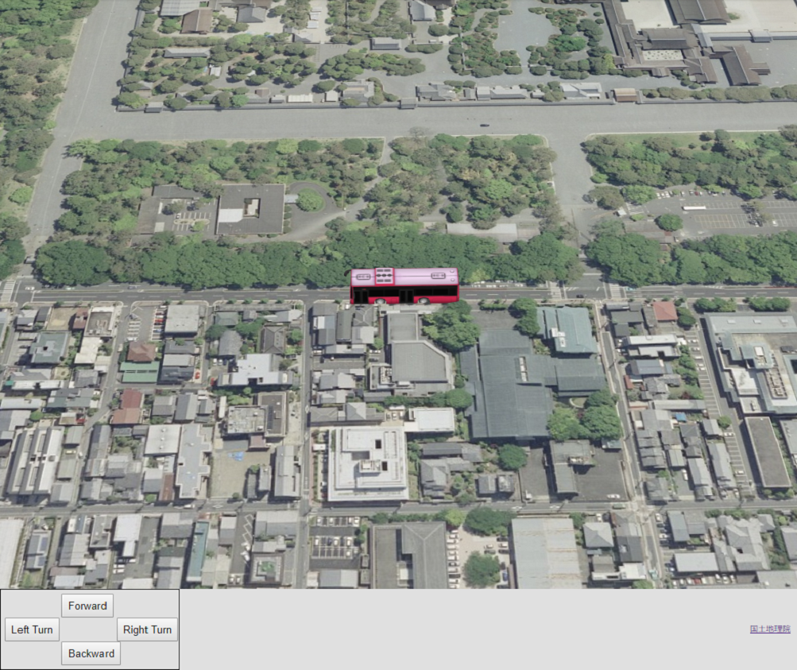
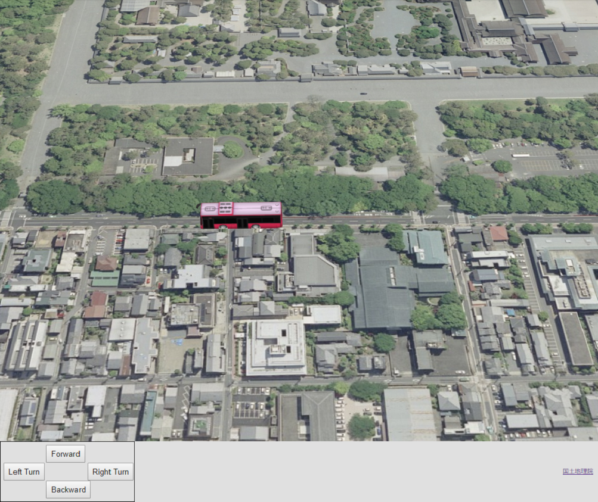

## モデルの移動・回転

ユーザインタフェースを介して、3Dモデルを移動・回転させる方法を説明します。

### サンプルコード
ユーザインタフェースを介して、3Dモデルを移動・回転させる**ModelController.html**及び**ModelController.js**のサンプルコードです。サンプルコードで利用するシーンファイル（**bus.json**）については、ヘルプページ『**モデルの表示（SceneLoaderを使った表示）**』を参照してください。
このサンプルコードでは、対応するボタンを操作することで、前進、後進、左90度回転、右90度回転ができます。

#### ModelController.html

```HTML
<!DOCTYPE html>
<html>
<head>
    <meta charset="utf-8">
    <title>ModelControllerSample</title>
    <script src="https://api.mapray.com/mapray-js/v0.6.0/mapray.js"></script>
    <script src="ModelController.js"></script>
    <style>
        html, body {
            height: 100%;
            margin: 0;
            background-color: #E0E0E0;
        }

        input {
            font-size: 13px;
        }

        div#mapray-container {
            display: flex;
            height: 89%;
        }

        div#ButtonBox {
            display: block;
            background-color: #E0E0E0;
            height: 100px;
            width: 220px;
            border: inset 1px #000000;
            float: left;
        }

        div#ForwardButton{
            display:flex;
            width:70px;
            height:30px;
            margin-top: 5px;
            margin-bottom:auto;
            margin-left:auto;
            margin-right:auto;
        }

        div#RotateLeft90Button{
            display: flex;
            width:70px;
            height:30px;
            margin-left: 5px;
            margin-right:auto;
            margin-top:auto;
            margin-bottom:auto;
            float: left;
        }

        div#RotateRight90Button{
            display: flex;
            width:70px;
            height:30px;
            margin-right: 7px;
            margin-left:auto;
            margin-top:auto;
            margin-bottom:auto;
        }

        div#BackwardButton{
            display: flex;
            width:70px;
            height:30px;
            margin-bottom:5px;
            margin-top:auto;
            margin-left:auto;
            margin-right:auto;
        }

        div#mapInfo{
            display: flex;
            width: 50px;
            height: 100px;
            margin-left: auto;
            margin-right: 10px;
            align-items: center;
        }
    </style>
</head>

<body onload="CreateModelControllerInstance('mapray-container');">
    <div id="mapray-container"></div>

    <div id="ButtonBox">
        <div id="ForwardButton"><input type="button" value="Forward" onclick="ForwardButtonClicked()"></div>
        <div id="RotateLeft90Button"><input type="button" value="Left Turn" onclick="LeftTurnButtonClicked()"></div>
        <div id="RotateRight90Button"><input type="button" value="Right Turn" onclick="RightTurnButtonClicked()"></div>
        <div id="BackwardButton"><input type="button" value="Backward" onclick="BackwardButtonClicked()"></div>
    </div>

    <div id="mapInfo"><a href="https://maps.gsi.go.jp/development/ichiran.html" style="font-size: 9px">国土地理院</a></div>
</body>
</html>
```

#### ModelController.js
```JavaScript
var model_Controller;

class ModelController {

    constructor(container) {

        // Access Tokenを設定
        var accessToken = "<your access token here>";

        // Viewerを作成する
        this.viewer = new mapray.Viewer(
            container, {
                image_provider: this.createImageProvider(),
                dem_provider: new mapray.CloudDemProvider(accessToken)
            }
        );

        this.model_Pos = { longitude: 135.759309, latitude: 35.025891, height: 50.0 };//モデルの球面座標
        this.move_Vec = [0,1,0];//モデルの移動方向(X:経度 Y:緯度 Z:高度)
        this.model_Angle = 0;//モデルの向いている向き（Z軸回転）
        this.isLoadedModel = false;//モデルをロードできたか
        this.move_Correction = 0.00007;//移動量の補正値

        this.SetCamera();

        this.LoadScene();
    }

    // 画像プロバイダを生成
    createImageProvider() {
        // 国土地理院提供の汎用的な地図タイルを設定
        return new mapray.StandardImageProvider("https://cyberjapandata.gsi.go.jp/xyz/seamlessphoto/", ".jpg", 256, 2, 18);
    }

    SetCamera() {
        // カメラ位置の設定

        // 球面座標系（経度、緯度、高度）で視点を設定。座標は京都御所前
        var home_pos = { longitude: 135.759366, latitude: 35.025891, height: 50.0 };

        // 球面座標から地心直交座標へ変換
        var home_view_to_gocs = mapray.GeoMath.iscs_to_gocs_matrix(home_pos, mapray.GeoMath.createMatrix());

        // 視線方向を定義
        var cam_pos = mapray.GeoMath.createVector3([-400, 10, 400]);
        var cam_end_pos = mapray.GeoMath.createVector3([0, 0, 0]);
        var cam_up = mapray.GeoMath.createVector3([0, 0, 1]);

        //ビュー変換行列を作成
        var view_to_home = mapray.GeoMath.createMatrix();
        mapray.GeoMath.lookat_matrix(cam_pos, cam_end_pos, cam_up, view_to_home);

        // カメラの位置と視線方向からカメラの姿勢を変更
        var view_to_gocs = this.viewer.camera.view_to_gocs;
        mapray.GeoMath.mul_AA(home_view_to_gocs, view_to_home, view_to_gocs);

        // カメラのnear  farの設定
        this.viewer.camera.near = 30;
        this.viewer.camera.far = 500000;
    }

    LoadScene() {
        var scene_File_URL = "http://localhost/bus/bus.json";
        //シーンを読み込む
        var loader = new mapray.SceneLoader(this.viewer.scene, scene_File_URL, {
            transform: (url, type) => this.onTransform(url, type),
            callback: (loader, isSuccess) => {
                this.onLoadScene(loader, isSuccess);
            }
        });
    }

    onTransform(url, type) {
        return {
            url: url,
            credentials: mapray.CredentialMode.SAME_ORIGIN,
            headers: {}
        };
    }

    onLoadScene(loader, isSuccess) {
        if (isSuccess) {
            this.isLoadedModel = true;

            this.SetModelTransform();
        }
    }

    SetModelTransform() {
        //モデルの回転行列を求める
        var turn_mat = mapray.GeoMath.rotation_matrix([0, 0, 1], this.model_Angle, mapray.GeoMath.createMatrix());
        //モデルの球面座標を地心座標に変換する
        var model_pos_Gocs = mapray.GeoMath.iscs_to_gocs_matrix(this.model_Pos, mapray.GeoMath.createMatrix());
        //モデルの地心座標に回転行列をかける
        var turned_pos_Gocs = mapray.GeoMath.mul_AA(model_pos_Gocs,turn_mat, mapray.GeoMath.createMatrix());

        this.CreateMoveVec(turn_mat);

        //sceneのEntityに初期座標をセットする
        var entity = this.viewer.scene.getEntity(0);
        entity.setTransform(turned_pos_Gocs);
    }

    CreateMoveVec(rot_mat) {
        //移動マトリックス生成
        var move_mat = mapray.GeoMath.createMatrix();
        //単位行列に変換
        mapray.GeoMath.setIdentity(move_mat);
        //Yの平行成分を更新
        move_mat[13] = 1;

        //移動マトリックスに回転行列をかける
        var rot_move_mat = mapray.GeoMath.mul_AA(rot_mat, move_mat, mapray.GeoMath.createMatrix());
        //回転後マトリックスから座標を取得
        this.move_Vec = [rot_move_mat[12], rot_move_mat[13], rot_move_mat[14]];
    }

    Forward() {
        if (this.isLoadedModel == false) {
            return;
        }

        this.model_Pos.longitude += this.move_Vec[0] * this.move_Correction;
        this.model_Pos.latitude += this.move_Vec[1] * this.move_Correction;

        this.SetModelTransform();
    }

    LeftTurn() {
        if (this.isLoadedModel == false) {
            return;
        }

        this.model_Angle += 90;

        this.SetModelTransform();
    }

    RightTurn() {
        if (this.isLoadedModel == false) {
            return;
        }

        this.model_Angle -= 90;

        this.SetModelTransform();
    }

    Backward() {
        if (this.isLoadedModel == false) {
            return;
        }

        this.model_Pos.longitude -= this.move_Vec[0] * this.move_Correction;
        this.model_Pos.latitude -= this.move_Vec[1] * this.move_Correction;

        this.SetModelTransform();
    }
}

function CreateModelControllerInstance(container) {
    model_Controller = new ModelController(container);
}

function ForwardButtonClicked() {
    model_Controller.Forward();
}

function LeftTurnButtonClicked() {
    model_Controller.LeftTurn();
}

function RightTurnButtonClicked() {
    model_Controller.RightTurn();
}

function BackwardButtonClicked() {
    model_Controller.Backward();
}
```

### htmlのサンプルコードの詳細
htmlのサンプルコードの詳細を以下で解説します。

#### htmlの文字コード設定
4行目でhtmlの文字コードを設定します。このサンプルコードでは、utf-8を設定します。
```HTML
<meta charset="utf-8">
```

#### タイトルの設定
5行目でタイトルの設定をします。このサンプルコードでは、ModelControllerSampleを設定します。
```HTML
<title>ModelControllerSample</title>
```

#### JavaScriptファイルのパス設定
6、7行目でhtmlで参照するJavaScriptのパスを設定します。このサンプルコードでは、maprayのJavaScriptファイルと3Dモデルを操作するJavaScriptファイル（**ModelController.js**）を設定します。
```HTML
<script src="https://api.mapray.com/mapray-js/v0.6.0/mapray.js"></script>
<script src="ModelController.js"></script>
```

#### スタイルの設定
8～82行目で表示する要素のスタイルを設定します。このサンプルコードでは、下記のスタイルを設定します。
- html
- body
- p
- input
- div#mapray-container（地図表示部分）
- div#ButtonBox（モデル操作ボタン表示部分）
- div#ForwardButton（前進ボタン表示部分）
- div#RotateLeft90Button（左回転ボタン表示部分）
- div#RotateRight90Button（右回転ボタン表示部分）
- div#BackwardButton（後進ボタン表示部分）
- div#mapInfo（出典表示部分）

```HTML
<style>
    html, body {
        height: 100%;
        margin: 0;
        background-color: #E0E0E0;
    }

    input {
        font-size: 13px;
    }

    div#mapray-container {
        display: flex;
        height: 89%;
    }

    div#ButtonBox {
        display: block;
        background-color: #E0E0E0;
        height: 100px;
        width: 220px;
        border: inset 1px #000000;
        float: left;
    }

    div#ForwardButton{
        display:flex;
        width:70px;
        height:30px;
        margin-top: 5px;
        margin-bottom:auto;
        margin-left:auto;
        margin-right:auto;
    }

    div#RotateLeft90Button{
        display: flex;
        width:70px;
        height:30px;
        margin-left: 5px;
        margin-right:auto;
        margin-top:auto;
        margin-bottom:auto;
        float: left;
    }

    div#RotateRight90Button{
        display: flex;
        width:70px;
        height:30px;
        margin-right: 7px;
        margin-left:auto;
        margin-top:auto;
        margin-bottom:auto;
    }

    div#BackwardButton{
        display: flex;
        width:70px;
        height:30px;
        margin-bottom:5px;
        margin-top:auto;
        margin-left:auto;
        margin-right:auto;
    }

    div#mapInfo{
        display: flex;
        width: 50px;
        height: 100px;
        margin-left: auto;
        margin-right: 10px;
        align-items: center;
    }
</style>
```

#### loadイベントの設定
画面を表示するときに、3Dモデルを操作するクラスを生成します。そのため、85行目でページ読み込み時に、3Dモデルを操作するクラスのインスタンスを生成する関数（**CreateModelControllerInstance**）を呼ぶように設定します。
3Dモデルを操作するクラスのインスタンスを生成する関数は、JavaScriptのサンプルコードの詳細で説明します。
```HTML
<body onload="CreateModelControllerInstance('mapray-container');">
```

#### 地図表示部分と出典表示部分の指定
86行目で地図表示部分になるブロックを、95行目で出典を明記するためのブロックを記述します。
詳細はヘルプページ『**緯度経度によるカメラ位置の指定**』を参照してください。
```HTML
<div id="mapray-container"></div>

中略

<div id="mapInfo"><a href="https://maps.gsi.go.jp/development/ichiran.html" style="font-size: 9px">国土地理院</a></div>
```

#### モデル操作のUI
88～93行目でモデル操作ボタン表示部分のブロックを記述します。このブロックの中には、前進ボタン、左回転ボタン、右回転ボタン、後退ボタンを用意します。
前進ボタンをクリックした時のイベント（onclick）に、前進ボタンクリック時に呼び出す関数（ForwardButtonClicked）を設定します。同様に、各ボタンのクリック時に呼び出す関数（LeftTurnButtonClicked、RightTurnButtonClicked、BackwardButtonClicked）をそれぞれ設定します。
各ボタンのクリック時に呼び出す関数は、JavaScriptのサンプルコードの詳細で説明します。
```HTML
<div id="ButtonBox">
    <div id="ForwardButton"><input type="button" value="Forward" onclick="ForwardButtonClicked()"></div>
    <div id="RotateLeft90Button"><input type="button" value="Left Turn" onclick="LeftTurnButtonClicked()"></div>
    <div id="RotateRight90Button"><input type="button" value="Right Turn" onclick="RightTurnButtonClicked()"></div>
    <div id="BackwardButton"><input type="button" value="Backward" onclick="BackwardButtonClicked()"></div>
</div>
```

### JavaScriptのサンプルコードの詳細
JavaScriptのサンプルコードの詳細を以下で解説します。

#### クラスとグローバル変数の説明
3～159行目で3Dモデルを操作するクラスを定義します。クラス内の各メソッドの詳細は以降で解説します。
また、1行目で3Dモデルを操作するクラスのグローバル変数を定義します。

```JavaScript
var model_Controller;

class ModelController {

    //中略

}
```

#### コンストラクタ
5～27行目が3Dモデルを操作するクラスのコンストラクタです。
まず、引数として渡されるブロックのidに対して、mapray.Viewerを作成します。mapray.Viewerのベース地図の画像プロバイダは、画像プロバイダの生成メソッドで取得した画像プロバイダを設定します。mapray.Viewerの作成の詳細は、ヘルプページ『**緯度経度によるカメラ位置の指定**』を参照してください。
次に、3Dモデルの操作に関する初期値を下記のように設定します。
- 3Dモデル初期位置の緯度、経度、高度　⇒　京都御所沿いの道路
- 3Dモデルの現在移動方向（経度・緯度・高度）　⇒　緯度＋方向
- 3Dモデルの現在の向き　⇒　0度
- 3Dモデルのロードの成功可否　⇒　false
- 3Dモデルの移動量　⇒　0.00007度

最後に、カメラの位置・向きの設定、シーンのロードの順にメソッドを呼び出します。

```JavaScript
constructor(container) {

    // Access Tokenを設定
    var accessToken = "<your access token here>";

    // Viewerを作成する
    this.viewer = new mapray.Viewer(
        container, {
            image_provider: this.createImageProvider(),
            dem_provider: new mapray.CloudDemProvider(accessToken)
        }
    );

    this.model_Pos = { longitude: 135.759309, latitude: 35.025891, height: 50.0 };//モデルの球面座標
    this.move_Vec = [0,1,0];//モデルの移動方向(X:経度 Y:緯度 Z:高度)
    this.model_Angle = 0;//モデルの向いている向き（Z軸回転）
    this.isLoadedModel = false;//モデルをロードできたか
    this.move_Correction = 0.00007;//移動量の補正値

    this.SetCamera();

    this.LoadScene();
}
```

#### 画像プロバイダを生成
29～33行目が画像プロバイダの生成メソッドです。生成した画像プロバイダを返します。
画像プロバイダの生成の詳細は、ヘルプページ『**緯度経度によるカメラ位置の指定**』を参照してください。

```JavaScript
// 画像プロバイダを生成
createImageProvider() {
    // 国土地理院提供の汎用的な地図タイルを設定
    return new mapray.StandardImageProvider("https://cyberjapandata.gsi.go.jp/xyz/seamlessphoto/", ".jpg", 256, 2, 18);
}
```

#### カメラの位置・向きの設定
35～60行目がカメラの位置・向きの設定メソッドです。
カメラの位置・向きの設定は、ヘルプページ『**緯度経度によるカメラ位置の指定**』を参照してください。

```JavaScript
SetCamera() {
    // カメラ位置の設定

    // 球面座標系（経度、緯度、高度）で視点を設定。座標は京都御所前
    var home_pos = { longitude: 135.759366, latitude: 35.025891, height: 50.0 };

    // 球面座標から地心直交座標へ変換
    var home_view_to_gocs = mapray.GeoMath.iscs_to_gocs_matrix(home_pos, mapray.GeoMath.createMatrix());

    // 視線方向を定義
    var cam_pos = mapray.GeoMath.createVector3([-400, 10, 400]);
    var cam_end_pos = mapray.GeoMath.createVector3([0, 0, 0]);
    var cam_up = mapray.GeoMath.createVector3([0, 0, 1]);

    //ビュー変換行列を作成
    var view_to_home = mapray.GeoMath.createMatrix();
    mapray.GeoMath.lookat_matrix(cam_pos, cam_end_pos, cam_up, view_to_home);

    // カメラの位置と視線方向からカメラの姿勢を変更
    var view_to_gocs = this.viewer.camera.view_to_gocs;
    mapray.GeoMath.mul_AA(home_view_to_gocs, view_to_home, view_to_gocs);

    // カメラのnear  farの設定
    this.viewer.camera.near = 30;
    this.viewer.camera.far = 500000;
}
```

#### シーンのロード
62～71行目がシーンのロードメソッドです。
シーンのロードは、ヘルプページ『**モデルの表示（SceneLoaderを使った表示）**』を参照してください。

```JavaScript
LoadScene() {
    var scene_File_URL = "http://localhost/bus/bus.json";
    //シーンを読み込む
    var loader = new mapray.SceneLoader(this.viewer.scene, scene_File_URL, {
        transform: (url, type) => this.onTransform(url, type),
        callback: (loader, isSuccess) => {
            this.onLoadScene(loader, isSuccess);
        }
    });
}
```

#### リソース要求変換
73～79行目がリソース要求変換メソッドです。
リソース要求変換は、ヘルプページ『**モデルの表示（SceneLoaderを使った表示）**』を参照してください。

```JavaScript
onTransform(url, type) {
    return {
        url: url,
        credentials: mapray.CredentialMode.SAME_ORIGIN,
        headers: {}
    };
}
```

#### シーンのロード終了イベント
81～87行目がシーンのロード終了イベントメソッドです。引数のisSuccessには、読み込み結果が格納されており、trueの場合のみ読み込んだ3Dモデルを表示し、3Dモデルを操作できるようにします。
3Dモデルのロード成功可否をtrueにし、3Dモデルの姿勢変換行列を求めるメソッドを呼び出します。3Dモデルの姿勢変換行列を求めるメソッドの詳細は後述します。

```JavaScript
onLoadScene(loader, isSuccess) {
    if (isSuccess) {
        this.isLoadedModel = true;

        this.SetModelTransform();
    }
}
```

#### 3Dモデルの姿勢変換行列の設定
89～102行目が3Dモデルの姿勢変換行列の設定メソッドです。3Dモデルの現在の位置（緯度・経度・高度）と現在の回転角度を用いて、現在の3Dモデルの姿勢変換行列を求め、3Dモデルのエンティティに反映します。
まず、91行目で、現在の回転角度から３Dモデルの向きを表す回転行列（Z軸回りの回転）を作成します。次に、現在の位置（緯度・経度・高度）から地心直交座標系での現在の位置を表す変換行列を作成します。最後に、それらの行列を掛け合わせることで、3Dモデルの姿勢変換行列を求めます。
また、現在の回転角度に合わせて、移動方向ベクトルも更新する必要があるため、97行目で移動方向ベクトル作成メソッドを呼び出し、移動方向ベクトルも更新します。移動方向ベクトル作成メソッドの詳細は後述します。
そして、100～101行目で、求めた姿勢変換行列をモデルのエンティティに反映します。なお、読み込んだモデルは1つ目のエンティティとなるため、エンティティ取得時の引数には0を指定します。

```JavaScript
SetModelTransform() {
    //モデルの回転行列を求める
    var turn_mat = mapray.GeoMath.rotation_matrix([0, 0, 1], this.model_Angle, mapray.GeoMath.createMatrix());
    //モデルの球面座標を地心座標に変換する
    var model_pos_Gocs = mapray.GeoMath.iscs_to_gocs_matrix(this.model_Pos, mapray.GeoMath.createMatrix());
    //モデルの地心座標に回転行列をかける
    var turned_pos_Gocs = mapray.GeoMath.mul_AA(model_pos_Gocs,turn_mat, mapray.GeoMath.createMatrix());

    this.CreateMoveVec(turn_mat);

    //sceneのEntityに初期座標をセットする
    var entity = this.viewer.scene.getEntity(0);
    entity.setTransform(turned_pos_Gocs);
}
```

#### 移動方向ベクトルの作成
104～116行目が移動方向ベクトル作成メソッドです。現在の向きを表す回転行列を利用して、最新の移動方向ベクトルを求めます。
まず、106～110行目で、移動方向を表す変換行列を単位行列に初期化し、3Dモデルの初期の前方向であるY軸方向に単位移動量である1分移動させます。その後、移動方向を表す変換行列に、現在の向きを表す変換行列を掛け合わせることで、現在の移動方向を表す変換行列を求めます。
そして、求めた現在の移動方向を表す変換行列から、移動方向成分に該当する部分を抜き出し、移動方向ベクトルとして設定します。

```JavaScript
CreateMoveVec(rot_mat) {
    //移動マトリックス生成
    var move_mat = mapray.GeoMath.createMatrix();
    //単位行列に変換
    mapray.GeoMath.setIdentity(move_mat);
    //Yの平行成分を更新
    move_mat[13] = 1;

    //移動マトリックスに回転行列をかける
    var rot_move_mat = mapray.GeoMath.mul_AA(rot_mat, move_mat, mapray.GeoMath.createMatrix());
    //回転後マトリックスから座標を取得
    this.move_Vec = [rot_move_mat[12], rot_move_mat[13], rot_move_mat[14]];
}
```

#### 前進
118～127行目が前進メソッドです。3Dモデルが正常に読み込まれている場合は、現在の3Dモデルの移動方向ベクトルに移動量を掛けた値をモデルの緯度・経度・高度に加算し、3Dモデルの姿勢変換行列の設定メソッドを呼び出します。

```JavaScript
Forward() {
    if (this.isLoadedModel == false) {
        return;
    }

    this.model_Pos.longitude += this.move_Vec[0] * this.move_Correction;
    this.model_Pos.latitude += this.move_Vec[1] * this.move_Correction;

    this.SetModelTransform();
}
```

#### 左回転
129～137行目が左回転メソッドです。3Dモデルが正常に読み込まれている場合は、現在の3Dモデルの回転角度に90を加算し、3Dモデルの姿勢変換行列の設定メソッドを呼び出します。

```JavaScript
LeftTurn() {
    if (this.isLoadedModel == false) {
        return;
    }

    this.model_Angle += 90;

    this.SetModelTransform();
}
```

#### 右回転
139～147行目が右回転メソッドです。3Dモデルが正常に読み込まれている場合は、現在の3Dモデルの回転角度に90を減算し、3Dモデルの姿勢変換行列の設定メソッドを呼び出します。
```JavaScript
RightTurn() {
    if (this.isLoadedModel == false) {
        return;
    }

    this.model_Angle -= 90;

    this.SetModelTransform();
}
```

#### 後進
149～158行目が後退メソッドです。3Dモデルが正常に読み込まれている場合は、現在の3Dモデルの移動方向ベクトルに移動量を掛けた値をモデルの緯度・経度・高度に減算し、3Dモデルの姿勢変換行列の設定メソッドを呼び出します。

```JavaScript
Backward() {
    if (this.isLoadedModel == false) {
        return;
    }

    this.model_Pos.longitude -= this.move_Vec[0] * this.move_Correction;
    this.model_Pos.latitude -= this.move_Vec[1] * this.move_Correction;

    this.SetModelTransform();
}
```

#### 3Dモデルを操作するクラスのインスタンス生成
161～163行目の関数は、引数として渡されるブロックのidを利用して、3Dモデルを操作するクラスのインスタンスを生成します。

```JavaScript
function CreateModelControllerInstance(container) {
    model_Controller = new ModelController(container);
}
```

#### 前進ボタンクリック時のイベント
165～167行目の関数は、前進ボタンクリック時に呼ばれ、3Dモデルを操作するクラスの前進メソッドを呼び出します。

```JavaScript
function ForwardButtonClicked() {
    model_Controller.Forward();
}
```

#### 左回転ボタンクリック時のイベント
169～171行目の関数は、左回転ボタンクリック時に呼ばれ、3Dモデルを操作するクラスの左回転メソッドを呼び出します。

```JavaScript
function LeftTurnButtonClicked() {
    model_Controller.LeftTurn();
}
```

#### 右回転ボタンクリック時のイベント
173～175行目の関数は、右回転ボタンクリック時に呼ばれ、3Dモデルを操作するクラスの左回転メソッドを呼び出します。

```JavaScript
function RightTurnButtonClicked() {
    model_Controller.RightTurn();
}
```

#### 後進ボタンクリック時のイベント
177～179行目の関数は、後進ボタンクリック時に呼ばれ、3Dモデルを操作するクラスの後進メソッドを呼び出します。

```JavaScript
function BackwardButtonClicked() {
    model_Controller.Backward();
}
```

### 出力イメージ
このサンプルコードで初期状態の出力イメージは下図のようになります。


初期状態から前進ボタンを5回押した時の出力イメージは下図のようになります。


初期状態から後進ボタンを5回押した時の出力イメージは下図のようになります。


初期状態から左回転ボタンを押した時の出力イメージは下図のようになります。


初期状態から右回転ボタンを押した時の出力イメージは下図のようになります。

