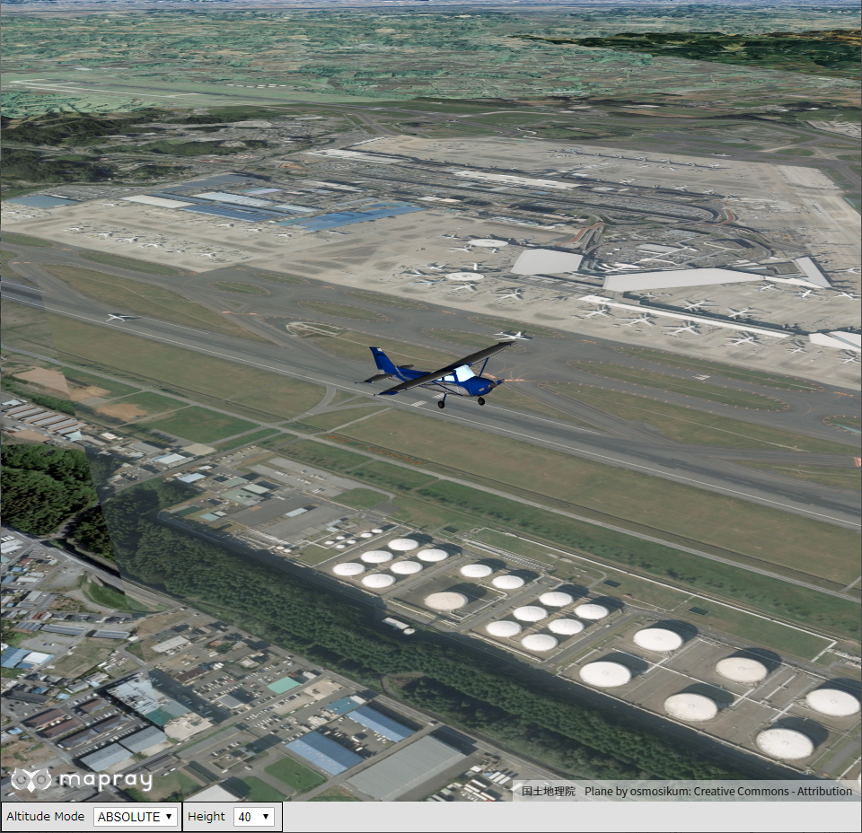
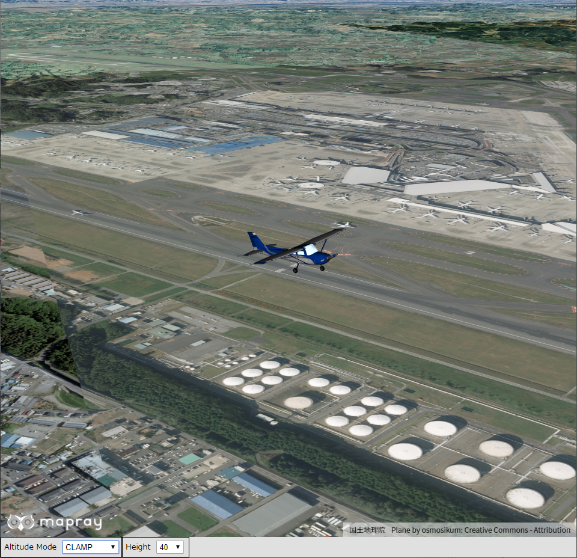
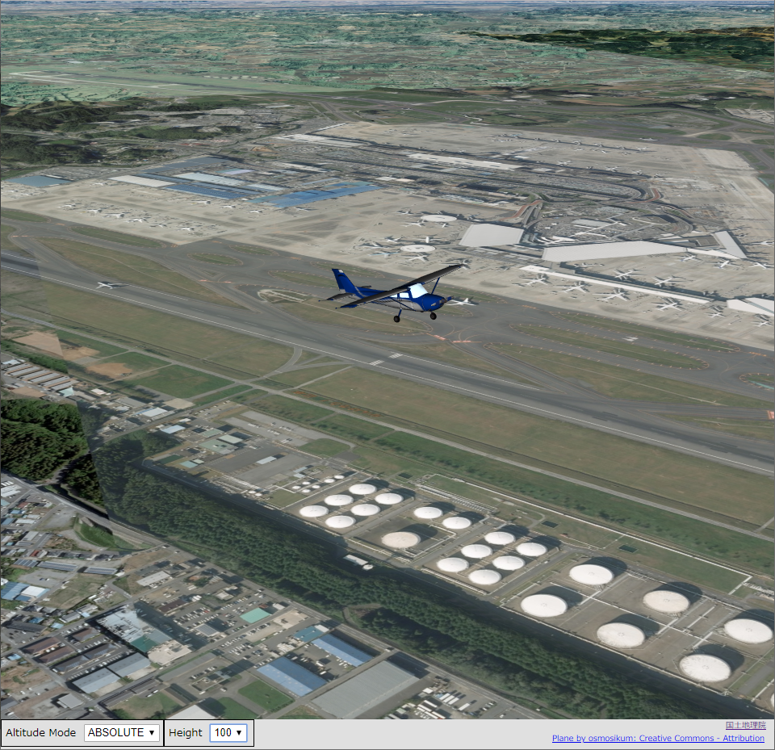

## モデルの高度の設定方法の変更

モデルの高度の設定方法を変更する方法を説明します。

### サンプルコード
モデルの高度の設定方法をを変更する**ChangeAltitudeMode.html**及び、**ChangeAltitudeMode.js**のサンプルコードとシーンファイル（**glTFChangeAltitudeMode.json**）です。
このサンプルコードでは、ユーザインタフェースを介して、高度モードを変更します。変更できる項目は、高度の設定方法、高さです。
高度の設定方法は、ABSOLUTE（絶対値）、RELATIVE（地表面からの相対値）、CLAMP（地表面に接地）に、高さは、0、40、100にそれぞれ変更できます。

#### glTFデータの入手
[Sketchfab](https://sketchfab.com/3d-models/plane-cedc8a07370747f7b0d14400cdf2faf9)へアクセスし、glTFファイルフォーマットのデータをダウンロードする、もしくは[ダウンロードリンク](https://storage.cloud.google.com/mapray-examples/model/download/plane.zip)をクリックしてダウンロードしてください。ダウンロードリンクからダウンロードした場合はzipファイルを展開してご利用ください。展開したデータは解凍した結果できたディレクトリを含めて、mapray-jsのルートディレクトリからの相対パスで以下のディレクトリに保存されているという想定で以下の説明を行います。

```
./examples/entity/gltf/data/
```

なお、データは当社の著作物ではありません。著作権は各データの作成者に帰属します。詳細はフォルダ中のLICENSEファイルを参照の上ご利用ください。
ユーザーの皆様がコンテンツの権利を侵害した場合、当社では一切責任を追うものではありませんのでご注意ください。

#### ChangeAltitudeMode.html

```HTML
<!DOCTYPE html>
<html>
    <head>
        <meta charset="utf-8">
        <title>ChangeAltitudeModeSample</title>
        <script src="https://resource.mapray.com/mapray-js/v0.8.2/mapray.min.js"></script>
        <link rel="stylesheet" href="https://resource.mapray.com/styles/v1/mapray.css">
        <script src="ChangeAltitudeMode.js" charset="utf-8"></script>
        <style>
            html, body {
                height: 100%;
                margin: 0;
                background-color:#E0E0E0;
            }

            select{
                height:22px;
                vertical-align:middle;
                font-size:13px;
                margin-left:10px;
            }

            p {
                margin-left:5px;
                font-size:13px;
            }

            input{
                margin-left:10px;
            }

            div#mapray-container {
                display: flex;
                position: relative;
                height: calc(100% - 34px);
            }

            div#AltitudeModeBox{
                display: flex;
                background-color:#E0E0E0;
                height: 32px;
                width: 200px;
                float:left;
                border:inset 1px #000000;
                align-items:center;
            }

            div#HeightBox{
                display: flex;
                background-color:#E0E0E0;
                height: 32px;
                width: 110px;
                float:left;
                border:inset 1px #000000;
                align-items:center;
            }
        </style>
    </head>

    <body onload="CreateChangeAltitudeModeInstance('mapray-container');">
        <div id="mapray-container"></div>

        <div id="AltitudeModeBox">
                <p>Altitude Mode</p>
                <select name="AltitudeModePullDown" id="AltitudeModePullDown" onchange="AltitudeModeValueChanged()">
                    <option value="ABSOLUTE">ABSOLUTE</option>
                    <option value="RELATIVE">RELATIVE</option>
                    <option value="CLAMP">CLAMP</option>
                </select>
        </div>

        <div id="HeightBox">
                <p>Height</p>
                <select name="HeightPullDown" id="HeightPullDown" onchange="HeightValueChanged()">
                    <option value=0>0</option>
                    <option value=40 selected>40</option>
                    <option value=100>100</option>
                </select>
        </div>
    </body>
</html>
```

#### ChangeAltitudeMode.js

```JavaScript
var change_altitude_mode;

class ChangeAltitudeMode {
    constructor(container) {
        // Access Tokenを設定
        var accessToken = "<your access token here>";

        // Viewerを作成する
        this.viewer = new mapray.Viewer(
            container, {
                image_provider: this.createImageProvider(),
                dem_provider: new mapray.CloudDemProvider(accessToken)
            }
        );

        // glTFモデルのライセンス表示
        this.viewer.attribution_controller.addAttribution( {
            display: "Plane by osmosikum: Creative Commons - Attribution",
            link: "https://sketchfab.com/3d-models/plane-cedc8a07370747f7b0d14400cdf2faf9"
        } );

        this.model_Point = new mapray.GeoPoint(140.379528, 35.758832, 40.0);    //モデルの球面座標(経度、緯度、高度)
        this.altitude_mode = mapray.AltitudeMode.ABSOLUTE;

        this.SetCamera()

        this.LoadScene();
    }

    // 画像プロバイダを生成
    createImageProvider() {
        // 国土地理院提供の汎用的な地図タイルを設定
        return new mapray.StandardImageProvider("https://cyberjapandata.gsi.go.jp/xyz/seamlessphoto/", ".jpg", 256, 2, 18);
    }

    // カメラ位置の設定
    SetCamera() {
        // 球面座標系（経度、緯度、高度）で視点を設定。成田国際空港付近
        var home_pos = { longitude: 140.379528, latitude: 35.758832, height: 40 };

        // 球面座標から地心直交座標へ変換
        var home_view_geoPoint = new mapray.GeoPoint( home_pos.longitude, home_pos.latitude, home_pos.height );
        var home_view_to_gocs = home_view_geoPoint.getMlocsToGocsMatrix( mapray.GeoMath.createMatrix() );

        // 視線方向を定義
        var cam_pos = mapray.GeoMath.createVector3([-500, -1500, 500]);
        var cam_end_pos = mapray.GeoMath.createVector3([0, 0, 0]);
        var cam_up = mapray.GeoMath.createVector3([0, 0, 1]);

        // ビュー変換行列を作成
        var view_to_home = mapray.GeoMath.createMatrix();
        mapray.GeoMath.lookat_matrix(cam_pos, cam_end_pos, cam_up, view_to_home);

        // カメラの位置と視線方向からカメラの姿勢を変更
        var view_to_gocs = this.viewer.camera.view_to_gocs;
        mapray.GeoMath.mul_AA(home_view_to_gocs, view_to_home, view_to_gocs);

        // カメラのnear  farの設定
        this.viewer.camera.near = 30;
        this.viewer.camera.far = 500000;
    }

    // シーンの読み込み
    LoadScene() {
        var scene_File_URL = "./data/glTFChangeAltitudeMode.json";

        // シーンを読み込む
        var loader = new mapray.SceneLoader(this.viewer.scene, scene_File_URL, {
            transform: (url, type) => this.onTransform(url, type),
            callback: (loader, isSuccess) => {
                this.onLoadScene(loader, isSuccess);
            }
        });

        loader.load();
    }

    onTransform(url, type) {
        return {
            url: url,
            credentials: mapray.CredentialMode.SAME_ORIGIN,
            headers: {}
        };
    }

    onLoadScene(loader, isSuccess) {
        if (isSuccess) {
            this.UpdateModelPosition();
        }
    }

    UpdateModelPosition() {
        // sceneのEntityを取得
        var entity = this.viewer.scene.getEntity(0);

        // 高度モードを設定
        entity.altitude_mode = this.altitude_mode;

        // モデルの位置を設定
        entity.setPosition(this.model_Point);

        // モデルの回転
        entity.setOrientation(new mapray.Orientation(130, -90, 0));

        // モデルのスケールを設定
        entity.setScale([0.2, 0.2, 0.2]);
    }

    ChangeAltitudeMode() {
        // プルダウンの値取得
        var altitude_mode_Value = document.getElementById("AltitudeModePullDown").value;

        // プルダウンの値を設定
        this.altitude_mode = altitude_mode_Value;

        switch ( altitude_mode_Value ) {
            case mapray.AltitudeMode.ABSOLUTE.id:
                    this.altitude_mode = mapray.AltitudeMode.ABSOLUTE;
                break;
            case mapray.AltitudeMode.RELATIVE.id:
                    this.altitude_mode = mapray.AltitudeMode.RELATIVE;
                break;
            case mapray.AltitudeMode.CLAMP.id:
                this.altitude_mode = mapray.AltitudeMode.CLAMP;
                break;                
        }

        this.UpdateModelPosition();
    }

    ChangeHeight() {
        // プルダウンの値取得
        var height_Value = parseFloat(document.getElementById("HeightPullDown").value);

        // プルダウンの値を設定
        this.model_Point.altitude = height_Value;

        this.UpdateModelPosition();
    }

}

function CreateChangeAltitudeModeInstance(container) {
    change_altitude_mode = new ChangeAltitudeMode(container);
}

function AltitudeModeValueChanged() {
    change_altitude_mode.ChangeAltitudeMode()
}

function HeightValueChanged() {
    change_altitude_mode.ChangeHeight()
}
```

#### シーンファイル（glTFChangeAltitudeMode.json）
```json
{
  "model_register": { "model-0": { "link": "./plane/scene.gltf" } },
  "entity_list": [{
    "type": "model",
    "mode": "basic",
    "transform": { "position": [140.379528, 35.758832, 40.0] },
    "ref_model": "model-0",
    "altitude_mode": "absolute"
    }
  ]
}
```

### htmlのサンプルコードの詳細
htmlのサンプルコードの詳細を以下で解説します。

#### htmlの文字コード設定
4行目でhtmlの文字コードを設定します。このサンプルコードでは、utf-8を設定します。

```HTML
<meta charset="utf-8">
```

#### タイトルの設定
5行目でタイトルの設定をします。このサンプルコードでは、ChangeAltitudeModeSampleを設定します。

```HTML
<title>ChangeAltitudeModeSample</title>
```

#### JavaScriptファイルのパス設定
6～8行目で参照するJavaScript及びスタイルシートのパスを設定します。このサンプルコードでは、maprayのJavaScriptファイル、スタイルシート、高度モードを変えるJavaScriptファイル（**ChangeAltitudeMode.js**）を設定します。高度モードを変えるJavaScriptファイルの文字コードはutf-8に設定します。

```HTML
<script src="https://resource.mapray.com/mapray-js/v0.8.2/mapray.min.js"></script>
<link rel="stylesheet" href="https://resource.mapray.com/styles/v1/mapray.css">
<script src="ChangeAltitudeMode.js" charset="utf-8"></script>
```

#### スタイルの設定
9～57行目で表示する要素のスタイルを設定します。このサンプルコードでは、下記のスタイルを設定します。
- html
- body
- select
- p
- input
- div#mapray-container（地図表示部分）
- div#AltitudeModeBox（高度の設定方法変更コンボボックス表示部分）
- div#HeightBox（高さ変更コンボボックス表示部分）

```HTML
<style>
    html, body {
        height: 100%;
        margin: 0;
        background-color:#E0E0E0;
    }

    select{
        height:22px;
        vertical-align:middle;
        font-size:13px;
        margin-left:10px;
    }

    p {
        margin-left:5px;
        font-size:13px;
    }

    input{
        margin-left:10px;
    }

    div#mapray-container {
        display: flex;
        position: relative;
        height: calc(100% - 34px);
    }

    div#AltitudeModeBox{
        display: flex;
        background-color:#E0E0E0;
        height: 32px;
        width: 200px;
        float:left;
        border:inset 1px #000000;
        align-items:center;
    }

    div#HeightBox{
        display: flex;
        background-color:#E0E0E0;
        height: 32px;
        width: 110px;
        float:left;
        border:inset 1px #000000;
        align-items:center;
    }
</style>
```

#### loadイベントの設定
画面を表示するときに、高度モード変更クラスを生成します。そのため、60行目でページ読み込み時に、高度モードを変更するクラスのインスタンスを生成する関数（**CreateChangeAltitudeModeInstance**）を呼ぶように設定します。
高度モードを変更するクラスのインスタンスを生成する関数は、JavaScriptのサンプルコードの詳細で説明します。

```HTML
<body onload="CreateChangeAltitudeModeInstance('mapray-container');">
```

#### 地図表示部分の指定
61行目で地図表示部分のブロックを記述します。
詳細はヘルプページ『**緯度経度によるカメラ位置の指定**』を参照してください。

```HTML
<div id="mapray-container"></div>
```

#### 高度の設定方法変更のUI
63～70行目で高度の設定方法変更コンボボックス表示部分のブロックを記述します。このブロックの中には、高度の設定方法を変更するコンボボックスを用意します。このサンプルコードでは、ABSOLUTE、RELATIVE、CLAMPを設定します。
高度の設定方法を変更するコンボボックスが変更された時のイベント（onchange）に、高度の設定方法変更のコンボボックス変更時に呼び出す関数（**AltitudeModeValueChanged**）を設定します。
高度の設定方法変更のコンボボックス変更時に呼び出す関数はJavaScriptのサンプルコードの詳細で説明します。

```HTML
<div id="AltitudeModeBox">
        <p>Altitude Mode</p>
        <select name="AltitudeModePullDown" id="AltitudeModePullDown" onchange="AltitudeModeValueChanged()">
            <option value="ABSOLUTE">ABSOLUTE</option>
            <option value="RELATIVE">RELATIVE</option>
            <option value="CLAMP">CLAMP</option>
        </select>
</div>
```

#### 高さ変更のUI
72～79行目で高さ変更ボタン表示部分のブロックを記述します。このブロックの中には、このブロックの中には、高さを変更するコンボボックスを用意します。このサンプルコードでは、0、40、100を設定します。
高さを変更するコンボボックスが変更された時のイベント（onchange）に、高さのコンボボックス変更時に呼び出す関数（**HeightValueChanged**）を設定します。
高さのコンボボックス変更時に呼び出す関数はJavaScriptのサンプルコードの詳細で説明します。

```HTML
<div id="HeightBox">
        <p>Height</p>
        <select name="HeightPullDown" id="HeightPullDown" onchange="HeightValueChanged()">
            <option value=0>0</option>
            <option value=40 selected>40</option>
            <option value=100>100</option>
        </select>
</div>
```

### JavaScriptのサンプルコードの詳細
JavaScriptのサンプルコードの詳細を以下で解説します。

#### クラスとグローバル変数の説明
3～141行目でモデルの高度の設定方法を変更するクラスを定義します。クラス内の各メソッドの詳細は以降で解説します。
また、1行目でモデルの高度の設定方法を変更するクラスのグローバル変数を定義します。

```JavaScript
var change_altitude_mode;

class ChangeAltitudeMode {

  //中略

}
```

#### コンストラクタ
4～28行目がモデルの高度の設定方法を変更するクラスのコンストラクタです。
引数として渡されるブロックのidに対して、mapray.Viewerを作成し、glTFモデルの出典情報を追加します。そして、カメラの位置・向きの設定、シーンの読み込みの順にメソッド呼び出します。mapray.Viewerのベース地図の画像プロバイダは、画像プロバイダの生成メソッドで取得した画像プロバイダを設定します。
mapray.Viewerの作成の詳細は、ヘルプページ『**緯度経度によるカメラ位置の指定**』を参照してください。

```JavaScript
constructor(container) {
    // Access Tokenを設定
    var accessToken = "<your access token here>";

    // Viewerを作成する
    this.viewer = new mapray.Viewer(
        container, {
            image_provider: this.createImageProvider(),
            dem_provider: new mapray.CloudDemProvider(accessToken)
        }
    );

    // glTFモデルのライセンス表示
    this.viewer.attribution_controller.addAttribution( {
        display: "Plane by osmosikum: Creative Commons - Attribution",
        link: "https://sketchfab.com/3d-models/plane-cedc8a07370747f7b0d14400cdf2faf9"
    } );    

    this.model_Point = new mapray.GeoPoint(140.379528, 35.758832, 40.0);    //モデルの球面座標(経度、緯度、高度)
    this.altitude_mode = mapray.AltitudeMode.ABSOLUTE;

    this.SetCamera()

    this.LoadScene();
}
```

#### 画像プロバイダの生成
31～34行目が画像プロバイダの生成メソッドです。生成した画像プロバイダを返します。
画像プロバイダの生成の詳細は、ヘルプページ『**緯度経度によるカメラ位置の指定**』を参照してください。

```JavaScript
// 画像プロバイダを生成
createImageProvider() {
    // 国土地理院提供の汎用的な地図タイルを設定
    return new mapray.StandardImageProvider("https://cyberjapandata.gsi.go.jp/xyz/seamlessphoto/", ".jpg", 256, 2, 18);
}
```

#### カメラの位置・向きの設定
37～61行目がカメラの位置・向きの設定メソッドです。
カメラの位置・向きの設定は、ヘルプページ『**緯度経度によるカメラ位置の指定**』を参照してください。

```JavaScript
// カメラ位置の設定
SetCamera() {
    // 球面座標系（経度、緯度、高度）で視点を設定。成田国際空港付近
    var home_pos = { longitude: 140.379528, latitude: 35.758832, height: 40 };

    // 球面座標から地心直交座標へ変換
    var home_view_geoPoint = new mapray.GeoPoint( home_pos.longitude, home_pos.latitude, home_pos.height );
    var home_view_to_gocs = home_view_geoPoint.getMlocsToGocsMatrix( mapray.GeoMath.createMatrix() );

    // 視線方向を定義
    var cam_pos = mapray.GeoMath.createVector3([-500, -1500, 500]);
    var cam_end_pos = mapray.GeoMath.createVector3([0, 0, 0]);
    var cam_up = mapray.GeoMath.createVector3([0, 0, 1]);

    // ビュー変換行列を作成
    var view_to_home = mapray.GeoMath.createMatrix();
    mapray.GeoMath.lookat_matrix(cam_pos, cam_end_pos, cam_up, view_to_home);

    // カメラの位置と視線方向からカメラの姿勢を変更
    var view_to_gocs = this.viewer.camera.view_to_gocs;
    mapray.GeoMath.mul_AA(home_view_to_gocs, view_to_home, view_to_gocs);

    // カメラのnear、farの設定
    this.viewer.camera.near = 30;
    this.viewer.camera.far = 500000;
}
```

#### シーンのロード
64～77行目がシーンのロードメソッドです。
シーンのロードは、ヘルプページ『**glTFモデルの表示（SceneLoaderを使った表示）**』を参照してください。

```JavaScript
// シーンの読み込み
LoadScene() {
    var scene_File_URL = "./data/glTFChangeAltitudeMode.json";

    // シーンを読み込む
    var loader = new mapray.SceneLoader(this.viewer.scene, scene_File_URL, {
        transform: (url, type) => this.onTransform(url, type),
        callback: (loader, isSuccess) => {
            this.onLoadScene(loader, isSuccess);
        }
    });

    loader.load();
}
```

#### リソース要求変換
78～84行目がリソース要求変換メソッドです。
リソース要求変換は、ヘルプページ『**glTFモデルの表示（SceneLoaderを使った表示）**』を参照してください。

```JavaScript
onTransform(url, type) {
    return {
        url: url,
        credentials: mapray.CredentialMode.SAME_ORIGIN,
        headers: {}
    };
}
```

#### シーンのロード終了イベント
86～90行目がシーンのロード終了イベントメソッドです。引数のisSuccessには、読み込み結果が格納されており、trueの場合のみ読み込んだglTFモデルを表示し、glTFモデルを操作できるようにします。
glTFモデルのロード成功可否をtrueにし、glTFモデルの表示位置を設定するメソッドを呼び出します。glTFモデルの表示位置を設定するメソッドの詳細は後述します。

```JavaScript
onLoadScene(loader, isSuccess) {
    if (isSuccess) {
        this.UpdateModelPosition();
    }
}
```

#### glTFモデルの表示位置の設定
92～107行目がglTFモデルの表示位置の設定メソッドです。高度の設定方法の設定、モデルの表示位置、向き、スケールをモデルのエンティティに反映します。
97行目で高度の設定方法を、101行目でモデルの表示位置を、103行目でモデルの向きを、106行目でモデルのスケールをそれぞれ設定します。
なお、読み込んだモデルは1つ目のエンティティとなるため、エンティティ取得時の引数には0を指定します。

```JavaScript
UpdateModelPosition() {
    // sceneのEntityを取得
    var entity = this.viewer.scene.getEntity(0);

    // 高度モードを設定
    entity.altitude_mode = this.altitude_mode;

    // モデルの位置を設定
    entity.setPosition(this.model_Point);

    // モデルの回転
    entity.setOrientation(new mapray.Orientation(130, -90, 0));

    // モデルのスケールを設定
    entity.setScale([0.2, 0.2, 0.2]);
}
```

#### 高度の設定方法の変更
109～129行目が高度の設定方法の変更メソッドです。111行目で高度の設定方法を変更するコンボボックスから文字列を取得します。そして、114～126行目で取得した文字列を高度の設定方法として設定し、128行目でglTFモデルの表示位置の設定を呼び出します。

```JavaScript
ChangeAltitudeMode() {
    // プルダウンの値取得
    var altitude_mode_Value = document.getElementById("AltitudeModePullDown").value;

    // プルダウンの値を設定
    this.altitude_mode = altitude_mode_Value;

    switch ( altitude_mode_Value ) {
        case mapray.AltitudeMode.ABSOLUTE.id:
                this.altitude_mode = mapray.AltitudeMode.ABSOLUTE;
            break;
        case mapray.AltitudeMode.RELATIVE.id:
                this.altitude_mode = mapray.AltitudeMode.RELATIVE;
            break;
        case mapray.AltitudeMode.CLAMP.id:
            this.altitude_mode = mapray.AltitudeMode.CLAMP;
            break;
    }

    this.UpdateModelPosition();
}
```

#### 高さの変更
131～140行目が高さの変更メソッドです。133行目で高さを変更するコンボボックスから値を取得し、136行目で高さの値として設定します。その後、138行目でglTFモデルの表示位置の設定を呼び出します。

```JavaScript
ChangeHeight() {
    // プルダウンの値取得
    var height_Value = parseFloat(document.getElementById("HeightPullDown").value);

    // プルダウンの値を設定
    this.model_Point.altitude = height_Value;

    this.UpdateModelPosition();
}
```

#### 高度の設定方法変更クラスのインスタンス生成
143～145行目の関数は、引数として渡されるブロックのidを利用して、高度の設定方法変更クラスのインスタンスを生成します。

```JavaScript
function CreateChangeAltitudeModeInstance(container) {
    change_altitude_mode = new ChangeAltitudeMode(container);
}
```

#### 高度の設定方法変更時のイベント
147～149行目の関数は、高度の設定方法変更時に呼ばれ、高度の設定方法変更クラスの高度の設定方法変更メソッドを呼び出します。

```JavaScript
function AltitudeModeValueChanged() {
    change_altitude_mode.ChangeAltitudeMode()
}
```

#### 高さ変更時のイベント
151～153行目の関数は、高さ変更時に呼ばれ、高度モード変更クラスの高さ変更メソッドを呼び出します。

```JavaScript
function HeightValueChanged() {
    change_altitude_mode.ChangeHeight()
}
```

### シーンファイルの詳細
シーンファイルの詳細を以下で解説します。なお、シーンファイルはJSON形式で記述します。

#### エンティティの設定
3行目でentity_listという名称でエンティティを定義し、その中にエンティティの詳細を定義します。4行目のtypeという名称は、エンティティの種類を表し、glTFモデルの場合はmodelを指定します。

```json
{

  中略

  "entity_list": [{
    "type": "model",

      中略

    }
  ]
}
```

#### メッシュのデータ
2行目でmodel_registerという名称でモデルデータを定義します。このシーンファイルでは、モデルデータのIDをmodel-0とし、モデルファイルをファイルから読み込むために、linkという名称にglTFファイルのURLを指定します。

```json
"model_register": { "model-0": { "link": "./plane/scene.gltf" } },
```

#### 汎用エンティティの設定
4～8行目で汎用エンティティの設定をします。汎用エンティティには以下の内容を定義します。
- モード（mode）　⇒　basic
- 初期姿勢（transform）　⇒　球面座標系（position）での初期位置
- モデルデータ（ref_model）　⇒　モデルデータのID（model-0）
- 高度モード（altitude_mode）　⇒　絶対値（absolute）

```json
"type": "model",
"mode": "basic",
"transform": { "position": [140.379528, 35.758832, 40.0] },
"ref_model": "model-0",
"altitude_mode": "absolute"
```

### 出力イメージ
このサンプルコードで初期状態（高度モード：ABSOLUTE、高さ：40）の出力イメージは下図のようになります。


初期状態から、高度モードをRELATIVEにした時の出力イメージは下図のようになります。


初期状態から、高度モードをCLAMPにした時の出力イメージは下図のようになります。


初期状態から、高さを100にした時の出力イメージは下図のようになります。

