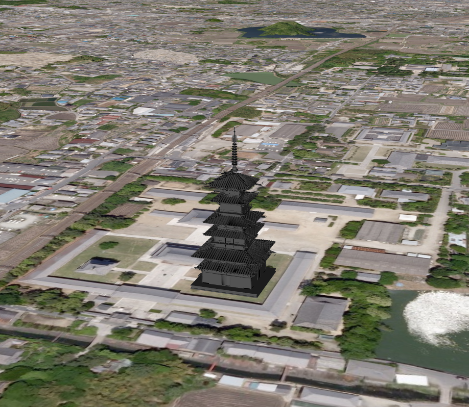
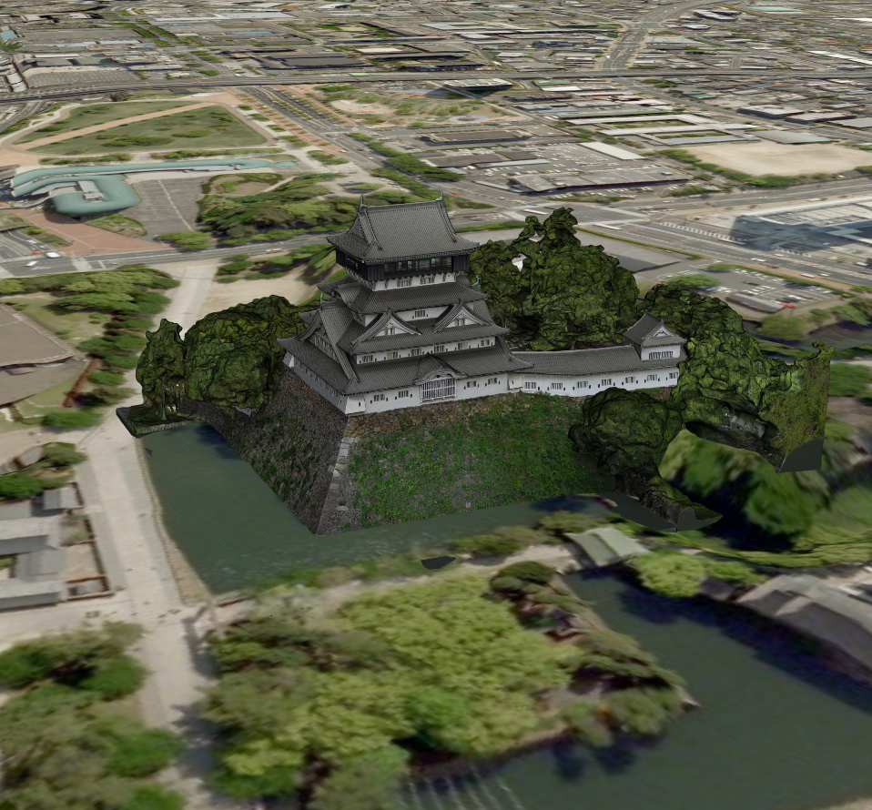

<!---
title: "　8.1 glTFモデルの表示(SceneLoaderを使った表示)"
date: 2019-12-02T18:35:00+09:00
draft: false
description: "glTFモデルの表示"
keywords: ["チュートリアル", "モデル", "glTF", "SceneLoader", "薬師寺", "小倉城"]
type: tutorials
menu: main
weight: 2081
--->

## glTFモデルの表示（SceneLoaderを使った表示）

mapray.SceneLoaderを使ってglTFモデルを表示する方法を説明します。

### サンプルコード
mapray.SceneLoaderを使ってglTFモデルを表示する**LoadglTFModel.html**及び、**LoadglTFModel.js**のサンプルコードとシーンファイル（**glTFLoad.json**）です。
このサンプルコードでは、薬師寺の場所に3Dモデルを表示します。

#### glTFデータの入手
[PART Community](https://b2b.partcommunity.com/community/knowledge/ja/detail/435/Yakushi-ji)へアクセスし、glTFファイルフォーマットのデータをダウンロードする、もしくは[ダウンロードリンク](https://storage.cloud.google.com/mapray-examples/model/download/Yakushiji_Temple.zip)をクリックしてダウンロードしてください。ダウンロードリンクからダウンロードした場合はzipファイルを展開してご利用ください。展開したデータは解凍した結果できたディレクトリを含めて、mapray-jsのルートディレクトリからの相対パスで以下のディレクトリに保存されているという想定で以下の説明を行います。

<!--@ none -->
```
./examples/entity/gltf/data/
```

なお、データは当社の著作物ではありません。著作権は各データの作成者に帰属します。詳細はフォルダ中のLICENSEファイルを参照の上ご利用ください。
ユーザーの皆様がコンテンツの権利を侵害した場合、当社では一切責任を追うものではありませんのでご注意ください。


#### LoadglTFModel.html
<!--@ 1 -->
```HTML
<!DOCTYPE html>
<html>
    <head>
        <meta charset="UTF-8">
        <title>LoadglTFModelSample</title>
        <script src="https://resource.mapray.com/mapray-js/v0.8.7/mapray.min.js"></script>
        <link rel="stylesheet" href="https://resource.mapray.com/styles/v1/mapray.css">
        <script src="LoadglTFModel.js"></script>
        <style>
            html, body {
                height: 100%;
                margin: 0;
            }

            div#mapray-container {
                display: flex;
                position: relative;
                height: 100%;
            }
        </style>
    </head>

    <body onload="new LoadModel('mapray-container');">
        <div id="mapray-container"></div>
    </body>
</html>
```

#### LoadglTFModel.js
<!--@ 1 -->
```JavaScript
class LoadModel {
    constructor(container) {
        // Access Tokenを設定
        var accessToken = "<your access token here>";

        // Viewerを作成する
        this.viewer = new mapray.Viewer(
            container, {
                image_provider: this.createImageProvider(),
                dem_provider: new mapray.CloudDemProvider(accessToken)
            }
        );

        // glTFモデルのライセンス表示
        this.viewer.attribution_controller.addAttribution( {
            display: "Yakushiji Temple by Daily CAD is licensed under: Creative Commons - Attribution - ShareAlike International",
            link: "https://b2b.partcommunity.com/community/knowledge/ja/detail/435/Yakushi-ji"
        } );

        this.SetCamera();

        this.LoadScene();
    }

    // 画像プロバイダを生成
    createImageProvider() {
        // 国土地理院提供の汎用的な地図タイルを設定
        return new mapray.StandardImageProvider("https://cyberjapandata.gsi.go.jp/xyz/seamlessphoto/", ".jpg", 256, 2, 18);
    }

    // カメラ位置の設定
    SetCamera() {
        // 球面座標系（経度、緯度、高度）で視点を設定。モデルの座標を設定
        var home_pos = { longitude: 135.784682, latitude: 34.668107, height: 100.0 };

        // 球面座標から地心直交座標へ変換
        var home_view_geoPoint = new mapray.GeoPoint( home_pos.longitude, home_pos.latitude, home_pos.height );
        var home_view_to_gocs = home_view_geoPoint.getMlocsToGocsMatrix( mapray.GeoMath.createMatrix() );

        // 視線方向を定義
        var cam_pos = mapray.GeoMath.createVector3([100, -300, 100]);
        var cam_end_pos = mapray.GeoMath.createVector3([0, 0, 0]);
        var cam_up = mapray.GeoMath.createVector3([0, 0, 1]);

        // ビュー変換行列を作成
        var view_to_home = mapray.GeoMath.createMatrix();
        mapray.GeoMath.lookat_matrix(cam_pos, cam_end_pos, cam_up, view_to_home);

        // カメラの位置と視線方向からカメラの姿勢を変更
        var view_to_gocs = this.viewer.camera.view_to_gocs;
        mapray.GeoMath.mul_AA(home_view_to_gocs, view_to_home, view_to_gocs);

        // カメラのnear、farの設定
        this.viewer.camera.near = 30;
        this.viewer.camera.far = 500000;
    }

    // シーンの読み込み
    LoadScene() {
      var scene_File_URL = "./data/glTFLoad.json";

        // シーンを読み込む
        var loader = new mapray.SceneLoader(this.viewer.scene, scene_File_URL, {
            transform: (url, type) => this.onTransform(url, type),
            callback: (loader, isSuccess) => {
                this.onLoadScene(loader, isSuccess);
            }
        });

        loader.load();
    }

    onTransform(url, type) {
        return {
            url: url,
            credentials: mapray.CredentialMode.SAME_ORIGIN,
            headers: {}
        };
    }

    onLoadScene(loader, isSuccess) {
        if (isSuccess) {
            // sceneのEntityを取得
            var entity = this.viewer.scene.getEntity(0);

            // モデルの回転
            entity.setOrientation(new mapray.Orientation(180, 0, 0));
        }
    }

}
```

#### シーンファイル（glTFLoad.json）
<!--@ 1 -->
```json
{
  "model_register": { "model-0": { "link": "./Yakushiji_Temple/Yakushiji_Temple.gltf" } },
  "entity_list": [{
    "type": "model",
    "mode": "basic",
    "transform": { "position": [135.784682, 34.668107, 57.0] },
    "ref_model": "model-0",
    "altitude_mode": "absolute"
    }
  ]
}
```

### htmlのサンプルコードの詳細
htmlのサンプルコードの詳細を以下で解説します。

#### htmlの文字コード設定
4行目でhtmlの文字コードを設定します。このサンプルコードでは、utf-8を設定します。

<!--@ 4 -->
```HTML
<meta charset="UTF-8">
```

#### タイトルの設定
5行目でタイトルを設定します。このサンプルコードでは、LoadglTFModelSampleを設定します。

<!--@ 5 -->
```HTML
<title>LoadglTFModelSample</title>
```

#### JavaScriptファイルのパス設定
6～8行目で参照するJavaScript及びスタイルシートのパスを設定します。このサンプルコードでは、maprayのJavaScriptファイル、スタイルシート、モデルのシーンを読み込むJavaScriptファイル（**Load3DModel.js**）を設定します。

<!--@ 6 -->
```HTML
<script src="https://resource.mapray.com/mapray-js/v0.8.7/mapray.min.js"></script>
<link rel="stylesheet" href="https://resource.mapray.com/styles/v1/mapray.css">
<script src="LoadglTFModel.js"></script>
```

#### スタイルの設定
9～20行目で表示する要素のスタイルを設定します。スタイルの詳細は、ヘルプページ『**緯度経度によるカメラ位置の指定**』を参照してください。

<!--@ 9 -->
```HTML
<style>
    html, body {
        height: 100%;
        margin: 0;
    }

    div#mapray-container {
        display: flex;
        position: relative;
        height: 100%;
    }
</style>
```

#### loadイベントの処理
画面を表示するときに、モデルシーン読み込みクラスを生成します。そのため、23行目でページの読み込み時に、地図表示部分のブロックのidからモデルシーン読み込みクラスのインスタンスを生成します。
モデルシーン読み込みクラスはJavaScriptのサンプルコードの詳細で説明します。

<!--@ 23 -->
```HTML
<body onload="new LoadModel('mapray-container');">
```

#### 地図表示部分の指定
24行目で地図表示部分のブロックを記述します。
詳細はヘルプページ『**緯度経度によるカメラ位置の指定**』を参照してください。

<!--@ 24 -->
```HTML
<div id="mapray-container"></div>
```

### JavaScriptのサンプルコードの詳細
JavaScriptのサンプルコードの詳細を以下で解説します。

#### クラスの説明
2～91行目で、モデルシーンを読み込み、表示するクラスを定義します。クラス内の各メソッドの詳細は以降で解説します。

<!--@ none -->
```JavaScript
class LoadModel {

  //中略

}
```

#### コンストラクタ
2～23行目がモデルシーンを読み込み、表示するクラスのコンストラクタです。引数として渡されるブロックのidに対して、mapray.Viewerを作成し、glTFモデルの出典情報を追加します。そして、カメラの位置・向きの設定メソッドを呼び出します。その後、シーンのロードメソッドを呼び出します。viewerを作成する際の画像プロバイダは画像プロバイダの生成メソッドから取得します。
mapray.Viewerの作成の詳細は、ヘルプページ『**緯度経度によるカメラ位置の指定**』を参照してください。

<!--@ 2 -->
```JavaScript
constructor(container) {
    // Access Tokenを設定
    var accessToken = "<your access token here>";

    // Viewerを作成する
    this.viewer = new mapray.Viewer(
        container, {
            image_provider: this.createImageProvider(),
            dem_provider: new mapray.CloudDemProvider(accessToken)
        }
    );

    // glTFモデルのライセンス表示
    this.viewer.attribution_controller.addAttribution( {
        display: "Yakushiji Temple by Daily CAD is licensed under: Creative Commons - Attribution - ShareAlike International",
        link: "https://b2b.partcommunity.com/community/knowledge/ja/detail/435/Yakushi-ji"
    } );

    this.SetCamera();

    this.LoadScene();
}
```

#### 画像プロバイダの生成
26～29行目が画像プロバイダの生成メソッドです。生成した画像プロバイダを返します。
画像プロバイダの生成の詳細は、ヘルプページ『**緯度経度によるカメラ位置の指定**』を参照してください。

<!--@ 25 -->
```JavaScript
// 画像プロバイダを生成
createImageProvider() {
    // 国土地理院提供の汎用的な地図タイルを設定
    return new mapray.StandardImageProvider("https://cyberjapandata.gsi.go.jp/xyz/seamlessphoto/", ".jpg", 256, 2, 18);
}
```

#### カメラの位置・向きの設定
32～56行目がカメラの位置・向きの設定メソッドです。
カメラの位置・向きの設定は、ヘルプページ『**緯度経度によるカメラ位置の指定**』を参照してください。

<!--@ 31 -->
```JavaScript
// カメラ位置の設定
SetCamera() {
    // 球面座標系（経度、緯度、高度）で視点を設定。モデルの座標を設定
    var home_pos = { longitude: 135.784682, latitude: 34.668107, height: 100.0 };

    // 球面座標から地心直交座標へ変換
    var home_view_geoPoint = new mapray.GeoPoint( home_pos.longitude, home_pos.latitude, home_pos.height );
    var home_view_to_gocs = home_view_geoPoint.getMlocsToGocsMatrix( mapray.GeoMath.createMatrix() );

    // 視線方向を定義
    var cam_pos = mapray.GeoMath.createVector3([100, -300, 100]);
    var cam_end_pos = mapray.GeoMath.createVector3([0, 0, 0]);
    var cam_up = mapray.GeoMath.createVector3([0, 0, 1]);

    // ビュー変換行列を作成
    var view_to_home = mapray.GeoMath.createMatrix();
    mapray.GeoMath.lookat_matrix(cam_pos, cam_end_pos, cam_up, view_to_home);

    // カメラの位置と視線方向からカメラの姿勢を変更
    var view_to_gocs = this.viewer.camera.view_to_gocs;
    mapray.GeoMath.mul_AA(home_view_to_gocs, view_to_home, view_to_gocs);

    // カメラのnear、farの設定
    this.viewer.camera.near = 30;
    this.viewer.camera.far = 500000;
}
```

#### シーンのロード
59～71行目がシーンのロードメソッドです。mapray.SceneLoaderでシーンを読み込みます。
SceneLoaderクラス生成時の引数には、シーンファイルのエンティティを追加するシーン、読み込むシーンファイルのURL、オプション集合の順に指定します。このサンプルコードでは、viewerクラスのシーン、60行目で設定したURL、リソース要求変換関数、シーンのロードが終了した時のコールバック関数の順に指定します。読み込むシーンのURLはhttpもしくはhttpsでアクセスできるURLを指定します。最後に、70行目のload関数を呼び出すことでシーンの読み込みができます。

<!--@ 58 -->
```JavaScript
// シーンの読み込み
LoadScene() {
    var scene_File_URL = "./data/glTFLoad.json";

    // シーンを読み込む
    var loader = new mapray.SceneLoader(this.viewer.scene, scene_File_URL, {
        transform: (url, type) => this.onTransform(url, type),
        callback: (loader, isSuccess) => {
            this.onLoadScene(loader, isSuccess);
        }
    });

    loader.load();
}
```

#### リソース要求変換
73～79行目はリソース要求変換メソッドです。リソースのリクエスト時にURLなどを変換する内容を定義します。このサンプルコードでは、特に指定はしないので、リファレンスに沿った内容で定義します。

<!--@ 73 -->
```JavaScript
onTransform(url, type) {
    return {
        url: url,
        credentials: mapray.CredentialMode.SAME_ORIGIN,
        headers: {}
    };
}
```

#### シーンのロード終了イベント
81～89行目がシーンのロード終了イベントメソッドです。引数のisSuccessには、読み込み結果が格納されており、trueの場合のみ読み込んだglTFモデルを表示します。
読み込んだモデルの向きを調整するため、87行目で、適切な向きをエンティティに反映させることで、地図上にglTFモデルを表示します。なお、読み込んだモデルは1つ目のエンティティとなるため、エンティティ取得時の引数には0を指定します。

<!--@ 81 -->
```JavaScript
onLoadScene(loader, isSuccess) {
    if (isSuccess) {
        // sceneのEntityを取得
        var entity = this.viewer.scene.getEntity(0);

        // モデルの回転
        entity.setOrientation(new mapray.Orientation(180, 0, 0));
    }
}
```

### シーンファイルの詳細
シーンファイルの詳細を以下で解説します。なお、シーンファイルはJSON形式で記述します。

#### エンティティの設定
3行目でentity_listという名称でエンティティを定義し、その中にエンティティの詳細を定義します。4行目のtypeという名称は、エンティティの種類を表し、glTFモデルの場合はmodelを指定します。

<!--@ none -->
```json
{

  中略

  "entity_list": [{
    "type": "model",

      中略

    }
  ]
}
```

#### glTFモデルのデータ
2行目でmodel_registerという名称でモデルデータを定義します。このシーンファイルでは、モデルデータのIDをmodel-0とし、モデルファイルをファイルから読み込むために、linkという名称にglTFファイルのURLを指定します。

<!--@ 2 -->
```json
"model_register": { "model-0": { "link": "./Yakushiji_Temple/Yakushiji_Temple.gltf" } },
```

#### 汎用エンティティの設定
4～8行目で汎用エンティティの設定をします。汎用エンティティには以下の内容を定義します。
- モード（mode）　⇒　basic
- 初期姿勢（transform）　⇒　球面座標系（position）での初期位置
- モデルデータ（ref_model）　⇒　モデルデータのID（model-0）
- 高度モード（altitude_mode）　⇒　初期位置の高度を絶対値で指定（absolute）

<!--@ 4 -->
```json
"type": "model",
"mode": "basic",
"transform": { "position": [135.784682, 34.668107, 57.0] },
"ref_model": "model-0",
"altitude_mode": "absolute"
```

### 出力イメージ
このサンプルコードの出力イメージは下図のようになります。



### glTFモデルの表示の改修
このサンプルコードを改修して、下記のglTFモデルを表示できるようにします。
- 対象のglTFモデルを薬師寺から小倉城に変更する
- カメラが見る位置を小倉城周辺に変更する

また、glTFモデル読み込み時の向き及びスケールはロード後に設定し直す以外に、
シーンファイル内に記載する方法もあるため、その方法についても記載します。

サンプルコードの修正部分は2つあり、以下で解説します。

#### カメラの見る位置の変更
カメラの位置・向きの設定メソッドを下記のように変更します。
この修正では、視点位置はを小倉城周辺に変更し、視線方向も小倉城が眺められる方向に変更しています。

<!--@ none -->
```JavaScript
SetCamera() {
    // 球面座標系（経度、緯度、高度）で視点を設定。モデルの座標を設定
    var home_pos = { longitude: 130.873921, latitude: 33.884291, height: 3.0 };

    // 球面座標から地心直交座標へ変換
    var home_view_geoPoint = new mapray.GeoPoint( home_pos.longitude, home_pos.latitude, home_pos.height );
    var home_view_to_gocs = home_view_geoPoint.getMlocsToGocsMatrix( mapray.GeoMath.createMatrix() );

    // 視線方向を定義
    var cam_pos = mapray.GeoMath.createVector3([200, 200, 100]);
    var cam_end_pos = mapray.GeoMath.createVector3([0, 0, 0]);
    var cam_up = mapray.GeoMath.createVector3([0, 0, 1]);

    // ビュー変換行列を作成
    var view_to_home = mapray.GeoMath.createMatrix();
    mapray.GeoMath.lookat_matrix(cam_pos, cam_end_pos, cam_up, view_to_home);

    // カメラの位置と視線方向からカメラの姿勢を変更
    var view_to_gocs = this.viewer.camera.view_to_gocs;
    mapray.GeoMath.mul_AA(home_view_to_gocs, view_to_home, view_to_gocs);

    // カメラのnear、farの設定
    this.viewer.camera.near = 30;
    this.viewer.camera.far = 500000;
}
```

#### 読み込み対象の変更
シーンのロードメソッドで読み込み対象のシーンファイルを下記のように変更します。
また、シーンファイル上でモデルの向き、スケールを設定するため、ロード後に実行することがなくなるので、今回はコールバック関数を設定しません。


<!--@ none -->
```JavaScript
LoadScene() {
    var scene_File_URL = "./data/glTFLoadVer2.json";

    // シーンを読み込む
    var loader = new mapray.SceneLoader(this.viewer.scene, scene_File_URL, {
        transform: (url, type) => this.onTransform(url, type)
    });

    loader.load();
}
```

#### 変更したシーンファイルの詳細
変更したシーンファイルの詳細は下記のとおりです。
表示するモデルとして、小倉城のglTFモデルデータを読み込むように作成しています。
また、モデルの初期向きとスケールは、offset_transformという名称で指定することができます。
このシーンファイルでは、下記の内容を定義しています。
- ヘディング（X軸回りの回転角度）（heading）　⇒　20
- チルト（Y軸回りの回転角度）（tilt）　⇒　-90
- モデルスケール（scale）　⇒　0.7

<!--@ 1 -->
```json
{
  "model_register": { "model-0": {
    "link": "./kokura_castle/scene.gltf",
    "offset_transform": { "heading": 20, "tilt": -90, "scale": 0.7 }
    }
  },
  "entity_list": [{
    "type": "model",
    "mode": "basic",
    "transform": { "position": [130.873721, 33.884881, -25.0] },
    "ref_model": "model-0",
    "altitude_mode": "absolute"
    }
  ]
}
```

### 出力イメージ
修正したサンプルコードの出力イメージは下図のようになります。

