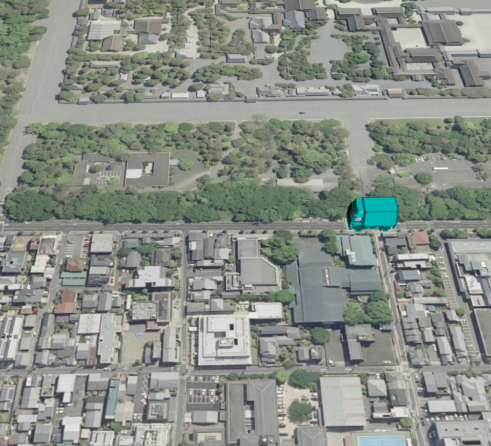
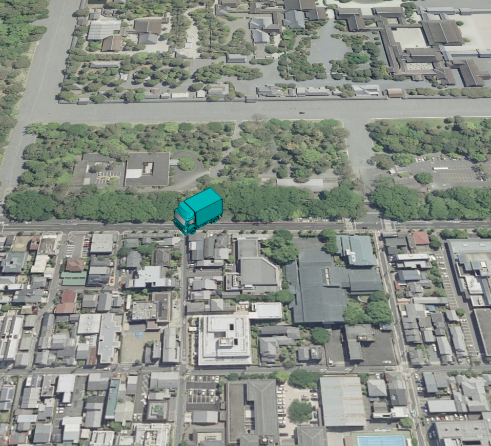
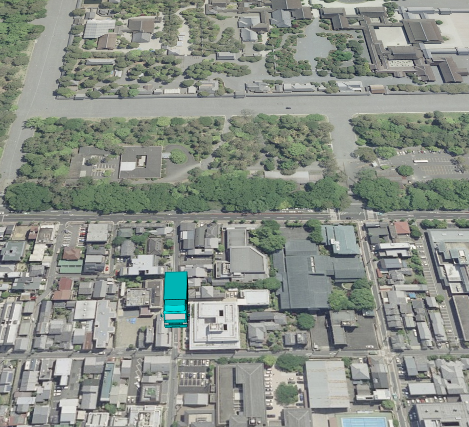

<!---
title: "　8.3 glTFモデルのアニメーション"
date: 2019-12-02T18:35:00+09:00
draft: false
description: "glTFモデルのアニメーション"
keywords: ["チュートリアル", "モデル", "glTF", "位置", "向き", "京都御所"]
type: tutorials
menu: main
weight: 2083
--->

## glTFモデルのアニメーション
動的にglTFモデルの位置・向きを変更するアニメーションを作成する方法を説明します。

### サンプルコード
動的にglTFモデルの位置・向きを変更するアニメーションを作成する**glTFModelAnimation.html**及び、**glTFModelAnimation.js**のサンプルコードとシーンファイル（**glTFAnimation.json**）です。
このサンプルコードでは、glTFモデルが京都御所沿いの道路を北上したのち、西向きに向きを変え、さらに西進するアニメーションを表現します。

#### glTFデータの入手
[Sketchfab](https://sketchfab.com/3d-models/truck-wip-33e925207e134652bd8c2465e5c16957)へアクセスし、glTFファイルフォーマットのデータをダウンロードする、もしくは[ダウンロードリンク](https://storage.cloud.google.com/mapray-examples/model/download/truck_wip.zip)をクリックしてダウンロードしてください。ダウンロードリンクからダウンロードした場合はzipファイルを展開してご利用ください。展開したデータは解凍した結果できたディレクトリを含めて、mapray-jsのルートディレクトリからの相対パスで以下のディレクトリに保存されているという想定で以下の説明を行います。

<!--@ none -->
```
./examples/entity/gltf/data/
```

なお、データは当社の著作物ではありません。著作権は各データの作成者に帰属します。詳細はフォルダ中のLICENSEファイルを参照の上ご利用ください。
ユーザーの皆様がコンテンツの権利を侵害した場合、当社では一切責任を追うものではありませんのでご注意ください。

#### glTFModelAnimation.html

<!--@ 1 -->
```HTML
<!DOCTYPE html>
<html>
    <head>
        <meta charset="utf-8">
        <title>glTFModelAnimationSample</title>
        <script src="https://resource.mapray.com/mapray-js/v0.8.3/mapray.min.js"></script>
        <link rel="stylesheet" href="https://resource.mapray.com/styles/v1/mapray.css">
        <script src="glTFModelAnimation.js"></script>
        <style>
            html, body {
                height: 100%;
                margin: 0;
            }

            div#mapray-container {
                display: flex;
                position: relative;
                height: 100%;
            }
        </style>
    </head>

    <body onload="new ModelAnimation('mapray-container');">
        <div id="mapray-container"></div>
    </body>
</html>
```

#### glTFModelAnimation.js
<!--@ 1 -->
```JavaScript
// JavaScript source code
class ModelAnimation extends mapray.RenderCallback {
    constructor(container) {
        super();

        // Access Tokenを設定
        var accessToken = "<your access token here>";

        // Viewerを作成する
        new mapray.Viewer(container, {
            render_callback: this,
            image_provider: this.createImageProvider(),
            dem_provider: new mapray.CloudDemProvider(accessToken)
        });

        // glTFモデルのライセンス表示
        this.viewer.attribution_controller.addAttribution( {
            display: "Created by modifying truck-wip by Renafox: Creative Commons - Attribution",
            link: "https://sketchfab.com/3d-models/truck-wip-33e925207e134652bd8c2465e5c16957"
        } );        

        this.animation_Path = [{ longitude: 135.759309, latitude: 35.024954, height: 55.0 },    // モデルを移動させるパス。場所は鳥丸通の鳥丸下長者町交差点付近
                               { longitude: 135.759309, latitude: 35.026257, height: 55.0 },    // 場所は鳥丸通と一条通の交差点付近
                               { longitude: 135.759309, latitude: 35.026257, height: 55.0 },    // 場所は鳥丸通と一条通の交差点付近
                               { longitude: 135.757438, latitude: 35.026257, height: 55.0 }];   // 場所は一条通の京都市立上京中学校前付近
        this.model_Point = new mapray.GeoPoint(this.animation_Path[0].longitude, this.animation_Path[0].latitude, this.animation_Path[0].height);   // モデルの球面座標(経度、緯度、高度)
        this.model_Angle = 0;                           // モデルの向いている向き
        this.isLoadedModel = false;                     // モデルをロードできたか
        this.move_Correction = 0.00007;                 // 移動量の補正値
        this.ratio_Increment = 0.15;                    // 毎フレームの線形補間割合増加分
        this.ratio = 0.0;                               // 線形補間の割合
        this.angle_Animation_Interval = [0, 0, 90, 90]; // 角度アニメーションの変化量データ
        this.animation_Index = 0;

        this.SetCamera();

        this.LoadScene();
    }

    // override
    onStart()  
    {
        // 初期の割合
        this.ratio = 0.0;
    }

    // override フレーム毎に呼ばれるメソッド
    onUpdateFrame(delta_time)
    {
        if (this.isLoadedModel == false) {
            return;
        }

        // 次の線形補間の割合
        this.ratio += this.ratio_Increment * delta_time;

        if (this.ratio > 1.0) {
            this.ratio = 0.0;
            this.animation_Index += 1;
        }

        if (this.animation_Index == this.animation_Path.length - 1) {
            this.animation_Index = 0
        }

        this.model_Point.longitude = this.animation_Path[this.animation_Index].longitude * (1 - this.ratio) + this.animation_Path[this.animation_Index + 1].longitude * this.ratio;
        this.model_Point.latitude = this.animation_Path[this.animation_Index].latitude * (1 - this.ratio) + this.animation_Path[this.animation_Index + 1].latitude * this.ratio;
        this.model_Point.height = this.animation_Path[this.animation_Index].height * (1 - this.ratio) + this.animation_Path[this.animation_Index + 1].height * this.ratio;

        this.model_Angle = this.angle_Animation_Interval[this.animation_Index] * (1 - this.ratio) + this.angle_Animation_Interval[this.animation_Index + 1] * this.ratio;

        this.UpdateModelPosition();
    }

    // 画像プロバイダを生成
    createImageProvider() {
        return new mapray.StandardImageProvider("https://cyberjapandata.gsi.go.jp/xyz/seamlessphoto/", ".jpg", 256, 2, 18);
    }

    // カメラ位置の設定
    SetCamera() {
        // 球面座標系（経度、緯度、高度）で視点を設定。座標は京都御所前
        var home_pos = { longitude: 135.759366, latitude: 35.025891, height: 50.0 };

        // 球面座標から地心直交座標へ変換
        var home_view_geoPoint = new mapray.GeoPoint( home_pos.longitude, home_pos.latitude, home_pos.height );
        var home_view_to_gocs = home_view_geoPoint.getMlocsToGocsMatrix( mapray.GeoMath.createMatrix() );

        // 視線方向を定義
        var cam_pos = mapray.GeoMath.createVector3([-400, 10, 400]);
        var cam_end_pos = mapray.GeoMath.createVector3([0, 0, 0]);
        var cam_up = mapray.GeoMath.createVector3([0, 0, 1]);

        // ビュー変換行列を作成
        var view_to_home = mapray.GeoMath.createMatrix();
        mapray.GeoMath.lookat_matrix(cam_pos, cam_end_pos, cam_up, view_to_home);

        // カメラの位置と視線方向からカメラの姿勢を変更
        var view_to_gocs = this.viewer.camera.view_to_gocs;
        mapray.GeoMath.mul_AA(home_view_to_gocs, view_to_home, view_to_gocs);

        // カメラのnear  farの設定
        this.viewer.camera.near = 30;
        this.viewer.camera.far = 500000;
    }

    // シーンの読み込み
    LoadScene() {
        var scene_File_URL = "http://localhost/glTF/glTFAnimation.json";

        // シーンを読み込む
        var loader = new mapray.SceneLoader(this.viewer.scene, scene_File_URL, {
            transform: (url, type) => this.onTransform(url, type),
            callback: (loader, isSuccess) => {
                this.onLoadScene(loader, isSuccess);
            }
        });

        loader.load();
    }

    onTransform(url, type) {
        return {
            url: url,
            credentials: mapray.CredentialMode.SAME_ORIGIN,
            headers: {}
        };
    }

    onLoadScene(loader, isSuccess) {
        if (isSuccess) {
            this.isLoadedModel = true;

            this.UpdateModelPosition();
        }
    }

    UpdateModelPosition() {
        // sceneのEntityを取得
        var entity = this.viewer.scene.getEntity(0);

        // モデルの位置を設定
        entity.setPosition(this.model_Point);

        // モデルの回転
        entity.setOrientation(new mapray.Orientation(-this.model_Angle, 0, 0));
    }

}
```

#### シーンファイル（glTFAnimation.json）
<!--@ 1 -->
```json
{
  "model_register": {
    "model-0": {
      "link": "./truck_wip/scene.gltf",
      "offset_transform": { "tilt": -90, "scale": 0.1 }
      }
    },
  "entity_list": [{
    "type": "model",
    "mode": "basic",
    "transform": { "position": [135.759366, 35.025891, 55.0] },
    "ref_model": "model-0",
    "altitude_mode": "absolute"
    }
  ]
}
```

### htmlのサンプルコードの詳細
htmlのサンプルコードの詳細を以下で解説します。

#### htmlの文字コード設定
4行目でhtmlの文字コードを設定します。このサンプルコードでは、utf-8を設定します。

<!--@ 4 -->
```HTML
<meta charset="utf-8">
```

#### タイトルの設定
5行目でタイトルを設定します。このサンプルコードでは、glTFModelAnimationSampleを設定します。

<!--@ 5 -->
```HTML
<title>glTFModelAnimationSample</title>
```

#### JavaScriptファイルのパス設定
6～8行目で参照するJavaScript及びスタイルシートのパスを設定します。このサンプルコードでは、maprayのJavaScriptファイル、スタイルシート、モデルのアニメーションJavaScriptファイル（**glTFModelAnimation.js**）を設定します。

<!--@ 6 -->
```HTML
<script src="https://resource.mapray.com/mapray-js/v0.8.3/mapray.min.js"></script>
<link rel="stylesheet" href="https://resource.mapray.com/styles/v1/mapray.css">
<script src="glTFModelAnimation.js"></script>
```

#### スタイルの設定
9～20行目で表示する要素のスタイルを設定します。スタイルの詳細は、ヘルプページ『**緯度経度によるカメラ位置の指定**』を参照してください。

<!--@ 9 -->
```HTML
<style>
    html, body {
        height: 100%;
        margin: 0;
    }

    div#mapray-container {
        display: flex;
        position: relative;
        height: 100%;
    }
</style>
```

#### loadイベントの処理
画面を表示するときに、glTFモデルアニメーションクラスを作成します。そのため、23行目でページの読み込み時に、地図表示部分のブロックのidからglTFモデルアニメーションクラスのインスタンスを生成します。
glTFモデルアニメーションクラスはJavaScriptのサンプルコードの詳細で説明します。

<!--@ 23 -->
```HTML
<body onload="new ModelAnimation('mapray-container');">
```

#### 地図表示部分の指定
24行目で地図表示部分のブロックを記述します。
詳細はヘルプページ『**緯度経度によるカメラ位置の指定**』を参照してください。

<!--@ 24 -->
```HTML
<div id="mapray-container"></div>
```

### JavaScriptのサンプルコードの詳細
JavaScriptのサンプルコードの詳細を以下で解説します。

#### クラスとグローバル変数の説明
1～148行目のクラスは、glTFモデルアニメーションクラスです。アニメーションを表現するために、glTFモデルアニメーション作成クラスは、mapray.RenderCallbackクラスを継承します。

<!--@ none -->
```JavaScript
class ModelAnimation extends mapray.RenderCallback {

    //中略

}
```

#### コンストラクタ
2～37行目がモデルのアニメーションクラスのコンストラクタです。
まず、引数として渡されるブロックのidに対して、mapray.Viewerを作成し、glTFモデルの出典情報を追加します。mapray.Viewerのベース地図の画像プロバイダは、画像プロバイダの生成メソッドで取得した画像プロバイダを設定します。mapray.Viewerの作成の詳細は、ヘルプページ『**カメラのアニメーション**』を参照してください。
次に、glTFモデルの操作に関する初期値を下記のように設定します。
- 移動時の経由点の緯度、経度、高度　⇒　開始位置、方向転換開始位置、方向転換終了位置、終了位置
- 現在の位置の緯度、経度、高度　⇒　開始位置
- 現在の向き　⇒　0度
- ロードの成功可否　⇒　false
- 移動量　⇒　0.00007度
- glTFモデル位置の線形補間時の1秒当たりの増加割合　⇒ 0.15
- glTFモデル位置の線形補間時の現在の割合 ⇒ 0
- 経由点でのglTFモデルの向き　⇒　0、0、90、90
- glTFモデル位置の線形補間対象となる区間番号　⇒　0

最後に、カメラの位置・向きの設定、シーンのロードの順にメソッドを呼び出します。

<!--@ 2 -->
```JavaScript
constructor(container) {
    super();

    // Access Tokenを設定
    var accessToken = "<your access token here>";

    // Viewerを作成する
    new mapray.Viewer(container, {
        render_callback: this,
        image_provider: this.createImageProvider(),
        dem_provider: new mapray.CloudDemProvider(accessToken)
    });

    // glTFモデルのライセンス表示
    this.viewer.attribution_controller.addAttribution( {
        display: "Created by modifying truck-wip by Renafox: Creative Commons - Attribution",
        link: "https://sketchfab.com/3d-models/truck-wip-33e925207e134652bd8c2465e5c16957"
    } );

    this.animation_Path = [{ longitude: 135.759309, latitude: 35.024954, height: 55.0 },    // モデルを移動させるパス。場所は鳥丸通の鳥丸下長者町交差点付近
                            { longitude: 135.759309, latitude: 35.026257, height: 55.0 },    // 場所は鳥丸通と一条通の交差点付近
                            { longitude: 135.759309, latitude: 35.026257, height: 55.0 },    // 場所は鳥丸通と一条通の交差点付近
                            { longitude: 135.757438, latitude: 35.026257, height: 55.0 }];   // 場所は一条通の京都市立上京中学校前付近
    this.model_Point = new mapray.GeoPoint(this.animation_Path[0].longitude, this.animation_Path[0].latitude, this.animation_Path[0].height);   // モデルの球面座標(経度、緯度、高度)
    this.model_Angle = 0;                           // モデルの向いている向き
    this.isLoadedModel = false;                     // モデルをロードできたか
    this.move_Correction = 0.00007;                 // 移動量の補正値
    this.ratio_Increment = 0.15;                    // 毎フレームの線形補間割合増加分
    this.ratio = 0.0;                               // 線形補間の割合
    this.angle_Animation_Interval = [0, 0, 90, 90]; // 角度アニメーションの変化量データ
    this.animation_Index = 0;

    this.SetCamera();

    this.LoadScene();
}
```

#### レンダリングループの開始時のコールバックメソッド
40～44行目がレンダリングループの開始時のコールバックメソッドです。
レンダリングループの開始時のコールバックメソッドの詳細は、ヘルプページ『**パスに沿ったカメラアニメーション**』を参照してください。

<!--@ 39 -->
```JavaScript
// override
onStart()  
{
    // 初期の割合
    this.ratio = 0.0;
}
```

#### フレームレンダリング前のコールバックメソッド（glTFモデルの位置・向きの後進処理）
47～72行目がフレームレンダリング前のコールバックメソッドです。このサンプルコードでは、この中で、glTFモデルが正常に読み込まれている場合は、glTFモデルの位置・向きの更新処理を行います。
まず、56～63行目で、引数の経過時間をもとに、線形補間時の現在の割合を計算します。その際、現在の割合が1より大きくなった場合は、線形補間対象となる区間番号を1つ増やし、現在の割合を0に設定します。また、全ての区間を補間し終えた場合は、区間番号0にリセットします。
次に、65～67行目で、線形補間の対象区間の緯度・経度・高度を線形補間し、現在の位置となる緯度・経度・高度を求めます。また、69行目で、線形補間の対象区間のglTFモデルの向きを線形補間し、現在のglTFモデルの向きを求めます。
最後に、glTFモデルの姿勢変換行列の設定メソッドを呼び出し、現在の位置、向きを用いて、glTFモデルの姿勢変換行列を現在の状態に更新します。なお、glTFモデルの姿勢変換行列の詳細は後述します。

<!--@ 46 -->
```JavaScript
// override フレーム毎に呼ばれるメソッド
onUpdateFrame(delta_time)
{
    if (this.isLoadedModel == false) {
        return;
    }

    // 次の線形補間の割合
    this.ratio += this.ratio_Increment * delta_time;

    if (this.ratio > 1.0) {
        this.ratio = 0.0;
        this.animation_Index += 1;
    }

    if (this.animation_Index == this.animation_Path.length - 1) {
        this.animation_Index = 0
    }

    this.model_Point.longitude = this.animation_Path[this.animation_Index].longitude * (1 - this.ratio) + this.animation_Path[this.animation_Index + 1].longitude * this.ratio;
    this.model_Point.latitude = this.animation_Path[this.animation_Index].latitude * (1 - this.ratio) + this.animation_Path[this.animation_Index + 1].latitude * this.ratio;
    this.model_Point.height = this.animation_Path[this.animation_Index].height * (1 - this.ratio) + this.animation_Path[this.animation_Index + 1].height * this.ratio;

    this.model_Angle = this.angle_Animation_Interval[this.animation_Index] * (1 - this.ratio) + this.angle_Animation_Interval[this.animation_Index + 1] * this.ratio;

    this.UpdateModelPosition();
}
```

#### 画像プロバイダの生成
75～77行目が画像プロバイダの生成メソッドです。生成した画像プロバイダを返します。
画像プロバイダの生成の詳細は、ヘルプページ『**緯度経度によるカメラ位置の指定**』を参照してください。

<!--@ 74 -->
```JavaScript
// 画像プロバイダを生成
createImageProvider() {
    return new mapray.StandardImageProvider("https://cyberjapandata.gsi.go.jp/xyz/seamlessphoto/", ".jpg", 256, 2, 18);
}
```

#### カメラの位置・向きの設定
80～104行目がカメラの位置・向きの設定メソッドです。
カメラの位置・向きの設定は、ヘルプページ『**緯度経度によるカメラ位置の指定**』を参照してください。

<!--@ 79 -->
```JavaScript
// カメラ位置の設定
SetCamera() {
    // 球面座標系（経度、緯度、高度）で視点を設定。座標は京都御所前
    var home_pos = { longitude: 135.759366, latitude: 35.025891, height: 50.0 };

    // 球面座標から地心直交座標へ変換
    var home_view_geoPoint = new mapray.GeoPoint( home_pos.longitude, home_pos.latitude, home_pos.height );
    var home_view_to_gocs = home_view_geoPoint.getMlocsToGocsMatrix( mapray.GeoMath.createMatrix() );

    // 視線方向を定義
    var cam_pos = mapray.GeoMath.createVector3([-400, 10, 400]);
    var cam_end_pos = mapray.GeoMath.createVector3([0, 0, 0]);
    var cam_up = mapray.GeoMath.createVector3([0, 0, 1]);

    // ビュー変換行列を作成
    var view_to_home = mapray.GeoMath.createMatrix();
    mapray.GeoMath.lookat_matrix(cam_pos, cam_end_pos, cam_up, view_to_home);

    // カメラの位置と視線方向からカメラの姿勢を変更
    var view_to_gocs = this.viewer.camera.view_to_gocs;
    mapray.GeoMath.mul_AA(home_view_to_gocs, view_to_home, view_to_gocs);

    // カメラのnear、farの設定
    this.viewer.camera.near = 30;
    this.viewer.camera.far = 500000;
}
```

#### シーンのロード
107～119行目がシーンのロードメソッドです。
シーンのロードは、ヘルプページ『**glTFモデルの表示（SceneLoaderを使った表示）**』を参照してください。

<!--@ 106 -->
```JavaScript
// シーンの読み込み
LoadScene() {
    var scene_File_URL = "./data/glTFAnimation.json";

    // シーンを読み込む
    var loader = new mapray.SceneLoader(this.viewer.scene, scene_File_URL, {
        transform: (url, type) => this.onTransform(url, type),
        callback: (loader, isSuccess) => {
            this.onLoadScene(loader, isSuccess);
        }
    });

    loader.load();
}
```

#### リソース要求変換
121～127行目がリソース要求変換メソッドです。
リソース要求変換は、ヘルプページ『**glTFモデルの表示（SceneLoaderを使った表示）**』を参照してください。

<!--@ 121 -->
```JavaScript
onTransform(url, type) {
    return {
        url: url,
        credentials: mapray.CredentialMode.SAME_ORIGIN,
        headers: {}
    };
}
```

#### シーンのロード終了イベント
129～135行目がシーンのロード終了イベントメソッドです。引数のisSuccessには、読み込み結果が格納されており、trueの場合のみ読み込んだglTFモデルを表示し、glTFモデルを操作できるようにします。
glTFモデルのロード成功可否をtrueにし、glTFモデルの表示位置を設定するメソッドを呼び出します。glTFモデルの表示位置を設定するメソッドの詳細は後述します。

<!--@ 129 -->
```JavaScript
onLoadScene(loader, isSuccess) {
    if (isSuccess) {
        this.isLoadedModel = true;

        this.UpdateModelPosition();
    }
}
```

#### glTFモデルの表示位置の設定
137～146行目がglTFモデルの表示位置の設定メソッドです。モデルの表示位置、向きをモデルのエンティティに反映します。
142行目でモデルの表示位置を、144行目でモデルの向きをそれぞれ設定します。
なお、読み込んだモデルは1つ目のエンティティとなるため、エンティティ取得時の引数には0を指定します。

<!--@ 137 -->
```JavaScript
UpdateModelPosition() {
    // sceneのEntityを取得
    var entity = this.viewer.scene.getEntity(0);

    // モデルの位置を設定
    entity.setPosition(this.model_Point);

    // モデルの回転
    entity.setOrientation(new mapray.Orientation(-this.model_Angle, 0, 0));
}
```

### シーンファイルの詳細
シーンファイルの詳細を以下で解説します。なお、シーンファイルはJSON形式で記述します。

#### エンティティの設定
8行目でentity_listという名称でエンティティを定義し、その中にエンティティの詳細を定義します。9行目のtypeという名称は、エンティティの種類を表し、glTFモデルの場合はmodelを指定します。

<!--@ none -->
```json
{

  中略

  "entity_list": [{
    "type": "model",

      中略

    }
  ]
}
```

#### glTFモデルのデータ
2～7行目でmodel_registerという名称でモデルデータを定義します。このシーンファイルでは、モデルデータのIDをmodel-0とし、モデルファイルをファイルから読み込むために、linkという名称にglTFファイルのURLを指定します。
また、モデルの初期向きとスケールをoffset_transformという名称で指定することができます。今回のデータでは下記の内容を定義します。
- チルト（Y軸回りの回転角度）（tilt）　⇒　-90
- モデルスケール（scale）　⇒　0.1

<!--@ 2 -->
```json
"model_register": {
  "model-0": {
    "link": "./truck_wip/scene.gltf",
    "offset_transform": { "tilt": -90, "scale": 0.1 }
    }
  },
  ```

#### 汎用エンティティの設定
8～15行目で汎用エンティティの設定をします。汎用エンティティには以下の内容を定義します。
- モード（mode）　⇒　basic
- 初期姿勢（transform）　⇒　球面座標系（position）での初期位置
- モデルデータ（ref_model）　⇒　モデルデータのID（model-0）
- 高度モード（altitude_mode）　⇒　初期位置の高度を絶対値で指定（absolute）

<!--@ 8 -->
```json
"type": "model",
"mode": "basic",
"transform": { "position": [135.759366, 35.025891, 55.0] },
"ref_model": "model-0",
"altitude_mode": "absolute"
```

### 出力イメージ
このサンプルコードで初期状態の出力イメージは下図のようになります。


初期状態から時間が経過し、向きを西向きに変更する時の出力イメージは、下図のようになります。


さらに時間が経過し、西進している時の出力イメージは、下図のようになります。

