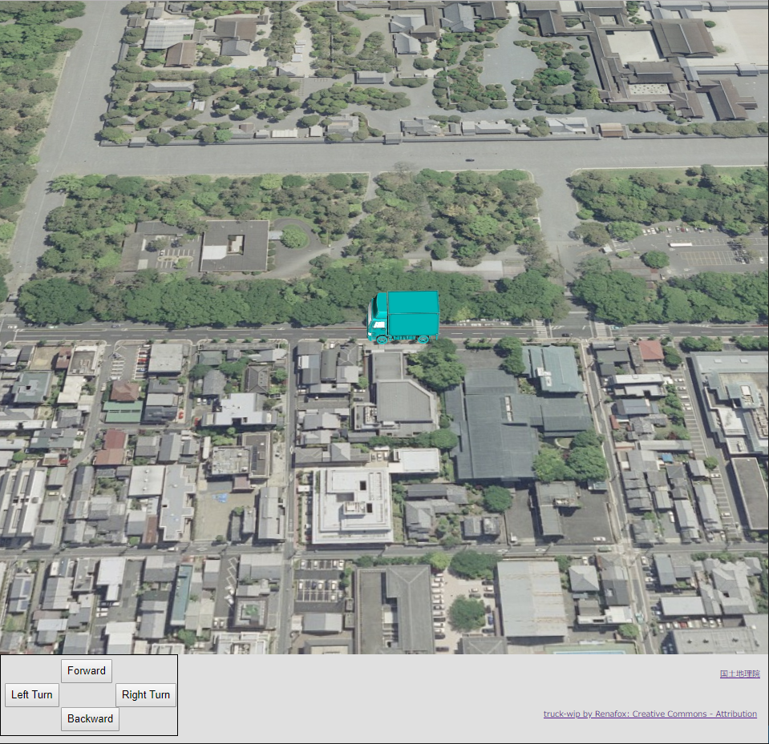
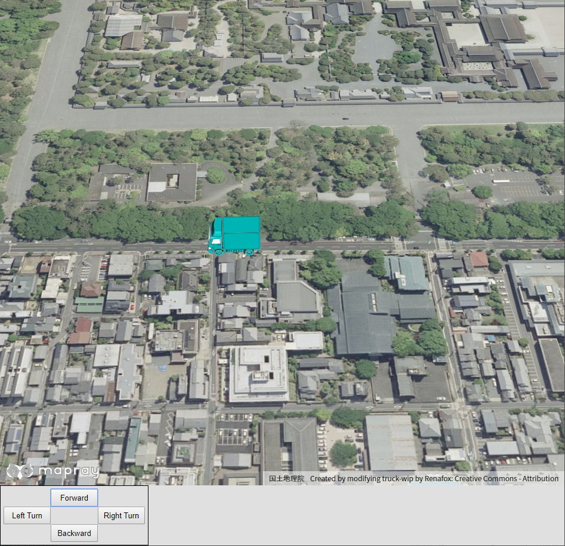
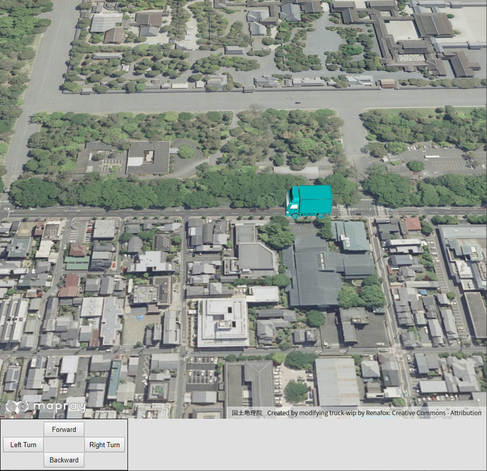
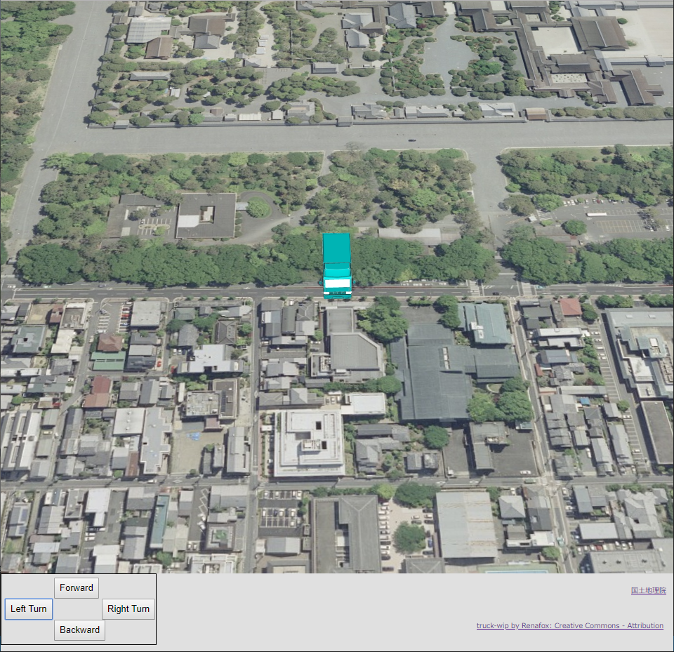
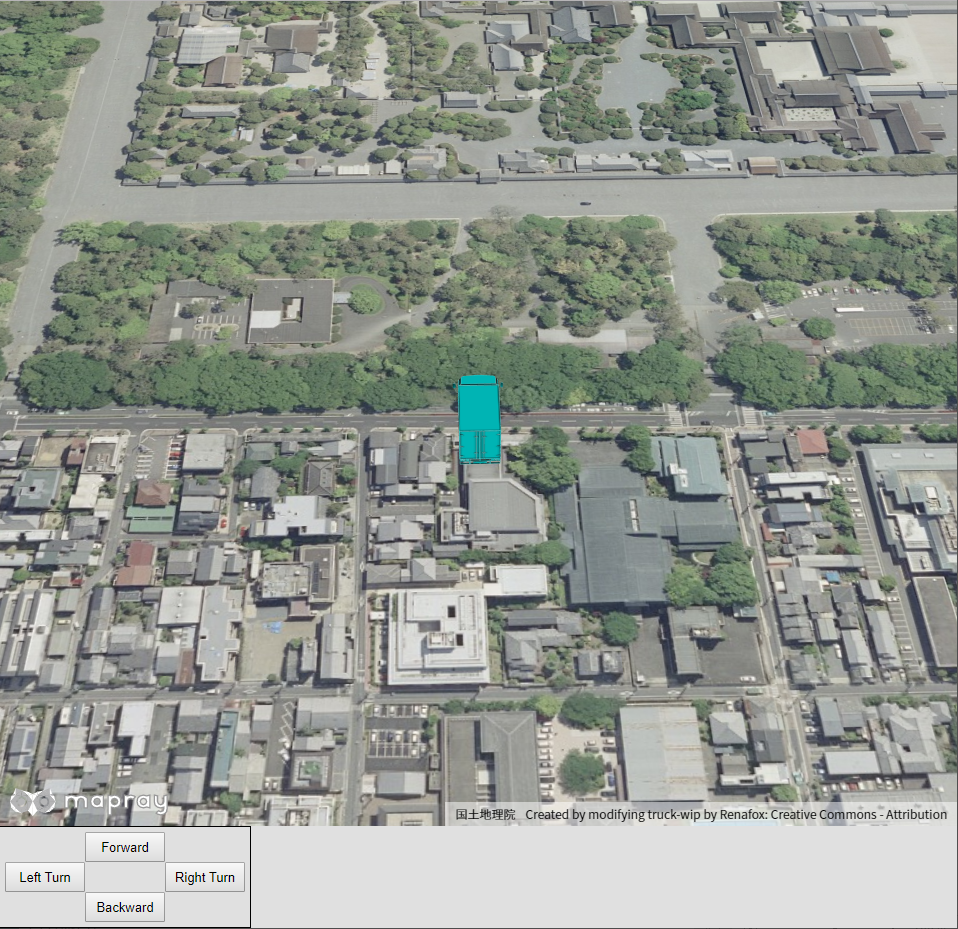

## glTFモデルの移動・回転

ユーザインタフェースを介して、glTFモデルを移動・回転させる方法を説明します。

### サンプルコード
ユーザインタフェースを介して、glTFモデルを移動・回転させる**glTFModelController.html**及び、**glTFModelController.js**のサンプルコードとシーンファイル（**glTFController.json**）です。
このサンプルコードでは、対応するボタンを操作することで、前進、後進、左90度回転、右90度回転ができます。

#### glTFデータの入手
[Sketchfab](https://sketchfab.com/3d-models/truck-wip-33e925207e134652bd8c2465e5c16957)へアクセスし、glTFファイルフォーマットのデータをダウンロードする、もしくは[ダウンロードリンク](https://storage.cloud.google.com/mapray-examples/model/download/truck_wip.zip)をクリックしてダウンロードしてください。ダウンロードリンクからダウンロードした場合はzipファイルを展開してご利用ください。展開したデータは解答した結果できたディレクトリを含めて、mapray-jsのルートディレクトリからの相対パスで以下のディレクトリに保存されているという想定で以下の説明を行います。

```
./examples/entity/gltf/data/
```

なお、データは当社の著作物ではありません。著作権は各データの作成者に帰属します。詳細はフォルダ中のLICENSEファイルを参照の上ご利用ください。
ユーザーの皆様がコンテンツの権利を侵害した場合、当社では一切責任を追うものではありませんのでご注意ください。

#### glTFModelController.html

```HTML
<!DOCTYPE html>
<html>
    <head>
        <meta charset="utf-8">
        <title>glTFModelControllerSample</title>
        <script src="https://resource.mapray.com/mapray-js/v0.7.0/mapray.js"></script>
        <script src="glTFModelController.js"></script>
        <style>
            html, body {
                height: 100%;
                margin: 0;
                background-color: #E0E0E0;
            }

            input {
                font-size: 13px;
            }

            div#mapray-container {
                display: flex;
                height: 88%;
            }

            div#ButtonBox {
                display: block;
                background-color: #E0E0E0;
                height: 100px;
                width: 220px;
                border: inset 1px #000000;
                float: left;
            }

            div#ForwardButton{
                display:flex;
                width:70px;
                height:30px;
                margin-top: 5px;
                margin-bottom:auto;
                margin-left:auto;
                margin-right:auto;
            }

            div#RotateLeft90Button{
                display: flex;
                width:70px;
                height:30px;
                margin-left: 5px;
                margin-right:auto;
                margin-top:auto;
                margin-bottom:auto;
                float: left;
            }

            div#RotateRight90Button{
                display: flex;
                width:70px;
                height:30px;
                margin-right: 7px;
                margin-left:auto;
                margin-top:auto;
                margin-bottom:auto;
            }

            div#BackwardButton{
                display: flex;
                width:70px;
                height:30px;
                margin-bottom:5px;
                margin-top:auto;
                margin-left:auto;
                margin-right:auto;
            }

            div#mapInfo{
                display: flex;
                width: 50px;
                height: 50px;
                margin-left: auto;
                margin-right: 10px;
                align-items: center;
            }

            div#modelInfo{
                display: flex;
                width: 270px;
                height: 50px;
                margin-left: auto;
                margin-right: 10px;
                align-items: center;
            }
        </style>
    </head>

    <body onload="CreateModelControllerInstance('mapray-container');">
        <div id="mapray-container"></div>

        <div id="ButtonBox">
            <div id="ForwardButton"><input type="button" value="Forward" onclick="ForwardButtonClicked()"></div>
            <div id="RotateLeft90Button"><input type="button" value="Left Turn" onclick="LeftTurnButtonClicked()"></div>
            <div id="RotateRight90Button"><input type="button" value="Right Turn" onclick="RightTurnButtonClicked()"></div>
            <div id="BackwardButton"><input type="button" value="Backward" onclick="BackwardButtonClicked()"></div>
        </div>

        <div id="mapInfo"><a href="https://maps.gsi.go.jp/development/ichiran.html" style="font-size: 9px">国土地理院</a></div>
        <div id="modelInfo"><a href="https://sketchfab.com/3d-models/truck-wip-33e925207e134652bd8c2465e5c16957" style="font-size: 9px">Created by modifying truck-wip by Renafox: Creative Commons - Attribution</a></div>
    </body>
</html>
```

#### glTFModelController.js
```JavaScript
var model_Controller;

class ModelController {
    constructor(container) {

        // Access Tokenを設定
        var accessToken = "<your access token here>";

        // Viewerを作成する
        this.viewer = new mapray.Viewer(
            container, {
                image_provider: this.createImageProvider(),
                dem_provider: new mapray.CloudDemProvider(accessToken)
            }
        );

        this.model_Point = new mapray.GeoPoint(135.759309, 35.025891, 55.0);    // モデルの球面座標(経度、緯度、高度)
        this.move_Vec = [0, 1, 0];                                              // モデルの移動方向(X:経度 Y:緯度 Z:高度)
        this.model_Angle = 0;                                                   // モデルの向いている向き（Z軸回転）
        this.isLoadedModel = false;                                             // モデルをロードできたか
        this.move_Correction = 0.00007;                                         // 移動量の補正値

        this.SetCamera();

        this.LoadScene();
    }

    // 画像プロバイダを生成
    createImageProvider() {
        // 国土地理院提供の汎用的な地図タイルを設定
        return new mapray.StandardImageProvider("https://cyberjapandata.gsi.go.jp/xyz/seamlessphoto/", ".jpg", 256, 2, 18);
    }

    // カメラ位置の設定
    SetCamera() {
        // 球面座標系（経度、緯度、高度）で視点を設定。座標は京都御所前
        var home_pos = { longitude: 135.759366, latitude: 35.025891, height: 50.0 };

        // 球面座標から地心直交座標へ変換
        var home_view_to_gocs = mapray.GeoMath.iscs_to_gocs_matrix(home_pos, mapray.GeoMath.createMatrix());

        // 視線方向を定義
        var cam_pos = mapray.GeoMath.createVector3([-400, 10, 400]);
        var cam_end_pos = mapray.GeoMath.createVector3([0, 0, 0]);
        var cam_up = mapray.GeoMath.createVector3([0, 0, 1]);

        // ビュー変換行列を作成
        var view_to_home = mapray.GeoMath.createMatrix();
        mapray.GeoMath.lookat_matrix(cam_pos, cam_end_pos, cam_up, view_to_home);

        // カメラの位置と視線方向からカメラの姿勢を変更
        var view_to_gocs = this.viewer.camera.view_to_gocs;
        mapray.GeoMath.mul_AA(home_view_to_gocs, view_to_home, view_to_gocs);

        // カメラのnear  farの設定
        this.viewer.camera.near = 30;
        this.viewer.camera.far = 500000;
    }

    // シーンの読み込み
    LoadScene() {
        var scene_File_URL = "./data/glTFController.json";

        // シーンを読み込む
        var loader = new mapray.SceneLoader(this.viewer.scene, scene_File_URL, {
            transform: (url, type) => this.onTransform(url, type),
            callback: (loader, isSuccess) => {
                this.onLoadScene(loader, isSuccess);
            }
        });

        loader.load();
    }

    onTransform(url, type) {
        return {
            url: url,
            credentials: mapray.CredentialMode.SAME_ORIGIN,
            headers: {}
        };
    }

    onLoadScene(loader, isSuccess) {
        if (isSuccess) {
            this.isLoadedModel = true;

            this.UpdateModelPosition();
        }
    }

    UpdateModelPosition() {
        // sceneのEntityを取得
        var entity = this.viewer.scene.getEntity(0);

        // モデルの位置を設定
        entity.setPosition(this.model_Point);

        // モデルの回転
        entity.setOrientation(new mapray.Orientation(-this.model_Angle, -90, 0));

        // モデルのスケールを設定
        entity.setScale([0.1, 0.1, 0.1]);
    }

    UpdateMoveVec() {
        // モデルの回転行列を求める
        var rot_mat = mapray.GeoMath.rotation_matrix([0, 0, 1], this.model_Angle, mapray.GeoMath.createMatrix());

        // 移動マトリックス生成
        var move_mat = mapray.GeoMath.createMatrix();

        // 単位行列に変換
        mapray.GeoMath.setIdentity(move_mat);

        // Yの平行成分を更新
        move_mat[13] = 1;

        // 移動マトリックスに回転行列をかける
        var rot_move_mat = mapray.GeoMath.mul_AA(rot_mat, move_mat, mapray.GeoMath.createMatrix());

        // 回転後マトリックスから座標を取得
        this.move_Vec = [rot_move_mat[12], rot_move_mat[13], rot_move_mat[14]];
    }

    Forward() {
        if (this.isLoadedModel == false) {
            return;
        }

        this.model_Point.longitude += this.move_Vec[0] * this.move_Correction;
        this.model_Point.latitude += this.move_Vec[1] * this.move_Correction;

        this.UpdateModelPosition();
    }

    Backward() {
        if (this.isLoadedModel == false) {
            return;
        }

        this.model_Point.longitude -= this.move_Vec[0] * this.move_Correction;
        this.model_Point.latitude -= this.move_Vec[1] * this.move_Correction;

        this.UpdateModelPosition();
    }

    LeftTurn() {
        if (this.isLoadedModel == false) {
            return;
        }

        this.model_Angle += 90;

        this.UpdateMoveVec();

        this.UpdateModelPosition();
    }

    RightTurn() {
        if (this.isLoadedModel == false) {
            return;
        }

        this.model_Angle -= 90;

        this.UpdateMoveVec();

        this.UpdateModelPosition();
    }

}

function CreateModelControllerInstance(container) {
    model_Controller = new ModelController(container);
}

function ForwardButtonClicked() {
    model_Controller.Forward();
}

function BackwardButtonClicked() {
    model_Controller.Backward();
}

function LeftTurnButtonClicked() {
    model_Controller.LeftTurn();
}

function RightTurnButtonClicked() {
    model_Controller.RightTurn();
}
```

#### シーンファイル（glTFController.json）
```json
{
  "model_register": { "model-0": { "link": "./truck_wip/scene.gltf" } },
  "entity_list": [{
    "type": "model",
    "mode": "basic",
    "transform": { "position": [135.759366, 35.025891, 55.0] },
    "ref_model": "model-0",
    "altitude_mode": "absolute"
    }
  ]
}
```

### htmlのサンプルコードの詳細
htmlのサンプルコードの詳細を以下で解説します。

#### htmlの文字コード設定
4行目でhtmlの文字コードを設定します。このサンプルコードでは、utf-8を設定します。
```HTML
<meta charset="utf-8">
```

#### タイトルの設定
5行目でタイトルの設定をします。このサンプルコードでは、glTFModelControllerSampleを設定します。
```HTML
<title>glTFModelControllerSample</title>
```

#### JavaScriptファイルのパス設定
6～7行目でhtmlで参照するJavaScriptのパスを設定します。このサンプルコードでは、maprayのJavaScriptファイルとglTFモデルを操作するJavaScriptファイル（**glTFModelController.js**）を設定します。
```HTML
<script src="https://resource.mapray.com/mapray-js/v0.7.0/mapray.js"></script>
<script src="glTFModelController.js"></script>
```

#### スタイルの設定
8～91行目で表示する要素のスタイルを設定します。このサンプルコードでは、下記のスタイルを設定します。
- html
- body
- input
- div#mapray-container（地図表示部分）
- div#ButtonBox（モデル操作ボタン表示部分）
- div#ForwardButton（前進ボタン表示部分）
- div#RotateLeft90Button（左回転ボタン表示部分）
- div#RotateRight90Button（右回転ボタン表示部分）
- div#BackwardButton（後進ボタン表示部分）
- div#mapInfo（出典表示部分）
- div#modelInfo（モデル出典表示部分）

```HTML
<style>
    html, body {
        height: 100%;
        margin: 0;
        background-color: #E0E0E0;
    }

    input {
        font-size: 13px;
    }

    div#mapray-container {
        display: flex;
        height: 88%;
    }

    div#ButtonBox {
        display: block;
        background-color: #E0E0E0;
        height: 100px;
        width: 220px;
        border: inset 1px #000000;
        float: left;
    }

    div#ForwardButton{
        display:flex;
        width:70px;
        height:30px;
        margin-top: 5px;
        margin-bottom:auto;
        margin-left:auto;
        margin-right:auto;
    }

    div#RotateLeft90Button{
        display: flex;
        width:70px;
        height:30px;
        margin-left: 5px;
        margin-right:auto;
        margin-top:auto;
        margin-bottom:auto;
        float: left;
    }

    div#RotateRight90Button{
        display: flex;
        width:70px;
        height:30px;
        margin-right: 7px;
        margin-left:auto;
        margin-top:auto;
        margin-bottom:auto;
    }

    div#BackwardButton{
        display: flex;
        width:70px;
        height:30px;
        margin-bottom:5px;
        margin-top:auto;
        margin-left:auto;
        margin-right:auto;
    }

    div#mapInfo{
        display: flex;
        width: 50px;
        height: 50px;
        margin-left: auto;
        margin-right: 10px;
        align-items: center;
    }

    div#modelInfo{
        display: flex;
        width: 270px;
        height: 50px;
        margin-left: auto;
        margin-right: 10px;
        align-items: center;
    }
</style>
```

#### loadイベントの設定
画面を表示するときに、glTFモデルを操作するクラスを生成します。そのため、94行目でページ読み込み時に、glTFモデルを操作するクラスのインスタンスを生成する関数（**CreateglTFModelControllerInstance**）を呼ぶように設定します。
glTFモデルを操作するクラスのインスタンスを生成する関数は、JavaScriptのサンプルコードの詳細で説明します。
```HTML
<body onload="CreateModelControllerInstance('mapray-container');">
```

#### 地図表示部分と出典表示部分の指定
95行目で地図表示部分になるブロックを、104行目で出典を明記するためのブロックを記述します。
詳細はヘルプページ『**緯度経度によるカメラ位置の指定**』を参照してください。
```HTML
<div id="mapray-container"></div>

中略

<div id="mapInfo"><a href="https://maps.gsi.go.jp/development/ichiran.html" style="font-size: 9px">国土地理院</a></div>
```

#### モデル操作のUI
97～102行目でモデル操作ボタン表示部分のブロックを記述します。このブロックの中には、前進ボタン、左回転ボタン、右回転ボタン、後退ボタンを用意します。
前進ボタンをクリックした時のイベント（onclick）に、前進ボタンクリック時に呼び出す関数（ForwardButtonClicked）を設定します。同様に、各ボタンのクリック時に呼び出す関数（LeftTurnButtonClicked、RightTurnButtonClicked、BackwardButtonClicked）をそれぞれ設定します。
各ボタンのクリック時に呼び出す関数は、JavaScriptのサンプルコードの詳細で説明します。
```HTML
<div id="ButtonBox">
    <div id="ForwardButton"><input type="button" value="Forward" onclick="ForwardButtonClicked()"></div>
    <div id="RotateLeft90Button"><input type="button" value="Left Turn" onclick="LeftTurnButtonClicked()"></div>
    <div id="RotateRight90Button"><input type="button" value="Right Turn" onclick="RightTurnButtonClicked()"></div>
    <div id="BackwardButton"><input type="button" value="Backward" onclick="BackwardButtonClicked()"></div>
</div>
```

#### glTFモデルの出典表示部分の設定
105行目で、glTFモデルの出典を明記するためのブロックを記述します。
```HTML
<div id="modelInfo"><a href="https://sketchfab.com/3d-models/truck-wip-33e925207e134652bd8c2465e5c16957" style="font-size: 9px">Created by modifying truck-wip by Renafox: Creative Commons - Attribution</a></div>
```

### JavaScriptのサンプルコードの詳細
JavaScriptのサンプルコードの詳細を以下で解説します。

#### クラスとグローバル変数の説明
3～171行目でglTFモデルを操作するクラスを定義します。クラス内の各メソッドの詳細は以降で解説します。
また、1行目でglTFモデルを操作するクラスのグローバル変数を定義します。

```JavaScript
// JavaScript source code
var model_Controller;

class ModelController {

    //中略

}
```

#### コンストラクタ
4～26行目がglTFモデルを操作するクラスのコンストラクタです。
まず、引数として渡されるブロックのidに対して、mapray.Viewerを作成します。mapray.Viewerのベース地図の画像プロバイダは、画像プロバイダの生成メソッドで取得した画像プロバイダを設定します。mapray.Viewerの作成の詳細は、ヘルプページ『**緯度経度によるカメラ位置の指定**』を参照してください。
次に、glTFモデルの操作に関する初期値を下記のように設定します。
- glTFモデル初期位置の緯度、経度、高度　⇒　京都御所沿いの道路
- glTFモデルの現在移動方向（経度・緯度・高度）　⇒　緯度＋方向
- glTFモデルの現在の向き　⇒　0度
- glTFモデルのロードの成功可否　⇒　false
- glTFモデルの移動量　⇒　0.00007度

最後に、カメラの位置・向きの設定、シーンのロードの順にメソッドを呼び出します。

```JavaScript
constructor(container) {
  
    // Access Tokenを設定
    var accessToken = "<your access token here>";

    // Viewerを作成する
    this.viewer = new mapray.Viewer(
        container, {
            image_provider: this.createImageProvider(),
            dem_provider: new mapray.CloudDemProvider(accessToken)
        }
    );

    this.model_Point = new mapray.GeoPoint(135.759309, 35.025891, 55.0);    // モデルの球面座標(経度、緯度、高度)
    this.move_Vec = [0, 1, 0];                                              // モデルの移動方向(X:経度 Y:緯度 Z:高度)
    this.model_Angle = 0;                                                   // モデルの向いている向き（Z軸回転）
    this.isLoadedModel = false;                                             // モデルをロードできたか
    this.move_Correction = 0.00007;                                         // 移動量の補正値

    this.SetCamera();

    this.LoadScene();
}
```

#### 画像プロバイダを生成
29～32行目が画像プロバイダの生成メソッドです。生成した画像プロバイダを返します。
画像プロバイダの生成の詳細は、ヘルプページ『**緯度経度によるカメラ位置の指定**』を参照してください。

```JavaScript
// 画像プロバイダを生成
createImageProvider() {
    // 国土地理院提供の汎用的な地図タイルを設定
    return new mapray.StandardImageProvider("https://cyberjapandata.gsi.go.jp/xyz/seamlessphoto/", ".jpg", 256, 2, 18);
}
```

#### カメラの位置・向きの設定
35～58行目がカメラの位置・向きの設定メソッドです。
カメラの位置・向きの設定は、ヘルプページ『**緯度経度によるカメラ位置の指定**』を参照してください。

```JavaScript
// カメラ位置の設定
SetCamera() {
    // 球面座標系（経度、緯度、高度）で視点を設定。座標は京都御所前
    var home_pos = { longitude: 135.759366, latitude: 35.025891, height: 50.0 };

    // 球面座標から地心直交座標へ変換
    var home_view_to_gocs = mapray.GeoMath.iscs_to_gocs_matrix(home_pos, mapray.GeoMath.createMatrix());

    // 視線方向を定義
    var cam_pos = mapray.GeoMath.createVector3([-400, 10, 400]);
    var cam_end_pos = mapray.GeoMath.createVector3([0, 0, 0]);
    var cam_up = mapray.GeoMath.createVector3([0, 0, 1]);

    // ビュー変換行列を作成
    var view_to_home = mapray.GeoMath.createMatrix();
    mapray.GeoMath.lookat_matrix(cam_pos, cam_end_pos, cam_up, view_to_home);

    // カメラの位置と視線方向からカメラの姿勢を変更
    var view_to_gocs = this.viewer.camera.view_to_gocs;
    mapray.GeoMath.mul_AA(home_view_to_gocs, view_to_home, view_to_gocs);

    // カメラのnear、farの設定
    this.viewer.camera.near = 30;
    this.viewer.camera.far = 500000;
}
```

#### シーンのロード
61～73行目がシーンのロードメソッドです。
シーンのロードは、ヘルプページ『**glTFモデルの表示（SceneLoaderを使った表示）**』を参照してください。

```JavaScript
// シーンの読み込み
LoadScene() {
    var scene_File_URL = "./data/glTFController.json";

    // シーンを読み込む
    var loader = new mapray.SceneLoader(this.viewer.scene, scene_File_URL, {
        transform: (url, type) => this.onTransform(url, type),
        callback: (loader, isSuccess) => {
            this.onLoadScene(loader, isSuccess);
        }
    });

    loader.load();
}
```

#### リソース要求変換
75～81行目がリソース要求変換メソッドです。
リソース要求変換は、ヘルプページ『**glTFモデルの表示（SceneLoaderを使った表示）**』を参照してください。

```JavaScript
onTransform(url, type) {
    return {
        url: url,
        credentials: mapray.CredentialMode.SAME_ORIGIN,
        headers: {}
    };
}
```

#### シーンのロード終了イベント
83～89行目がシーンのロード終了イベントメソッドです。引数のisSuccessには、読み込み結果が格納されており、trueの場合のみ読み込んだglTFモデルを表示し、glTFモデルを操作できるようにします。
glTFモデルのロード成功可否をtrueにし、glTFモデルの表示位置を設定するメソッドを呼び出します。glTFモデルの表示位置を設定するメソッドの詳細は後述します。

```JavaScript
onLoadScene(loader, isSuccess) {
    if (isSuccess) {
        this.isLoadedModel = true;

        this.UpdateModelPosition();
    }
}
```

#### glTFモデルの表示位置の設定
91～103行目がglTFモデルの表示位置の設定メソッドです。モデルの表示位置、向き、スケールをモデルのエンティティに反映します。
96行目でモデルの表示位置を設定、97行目でモデルの向きを、98行目でモデルのスケールをそれぞれ設定します。
なお、読み込んだモデルは1つ目のエンティティとなるため、エンティティ取得時の引数には0を指定します。

```JavaScript
UpdateModelPosition() {
    // sceneのEntityを取得
    var entity = this.viewer.scene.getEntity(0);

    // モデルの位置を設定
    entity.setPosition(this.model_Point);

    // モデルの回転
    entity.setOrientation(new mapray.Orientation(-this.model_Angle, -90, 0));

    // モデルのスケールを設定
    entity.setScale([0.1, 0.1, 0.1]);
}
```

#### 移動方向ベクトルの作成
105～123行目が移動方向ベクトル作成メソッドです。現在の向きを表す回転行列を利用して、最新の移動方向ベクトルを求めます。
まず、107～116行目で、移動方向を表す変換行列を単位行列に初期化し、glTFモデルの初期の前方向であるY軸方向に単位移動量である1分移動させます。その後、移動方向を表す変換行列に、現在の向きを表す変換行列を掛け合わせることで、現在の移動方向を表す変換行列を求めます。
そして、求めた現在の移動方向を表す変換行列から、移動方向成分に該当する部分を抜き出し、移動方向ベクトルとして設定します。

```JavaScript
UpdateMoveVec() {
    // モデルの回転行列を求める
    var rot_mat = mapray.GeoMath.rotation_matrix([0, 0, 1], this.model_Angle, mapray.GeoMath.createMatrix());

    // 移動マトリックス生成
    var move_mat = mapray.GeoMath.createMatrix();

    // 単位行列に変換
    mapray.GeoMath.setIdentity(move_mat);

    // Yの平行成分を更新
    move_mat[13] = 1;

    // 移動マトリックスに回転行列をかける
    var rot_move_mat = mapray.GeoMath.mul_AA(rot_mat, move_mat, mapray.GeoMath.createMatrix());

    // 回転後マトリックスから座標を取得
    this.move_Vec = [rot_move_mat[12], rot_move_mat[13], rot_move_mat[14]];
}
```

#### 前進
125～134行目が前進メソッドです。glTFモデルが正常に読み込まれている場合は、現在のglTFモデルの移動方向ベクトルに移動量を掛けた値をモデルの緯度・経度に加算し、glTFモデルの姿勢変換行列の設定メソッドを呼び出します。

```JavaScript
Forward() {
    if (this.isLoadedModel == false) {
        return;
    }

    this.model_Point.longitude += this.move_Vec[0] * this.move_Correction;
    this.model_Point.latitude += this.move_Vec[1] * this.move_Correction;

    this.UpdateModelPosition();
}
```

#### 後進
136～145行目が後退メソッドです。glTFモデルが正常に読み込まれている場合は、現在のglTFモデルの移動方向ベクトルに移動量を掛けた値をモデルの緯度・経度に減算し、glTFモデルの姿勢変換行列の設定メソッドを呼び出します。

```JavaScript
Backward() {
    if (this.isLoadedModel == false) {
        return;
    }

    this.model_Point.longitude -= this.move_Vec[0] * this.move_Correction;
    this.model_Point.latitude -= this.move_Vec[1] * this.move_Correction;

    this.UpdateModelPosition();
}
```

#### 左回転
147～157行目が左回転メソッドです。glTFモデルが正常に読み込まれている場合は、現在のglTFモデルの回転角度に90を加算し、glTFモデルの姿勢変換行列の設定メソッドを呼び出します。

```JavaScript
LeftTurn() {
    if (this.isLoadedModel == false) {
        return;
    }

    this.model_Angle += 90;

    this.UpdateMoveVec();

    this.UpdateModelPosition();
}
```

#### 右回転
159～169行目が右回転メソッドです。glTFモデルが正常に読み込まれている場合は、現在のglTFモデルの回転角度に90を減算し、glTFモデルの姿勢変換行列の設定メソッドを呼び出します。
```JavaScript
RightTurn() {
    if (this.isLoadedModel == false) {
        return;
    }

    this.model_Angle -= 90;

    this.UpdateMoveVec();

    this.UpdateModelPosition();
}
```

#### glTFモデルを操作するクラスのインスタンス生成
173～175行目の関数は、引数として渡されるブロックのidを利用して、glTFモデルを操作するクラスのインスタンスを生成します。

```JavaScript
function CreateModelControllerInstance(container) {
    model_Controller = new ModelController(container);
}
```

#### 前進ボタンクリック時のイベント
177～179行目の関数は、前進ボタンクリック時に呼ばれ、glTFモデルを操作するクラスの前進メソッドを呼び出します。

```JavaScript
function ForwardButtonClicked() {
    model_Controller.Forward();
}
```

#### 後進ボタンクリック時のイベント
181～183行目の関数は、後進ボタンクリック時に呼ばれ、glTFモデルを操作するクラスの後進メソッドを呼び出します。

```JavaScript
function BackwardButtonClicked() {
    model_Controller.Backward();
}
```

#### 左回転ボタンクリック時のイベント
185～187行目の関数は、左回転ボタンクリック時に呼ばれ、glTFモデルを操作するクラスの左回転メソッドを呼び出します。

```JavaScript
function LeftTurnButtonClicked() {
    model_Controller.LeftTurn();
}
```

#### 右回転ボタンクリック時のイベント
189～191行目の関数は、右回転ボタンクリック時に呼ばれ、glTFモデルを操作するクラスの左回転メソッドを呼び出します。

```JavaScript
function RightTurnButtonClicked() {
    model_Controller.RightTurn();
}
```

### シーンファイルの詳細
シーンファイルの詳細を以下で解説します。なお、シーンファイルはJSON形式で記述します。

#### エンティティの設定
3行目でentity_listという名称でエンティティを定義し、その中にエンティティの詳細を定義します。4行目のtypeという名称は、エンティティの種類を表し、glTFモデルの場合はmodelを指定します。

```json
{

  中略

  "entity_list": [{
    "type": "model",

      中略

    }
  ]
}
```

#### glTFモデルのデータ
2行目でmodel_registerという名称でモデルデータを定義します。このシーンファイルでは、モデルデータのIDをmodel-0とし、モデルファイルをファイルから読み込むために、linkという名称にglTFファイルのURLを指定します。

```json
"model_register": { "model-0": { "link": "./truck_wip/scene.gltf" } },
```

#### 汎用エンティティの設定
4～8行目で汎用エンティティの設定をします。汎用エンティティには以下の内容を定義します。
- モード（mode）　⇒　basic
- 初期姿勢（transform）　⇒　球面座標系（position）での初期位置
- モデルデータ（ref_model）　⇒　モデルデータのID（model-0）
- 高度モード（altitude_mode）　⇒　初期位置の高度を絶対値で指定（absolute）

```json
"type": "model",
"mode": "basic",
"transform": { "position": [135.759366, 35.025891, 55.0] },
"ref_model": "model-0",
"altitude_mode": "absolute"
```

### 出力イメージ
このサンプルコードで初期状態の出力イメージは下図のようになります。


初期状態から前進ボタンを5回押した時の出力イメージは下図のようになります。


初期状態から後進ボタンを5回押した時の出力イメージは下図のようになります。


初期状態から左回転ボタンを押した時の出力イメージは下図のようになります。


初期状態から右回転ボタンを押した時の出力イメージは下図のようになります。

