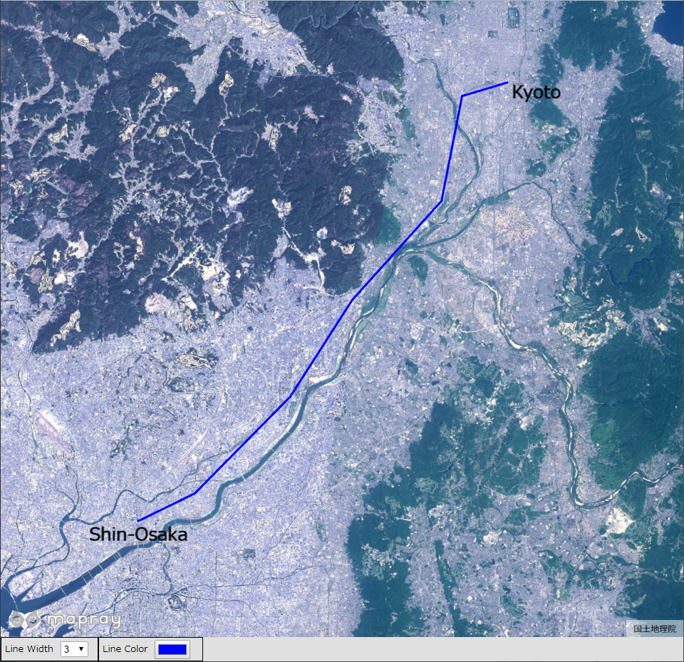
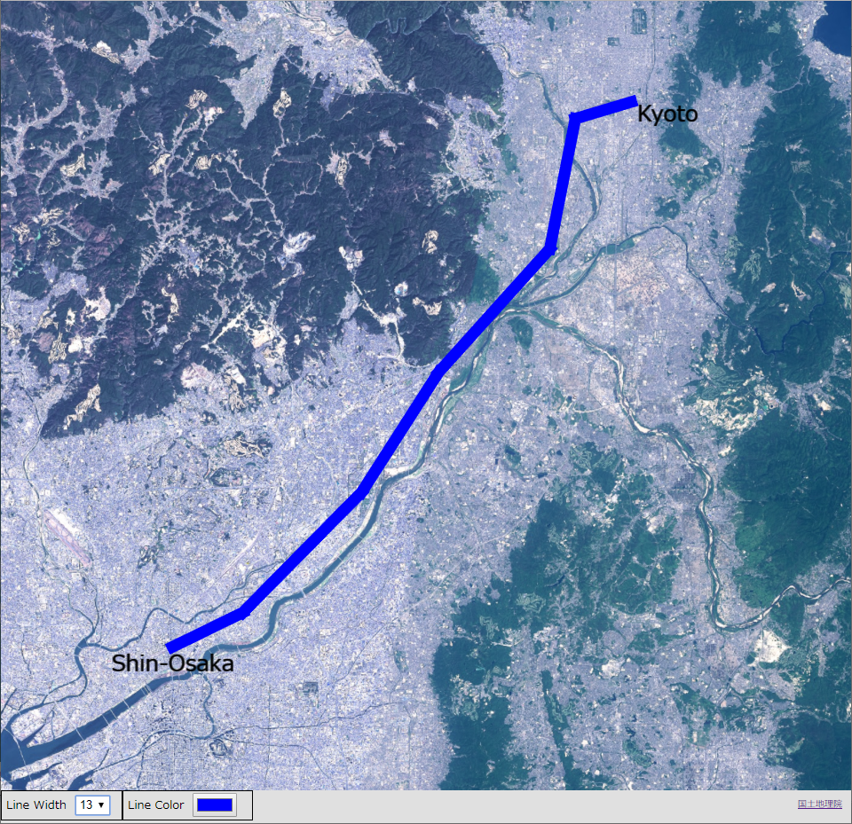
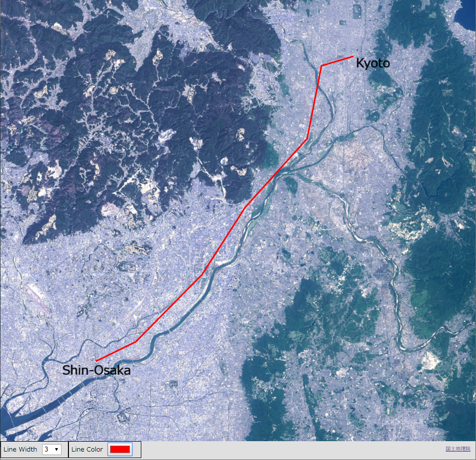

## GeoJSONのフォーマットの変更

GeoJSONデータのフォーマットを変更する方法を説明します。

### サンプルコード
GeoJSONデータのフォーマットを変更する**ChangeGeoJsonFormat.html**及び**ChangeGeoJsonFormat.js**のサンプルコードです。サンプルコードで利用するGeoJSONファイル（**RouteLine.json**）については、ヘルプページ『**GeoJSONの表示（GeoJSONLoaderを使った表示）**』を参照してください。
このサンプルコードでは、ユーザインタフェースを介して、新大阪駅、京都駅間を結ぶGeoJSONデータのフォーマットを変更します。変更できるフォーマットは、線の幅、線の色です。線の幅は、1、3、7、13、17、21に変更でき、線の色は、カラーピッカーで変更できます。

#### ChangeGeoJsonFormat.html

```HTML
<!DOCTYPE html>
<html>
    <head>
        <meta charset="utf-8">
        <title>ChangeGeoJSONFormatSample</title>
        <script src="https://resource.mapray.com/mapray-js/v0.7.2/mapray.js"></script>
        <link rel="stylesheet" href="https://resource.mapray.com/styles/v1/mapray.css">
        <script src="ChangeGeoJSONFormat.js" charset="utf-8"></script>
        <style>
            html, body {
                height: 100%;
                margin: 0;
                background-color: #E0E0E0;
            }

            select{
                height:22px;
                vertical-align:middle;
                font-size:13px;
                margin-left:10px;
            }

            p{
                font-size:13px;
                margin-left:5px;
            }

            input{
                margin-left:10px;
            }

            div#mapray-container {
                display: flex;
                position: relative;
                height: calc(100% - 34px);
            }

            div#LineWidthBox {
                display: flex;
                background-color: #E0E0E0;
                height: 32px;
                width: 135px;
                float: left;
                border: inset 1px #000000;
                align-items: center;
            }

            div#LineColorBox {
                display: flex;
                background-color: #E0E0E0;
                height: 32px;
                width: 145px;
                float: left;
                border: inset 1px #000000;
                align-items: center;
            }
        </style>
    </head>

    <body onload="CreateChangeGeoJSONFormatInstance('mapray-container');">
        <div id="mapray-container"></div>

        <div id="LineWidthBox">
            <p>Line Width</p>
            <select name="LineWidthPullDown" id="LineWidthPullDown" onchange="LineWidthValueChanged()">
                <option value=1>1</option>
                <option value=3 selected>3</option>
                <option value=7>7</option>
                <option value=13>13</option>
                <option value=17>17</option>
                <option value=21>21</option>
            </select>
        </div>

        <div id="LineColorBox">
            <p>Line Color</p>
            <input type="color" id="LineColorPallet" name="LineColorPallet" value="#0000ff" onchange="LineColorValueChanged()">
        </div>
    </body>
</html>
```

#### ChangeGeoJsonFormat.js

```JavaScript
var change_GeoJSON_Format;

class ChangeGeoJSONFormat extends mapray.RenderCallback {
    constructor(container) {
        super();

        // Access Tokenを設定
        var accessToken = "<your access token here>";

        // Viewerを作成する
        new mapray.Viewer(container, {
            render_callback: this,
            image_provider: this.createImageProvider(),
            dem_provider: new mapray.CloudDemProvider(accessToken)
        });

        this.SetCamera();

        this.AddText();

        this.LoadScene();
    }

    // 画像プロバイダを生成
    createImageProvider() {
        // 国土地理院提供の汎用的な地図タイルを設定
        return new mapray.StandardImageProvider("https://cyberjapandata.gsi.go.jp/xyz/seamlessphoto/", ".jpg", 256, 2, 18);
    }

    // カメラ位置の設定
    SetCamera() {
        // 球面座標系（経度、緯度、高度）で視点を設定。座標は高槻市付近
        var home_pos = { longitude: 135.642749, latitude: 34.849955, height: 500.0 };

        // 球面座標から地心直交座標へ変換
        var home_view_geoPoint = new mapray.GeoPoint( home_pos.longitude, home_pos.latitude, home_pos.height );
        var home_view_to_gocs = home_view_geoPoint.getMlocsToGocsMatrix( mapray.GeoMath.createMatrix() );

        // 視線方向を定義
        var cam_pos = mapray.GeoMath.createVector3([0, 0, 70000]);
        var cam_end_pos = mapray.GeoMath.createVector3([0, 0, 0]);
        var cam_up = mapray.GeoMath.createVector3([0, 1, 0]);

        // ビュー変換行列を作成
        var view_to_home = mapray.GeoMath.createMatrix();
        mapray.GeoMath.lookat_matrix(cam_pos, cam_end_pos, cam_up, view_to_home);

        // カメラの位置と視線方向からカメラの姿勢を変更
        var view_to_gocs = this.viewer.camera.view_to_gocs;
        mapray.GeoMath.mul_AA(home_view_to_gocs, view_to_home, view_to_gocs);

        // カメラのnear  farの設定
        this.viewer.camera.near = 30;
        this.viewer.camera.far = 500000;
    }

    // テキストの表示
    AddText() {
        //文字のエンティティを作成
        var font_Entity = new mapray.TextEntity(this.viewer.scene);

        //新大阪駅付近
        var fast_Font_Point = new mapray.GeoPoint(135.501101, 34.722939, 500);

        font_Entity.addText("Shin-Osaka", fast_Font_Point, { color: [0, 0, 0], font_size: 25 });

        //京都駅付近
        var second_Font_Point = new mapray.GeoPoint(135.778568, 34.976024, 500);

        font_Entity.addText("Kyoto", second_Font_Point, { color: [0, 0, 0], font_size: 25 });

        //エンティティをシーンに追加
        this.viewer.scene.addEntity(font_Entity);
    }

    // シーンの読み込み
    LoadScene() {
        var loader = new mapray.GeoJSONLoader( this._viewer.scene, "./data/RouteLine.json", {
            onLoad: (loader, isSuccess) => { console.log("success load geojson") },
            getLineColor: d => d.properties && d.properties.color ? d.properties.color : [0, 0, 255, 1.0],
            getLineWidth: d => d.properties && d.properties.width ? d.properties.width : 3,
            getAltitude: () => 100
        } );

        loader.load();
    }

    ChangeLineWidth() {
        // プルダウンの値取得
        var line_Width_Value = parseFloat(document.getElementById("LineWidthPullDown").value);

        // プルダウンの値を設定
        var lineEntity = this.viewer.scene.getEntity(1);
        lineEntity.setLineWidth(line_Width_Value);
    }

    ChangeLineColor() {
        // プルダウンの値取得
        var line_ColorChord = document.getElementById("LineColorPallet").value;

        // カラーコードをRBGに変換
        var RGBArray = this.convertColorChordToRGB(line_ColorChord);

        // プルダウンの値を設定
        var lineEntity = this.viewer.scene.getEntity(1);
        lineEntity.setColor(RGBArray);
    }

    convertColorChordToRGB(colorChord) {
        var colorChordChars = colorChord.split('')

        var r = parseInt(colorChordChars[1].toString() + colorChordChars[2].toString(), 16) / 255;
        var g = parseInt(colorChordChars[3].toString() + colorChordChars[4].toString(), 16) / 255;
        var b = parseInt(colorChordChars[5].toString() + colorChordChars[6].toString(), 16) / 255;

        return [r, g, b]
    }

}

function CreateChangeGeoJSONFormatInstance(container) {
    change_GeoJSON_Format = new ChangeGeoJSONFormat(container);
}

function LineWidthValueChanged() {
    change_GeoJSON_Format.ChangeLineWidth()
}

function LineColorValueChanged() {
    change_GeoJSON_Format.ChangeLineColor()
}
```

### htmlのサンプルコードの詳細
htmlのサンプルコードの詳細を以下で解説します。

#### htmlの文字コード設定
4行目でhtmlの文字コードを設定します。このサンプルコードでは、utf-8を設定します。

```HTML
<meta charset="utf-8">
```

#### タイトルの設定
5行目でタイトルの設定をします。このサンプルコードでは、ChangeGeoJSONFormatSampleを設定します。

```HTML
<title>ChangeGeoJSONFormatSample</title>
```

#### JavaScriptファイルのパス設定
6～8行目で参照するJavaScript及びスタイルシートのパスを設定します。このサンプルコードでは、maprayのJavaScriptファイル、スタイルシート、GeoJSONデータのフォーマットを変えるJavaScriptファイル（**ChangeGeoJsonFormat.js**）を設定します。GeoJSONデータのフォーマットを変えるJavaScriptファイルの文字コードはutf-8に設定します。

```HTML
<script src="https://resource.mapray.com/mapray-js/v0.7.2/mapray.js"></script>
<link rel="stylesheet" href="https://resource.mapray.com/styles/v1/mapray.css">
<script src="ChangeGeoJSONFormat.js" charset="utf-8"></script>
```

#### スタイルの設定
9～57行目で表示する要素のスタイルを設定します。このサンプルコードでは、下記のスタイルを設定します。
- html
- body
- select
- p
- input
- div#mapray-container（地図表示部分）
- div#LineWidthBox（線幅変更コンボボックス表示部分）
- div#LineColorBox（線色変更ボタン表示部分）

```HTML
<style>
    html, body {
        height: 100%;
        margin: 0;
        background-color: #E0E0E0;
    }

    select{
        height:22px;
        vertical-align:middle;
        font-size:13px;
        margin-left:10px;
    }

    p{
        font-size:13px;
        margin-left:5px;
    }

    input{
        margin-left:10px;
    }

    div#mapray-container {
        display: flex;
        position: relative;
        height: calc(100% - 34px);
    }

    div#LineWidthBox {
        display: flex;
        background-color: #E0E0E0;
        height: 32px;
        width: 135px;
        float: left;
        border: inset 1px #000000;
        align-items: center;
    }

    div#LineColorBox {
        display: flex;
        background-color: #E0E0E0;
        height: 32px;
        width: 145px;
        float: left;
        border: inset 1px #000000;
        align-items: center;
    }
</style>
```

#### loadイベントの設定
画面を表示するときに、GeoJSONデータフォーマット変更クラスを生成します。そのため、60行目でページ読み込み時に、GeoJSONデータのフォーマットを変更するクラスのインスタンスを生成する関数（**CreateChangeGeoJSONFormatInstance**）を呼ぶように設定します。
GeoJSONデータのフォーマットを変更するクラスのインスタンスを生成する関数は、JavaScriptのサンプルコードの詳細で説明します。

```HTML
<body onload="CreateChangeGeoJSONFormatInstance('mapray-container');">
```

#### 地図表示部分の指定
61行目で地図表示部分のブロックを記述します。
詳細はヘルプページ『**緯度経度によるカメラ位置の指定**』を参照してください。

```HTML
<div id="mapray-container"></div>
```

#### 線の幅変更のUI
63～73行目で線幅変更コンボボックス表示部分のブロックを記述します。このブロックの中には、線幅を変更するコンボボックスを用意します。このサンプルコードでは、1、3、7、13、17、21を設定します。
線幅を変更するコンボボックスが変更された時のイベント（onchange）に、線幅のコンボボックス変更時に呼び出す関数（**LineWidthValueChanged**）を設定します。
線幅のコンボボックス変更時に呼び出す関数はJavaScriptのサンプルコードの詳細で説明します。

```HTML
<div id="LineWidthBox">
    <p>Line Width</p>
    <select name="LineWidthPullDown" id="LineWidthPullDown" onchange="LineWidthValueChanged()">
        <option value=1>1</option>
        <option value=3 selected>3</option>
        <option value=7>7</option>
        <option value=13>13</option>
        <option value=17>17</option>
        <option value=21>21</option>
    </select>
</div>
```

#### 線の色変更のUI
75～78行目で線色変更ボタン表示部分のブロックを記述します。このブロックの中には、線色変更ボタンを用意します。
線色変更ボタンには、カラーピッカーの色が変更された時のイベント（onchange）に、線色変更時に呼び出す関数（**LineColorValueChanged**）を設定します。
線色変更時に呼び出す関数はJavaScriptのサンプルコードの詳細で説明します。

```HTML
<div id="LineColorBox">
    <p>Line Color</p>
    <input type="color" id="LineColorPallet" name="LineColorPallet" value="#0000ff" onchange="LineColorValueChanged()">
</div>
```

### JavaScriptのサンプルコードの詳細
JavaScriptのサンプルコードの詳細を以下で解説します。

#### クラスとグローバル変数の説明
3～120行目で、GeoJSONデータのフォーマットを変更するクラスを定義します。クラス内の各メソッドの詳細は以降で解説します。
GeoJSONデータのフォーマットを変更するクラスは、mapray.RenderCallbackクラスを継承します。
また、1行目でGeoJSONデータのフォーマットを変更するクラスのグローバル変数を定義します。

```JavaScript
var change_GeoJSON_Format;

class ChangeGeoJSONFormat extends mapray.RenderCallback {

  //中略

}
```

#### コンストラクタ
3～22行目がGeoJSONデータのフォーマットを変更するクラスのコンストラクタです。
引数として渡されるブロックのidに対して、mapray.Viewerを作成し、カメラの位置・向きの設定メソッドを呼び出します。その後、文字の表示メソッドとシーンのロードメソッドを呼び出します。mapray.Viewerのベース地図の画像プロバイダは、画像プロバイダの生成メソッドで取得した画像プロバイダを設定します。
mapray.Viewerの作成の詳細は、ヘルプページ『**緯度経度によるカメラ位置の指定**』を参照してください。

```JavaScript
constructor(container) {
    super();

    // Access Tokenを設定
    var accessToken = "<your access token here>";

    // Viewerを作成する
    new mapray.Viewer(container, {
        render_callback: this,
        image_provider: this.createImageProvider(),
        dem_provider: new mapray.CloudDemProvider(accessToken)
    });

    this.SetCamera();

    this.AddText();

    this.LoadScene();
}
```

#### 画像プロバイダの生成
25～28行目が画像プロバイダの生成メソッドです。生成した画像プロバイダを返します。
画像プロバイダの生成の詳細は、ヘルプページ『**緯度経度によるカメラ位置の指定**』を参照してください。

```JavaScript
// 画像プロバイダを生成
createImageProvider() {
    // 国土地理院提供の汎用的な地図タイルを設定
    return new mapray.StandardImageProvider("https://cyberjapandata.gsi.go.jp/xyz/seamlessphoto/", ".jpg", 256, 2, 18);
}
```

#### カメラの位置・向きの設定
31～55行目がカメラの位置・向きの設定メソッドです。
カメラの位置・向きの設定は、ヘルプページ『**緯度経度によるカメラ位置の指定**』を参照してください。

```JavaScript
// カメラ位置の設定
SetCamera() {
    // 球面座標系（経度、緯度、高度）で視点を設定。座標は高槻市付近
    var home_pos = { longitude: 135.642749, latitude: 34.849955, height: 500.0 };

    // 球面座標から地心直交座標へ変換
    var home_view_geoPoint = new mapray.GeoPoint( home_pos.longitude, home_pos.latitude, home_pos.height );
    var home_view_to_gocs = home_view_geoPoint.getMlocsToGocsMatrix( mapray.GeoMath.createMatrix() );

    // 視線方向を定義
    var cam_pos = mapray.GeoMath.createVector3([0, 0, 70000]);
    var cam_end_pos = mapray.GeoMath.createVector3([0, 0, 0]);
    var cam_up = mapray.GeoMath.createVector3([0, 1, 0]);

    // ビュー変換行列を作成
    var view_to_home = mapray.GeoMath.createMatrix();
    mapray.GeoMath.lookat_matrix(cam_pos, cam_end_pos, cam_up, view_to_home);

    // カメラの位置と視線方向からカメラの姿勢を変更
    var view_to_gocs = this.viewer.camera.view_to_gocs;
    mapray.GeoMath.mul_AA(home_view_to_gocs, view_to_home, view_to_gocs);

    // カメラのnear、farの設定
    this.viewer.camera.near = 30;
    this.viewer.camera.far = 500000;
}
```

#### 文字の表示
58～74行目で、それぞれの駅名を表示するための文字をmapray.Viewerのシーンに追加します。文字の表示方法の詳細は、ヘルプページ『**文字の表示（addTextを使った表示）**』を参照してください。

```JavaScript
// テキストの表示
AddText() {
    //文字のエンティティを作成
    var font_Entity = new mapray.TextEntity(this.viewer.scene);

    //新大阪駅付近
    var fast_Font_Point = new mapray.GeoPoint(135.501101, 34.722939, 500);

    font_Entity.addText("Shin-Osaka", fast_Font_Point, { color: [0, 0, 0], font_size: 25 });

    //京都駅付近
    var second_Font_Point = new mapray.GeoPoint(135.778568, 34.976024, 500);

    font_Entity.addText("Kyoto", second_Font_Point, { color: [0, 0, 0], font_size: 25 });

    //エンティティをシーンに追加
    this.viewer.scene.addEntity(font_Entity);
}
```

#### シーンのロード
77～87行目がシーンのロードメソッドです。mapray.GeoJSONLoaderでシーンを読み込みます。
GeoJSONLoaderクラス生成時の引数には、GeoJSONファイルのエンティティを追加するシーン、読み込むGeoJSONファイルのURL、オプション集合の順に指定します。このサンプルコードでは、viewerクラスのシーン、GeoJSONファイルのURL、オプション集合の順に指定します。オプション集合には、シーンのロードが終了した時のコールバック関数、線の色、線の幅、指定高度優先可否、指定高度をの順に指定します。読み込むGeoJSONファイルのURLは、httpもしくはhttpsでアクセスできるURLを指定します。最後に、86行目のload関数を呼び出すことでシーンの読み込みができます。
なお、GeoJSONLoaderクラスは、GeoJSONデータのfeatureごとのロード時にコールバック関数が呼ばれ、GeoJSONデータの任意のproperty属性にアクセスすることができます。また、propertyに書かれているkeyの値をコールバック関数内で取得することも可能です。

```JavaScript
// シーンの読み込み
LoadScene() {
    var loader = new mapray.GeoJSONLoader( this._viewer.scene, "./data/RouteLine.json", {
        onLoad: (loader, isSuccess) => { console.log("success load geojson") },
        getLineColor: d => d.properties && d.properties.color ? d.properties.color : [0, 0, 255, 1.0],
        getLineWidth: d => d.properties && d.properties.width ? d.properties.width : 3,
        getAltitude: () => 100
    } );

    loader.load();
}
```

#### 線の幅変更
89～96行目が線幅変更メソッドです。91行目で線幅を変更するコンボボックスから値を取得します。そして、94行目のviewer.sceneのgetEntity関数で表示している線のエンティティを取得し、95行目で取得した値を指定することで、線の幅を変更します。このサンプルコードでは、GeoJSONデータは線のエンティティとなり、インデックスは1番目となるため、getEntity関数には1を指定します。

```JavaScript
ChangeLineWidth() {
    // プルダウンの値取得
    var line_Width_Value = parseFloat(document.getElementById("LineWidthPullDown").value);

    // プルダウンの値を設定
    var lineEntity = this.viewer.scene.getEntity(1);
    lineEntity.setLineWidth(line_Width_Value);
}
```

#### 線の色変更
98～108行目が線色変更メソッドです。100行目でカラーピッカーから値を取得し、103行目でカラーピッカーの値をRGBの配列に変換します。そして、106行目のviewer.sceneのgetEntity関数で表示している線のエンティティを取得し、107行目でその値を指定することで、線の色を変更します。このサンプルコードでは、GeoJSONデータは線のエンティティとなり、インデックスは1番目となるため、getEntity関数には1を指定します。

```JavaScript
ChangeLineColor() {
    // プルダウンの値取得
    var line_ColorChord = document.getElementById("LineColorPallet").value;

    // カラーコードをRBGに変換
    var RGBArray = this.convertColorChordToRGB(line_ColorChord);

    // プルダウンの値を設定
    var lineEntity = this.viewer.scene.getEntity(1);
    lineEntity.setColor(RGBArray);
}
```

#### 色情報の変換
110～118行目が色情報の変換メソッドです。
色情報の変換方法の詳細は、ヘルプページ『**文字のフォーマットの変更**』を参照してください。

```JavaScript
convertColorChordToRGB(colorChord) {
    var colorChordChars = colorChord.split('')

    var r = parseInt(colorChordChars[1].toString() + colorChordChars[2].toString(), 16) / 255;
    var g = parseInt(colorChordChars[3].toString() + colorChordChars[4].toString(), 16) / 255;
    var b = parseInt(colorChordChars[5].toString() + colorChordChars[6].toString(), 16) / 255;

    return [r, g, b]
}
```

#### GeoJSONデータのフォーマット変更クラスのインスタンス生成
122～124行目の関数は、引数として渡されるブロックのidを利用して、GeoJSONデータのフォーマット変更クラスのインスタンスを生成します。

```JavaScript
function CreateChangeGeoJSONFormatInstance(container) {
    change_GeoJSON_Format = new ChangeGeoJSONFormat(container);
}
```

#### 線幅変更時のイベント
126～128行目の関数は、線幅変更時に呼ばれ、GeoJSONデータのフォーマット変更クラスの線幅変更メソッドを呼び出します。

```JavaScript
function LineWidthValueChanged() {
    change_GeoJSON_Format.ChangeLineWidth()
}
```

#### 線色変更時のイベント
130～132行目の関数は、線色変更時に呼ばれ、GeoJSONデータのフォーマット変更クラスの線色変更メソッドを呼び出します。

```JavaScript
function LineColorValueChanged() {
    change_GeoJSON_Format.ChangeLineColor()
}
```

### 出力イメージ
このサンプルコードで初期状態（線幅：3、線色：青）の出力イメージは下図のようになります。


初期状態から、線幅を13にした時の出力イメージは下図のようになります。


初期状態から、線色を赤にした時の出力イメージは下図のようになります。

