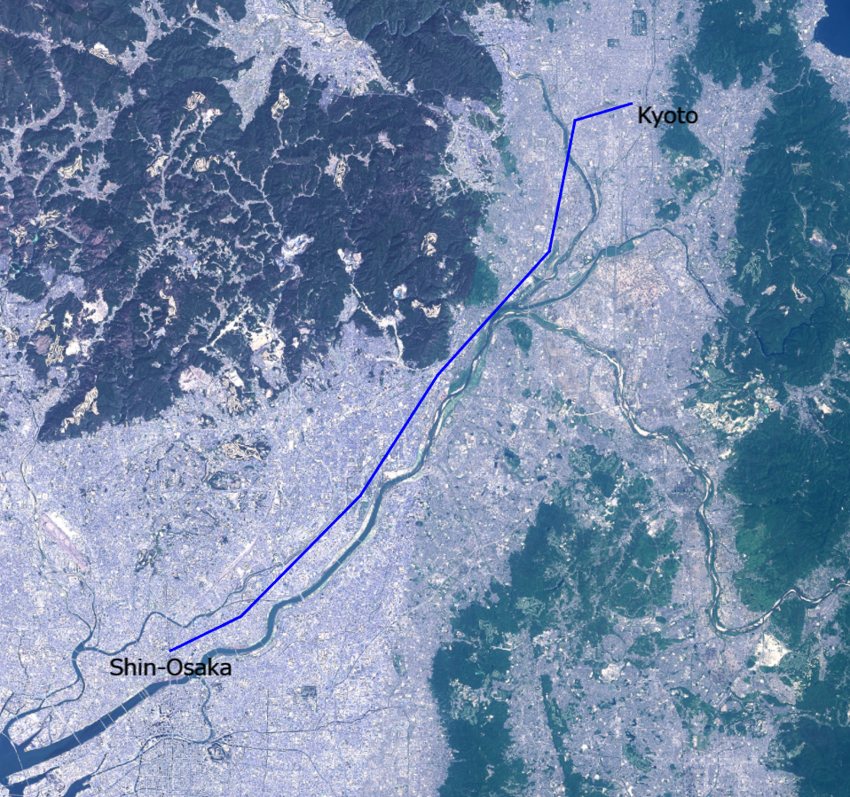

## GeoJSONデータの表示（GeoJSONLoaderを使った表示）

mapray.GeoJSONLoaderを使ってGeoJSONデータを表示する方法を説明します。

### サンプルコード
mapray.GeoJSONLoaderを使ってGeoJSONデータを表示する**LoadGeoJSON.html**及び、**LoadGeoJSON.js**のサンプルコードとシーンファイル（**RouteLine.json**）です。
このサンプルコードでは、新大阪駅と京都駅間の新幹線の経路を表示します。

#### LoadGeoJSON.html
```HTML
<!DOCTYPE html>
<html>
    <head>
        <meta charset="utf-8">
        <title>LoadGeoJSONSample</title>
        <script src="https://resource.mapray.com/mapray-js/v0.7.2/mapray.js"></script>
        <link rel="stylesheet" href="https://resource.mapray.com/styles/v1/mapray.css">
        <script src="LoadGeoJSON.js"></script>
        <style>
            html, body {
                height: 100%;
                margin: 0;
            }

            div#mapray-container {
                display: flex;
                position: relative;
                height: 100%;
            }
        </style>
    </head>

    <body onload="new LoadGeoJSON('mapray-container');">
        <div id="mapray-container"></div>
    </body>
</html>
```

#### LoadGeoJSON.js
```JavaScript
class LoadGeoJSON extends mapray.RenderCallback {
    constructor(container) {
        super();

        // Access Tokenを設定
        var accessToken = "<your access token here>";

        // Viewerを作成する
        new mapray.Viewer(container, {
            render_callback: this,
            image_provider: this.createImageProvider(),
            dem_provider: new mapray.CloudDemProvider(accessToken)
        });

        this.SetCamera();

        this.AddText();

        this.LoadScene();
    }

    // 画像プロバイダを生成
    createImageProvider() {
        return new mapray.StandardImageProvider("https://cyberjapandata.gsi.go.jp/xyz/seamlessphoto/", ".jpg", 256, 2, 18);
    }

    // カメラ位置の設定
    SetCamera() {
        // 球面座標系（経度、緯度、高度）で視点を設定。座標は高槻市付近
        var home_pos = { longitude: 135.642749, latitude: 34.849955, height: 500.0 };

        // 球面座標から地心直交座標へ変換
        var home_view_geoPoint = new mapray.GeoPoint( home_pos.longitude, home_pos.latitude, home_pos.height );
        var home_view_to_gocs = home_view_geoPoint.getMlocsToGocsMatrix( mapray.GeoMath.createMatrix() );

        // 視線方向を定義
        var cam_pos = mapray.GeoMath.createVector3([0, 0, 70000]);
        var cam_end_pos = mapray.GeoMath.createVector3([0, 0, 0]);
        var cam_up = mapray.GeoMath.createVector3([0, 1, 0]);

        // ビュー変換行列を作成
        var view_to_home = mapray.GeoMath.createMatrix();
        mapray.GeoMath.lookat_matrix(cam_pos, cam_end_pos, cam_up, view_to_home);

        // カメラの位置と視線方向からカメラの姿勢を変更
        var view_to_gocs = this.viewer.camera.view_to_gocs;
        mapray.GeoMath.mul_AA(home_view_to_gocs, view_to_home, view_to_gocs);

        // カメラのnear、farの設定
        this.viewer.camera.near = 30;
        this.viewer.camera.far = 500000;
    }

    // テキストの表示
    AddText() {
        //文字のエンティティを作成
        var font_Entity = new mapray.TextEntity(this.viewer.scene);

        //新大阪駅付近
        var fast_Font_Point = new mapray.GeoPoint(135.501101, 34.722939, 500);

        font_Entity.addText("Shin-Osaka", fast_Font_Point, { color: [0, 0, 0], font_size: 25 });

        //京都駅付近
        var second_Font_Point = new mapray.GeoPoint(135.778568, 34.976024, 500);

        font_Entity.addText("Kyoto", second_Font_Point, { color: [0, 0, 0], font_size: 25 });

        //エンティティをシーンに追加
        this.viewer.scene.addEntity(font_Entity);
    }

    // シーンの読み込み
    LoadScene() {
        var loader = new mapray.GeoJSONLoader( this._viewer.scene, "./data/RouteLine.json", {
            onLoad: (loader, isSuccess) => { console.log("success load geojson") },
            getLineColor: d => d.properties && d.properties.color ? d.properties.color : [0, 0, 255, 1.0],
            getLineWidth: d => d.properties && d.properties.width ? d.properties.width : 3,
            getAltitude: () => 100
        } );

        loader.load();
    }

}
```

#### シーンファイル（RouteLine.json）
```json
{
  "type": "FeatureCollection",
  "features": [
    {
      "type": "Feature",
      "properties": {},
      "geometry": {
        "type": "MultiLineString",
        "coordinates": [
          [
            [
              135.500043,
              34.733513
            ],
            [
              135.539592,
              34.749465
            ],
            [
              135.606446,
              34.805161
            ],
            [
              135.649862,
              34.860777
            ],
            [
              135.712598,
              34.917862
            ],
            [
              135.727113,
              34.978146
            ],
            [
              135.758771,
              34.985886
            ]
          ]
        ]
      }
    }
  ]
}
```

### htmlのサンプルコードの詳細
htmlのサンプルコードの詳細を以下で解説します。

#### htmlの文字コード設定
4行目でhtmlの文字コードを設定します。このサンプルコードでは、utf-8を設定します。

```HTML
<meta charset="UTF-8">
```

#### タイトルの設定
5行目でタイトルを設定します。このサンプルコードでは、LoadGeoJSONSampleを設定します。

```HTML
<title>LoadGeoJSONSample</title>
```

#### JavaScriptファイルのパス設定
6～8行目で参照するJavaScript及びスタイルシートのパスを設定します。このサンプルコードでは、maprayのJavaScriptファイル、スタイルシート、モデルのシーンを読み込むJavaScriptファイル（**LoadGeoJSON.js**）を設定します。

```HTML
<script src="https://resource.mapray.com/mapray-js/v0.7.2/mapray.js"></script>
<link rel="stylesheet" href="https://resource.mapray.com/styles/v1/mapray.css">
<script src="LoadGeoJSON.js"></script>
```

#### スタイルの設定
9～20行目で表示する要素のスタイルを設定します。
スタイルの詳細は、ヘルプページ『**緯度経度によるカメラ位置の指定**』を参照してください。

```HTML
<style>
    html, body {
        height: 100%;
        margin: 0;
    }

    div#mapray-container {
        display: flex;
        position: relative;
        height: 100%;
    }
</style>
```

#### loadイベントの処理
画面を表示するときに、GeoJSONデータ読み込みクラスを生成します。そのため、23行目でページの読み込み時に、地図表示部分のブロックのidからGeoJSONデータ読み込みクラスのインスタンスを生成します。
GeoJSONデータ読み込みクラスはJavaScriptのサンプルコードの詳細で説明します。

```HTML
<body onload="new LoadGeoJSON('mapray-container');">
```

#### 地図表示部分の指定
24行目で地図表示部分のブロックを記述します。
詳細はヘルプページ『**緯度経度によるカメラ位置の指定**』を参照してください。

```HTML
<div id="mapray-container"></div>
```

### JavaScriptのサンプルコードの詳細
JavaScriptのサンプルコードの詳細を以下で解説します。

#### クラスの説明
1～85行目で、GeoJSONデータを読み込み、表示するクラスを定義します。クラス内の各メソッドの詳細は以降で解説します。
GeoJSONデータを読み込み、表示するクラスは、mapray.RenderCallbackクラスを継承します。

```JavaScript
class LoadGeoJSON extends mapray.RenderCallback {

  //中略

}
```

#### コンストラクタ
2～20行目がGeoJSONデータを読み込み、表示するクラスのコンストラクタです。引数として渡されるブロックのidに対して、mapray.Viewerを作成し、カメラの位置・向きの設定メソッドを呼び出します。その後、文字の表示メソッドとシーンのロードメソッドを呼び出します。viewerを作成する際の画像プロバイダは画像プロバイダの生成メソッドから取得します。
mapray.Viewerの作成の詳細は、ヘルプページ『**緯度経度によるカメラ位置の指定**』を参照してください。

```JavaScript
constructor(container) {
    super();

    // Access Tokenを設定
    var accessToken = "<your access token here>";

    // Viewerを作成する
    new mapray.Viewer(container, {
        render_callback: this,
        image_provider: this.createImageProvider(),
        dem_provider: new mapray.CloudDemProvider(accessToken)
    });

    this.SetCamera();

    this.AddText();

    this.LoadScene();
}
```

#### 画像プロバイダの生成
23～25行目が画像プロバイダの生成メソッドです。生成した画像プロバイダを返します。
画像プロバイダの生成の詳細は、ヘルプページ『**緯度経度によるカメラ位置の指定**』を参照してください。

```JavaScript
// 画像プロバイダを生成
createImageProvider() {
    return new mapray.StandardImageProvider("https://cyberjapandata.gsi.go.jp/xyz/seamlessphoto/", ".jpg", 256, 2, 18);
}
```

#### カメラの位置・向きの設定
28～52行目がカメラの位置・向きの設定メソッドです。
カメラの位置・向きの設定は、ヘルプページ『**緯度経度によるカメラ位置の指定**』を参照してください。

```JavaScript
// カメラ位置の設定
SetCamera() {
    // 球面座標系（経度、緯度、高度）で視点を設定。座標は高槻市付近
    var home_pos = { longitude: 135.642749, latitude: 34.849955, height: 500.0 };

    // 球面座標から地心直交座標へ変換
    var home_view_geoPoint = new mapray.GeoPoint( home_pos.longitude, home_pos.latitude, home_pos.height );
    var home_view_to_gocs = home_view_geoPoint.getMlocsToGocsMatrix( mapray.GeoMath.createMatrix() );

    // 視線方向を定義
    var cam_pos = mapray.GeoMath.createVector3([0, 0, 70000]);
    var cam_end_pos = mapray.GeoMath.createVector3([0, 0, 0]);
    var cam_up = mapray.GeoMath.createVector3([0, 1, 0]);

    // ビュー変換行列を作成
    var view_to_home = mapray.GeoMath.createMatrix();
    mapray.GeoMath.lookat_matrix(cam_pos, cam_end_pos, cam_up, view_to_home);

    // カメラの位置と視線方向からカメラの姿勢を変更
    var view_to_gocs = this.viewer.camera.view_to_gocs;
    mapray.GeoMath.mul_AA(home_view_to_gocs, view_to_home, view_to_gocs);

    // カメラのnear、farの設定
    this.viewer.camera.near = 30;
    this.viewer.camera.far = 500000;
}
```

#### 文字の表示
55～71行目で、それぞれの駅名を表示するための文字をmapray.Viewerのシーンに追加します。
文字の表示方法の詳細は、ヘルプページ『**文字の表示（addTextを使った表示）**』を参照してください。

```JavaScript
// テキストの表示
AddText() {
    //文字のエンティティを作成
    var font_Entity = new mapray.TextEntity(this.viewer.scene);

    //新大阪駅付近
    var fast_Font_Point = new mapray.GeoPoint(135.501101, 34.722939, 500);

    font_Entity.addText("Shin-Osaka", fast_Font_Point, { color: [0, 0, 0], font_size: 25 });

    //京都駅付近
    var second_Font_Point = new mapray.GeoPoint(135.778568, 34.976024, 500);

    font_Entity.addText("Kyoto", second_Font_Point, { color: [0, 0, 0], font_size: 25 });

    //エンティティをシーンに追加
    this.viewer.scene.addEntity(font_Entity);
}
```

#### シーンのロード
74～83行目がシーンのロードメソッドです。mapray.GeoJSONLoaderでシーンを読み込みます。
GeoJSONLoaderクラス生成時の引数には、GeoJSONファイルのエンティティを追加するシーン、読み込むGeoJSONファイルのURL、オプション集合の順に指定します。このサンプルコードでは、viewerクラスのシーン、GeoJSONファイルのURL、オプション集合の順に指定します。オプション集合には、シーンのロードが終了した時のコールバック関数、線の色、線の幅、指定高度優先可否、指定高度をの順に指定します。読み込むGeoJSONファイルのURLは、httpもしくはhttpsでアクセスできるURLを指定します。最後に、82行目のload関数を呼び出すことでシーンの読み込みができます。
なお、GeoJSONLoaderクラスは、GeoJSONデータのfeatureごとのロード時にコールバック関数が呼ばれ、GeoJSONデータの任意のproperty属性にアクセスすることができます。また、propertyに書かれているkeyの値をコールバック関数内で取得することも可能です。

```JavaScript
// シーンの読み込み
LoadScene() {
    var loader = new mapray.GeoJSONLoader( this._viewer.scene, "./data/RouteLine.json", {
        onLoad: (loader, isSuccess) => { console.log("success load geojson") },
        getLineColor: d => d.properties && d.properties.color ? d.properties.color : [0, 0, 255, 1.0],
        getLineWidth: d => d.properties && d.properties.width ? d.properties.width : 3,
        getAltitude: () => 100
    } );

    loader.load();
}
```

### GeoJSONファイルの詳細
GeoJSONファイルの詳細を以下で解説します。なお、GeoJSONファイルはJSON形式で記述します。
GeoJsonファイルの詳細なフォーマットは、[GeoJSONの公式サイト](https://geojson.org)を参照ください。

#### FeatureCollectionの設定
2行目でFeatureCollectionという名称でフィーチャーコレクションオブジェクトを定義し、その中の5行目でFeatureという名称でフィーチャーオブジェクトを定義します。

```json
{
    "type": "FeatureCollection",
    "features": [
      {
        "type": "Feature",
        "properties": {},
        "geometry": {

      中略

        }
      }
    ]
}
```

#### ラインのデータ
8行目でMultiLineStringという名称でジオメトリオブジェクトを定義します。9行目のcoordinatesから座標配列を定義します。

```json
"type": "MultiLineString",
"coordinates": [
    [
        [
        135.500043,
        34.733513
        ],
        [
        135.539592,
        34.749465
        ],
        [
        135.606446,
        34.805161
        ],
        [
        135.649862,
        34.860777
        ],
        [
        135.712598,
        34.917862
        ],
        [
        135.727113,
        34.978146
        ],
        [
        135.758771,
        34.985886
        ]
    ]
]
```

### 出力イメージ
このサンプルコードの出力イメージは下図のようになります。

