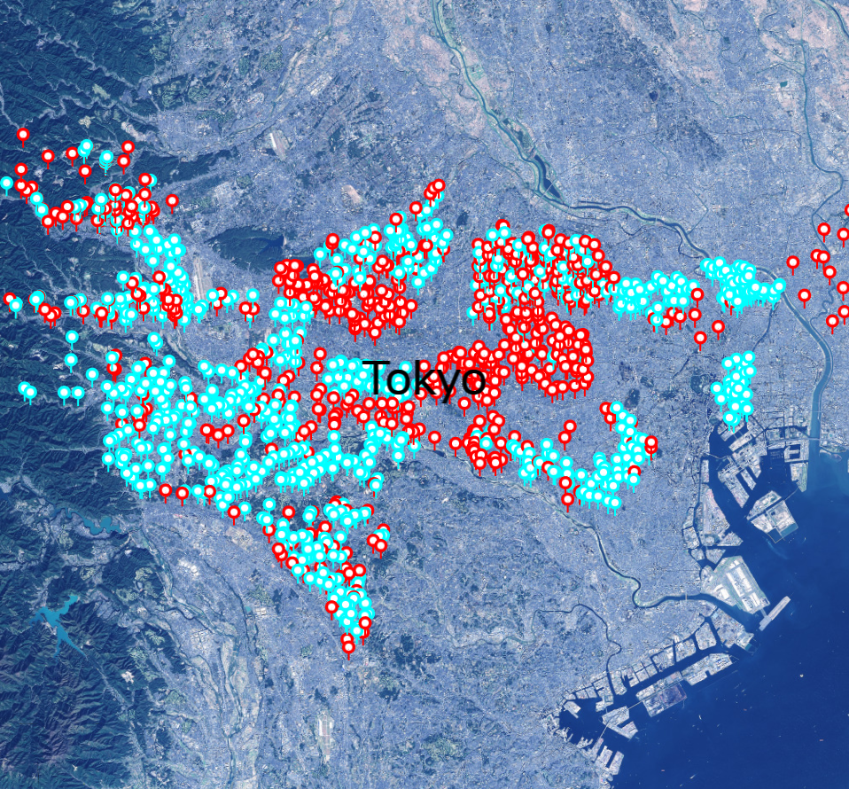
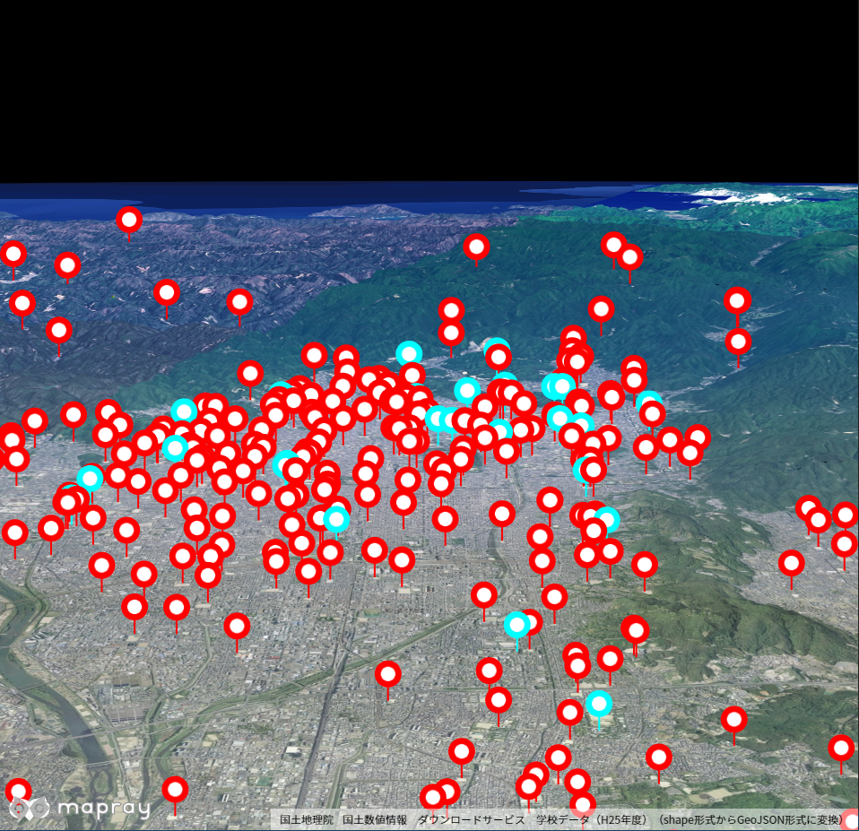

## GeoJSONプロパティの参照（点データ）

点のGeoJSONデータを読み込み、そのデータが持つプロパティを参照して対象データ表示する方法を説明します。

### サンプルコード
点のGeoJSONデータを読み込み、そのデータが持つプロパティを参照して対象データ表示する**ReadGeoJsonPointProperties.html**及び、**ReadGeoJsonPointProperties.js**のサンプルコードです。
シーンファイル（**tokyo_evacuation_area_point.json**）は、[Ｇ空間情報センター](https://www.geospatial.jp/ckan/dataset/hinanbasho/resource/3abdb68d-f91a-4d4d-9643-2d6ccc6e63fa)から取得した実データのため、詳細説明は割愛します。
このサンプルコードでは、東京都の避難所のうち、洪水時に対応している避難所を青色、対応していない避難所を赤色で表示します。

#### ReadGeoJsonPointProperties.html
```HTML
<!DOCTYPE html>
<html>
    <head>
        <meta charset="utf-8">
        <title>ReadGeoJsonPointPropertiesSample</title>
        <script src="https://resource.mapray.com/mapray-js/v0.8.1/mapray.min.js"></script>
        <link rel="stylesheet" href="https://resource.mapray.com/styles/v1/mapray.css">
        <script src="ReadGeoJsonPointProperties.js"></script>
        <style>
            html, body {
                height: 100%;
                margin: 0;
            }

            div#mapray-container {
                display: flex;
                position: relative;
                height: 100%;
            }
        </style>
    </head>

    <body onload="new ReadGeoJsonPointProperties('mapray-container');">
        <div id="mapray-container"></div>
    </body>
</html>
```

#### ReadGeoJsonPointProperties.js
```JavaScript
class ReadGeoJsonPointProperties extends mapray.RenderCallback {
    constructor(container) {
        super();

        // Access Tokenを設定
        var accessToken = "<your access token here>";

        // Viewerを作成する
        new mapray.Viewer(container, {
            render_callback: this,
            image_provider: this.createImageProvider(),
            dem_provider: new mapray.CloudDemProvider(accessToken)
        });

        // geoJSONファイルのライセンス表示
        this.viewer.attribution_controller.addAttribution( {
            display: "指定緊急避難場所データ_13東京都 by 一般社団法人社会基盤情報流通推進協議会: Creative Commons - Attribution",
            link: "https://www.geospatial.jp/ckan/dataset/hinanbasho/resource/3abdb68d-f91a-4d4d-9643-2d6ccc6e63fa"
        } );

        this.SetCamera();

        this.AddText();

        this.LoadGeoJson();
    }

    // 画像プロバイダを生成
    createImageProvider() {
        return new mapray.StandardImageProvider("https://cyberjapandata.gsi.go.jp/xyz/seamlessphoto/", ".jpg", 256, 2, 18);
    }

    // カメラ位置の設定
    SetCamera() {
        // 球面座標系（経度、緯度、高度）で視点を設定。座標は府中市付近
        var home_pos = { longitude: 139.529127, latitude: 35.677033, height: 100.0 };

        // 球面座標から地心直交座標へ変換
        var home_view_geoPoint = new mapray.GeoPoint( home_pos.longitude, home_pos.latitude, home_pos.height );
        var home_view_to_gocs = home_view_geoPoint.getMlocsToGocsMatrix( mapray.GeoMath.createMatrix() );

        // 視線方向を定義
        var cam_pos = mapray.GeoMath.createVector3([0, 0, 100000]);
        var cam_end_pos = mapray.GeoMath.createVector3([0, 0, 0]);
        var cam_up = mapray.GeoMath.createVector3([0, 1, 0]);

        // ビュー変換行列を作成
        var view_to_home = mapray.GeoMath.createMatrix();
        mapray.GeoMath.lookat_matrix(cam_pos, cam_end_pos, cam_up, view_to_home);

        // カメラの位置と視線方向からカメラの姿勢を変更
        var view_to_gocs = this.viewer.camera.view_to_gocs;
        mapray.GeoMath.mul_AA(home_view_to_gocs, view_to_home, view_to_gocs);

        // カメラのnear、farの設定
        this.viewer.camera.near = 30;
        this.viewer.camera.far = 500000;
    }

    // テキストの表示
    AddText() {
        // 文字のエンティティを作成
        var font_Entity = new mapray.TextEntity(this.viewer.scene);

        // 府中市付近
        var Font_Point = new mapray.GeoPoint(139.529127, 35.677033, 5000);

        font_Entity.addText("Tokyo", Font_Point, { color: [0, 0, 0], font_size: 50 });

        // エンティティをシーンに追加
        this.viewer.scene.addEntity(font_Entity);
    }

    // GeoJSONの読み込み
    LoadGeoJson() {
        var loader = new mapray.GeoJSONLoader( this._viewer.scene, "./data/tokyo_evacuation_area_point.json", {
            onLoad: (loader, isSuccess) => { console.log("success load geojson") },
            getPointFGColor: d => d.properties && d.properties.color ? d.properties.color : [1.0, 1.0, 1.0],
            getPointBGColor: d => d.properties ? this.GetBGColor(d.properties) : [0.0, 0.0, 0.0],
            getPointIconId: () => "circle-11",
            getPointSize: () => 10,
            getAltitude: () => 2000
        } );

        loader.load();
    }

    // プロパティから線の色を決定し返す
    GetBGColor( properties={} ) {
        var RGBArray = [0.0, 0.0, 0.0];
        var supported = properties["洪水"];

        // 洪水災害に対応している避難所かどうかで色を決定する
        if ( supported == "◎" ) {
            RGBArray = [0.0, 1.0, 1.0];
        }
        else {
            RGBArray = [1.0, 0.0, 0.0];
        }

        return RGBArray;
    }

}
```

### htmlのサンプルコードの詳細
htmlのサンプルコードの詳細を以下で解説します。

#### htmlの文字コード設定
4行目でhtmlの文字コードを設定します。このサンプルコードでは、utf-8を設定します。

```HTML
<meta charset="UTF-8">
```

#### タイトルの設定
5行目でタイトルを設定します。このサンプルコードでは、ReadGeoJsonPointPropertiesSampleを設定します。

```HTML
<title>ReadGeoJsonPointPropertiesSample</title>
```

#### JavaScriptファイルのパス設定
6～8行目で参照するJavaScript及びスタイルシートのパスを設定します。このサンプルコードでは、maprayのJavaScriptファイル、スタイルシート、点のプロパティを参照して対象データ表示するJavaScriptファイル（**ReadGeoJsonPointProperties.js**）を設定します。

```HTML
<script src="https://resource.mapray.com/mapray-js/v0.8.1/mapray.min.js"></script>
<link rel="stylesheet" href="https://resource.mapray.com/styles/v1/mapray.css">
<script src="ReadGeoJsonPointProperties.js"></script>
```

#### スタイルの設定
9～20行目で表示する要素のスタイルを設定します。スタイルの詳細は、ヘルプページ『**緯度経度によるカメラ位置の指定**』を参照してください。

```HTML
<style>
    html, body {
        height: 100%;
        margin: 0;
    }

    div#mapray-container {
        display: flex;
        position: relative;
        height: 100%;
    }
</style>
```

#### loadイベントの処理
画面を表示するときに、点のプロパティを参照して対象データ表示するクラスを生成します。そのため、23行目で、ページの読み込み時に、地図表示部分のブロックのidから点のプロパティを参照して対象データ表示するクラスのインスタンスを生成します。
点のプロパティを参照して対象データ表示するクラスはJavaScriptのサンプルコードの詳細で説明します。

```HTML
<body onload="new ReadGeoJsonPointProperties('mapray-container');">
```

#### 地図表示部分の指定
24行目で地図表示部分のブロックを記述します。
詳細はヘルプページ『**緯度経度によるカメラ位置の指定**』を参照してください。

```HTML
<div id="mapray-container"></div>
```

### JavaScriptのサンプルコードの詳細
JavaScriptのサンプルコードの詳細を以下で解説します。

#### クラスの説明
1～104行目で、点のGeoJSONデータを読み込み、そのデータが持つプロパティを参照して対象データ表示するクラスを定義します。クラス内の各メソッドの詳細は以降で解説します。
点のプロパティを参照して対象データ表示するクラスは、mapray.RenderCallbackクラスを継承します。

```JavaScript
class ReadGeoJsonPointProperties extends mapray.RenderCallback {

  //中略

}
```

#### コンストラクタ
2～26行目が点のGeoJSONデータを読み込み、そのデータが持つプロパティを参照して対象データ表示するクラスのコンストラクタです。引数として渡されるブロックのidに対して、mapray.Viewerを作成し、geoJSONファイルの出典情報を追加します。そして、カメラの位置・向きの設定メソッドを呼び出します。その後、文字の表示メソッドとGeoJSONデータのロードメソッドを呼び出します。viewerを作成する際の画像プロバイダは画像プロバイダの生成メソッドから取得します。
mapray.Viewerの作成の詳細は、ヘルプページ『**緯度経度によるカメラ位置の指定**』を参照してください。

```JavaScript
constructor(container) {
    super();

    // Access Tokenを設定
    var accessToken = "<your access token here>";

    // Viewerを作成する
    new mapray.Viewer(container, {
        render_callback: this,
        image_provider: this.createImageProvider(),
        dem_provider: new mapray.CloudDemProvider(accessToken)
    });

    // geoJSONファイルのライセンス表示
    this.viewer.attribution_controller.addAttribution( {
        display: "指定緊急避難場所データ_13東京都 by 一般社団法人社会基盤情報流通推進協議会: Creative Commons - Attribution",
        link: "https://www.geospatial.jp/ckan/dataset/hinanbasho/resource/3abdb68d-f91a-4d4d-9643-2d6ccc6e63fa"
    } );

    this.SetCamera();

    this.AddText();

    this.LoadGeoJson();
}
```

#### 画像プロバイダの生成
29～31行目が画像プロバイダの生成メソッドです。生成した画像プロバイダを返します。
画像プロバイダの生成の詳細は、ヘルプページ『**緯度経度によるカメラ位置の指定**』を参照してください。

```JavaScript
// 画像プロバイダを生成
createImageProvider() {
    return new mapray.StandardImageProvider("https://cyberjapandata.gsi.go.jp/xyz/seamlessphoto/", ".jpg", 256, 2, 18);
}
```

#### カメラの位置・向きの設定
34～58行目がカメラの位置・向きの設定メソッドです。
カメラの位置・向きの設定は、ヘルプページ『**緯度経度によるカメラ位置の指定**』を参照してください。

```JavaScript
// カメラ位置の設定
SetCamera() {
    // 球面座標系（経度、緯度、高度）で視点を設定。座標は府中市付近
    var home_pos = { longitude: 139.529127, latitude: 35.677033, height: 100.0 };

    // 球面座標から地心直交座標へ変換
    var home_view_geoPoint = new mapray.GeoPoint( home_pos.longitude, home_pos.latitude, home_pos.height );
    var home_view_to_gocs = home_view_geoPoint.getMlocsToGocsMatrix( mapray.GeoMath.createMatrix() );

    // 視線方向を定義
    var cam_pos = mapray.GeoMath.createVector3([0, 0, 100000]);
    var cam_end_pos = mapray.GeoMath.createVector3([0, 0, 0]);
    var cam_up = mapray.GeoMath.createVector3([0, 1, 0]);

    // ビュー変換行列を作成
    var view_to_home = mapray.GeoMath.createMatrix();
    mapray.GeoMath.lookat_matrix(cam_pos, cam_end_pos, cam_up, view_to_home);

    // カメラの位置と視線方向からカメラの姿勢を変更
    var view_to_gocs = this.viewer.camera.view_to_gocs;
    mapray.GeoMath.mul_AA(home_view_to_gocs, view_to_home, view_to_gocs);

    // カメラのnear、farの設定
    this.viewer.camera.near = 30;
    this.viewer.camera.far = 500000;
}
```

#### 文字の表示
61～72行目で、地名を表現する文字をmapray.Viewerのシーンに追加します。
文字の表示方法の詳細は、ヘルプページ『**文字の表示（addTextを使った表示）**』を参照してください。

```JavaScript
// テキストの表示
AddText() {
    // 文字のエンティティを作成
    var font_Entity = new mapray.TextEntity(this.viewer.scene);

    // 府中市付近
    var Font_Point = new mapray.GeoPoint(139.529127, 35.677033, 5000);

    font_Entity.addText("Tokyo", Font_Point, { color: [0, 0, 0], font_size: 50 });

    // エンティティをシーンに追加
    this.viewer.scene.addEntity(font_Entity);
}
```

#### シーンのロード
75～86行目がシーンのロードメソッドです。mapray.GeoJSONLoaderでシーンを読み込みます。
GeoJSONLoaderクラス生成時の引数には、GeoJSONファイルのエンティティを追加するシーン、読み込むGeoJSONファイルのURL、オプション集合の順に指定します。このサンプルコードでは、viewerクラスのシーン、GeoJSONファイルのURL、オプション集合の順に指定します。オプション集合には、シーンのロードが終了した時のコールバック関数、点の色、点の背景色、点のアイコン種別、点の大きさ。線の色、線の幅、指定高度をの順に指定します。このサンプルコードでは、GeoJSONデータのプロパティに応じた内容にするため、点の色には、colorプロパティの値を、点の背景色には、プロパティの値に応じた色が取得できるメソッドを設定しています。なお、プロパティの値に応じた色が取得できるメソッドの詳細は後述します。
また、読み込むGeoJSONファイルのURLは、httpもしくはhttpsでアクセスできるURLを指定します。
最後に、85行目のload関数を呼び出すことでシーンの読み込みができます。
なお、GeoJSONLoaderクラスは、GeoJSONデータのfeatureごとのロード時にコールバック関数が呼ばれ、GeoJSONデータの任意のproperty属性にアクセスすることができます。また、propertyに書かれているkeyの値をコールバック関数内で取得することも可能です。

```JavaScript
// GeoJSONの読み込み
LoadGeoJson() {
    var loader = new mapray.GeoJSONLoader( this._viewer.scene, "./data/tokyo_evacuation_area_point.json", {
        onLoad: (loader, isSuccess) => { console.log("success load geojson") },
        getPointFGColor: d => d.properties && d.properties.color ? d.properties.color : [1.0, 1.0, 1.0],
        getPointBGColor: d => d.properties ? this.GetBGColor(d.properties) : [0.0, 0.0, 0.0],
        getPointIconId: () => "circle-11",
        getPointSize: () => 10,
        getAltitude: () => 2000
    } );

    loader.load();
}
```

#### プロパティの値に応じた背景色の変更
89～105行目がプロパティの値に応じた色が取得できるメソッドです。読み込んだGeoJSONデータのプロパティを参照して、適切な色を返します。
このサンプルコードでは、洪水時に対応できるかどうかで背景色を変更するため、対象のGeoJSONデータが持つ洪水プロパティを参照して、対応できる場合は青、対応できない場合は赤を返します。

```JavaScript
// プロパティから線の色を決定し返す
GetBGColor( properties={} ) {
    var RGBArray = [0.0, 0.0, 0.0];
    var supported = properties["洪水"];

    // 洪水災害に対応している避難所かどうかで色を決定する
    if ( supported == "◎" ) {
        RGBArray = [0.0, 1.0, 1.0];
    }
    else {
        RGBArray = [1.0, 0.0, 0.0];
    }

    return RGBArray;
}
```

### 出力イメージ
このサンプルコードの出力イメージは下図のようになります。


### クランプ機能を用いたサンプル
点のGeoJSONデータを読み込む際に、クランプ機能（点を地表面上に作図する）を用いたサンプルコードが、**ReadGeoJsonPointPropertiesVer2.html**及び、**ReadGeoJsonPointPropertiesVer2.js**です。
シーンファイル（**kyoto_school.json**）は、[国土交通省](http://nlftp.mlit.go.jp/ksj/gml/datalist/KsjTmplt-P29.html)から取得した実データのため、詳細説明は割愛します。
このサンプルコードでは、京都府の学校のうち、大学に分類される学校を青色、それ以外を赤色で表示し、クランプ機能を用いて、点を地表面上に表示します。

#### クランプ機能を用いたシーンのロード
クランプ機能を用いるには、シーンのロードメソッド内で、getAltitudeModeにmapray.AltitudeMode.CLAMPを設定します。下記に示すコードの9行目にあたる部分になります。
この設定を行うことで、読みこんだGeoJSONファイルを表示する際に、全ての点が地表面上に沿った形で表示されます。

```JavaScript
// GeoJSONの読み込み
LoadGeoJson() {
    var loader = new mapray.GeoJSONLoader( this._viewer.scene, "./data/kyoto_school.json", {
        onLoad: ( loader, isSuccess ) => { console.log( "success load geojson" ) },
        getPointFGColor: d => d.properties && d.properties.color ? d.properties.color : [1.0, 1.0, 1.0],
        getPointBGColor: d => d.properties ? this.GetBGColor( d.properties ) : [0.0, 0.0, 0.0],
        getPointIconId: () => "circle-11",
        getPointSize: () => 20,
        getAltitudeMode: () => mapray.AltitudeMode.CLAMP
    } );

    loader.load();
}

```

### 出力イメージ
このサンプルコードの出力イメージは下図のようになります。

