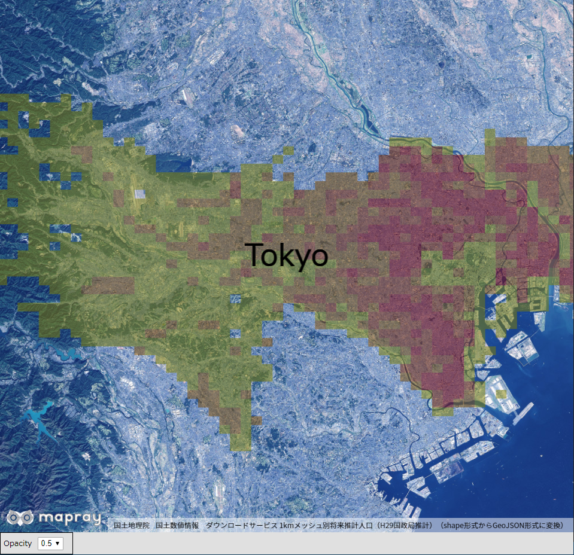
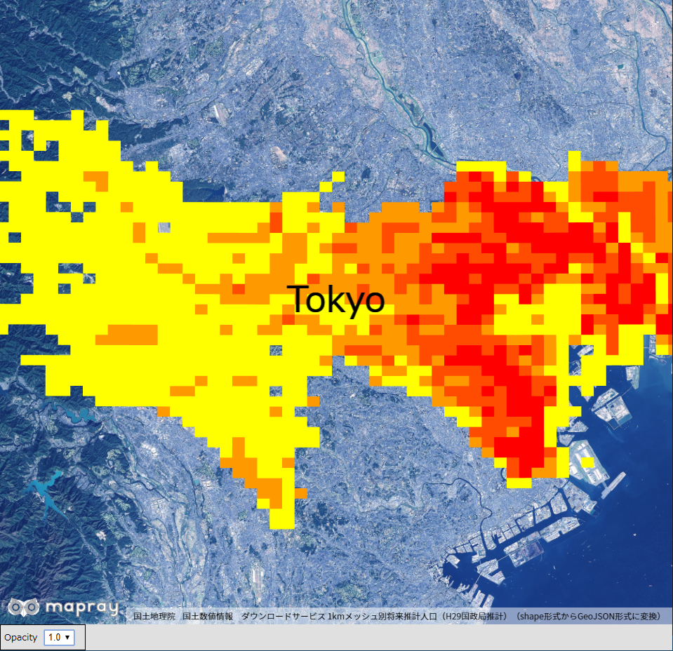

## GeoJSONプロパティの参照（ポリゴンデータ）
ポリゴンのGeoJSONデータを読み込み、そのデータが持つプロパティを参照して対象データ表示する方法を説明します。

### サンプルコード
ポリゴンのGeoJSONデータを読み込み、そのデータが持つプロパティを参照して対象データ表示する**ReadGeoJsonPolygonProperties.html**及び、**ReadGeoJsonPolygonProperties.js**のサンプルコードです。
シーンファイル（**tokyo_population.json**）は、[国土交通省](http://nlftp.mlit.go.jp/ksj/gml/datalist/KsjTmplt-mesh1000.html)から取得した実データのため、詳細説明は割愛します。
このサンプルコードでは、人口密度に応じてポリゴンの色をグラデーション表示し、表示するポリゴンの透過率を変更できます。変更できる透過率の範囲は、0.0、0.5、1.0となるます。


#### ReadGeoJsonPolygonProperties.html
```HTML
<!DOCTYPE html>
<html>
    <head>
        <meta charset="utf-8">
        <title>ReadGeoJsonPolygonPropertiesSample</title>
        <script src="https://resource.mapray.com/mapray-js/v0.7.0/mapray.js"></script>
        <script src="ReadGeoJsonPolygonProperties.js" charset="utf-8"></script>
        <style>
            html, body {
                height: 100%;
                margin: 0;
                background-color: #E0E0E0;
            }

            select{
                height:22px;
                vertical-align:middle;
                font-size:13px;
                margin-left:10px;
            }

            p{
                font-size:13px;
                margin-left:5px;
            }

            div#mapray-container {
                display: flex;
                height: 96%;
            }

            div#OpacityBox {
                display: flex;
                background-color: #E0E0E0;
                height: 35px;
                width: 120px;
                float: left;
                border: inset 1px #000000;
                align-items: center;
            }

            div#mapInfo{
                display: flex;
                width: 50px;
                height: 16px;
                margin-left: auto;
                margin-right: 10px;
                align-items: center;
            }

            div#geoJsonInfo{
                display: flex;
                width: 580px;
                height: 16px;
                margin-left: auto;
                margin-right: 10px;
                align-items: center;
            }
        </style>
    </head>

    <body onload="CreateReadGeoJsonPolygonPropertiesInstance('mapray-container');">
        <div id="mapray-container"></div>

        <div id="OpacityBox">
            <p>Opacity</p>
            <select name="OpacityPullDown" id="OpacityPullDown" onchange="OpacityValueChanged()">
                <option value=0>0</option>
                <option value=0.5 selected>0.5</option>
                <option value=1.0>1.0</option>
            </select>
        </div>

        <div id="mapInfo"><a href="https://maps.gsi.go.jp/development/ichiran.html" style="font-size: 9px">国土地理院</a></div>
        <div id="geoJsonInfo"><a href="http://nlftp.mlit.go.jp/ksj/gml/datalist/KsjTmplt-mesh1000.html" style="font-size: 9px">国土数値情報　ダウンロードサービス 1kmメッシュ別将来推計人口（H29国政局推計）（shape形式からGeoJSON形式に変換）</a></div>
    </body>
</html>
```

#### ReadGeoJsonPolygonProperties.js
```JavaScript
var read_GeoJson_polygon_properties;

class ReadGeoJsonPolygonProperties extends mapray.RenderCallback {
    constructor(container) {
        super();

        // Access Tokenを設定
        var accessToken = "<your access token here>";

        // Viewerを作成する
        new mapray.Viewer(container, {
            render_callback: this,
            image_provider: this.createImageProvider(),
            dem_provider: new mapray.CloudDemProvider(accessToken)
        });

        this.SetCamera();

        this.AddText();

        this.LoadGeoJson();
    }

    // 画像プロバイダを生成
    createImageProvider() {
        return new mapray.StandardImageProvider("https://cyberjapandata.gsi.go.jp/xyz/seamlessphoto/", ".jpg", 256, 2, 18);
    }

    // カメラ位置の設定
    SetCamera() {
        // 球面座標系（経度、緯度、高度）で視点を設定。座標は府中市付近
        var home_pos = { longitude: 139.529127, latitude: 35.677033, height: 100.0 };

        // 球面座標から地心直交座標へ変換
        var home_view_to_gocs = mapray.GeoMath.iscs_to_gocs_matrix(home_pos, mapray.GeoMath.createMatrix());

        // 視線方向を定義
        var cam_pos = mapray.GeoMath.createVector3([0, 0, 100000]);
        var cam_end_pos = mapray.GeoMath.createVector3([0, 0, 0]);
        var cam_up = mapray.GeoMath.createVector3([0, 1, 0]);

        // ビュー変換行列を作成
        var view_to_home = mapray.GeoMath.createMatrix();
        mapray.GeoMath.lookat_matrix(cam_pos, cam_end_pos, cam_up, view_to_home);

        // カメラの位置と視線方向からカメラの姿勢を変更
        var view_to_gocs = this.viewer.camera.view_to_gocs;
        mapray.GeoMath.mul_AA(home_view_to_gocs, view_to_home, view_to_gocs);

        // カメラのnear、farの設定
        this.viewer.camera.near = 30;
        this.viewer.camera.far = 500000;
    }

    // テキストの表示
    AddText() {
        // 文字のエンティティを作成
        var font_Entity = new mapray.TextEntity(this.viewer.scene);

        // 府中市付近
        var Font_Point = new mapray.GeoPoint(139.529127, 35.677033, 5000);

        font_Entity.addText("Tokyo", Font_Point, { color: [0, 0, 0], font_size: 50 });

        // エンティティをシーンに追加
        this.viewer.scene.addEntity(font_Entity);
    }

    // GeoJSONの読み込み
    LoadGeoJson() {
        var loader = new mapray.GeoJSONLoader( this._viewer.scene, "./data/tokyo_population.json", {
            onLoad: (loader, isSuccess) => { console.log("success load geojson") },
            getFillColor: d => d.properties ? this.GetFillColor(d.properties) : [1.0, 0.0, 1.0, 0.5],
            getAltitude: () => 2000
        } );

        loader.load();
    }

    // プロパティから線の色を決定し返す
    GetFillColor( properties={} ) {
        var RGBArray = [0.0, 0.0, 0.0, 0.5];

        if( properties.POP2010 ) {
            var pop2010 = properties.POP2010;

            // 人口密度が一定数以上かどうかで色を決定する
            if ( pop2010 > 20000 ) {
                RGBArray = [1.0, 0.0, 0.0, 0.5];
            }
            else if ( pop2010 > 15000 ) {
                RGBArray = [1.0, 0.3, 0.0, 0.5];
            }
            else if ( pop2010 > 10000 ) {
                RGBArray = [1.0, 0.6, 0.0, 0.5];                
            }
            else {
                RGBArray = [1.0, 1.0, 0.0, 0.5];
            }
        }

        return RGBArray;
    }

    ChangeOpacity() {
        // プルダウンの値取得
        var opacity_Value = parseFloat(document.getElementById("OpacityPullDown").value);

        // プルダウンの値を設定
        for ( var i = 1; i < this.viewer.scene.num_entities; ++i ) {
            var polygonEntity = this.viewer.scene.getEntity(i);
            polygonEntity.setOpacity(opacity_Value);
        }
    }

}

function CreateReadGeoJsonPolygonPropertiesInstance(container) {
    read_GeoJson_polygon_properties = new ReadGeoJsonPolygonProperties(container);
}

function OpacityValueChanged() {
    read_GeoJson_polygon_properties.ChangeOpacity()
}
```

### htmlのサンプルコードの詳細
htmlのサンプルコードの詳細を以下で解説します。

#### htmlの文字コード設定
4行目でhtmlの文字コードを設定します。このサンプルコードでは、utf-8を設定します。

```HTML
<meta charset="UTF-8">
```

#### タイトルの設定
5行目でタイトルを設定します。このサンプルコードでは、ReadGeoJsonPolygonPropertiesSampleを設定します。

```HTML
<title>ReadGeoJsonPolygonPropertiesSample</title>
```

#### JavaScriptファイルのパス設定
6～7行目で参照するJavaScripのパスを設定します。このサンプルコードでは、maprayのJavaScriptファイルとポリゴンのプロパティを参照して対象データ表示するJavaScriptファイル（**ReadGeoJsonPolygonProperties.js**）を設定します。

```HTML
<script src="https://resource.mapray.com/mapray-js/v0.7.0/mapray.js"></script>
<script src="ReadGeoJsonPolygonProperties.js" charset="utf-8"></script>
```

#### スタイルの設定
8～59行目で表示する要素のスタイルを設定します。このサンプルコードでは、下記のスタイルを設定します。
- html
- body
- select
- p
- div#mapray-container（地図表示部分）
- div#OpacityBox（透過率変更コンボボックス表示部分）
- div#mapInfo（出典表示部分）
- div#geoJsonInfo（GeonJSONデータ出典表示部分）

```HTML
<style>
    html, body {
        height: 100%;
        margin: 0;
        background-color: #E0E0E0;
    }

    select{
        height:22px;
        vertical-align:middle;
        font-size:13px;
        margin-left:10px;
    }

    p{
        font-size:13px;
        margin-left:5px;
    }

    div#mapray-container {
        display: flex;
        height: 96%;
    }

    div#OpacityBox {
        display: flex;
        background-color: #E0E0E0;
        height: 35px;
        width: 120px;
        float: left;
        border: inset 1px #000000;
        align-items: center;
    }

    div#mapInfo{
        display: flex;
        width: 50px;
        height: 16px;
        margin-left: auto;
        margin-right: 10px;
        align-items: center;
    }

    div#geoJsonInfo{
        display: flex;
        width: 580px;
        height: 16px;
        margin-left: auto;
        margin-right: 10px;
        align-items: center;
    }
</style>
```

#### loadイベントの処理
画面を表示するときに、ポリゴンのプロパティを参照して対象データ表示するクラスを生成します。そのため、62行目で、ページの読み込み時に、ポリゴンのプロパティを参照して対象データ表示するクラスのインスタンスを生成するメソッド（**CreateReadGeoJsonPolygonPropertiesInstance**）を呼ぶように設定します。
ポリゴンのプロパティを参照して対象データ表示するクラスのインスタンスを生成するメソッドは、JavaScriptのサンプルコードの詳細で説明します。

```HTML
<body onload="CreateReadGeoJsonPolygonPropertiesInstance('mapray-container');">
```

#### 地図表示部分と出典表示部分の指定
63行目で地図表示部分になるブロックを記述し、74行目で出典を明記するためのブロックを記述します。
詳細はヘルプページ『**緯度経度によるカメラ位置の指定**』を参照してください。

```HTML
<div id="mapray-container"></div>

中略

<div id="mapInfo"><a href="https://maps.gsi.go.jp/development/ichiran.html" style="font-size: 9px">国土地理院</a></div>
```

#### 透過率変更のUI
65～72行目で透過率変更コンボボックス表示部分のブロックを記述します。このブロックの中には、透過率を変更するコンボボックスを用意します。このサンプルコードでは、0.0、0.5、1.0を設定します。
透過率を変更するコンボボックスが変更された時のイベント（onchange）に、透過率のコンボボックス変更時に呼び出す関数（**OpacityValueChanged**）を設定します。
透過率のコンボボックス変更時に呼び出す関数はJavaScriptのサンプルコードの詳細で説明します。

```HTML
<div id="OpacityBox">
    <p>Opacity</p>
    <select name="OpacityPullDown" id="OpacityPullDown" onchange="OpacityValueChanged()">
        <option value=0.0>0.0</option>
        <option value=0.5 selected>0.5</option>
        <option value=1.0>1.0</option>
    </select>
</div>
```

#### GeoJSONデータの出典表示部分の設定
75行目で、GeoJSONデータの出典を明記するためのブロックを記述します。

```HTML
<div id="geoJsonInfo"><a href="http://nlftp.mlit.go.jp/ksj/gml/datalist/KsjTmplt-mesh1000.html" style="font-size: 9px">国土数値情報　ダウンロードサービス 1kmメッシュ別将来推計人口（H29国政局推計）（shape形式からGeoJSON形式に変換）</a></div>
```

### JavaScriptのサンプルコードの詳細
JavaScriptのサンプルコードの詳細を以下で解説します。

#### クラスの説明
3～117行目で、ポリゴンのGeoJSONデータを読み込み、そのデータが持つプロパティを参照して対象データ表示するクラスを定義します。クラス内の各メソッドの詳細は以降で解説します。
ポリゴンのプロパティを参照して対象データ表示するクラスは、mapray.RenderCallbackクラスを継承します。
また、1行目でプロパティを参照して対象データを表示するクラスのグローバル変数を定義します。

```JavaScript
var read_GeoJson_polygon_properties;

class ReadGeoJsonPolygonProperties extends mapray.RenderCallback {

  //中略

}
```

#### コンストラクタ
4～22行目が線のGeoJSONデータを読み込み、そのデータが持つプロパティを参照して対象データ表示するクラスのコンストラクタです。引数として渡されるブロックのidに対して、mapray.Viewerを作成し、カメラの位置・向きの設定メソッドを呼び出します。その後、文字の表示メソッドとGeoJSONデータのロードメソッドを呼び出します。viewerを作成する際の画像プロバイダは画像プロバイダの生成メソッドから取得します。
mapray.Viewerの作成の詳細は、ヘルプページ『**緯度経度によるカメラ位置の指定**』を参照してください。

```JavaScript
constructor(container) {
    super();

    // Access Tokenを設定
    var accessToken = "<your access token here>";

    // Viewerを作成する
    new mapray.Viewer(container, {
        render_callback: this,
        image_provider: this.createImageProvider(),
        dem_provider: new mapray.CloudDemProvider(accessToken)
    });

    this.SetCamera();

    this.AddText();

    this.LoadGeoJson();
}
```

#### 画像プロバイダの生成
25～27行目が画像プロバイダの生成メソッドです。生成した画像プロバイダを返します。
画像プロバイダの生成の詳細は、ヘルプページ『**緯度経度によるカメラ位置の指定**』を参照してください。

```JavaScript
// 画像プロバイダを生成
createImageProvider() {
    return new mapray.StandardImageProvider("https://cyberjapandata.gsi.go.jp/xyz/seamlessphoto/", ".jpg", 256, 2, 18);
}
```

#### カメラの位置・向きの設定
30～53行目がカメラの位置・向きの設定メソッドです。
カメラの位置・向きの設定は、ヘルプページ『**緯度経度によるカメラ位置の指定**』を参照してください。

```JavaScript
// カメラ位置の設定
SetCamera() {
    // 球面座標系（経度、緯度、高度）で視点を設定。座標は府中市付近
    var home_pos = { longitude: 139.529127, latitude: 35.677033, height: 100.0 };

    // 球面座標から地心直交座標へ変換
    var home_view_to_gocs = mapray.GeoMath.iscs_to_gocs_matrix(home_pos, mapray.GeoMath.createMatrix());

    // 視線方向を定義
    var cam_pos = mapray.GeoMath.createVector3([0, 0, 100000]);
    var cam_end_pos = mapray.GeoMath.createVector3([0, 0, 0]);
    var cam_up = mapray.GeoMath.createVector3([0, 1, 0]);

    // ビュー変換行列を作成
    var view_to_home = mapray.GeoMath.createMatrix();
    mapray.GeoMath.lookat_matrix(cam_pos, cam_end_pos, cam_up, view_to_home);

    // カメラの位置と視線方向からカメラの姿勢を変更
    var view_to_gocs = this.viewer.camera.view_to_gocs;
    mapray.GeoMath.mul_AA(home_view_to_gocs, view_to_home, view_to_gocs);

    // カメラのnear、farの設定
    this.viewer.camera.near = 30;
    this.viewer.camera.far = 500000;
}
```

#### 文字の表示
56～67行目で、地名を表現する文字をmapray.Viewerのシーンに追加します。
文字の表示方法の詳細は、ヘルプページ『**文字の表示（addTextを使った表示）**』を参照してください。

```JavaScript
// テキストの表示
AddText() {
    // 文字のエンティティを作成
    var font_Entity = new mapray.TextEntity(this.viewer.scene);

    // 府中市付近
    var Font_Point = new mapray.GeoPoint(139.529127, 35.677033, 5000);

    font_Entity.addText("Tokyo", Font_Point, { color: [0, 0, 0], font_size: 50 });

    // エンティティをシーンに追加
    this.viewer.scene.addEntity(font_Entity);
}
```

#### シーンのロード
70～79行目がシーンのロードメソッドです。mapray.GeoJSONLoaderでシーンを読み込みます。
GeoJSONLoaderクラス生成時の引数には、GeoJSONファイルのエンティティを追加するシーン、読み込むGeoJSONファイルのURL、オプション集合の順に指定します。このサンプルコードでは、viewerクラスのシーン、GeoJSONファイルのURL、オプション集合の順に指定します。オプション集合には、シーンのロードが終了した時のコールバック関数、ポリゴンの色、指定高度優先可否、指定高度をの順に指定します。このサンプルコードでは、GeoJSONデータのプロパティに応じた内容にするため、ポリゴンの色には、プロパティの値に応じた色が取得できるメソッドを設定しています。なお、プロパティの値に応じた色が取得できるメソッドの詳細は後述します。
また、読み込むGeoJSONファイルのURLは、httpもしくはhttpsでアクセスできるURLを指定します。
最後に、78行目のload関数を呼び出すことでシーンの読み込みができます。
なお、GeoJSONLoaderクラスは、GeoJSONデータのfeatureごとのロード時にコールバック関数が呼ばれ、GeoJSONデータの任意のproperty属性にアクセスすることができます。また、propertyに書かれているkeyの値をコールバック関数内で取得することも可能です。

```JavaScript
// GeoJSONの読み込み
LoadGeoJson() {
    var loader = new mapray.GeoJSONLoader( this._viewer.scene, "./data/tokyo_population.json", {
        onLoad: (loader, isSuccess) => { console.log("success load geojson") },
        getFillColor: d => d.properties ? this.GetFillColor(d.properties) : [1.0, 0.0, 1.0, 0.5],
        getAltitude: () => 2000
    } );

    loader.load();
}
```

#### プロパティの値に応じた色の変更
82～104行目がプロパティの値に応じた色が取得できるメソッドです。読み込んだGeoJSONデータのプロパティを参照して、適切な色を返します。
このサンプルコードでは、人口密度が高くなるにつれて、赤色から黄色になるように設定しています。

```JavaScript
// プロパティから線の色を決定し返す
GetFillColor( properties={} ) {
    var RGBArray = [0.0, 0.0, 0.0, 0.5];

    if( properties.POP2010 ) {
        var pop2010 = properties.POP2010;

        // 人口密度が一定数以上かどうかで色を決定する
        if ( pop2010 > 20000 ) {
            RGBArray = [1.0, 0.0, 0.0, 0.5];
        }
        else if ( pop2010 > 15000 ) {
            RGBArray = [1.0, 0.3, 0.0, 0.5];
        }
        else if ( pop2010 > 10000 ) {
            RGBArray = [1.0, 0.6, 0.0, 0.5];                
        }
        else {
            RGBArray = [1.0, 1.0, 0.0, 0.5];
        }
    }

    return RGBArray;
}
```

#### 透過率の変更
106～115行目が透過率変更メソッドです。108行目で透過率を変更するコンボボックスから値を取得します。そして、112行目のviewer.sceneのgetEntity関数でポリゴンのエンティティを順に取得し、113行目で取得した値を指定することで、ポリゴンの透過率を変更します。このサンプルコードでは、GeoJSONデータはポリゴンのエンティティとなり、インデックスは1番目以降となるため、getEntity関数には1以降のすべてのエンティティを指定します。

```JavaScript
ChangeOpacity() {
    // プルダウンの値取得
    var opacity_Value = parseFloat(document.getElementById("OpacityPullDown").value);

    // プルダウンの値を設定
    for ( var i = 1; i < this.viewer.scene.num_entities; ++i ) {
        var polygonEntity = this.viewer.scene.getEntity(i);
        polygonEntity.setOpacity(opacity_Value);
    }
}
```

#### ポリゴンのプロパティを参照して対象データ表示するクラスのインスタンス生成
119～121行目の関数は、引数として渡されるブロックのidを利用して、ポリゴンのプロパティを参照して対象データ表示するクラスのインスタンスを生成します。

```JavaScript
function CreateReadGeoJsonPolygonPropertiesInstance(container) {
    read_GeoJson_polygon_properties = new ReadGeoJsonPolygonProperties(container);
}
```

#### 透過率変更時のイベント
123～125行目の関数は、透過率変更時に呼ばれ、ポリゴンのプロパティを参照して対象データ表示するクラスの透過率変更メソッドを呼び出します。

```JavaScript
function OpacityValueChanged() {
    read_GeoJson_polygon_properties.ChangeOpacity()
}
```


### 出力イメージ
このサンプルコードで初期状態（透過率:0.5）の出力イメージは下図のようになります。


初期状態から、透過率を1.0にした時の出力イメージは下図のようになります。

