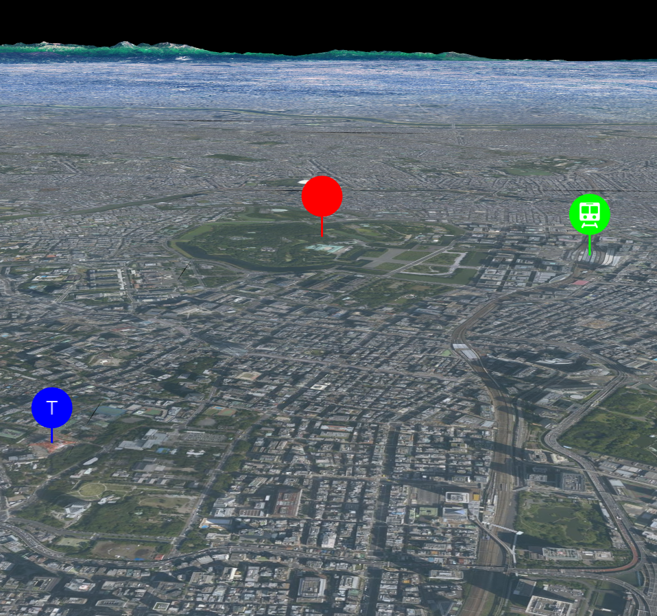

## ピンの表示

mapray.PinEntityを使ってピンを表示する方法を説明します。

### サンプルコード
mapray.PinEntityを使ってピンを表示する**AddPin.html**のサンプルコードです。
このサンプルコードでは、皇居と東京駅と東京タワーにピンを表示します。

```HTML
<!DOCTYPE html>
<html>
    <head>
        <meta charset="UTF-8">
        <title>AddPinSample</title>
        <script src="https://resource.mapray.com/mapray-js/v0.7.0/mapray.js"></script>
        <style>
            html, body {
                height: 100%;
                margin: 0;
            }

            div#mapray-container {
                display: flex;
                height: 97%;
            }

            div#mapInfo{
                display: flex;
                width: 50px;
                height: 25px;
                margin-left: auto;
                margin-right: 10px;
                align-items: center;
            }
        </style>
    </head>

    <body>
        <div id="mapray-container"></div>
        <div id="mapInfo"><a href="https://maps.gsi.go.jp/development/ichiran.html" style="font-size: 9px">国土地理院</a></div>
    </body>
</html>

<script>
    // Access Tokenを設定
    var accessToken = "<your access token here>";

    // Viewerを作成する
    viewer = new mapray.Viewer(
        "mapray-container", {
            image_provider: new mapray.StandardImageProvider("https://cyberjapandata.gsi.go.jp/xyz/seamlessphoto/", ".jpg", 256, 2, 18),
            dem_provider: new mapray.CloudDemProvider(accessToken)
        }
    );

    // 球面座標系（経度、緯度、高度）で視点を設定。皇居と東京駅と東京タワーの中心点付近
    var home_pos = { longitude: 139.753175, latitude: 35.653943, height: 500 };

    // 球面座標から地心直交座標へ変換
    var home_view_to_gocs = mapray.GeoMath.iscs_to_gocs_matrix(home_pos, mapray.GeoMath.createMatrix());

    // 視線方向を定義
    var cam_pos = mapray.GeoMath.createVector3([0, -2000, 500]);
    var cam_end_pos = mapray.GeoMath.createVector3([0, 0, 0]);
    var cam_up = mapray.GeoMath.createVector3([0, 1, 0]);

    // ビュー変換行列を作成
    var view_to_home = mapray.GeoMath.createMatrix();
    mapray.GeoMath.lookat_matrix(cam_pos, cam_end_pos, cam_up, view_to_home);

    // カメラの位置と視線方向からカメラの姿勢を変更
    var view_to_gocs = viewer.camera.view_to_gocs;
    mapray.GeoMath.mul_AA(home_view_to_gocs, view_to_home, view_to_gocs);

    // カメラのnear、farの設定
    viewer.camera.near = 30;
    viewer.camera.far = 500000;

    // ピンのエンティティを作成
    var pin_Entity = new mapray.PinEntity(viewer.scene);

    // 皇居の座標を設定
    var fast_Pin_Point = new mapray.GeoPoint(139.7528, 35.685175, 13);

    // ピンを追加
    pin_Entity.addPin(fast_Pin_Point, { size: 40, bg_color: [1, 0, 0] });

    // 東京駅の座標を設定
    var second_Pin_Point = new mapray.GeoPoint(139.767141, 35.681247, 3);

    // Makiアイコンピンを追加
    pin_Entity.addMakiIconPin("rail-15", second_Pin_Point, { size: 40, bg_color: [0, 1, 0] });

    // 東京タワーの座標を設定
    var third_Pin_Point = new mapray.GeoPoint(139.745440, 35.658594, 3);

    // テキストピンを追加
    pin_Entity.addTextPin("T", third_Pin_Point, { size: 40, bg_color: [0, 0, 1] });

    // エンティティをシーンに追加
    viewer.scene.addEntity(pin_Entity);
</script>
```

このサンプルコードの詳細を以下で解説します。

#### htmlの記述
1～33行目がでhtmlの定義です。ヘルプページ『**緯度経度によるカメラ位置の指定**』で示したhtmlファイルからタイトルのみを変更します。
詳細はヘルプページ『**緯度経度によるカメラ位置の指定**』を参照してください。

```HTML
<!DOCTYPE html>
<html>
    <head>
        <meta charset="UTF-8">
        <title>AddPinSample</title>
        <script src="https://resource.mapray.com/mapray-js/v0.7.0/mapray.js"></script>
        <style>
            html, body {
                height: 100%;
                margin: 0;
            }

            div#mapray-container {
                display: flex;
                height: 97%;
            }

            div#mapInfo{
                display: flex;
                width: 50px;
                height: 25px;
                margin-left: auto;
                margin-right: 10px;
                align-items: center;
            }
        </style>
    </head>

    <body>
        <div id="mapray-container"></div>
        <div id="mapInfo"><a href="https://maps.gsi.go.jp/development/ichiran.html" style="font-size: 9px">国土地理院</a></div>
    </body>
</html>
```

#### カメラ位置・向きの設定
37～68行目でMapray.Viewerクラスを作成し、カメラ位置・向きを設定します。
詳細はヘルプページ『**緯度経度によるカメラ位置の指定**』を参照してください。

```JavaScript
// Access Tokenを設定
var accessToken = "<your access token here>";

// Viewerを作成する
viewer = new mapray.Viewer(
    "mapray-container", {
        image_provider: new mapray.StandardImageProvider("https://cyberjapandata.gsi.go.jp/xyz/seamlessphoto/", ".jpg", 256, 2, 18),
        dem_provider: new mapray.CloudDemProvider(accessToken)
    }
);

// 球面座標系（経度、緯度、高度）で視点を設定。皇居と東京駅と東京タワーの中心点付近
var home_pos = { longitude: 139.753175, latitude: 35.653943, height: 500 };

// 球面座標から地心直交座標へ変換
var home_view_to_gocs = mapray.GeoMath.iscs_to_gocs_matrix(home_pos, mapray.GeoMath.createMatrix());

// 視線方向を定義
var cam_pos = mapray.GeoMath.createVector3([0, -2000, 500]);
var cam_end_pos = mapray.GeoMath.createVector3([0, 0, 0]);
var cam_up = mapray.GeoMath.createVector3([0, 1, 0]);

// ビュー変換行列を作成
var view_to_home = mapray.GeoMath.createMatrix();
mapray.GeoMath.lookat_matrix(cam_pos, cam_end_pos, cam_up, view_to_home);

// カメラの位置と視線方向からカメラの姿勢を変更
var view_to_gocs = viewer.camera.view_to_gocs;
mapray.GeoMath.mul_AA(home_view_to_gocs, view_to_home, view_to_gocs);

// カメラのnear、farの設定
viewer.camera.near = 30;
viewer.camera.far = 500000;
```

#### PinEntityの生成
ピンを表示するためには、ピンの情報を管理するクラス（PinEntity）が必要です。そのため、71行目でPinEntityのインスタンスを生成します。コンストラクタの引数には、作成したMapray.Viewerのシーン（Mapray.Viewer.scene）を指定します。

```JavaScript
// ピンのエンティティを作成
var pin_Entity = new mapray.PinEntity(viewer.scene);
```

#### 表示ピンの生成
74～77行目で、標準のピンを生成します。74行目で皇居の経度・緯度・高度からGeoPointクラスを定義し、76行目のaddPin関数でピンを作成します。addPin関数には、ピンを表示する位置、生成オプションとしてピンの大きさと色を、それぞれ設定します。

```JavaScript
// 皇居の座標を設定
var fast_Pin_Point = new mapray.GeoPoint(139.7528, 35.685175, 13);

// ピンを追加
pin_Entity.addPin(fast_Pin_Point, { size: 40, bg_color: [1, 0, 0] });
```

#### Makiアイコンピンの生成
80～83行目で、Makiアイコンのピンを生成します。80行目で東京駅の経度・緯度・高度からGeoPointクラスを定義し、83行目のaddMakiIconPin関数でピンを生成します。addMakiIconPin関数には、Makiアイコンの名称、ピンを表示する位置、生成オプションとしてピンの大きさと色を、それぞれ設定します。
Makiアイコンとは、[Makiアイコン](https://labs.mapbox.com/maki-icons/)に掲載されているアイコンを指します。各アイコンの名称を指定することで、自由にアイコンを使用することができます。

```JavaScript
// 東京駅の座標を設定
var second_Pin_Point = new mapray.GeoPoint(139.767141, 35.681247, 3);

// Makiアイコンピンを追加
pin_Entity.addMakiIconPin("rail-15", second_Pin_Point, { size: 40, bg_color: [0, 1, 0] });
```

#### テキストピンの生成
86～89行目で、テキストのピンを生成します。86行目で東京タワーの経度・緯度・高度からGeoPointクラスを定義し、89行目のaddTextPin関数でピンを生成します。addTextPin関数には、表示する文字、ピンを表示する位置、生成オプションとしてピンの大きさと色を、それぞれ設定します。

```JavaScript
// 東京タワーの座標を設定
var third_Pin_Point = new mapray.GeoPoint(139.745440, 35.658594, 3);

// テキストピンを追加
pin_Entity.addTextPin("T", third_Pin_Point, { size: 40, bg_color: [0, 0, 1] });
```

#### PinEntityの追加
92行目でPinEntityを作成したmapray.Viewerのシーンに追加します。mapray.Viewerのシーンに追加することでピンが表示されます。

```JavaScript
// エンティティをシーンに追加
viewer.scene.addEntity(pin_Entity);
```

### 出力イメージ
このサンプルコードの出力イメージは下図のようになります。

